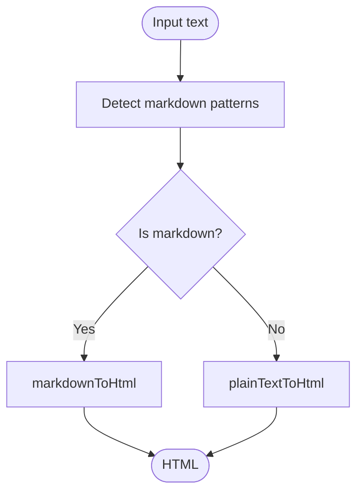

# AI Integration

<cite>
**Referenced Files in This Document**
- [README.md](file://README.md)
- [package.json](file://package.json)
- [src/components/ArticleGenerator.js](file://src/components/ArticleGenerator.js)
- [src/components/ArticleEditorApp.js](file://src/components/ArticleEditorApp.js)
- [src/components/CardEditor.js](file://src/components/CardEditor.js)
- [src/utils/markdown.js](file://src/utils/markdown.js)
- [src/utils/jsonRepair.js](file://src/utils/jsonRepair.js)
- [src/utils/ArticleManager.js](file://src/utils/ArticleManager.js)
- [src/components/RichTextDisplay.js](file://src/components/RichTextDisplay.js)
- [src/components/Card.js](file://src/components/Card.js)
- [src/setupProxy.js](file://src/setupProxy.js)
- [docs/ai-links-spec.md](file://docs/ai-links-spec.md)
- [docs/ai-links-prompt.md](file://docs/ai-links-prompt.md)
- [src/styles-clean.css](file://src/styles-clean.css)
</cite>

## Table of Contents
1. [Introduction](#introduction)
2. [Project Structure](#project-structure)
3. [Core Components](#core-components)
4. [Architecture Overview](#architecture-overview)
5. [Detailed Component Analysis](#detailed-component-analysis)
6. [Dependency Analysis](#dependency-analysis)
7. [Performance Considerations](#performance-considerations)
8. [Troubleshooting Guide](#troubleshooting-guide)
9. [Conclusion](#conclusion)
10. [Appendices](#appendices)

## Introduction
This document explains the AI integration feature centered on Google Gemini API usage in article-page-v11. It covers:
- AI-powered article generation in ArticleGenerator.js and ArticleEditorApp.js
- Prompt construction, request formatting, and response parsing
- Markdown-to-HTML conversion via markdown.js, including support for custom <ai-link> tags
- CardEditor component’s AI-assisted refinement for simplifying or expanding content
- Development proxy configuration in setupProxy.js to route AI requests and hide API keys
- Configuration options for API keys and rate limiting
- Relationships with other components, especially how refined content updates the card state
- Troubleshooting guidance for common issues

## Project Structure
The AI integration spans several UI components and utilities:
- Article generation and refinement: ArticleGenerator.js, ArticleEditorApp.js
- AI-assisted card editing: CardEditor.js
- Markdown conversion and sanitization: markdown.js, RichTextDisplay.js
- Storage and routing: ArticleManager.js
- Development proxy: setupProxy.js
- AI-link specification and prompt: docs/ai-links-spec.md, docs/ai-links-prompt.md
- Styling for AI links: src/styles-clean.css

**Diagram sources**
- [src/components/ArticleGenerator.js](file://src/components/ArticleGenerator.js#L1-L91)
- [src/components/ArticleEditorApp.js](file://src/components/ArticleEditorApp.js#L1-L649)
- [src/components/CardEditor.js](file://src/components/CardEditor.js#L1-L482)
- [src/components/Card.js](file://src/components/Card.js#L1-L34)
- [src/components/RichTextDisplay.js](file://src/components/RichTextDisplay.js#L1-L51)
- [src/utils/markdown.js](file://src/utils/markdown.js#L1-L128)
- [src/utils/ArticleManager.js](file://src/utils/ArticleManager.js#L1-L152)
- [src/utils/jsonRepair.js](file://src/utils/jsonRepair.js#L1-L66)
- [src/setupProxy.js](file://src/setupProxy.js#L1-L29)
- [docs/ai-links-spec.md](file://docs/ai-links-spec.md#L1-L33)
- [docs/ai-links-prompt.md](file://docs/ai-links-prompt.md#L1-L15)

**Section sources**
- [README.md](file://README.md#L1-L45)
- [package.json](file://package.json#L1-L53)

## Core Components
- ArticleGenerator.js: Presents a topic input and triggers generation via ArticleEditorApp.handleGenerate.
- ArticleEditorApp.js: Orchestrates generation, parses Markdown, splits into cards, and updates state.
- CardEditor.js: Provides an AI-assisted refinement UI with rate limiting and prompt validation.
- markdown.js: Converts AI-generated Markdown/plain text to HTML and detects content type.
- RichTextDisplay.js: Sanitizes HTML and allows custom <ai-link> tags with attributes.
- setupProxy.js: Routes AI requests through a development proxy to avoid CORS and hide API keys.
- ArticleManager.js: Manages local storage of articles and current article ID.
- Docs: ai-links-spec.md and ai-links-prompt.md define the AI-link contract and prompt instructions.

**Section sources**
- [src/components/ArticleGenerator.js](file://src/components/ArticleGenerator.js#L1-L91)
- [src/components/ArticleEditorApp.js](file://src/components/ArticleEditorApp.js#L1-L649)
- [src/components/CardEditor.js](file://src/components/CardEditor.js#L1-L482)
- [src/utils/markdown.js](file://src/utils/markdown.js#L1-L128)
- [src/components/RichTextDisplay.js](file://src/components/RichTextDisplay.js#L1-L51)
- [src/setupProxy.js](file://src/setupProxy.js#L1-L29)
- [src/utils/ArticleManager.js](file://src/utils/ArticleManager.js#L1-L152)
- [docs/ai-links-spec.md](file://docs/ai-links-spec.md#L1-L33)
- [docs/ai-links-prompt.md](file://docs/ai-links-prompt.md#L1-L15)

## Architecture Overview
The AI integration follows a clear flow:
- User initiates generation in ArticleGenerator.js
- ArticleEditorApp.js constructs a system prompt and sends a request to the Gemini API
- Gemini responds with Markdown; ArticleEditorApp parses and converts to cards
- Cards are rendered with RichTextDisplay.js, which sanitizes HTML and preserves <ai-link> tags
- CardEditor.js enables per-card AI refinement with prompt validation and rate limiting
- setupProxy.js proxies requests during development to avoid CORS and hide API keys

**Diagram sources**
- [src/components/ArticleGenerator.js](file://src/components/ArticleGenerator.js#L1-L91)
- [src/components/ArticleEditorApp.js](file://src/components/ArticleEditorApp.js#L1-L649)
- [src/utils/markdown.js](file://src/utils/markdown.js#L1-L128)
- [src/components/RichTextDisplay.js](file://src/components/RichTextDisplay.js#L1-L51)
- [docs/ai-links-spec.md](file://docs/ai-links-spec.md#L1-L33)

## Detailed Component Analysis

### Article Generation and Markdown Parsing
- Prompt construction: The system prompt instructs the model to produce Markdown with headings and to embed <ai-link> tags for sub-topics. See the prompt fragment in docs/ai-links-prompt.md.
- Request formatting: ArticleEditorApp.js builds a request body with contents.parts.text and generationConfig (maxOutputTokens, temperature).
- Response parsing: The response is expected to contain candidates[0].content.parts[0].text. The app extracts the first heading as the title and splits content by "## " into sections. Each section is converted to HTML using markdown.js.convertToHtml and wrapped with an EDIT link.
- Relationship to Card state: Converted HTML is stored in cards, which are rendered by Card.js and displayed via RichTextDisplay.js.

**Diagram sources**
- [src/components/ArticleEditorApp.js](file://src/components/ArticleEditorApp.js#L42-L178)
- [src/utils/markdown.js](file://src/utils/markdown.js#L107-L126)
- [docs/ai-links-prompt.md](file://docs/ai-links-prompt.md#L1-L15)

**Section sources**
- [src/components/ArticleEditorApp.js](file://src/components/ArticleEditorApp.js#L42-L178)
- [src/utils/markdown.js](file://src/utils/markdown.js#L1-L128)
- [docs/ai-links-prompt.md](file://docs/ai-links-prompt.md#L1-L15)

### Markdown Conversion Utility (markdown.js)
- Detects content type heuristically (headers, bold, italic, lists) and chooses markdownToHtml or plainTextToHtml.
- markdownToHtml handles headers, bold, italic, unordered and ordered lists, and wraps non-list lines in paragraphs.
- plainTextToHtml escapes HTML and wraps line breaks in paragraphs.
- convertToHtml selects the appropriate converter based on detection.

**Diagram sources**
- [src/utils/markdown.js](file://src/utils/markdown.js#L1-L128)

**Section sources**
- [src/utils/markdown.js](file://src/utils/markdown.js#L1-L128)

### CardEditor AI-Assisted Refinement
- Prompt validation: Enforces minimum/maximum length and blocks forbidden phrases.
- Rate limiting: 10-second cooldown between AI requests.
- Request formatting: Sends a request to the Gemini API with a system prompt and the current card content as context.
- Response handling: Parses the response text; if it starts with an error marker, shows an error notification; otherwise converts the response to HTML and updates the content area.
- State update: Sets hasUnsavedChanges and notifies the user. The updated content replaces the card’s HTML in ArticleEditorApp.js state.

**Diagram sources**
- [src/components/CardEditor.js](file://src/components/CardEditor.js#L270-L366)
- [src/utils/markdown.js](file://src/utils/markdown.js#L107-L126)

**Section sources**
- [src/components/CardEditor.js](file://src/components/CardEditor.js#L238-L366)
- [src/utils/markdown.js](file://src/utils/markdown.js#L107-L126)

### AI-Link Rendering and Behavior
- Specification: ai-links-spec.md defines the <ai-link> tag, required attributes (topic, template), and frontend behavior.
- Rendering: RichTextDisplay.js sanitizes HTML and explicitly allows the ai-link tag and its attributes.
- Click handling: Card.js intercepts clicks on ai-link elements, extracts topic/template, and opens a new tab with a URL that triggers generation in ArticleEditorApp.js.

**Diagram sources**
- [docs/ai-links-spec.md](file://docs/ai-links-spec.md#L1-L33)
- [src/components/RichTextDisplay.js](file://src/components/RichTextDisplay.js#L1-L51)
- [src/components/Card.js](file://src/components/Card.js#L1-L34)
- [src/components/ArticleEditorApp.js](file://src/components/ArticleEditorApp.js#L297-L329)

**Section sources**
- [docs/ai-links-spec.md](file://docs/ai-links-spec.md#L1-L33)
- [src/components/RichTextDisplay.js](file://src/components/RichTextDisplay.js#L1-L51)
- [src/components/Card.js](file://src/components/Card.js#L1-L34)
- [src/styles-clean.css](file://src/styles-clean.css#L985-L996)

### Development Proxy Configuration (setupProxy.js)
- Purpose: Route AI requests through a development proxy to avoid CORS and hide API keys from client-side code.
- Behavior: Rewrites /api to the Gemini endpoint with a configured API key and logs proxy activity. Errors are captured and returned as JSON.

**Diagram sources**
- [src/setupProxy.js](file://src/setupProxy.js#L1-L29)

**Section sources**
- [src/setupProxy.js](file://src/setupProxy.js#L1-L29)

### API Key Management and Rate Limiting
- API key placement: README.md recommends moving the hard-coded key to an environment variable and replacing constants with process.env.REACT_APP_GEMINI_API_KEY.
- Rate limiting: CardEditor.js enforces a 10-second cooldown between AI requests. ArticleEditorApp.js does not enforce a global rate limit for generation requests.
- Proxy-based key hiding: setupProxy.js demonstrates a pattern to avoid exposing keys in client code by routing requests through the proxy.

**Section sources**
- [README.md](file://README.md#L1-L45)
- [src/components/CardEditor.js](file://src/components/CardEditor.js#L270-L366)
- [src/setupProxy.js](file://src/setupProxy.js#L1-L29)

### Relationship with ArticleEditorApp.js State
- Generated cards: ArticleEditorApp.js sets cards state with converted HTML and EDIT links, then renders them.
- Per-card editing: CardEditor.js updates the content of a selected card in the cards array, preserving the EDIT link markup and notifying the user.
- Saving: ArticleEditorApp.js persists the article to local storage and can save to backend.

**Diagram sources**
- [src/components/ArticleEditorApp.js](file://src/components/ArticleEditorApp.js#L42-L178)
- [src/components/CardEditor.js](file://src/components/CardEditor.js#L152-L203)
- [src/utils/ArticleManager.js](file://src/utils/ArticleManager.js#L1-L152)

**Section sources**
- [src/components/ArticleEditorApp.js](file://src/components/ArticleEditorApp.js#L42-L178)
- [src/components/CardEditor.js](file://src/components/CardEditor.js#L152-L203)
- [src/utils/ArticleManager.js](file://src/utils/ArticleManager.js#L1-L152)

## Dependency Analysis
- External libraries:
  - @google/generative-ai: Used for direct API calls in components (see README note).
  - dompurify: Used in RichTextDisplay.js for HTML sanitization.
  - react-quill: Used in CardEditor.js for rich text editing.
  - http-proxy-middleware: Used in setupProxy.js for development proxy.
- Internal dependencies:
  - markdown.js is used by ArticleEditorApp.js and CardEditor.js.
  - ArticleManager.js stores and retrieves article data.
  - RichTextDisplay.js depends on DOMPurify and allows ai-link tags.
  - Card.js depends on RichTextDisplay.js and handles ai-link click events.

**Diagram sources**
- [src/components/ArticleEditorApp.js](file://src/components/ArticleEditorApp.js#L1-L649)
- [src/components/CardEditor.js](file://src/components/CardEditor.js#L1-L482)
- [src/components/RichTextDisplay.js](file://src/components/RichTextDisplay.js#L1-L51)
- [src/components/Card.js](file://src/components/Card.js#L1-L34)
- [src/utils/markdown.js](file://src/utils/markdown.js#L1-L128)
- [src/utils/ArticleManager.js](file://src/utils/ArticleManager.js#L1-L152)
- [src/setupProxy.js](file://src/setupProxy.js#L1-L29)
- [package.json](file://package.json#L1-L53)

**Section sources**
- [package.json](file://package.json#L1-L53)
- [src/components/ArticleEditorApp.js](file://src/components/ArticleEditorApp.js#L1-L649)
- [src/components/CardEditor.js](file://src/components/CardEditor.js#L1-L482)
- [src/components/RichTextDisplay.js](file://src/components/RichTextDisplay.js#L1-L51)
- [src/components/Card.js](file://src/components/Card.js#L1-L34)
- [src/utils/markdown.js](file://src/utils/markdown.js#L1-L128)
- [src/utils/ArticleManager.js](file://src/utils/ArticleManager.js#L1-L152)
- [src/setupProxy.js](file://src/setupProxy.js#L1-L29)

## Performance Considerations
- Token limits: generationConfig includes maxOutputTokens and temperature; tune these to balance quality and cost.
- Rate limiting: CardEditor.js applies a 10-second cooldown to reduce API usage and improve UX.
- Rendering: CardEditor.js memoizes the Quill component to minimize re-renders.
- Sanitization: RichTextDisplay.js restricts allowed tags and attributes to reduce XSS risk and keep rendering efficient.

[No sources needed since this section provides general guidance]

## Troubleshooting Guide
- API quota limits or billing issues:
  - Symptom: Non-OK response from Gemini API.
  - Action: Check API key validity and quotas; consider using setupProxy.js to route requests through a backend proxy.
  - References: [src/components/ArticleEditorApp.js](file://src/components/ArticleEditorApp.js#L96-L101), [src/components/CardEditor.js](file://src/components/CardEditor.js#L333-L341), [src/setupProxy.js](file://src/setupProxy.js#L1-L29)
- Malformed responses:
  - Symptom: Unexpected response shape or missing candidates/content.
  - Action: Validate response structure; ensure the model returns text in the expected format. Consider adding defensive checks around response parsing.
  - References: [src/components/ArticleEditorApp.js](file://src/components/ArticleEditorApp.js#L100-L101), [src/components/CardEditor.js](file://src/components/CardEditor.js#L337-L341)
- Network errors:
  - Symptom: Fetch failures or CORS errors.
  - Action: Use setupProxy.js during development to avoid CORS; verify proxy rewrite and target configuration.
  - References: [src/setupProxy.js](file://src/setupProxy.js#L1-L29)
- AI-link not clickable:
  - Symptom: Clicking ai-link does nothing.
  - Action: Ensure ai-link tag is allowed by RichTextDisplay.js and that Card.js handles click events and opens the correct URL.
  - References: [src/components/RichTextDisplay.js](file://src/components/RichTextDisplay.js#L1-L51), [src/components/Card.js](file://src/components/Card.js#L1-L34), [docs/ai-links-spec.md](file://docs/ai-links-spec.md#L1-L33)
- Prompt validation failures:
  - Symptom: Error notifications about prompt length or forbidden phrases.
  - Action: Adjust prompt length and wording; CardEditor.js validates length and blocks specific phrases.
  - References: [src/components/CardEditor.js](file://src/components/CardEditor.js#L238-L268)
- Rate limit exceeded:
  - Symptom: Warning notification about waiting before next AI request.
  - Action: Respect the 10-second cooldown enforced by CardEditor.js.
  - References: [src/components/CardEditor.js](file://src/components/CardEditor.js#L277-L283)

**Section sources**
- [src/components/ArticleEditorApp.js](file://src/components/ArticleEditorApp.js#L96-L101)
- [src/components/CardEditor.js](file://src/components/CardEditor.js#L238-L366)
- [src/setupProxy.js](file://src/setupProxy.js#L1-L29)
- [src/components/RichTextDisplay.js](file://src/components/RichTextDisplay.js#L1-L51)
- [src/components/Card.js](file://src/components/Card.js#L1-L34)
- [docs/ai-links-spec.md](file://docs/ai-links-spec.md#L1-L33)

## Conclusion
The AI integration in article-page-v11 centers on Google Gemini API usage with robust prompt engineering, Markdown parsing, and safe HTML rendering. ArticleGenerator.js and ArticleEditorApp.js orchestrate generation and refinement, while CardEditor.js provides per-card AI assistance with validation and rate limiting. markdown.js and RichTextDisplay.js ensure safe and correct rendering of AI-generated content, including custom <ai-link> tags. setupProxy.js streamlines development by routing requests and hiding API keys. Together, these components deliver a cohesive, extensible AI-powered authoring experience.

[No sources needed since this section summarizes without analyzing specific files]

## Appendices

### Concrete Examples from the Codebase
- generateContent request structure (ArticleEditorApp.js):
  - Headers include Content-Type and x-goog-api-key
  - Body includes contents.parts.text with system prompt and generationConfig
  - Reference: [src/components/ArticleEditorApp.js](file://src/components/ArticleEditorApp.js#L76-L94)
- Response parsing (ArticleEditorApp.js):
  - Access candidates[0].content.parts[0].text and extract title and sections
  - Reference: [src/components/ArticleEditorApp.js](file://src/components/ArticleEditorApp.js#L100-L159)
- AI-assisted refinement request (CardEditor.js):
  - System prompt instructs to improve clarity and structure, including <ai-link> usage
  - Headers include Content-Type and x-goog-api-key
  - Body includes contents.parts.text with current content and generationConfig
  - Reference: [src/components/CardEditor.js](file://src/components/CardEditor.js#L292-L331)
- Response handling (CardEditor.js):
  - If response text starts with an error marker, show error notification; otherwise convert to HTML and update content
  - Reference: [src/components/CardEditor.js](file://src/components/CardEditor.js#L333-L366)

**Section sources**
- [src/components/ArticleEditorApp.js](file://src/components/ArticleEditorApp.js#L76-L159)
- [src/components/CardEditor.js](file://src/components/CardEditor.js#L292-L366)