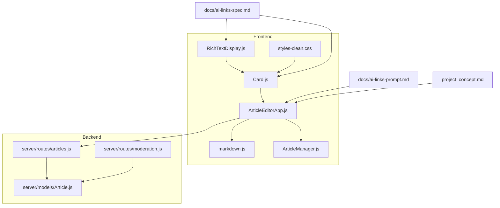
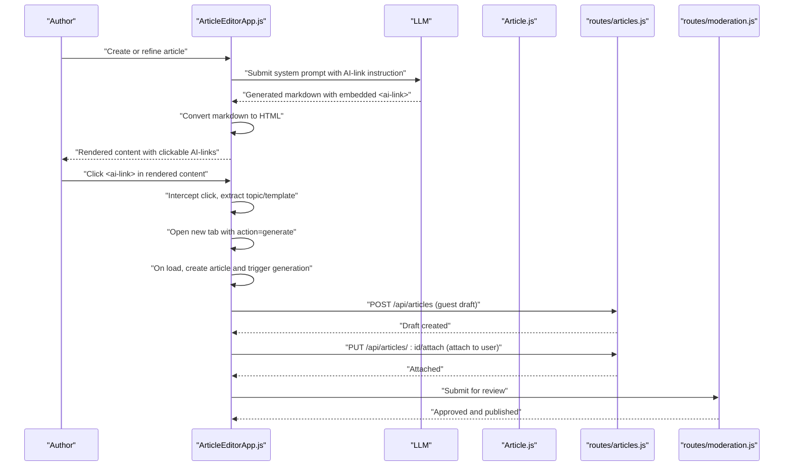
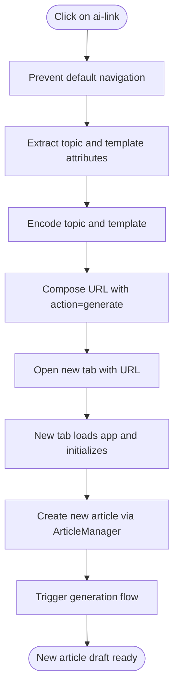
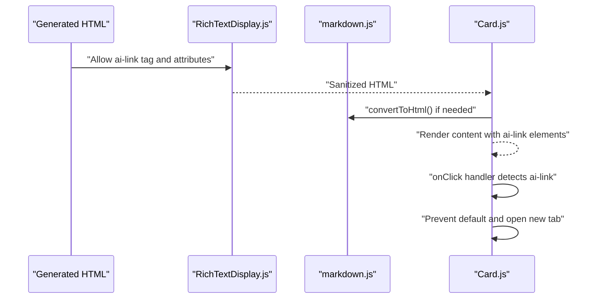
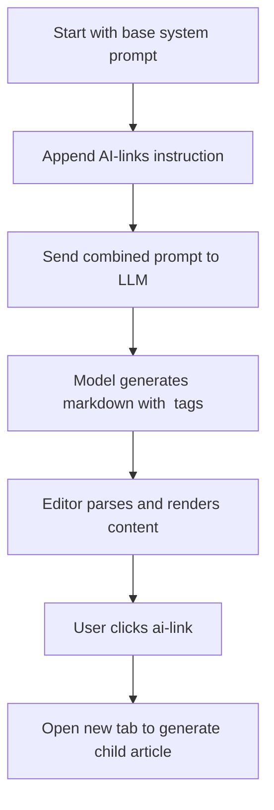
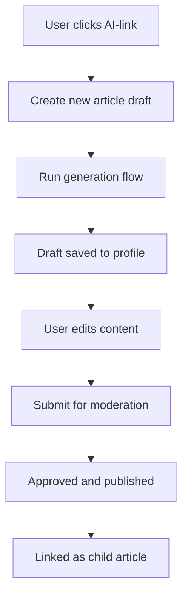
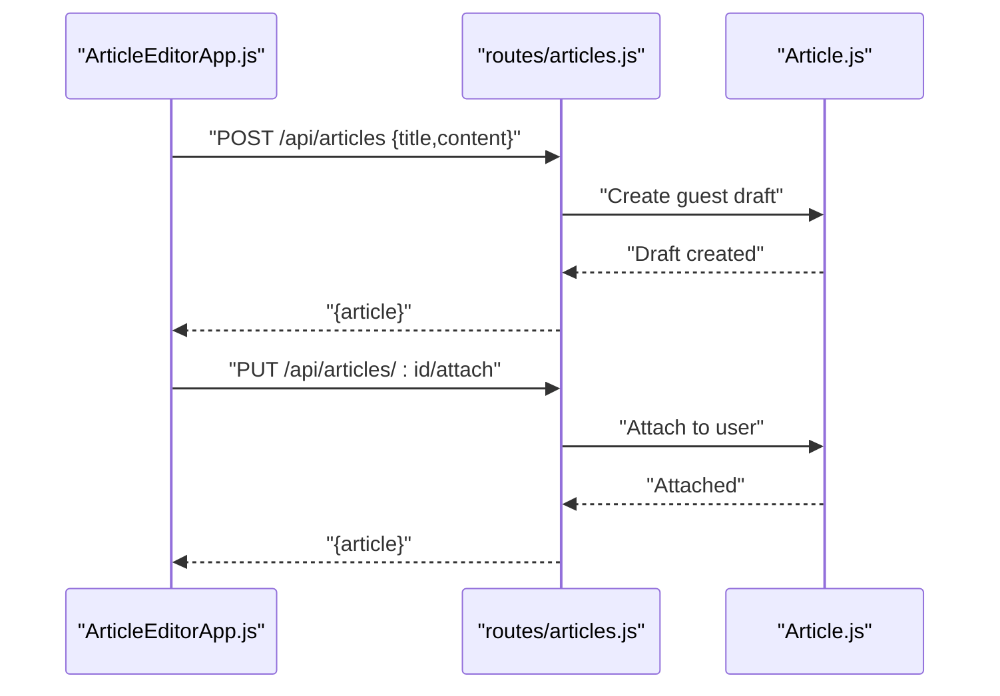
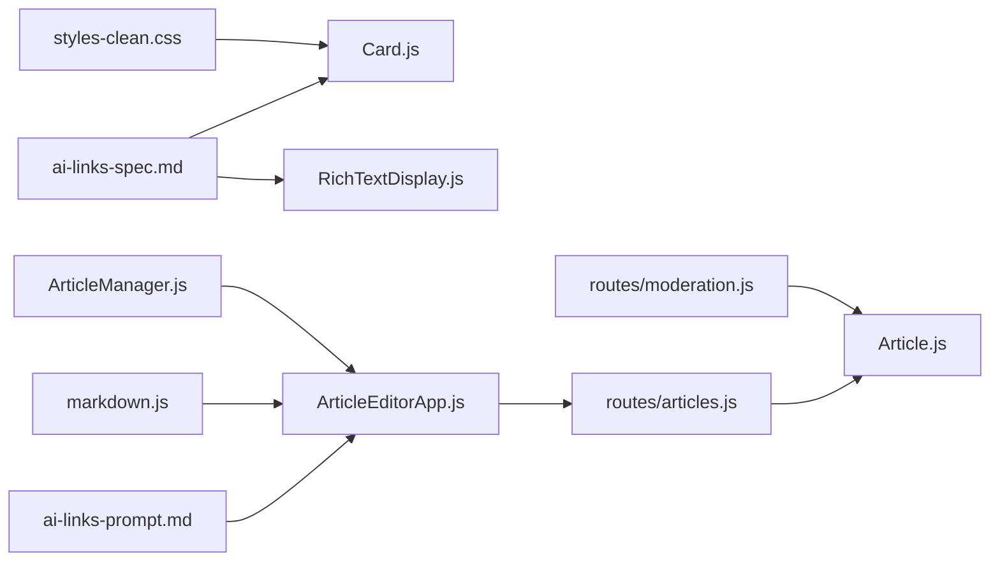

# AI Links System

<cite>
**Referenced Files in This Document**
- [ai-links-spec.md](file://docs/ai-links-spec.md)
- [ai-links-prompt.md](file://docs/ai-links-prompt.md)
- [project_concept.md](file://project_concept.md)
- [markdown.js](file://src/utils/markdown.js)
- [RichTextDisplay.js](file://src/components/RichTextDisplay.js)
- [Card.js](file://src/components/Card.js)
- [ArticleEditorApp.js](file://src/components/ArticleEditorApp.js)
- [ArticleManager.js](file://src/utils/ArticleManager.js)
- [styles-clean.css](file://src/styles-clean.css)
- [Article.js](file://server/models/Article.js)
- [articles.js](file://server/routes/articles.js)
- [moderation.js](file://server/routes/moderation.js)
</cite>

## Table of Contents
1. [Introduction](#introduction)
2. [Project Structure](#project-structure)
3. [Core Components](#core-components)
4. [Architecture Overview](#architecture-overview)
5. [Detailed Component Analysis](#detailed-component-analysis)
6. [Dependency Analysis](#dependency-analysis)
7. [Performance Considerations](#performance-considerations)
8. [Troubleshooting Guide](#troubleshooting-guide)
9. [Conclusion](#conclusion)

## Introduction
This document explains the AI Links system that enables dynamic article generation via custom HTML tags. It covers the frontend parsing and rendering of ai-link tags, the backend routing and article generation flow, and the editorial workflow that connects generated content to the broader article ecosystem. It also documents the AI prompt construction that encourages the model to embed AI-link tags for sub-topics, and outlines the five-step knowledge branching workflow from click to publication.

## Project Structure
The AI Links system spans frontend components, utilities, and backend routes:
- Frontend: ai-link rendering and click handling, markdown conversion, and article generation orchestration
- Backend: article persistence and moderation APIs
- Docs: specifications and prompts that define behavior and AI instructions

**Diagram sources**
- [RichTextDisplay.js](file://src/components/RichTextDisplay.js#L1-L51)
- [Card.js](file://src/components/Card.js#L1-L34)
- [ArticleEditorApp.js](file://src/components/ArticleEditorApp.js#L26-L344)
- [markdown.js](file://src/utils/markdown.js#L1-L128)
- [ArticleManager.js](file://src/utils/ArticleManager.js#L1-L152)
- [styles-clean.css](file://src/styles-clean.css#L985-L996)
- [Article.js](file://server/models/Article.js#L1-L52)
- [articles.js](file://server/routes/articles.js#L1-L227)
- [moderation.js](file://server/routes/moderation.js#L42-L213)
- [ai-links-spec.md](file://docs/ai-links-spec.md#L1-L33)
- [ai-links-prompt.md](file://docs/ai-links-prompt.md#L1-L15)
- [project_concept.md](file://project_concept.md#L68-L87)

**Section sources**
- [ai-links-spec.md](file://docs/ai-links-spec.md#L1-L33)
- [ai-links-prompt.md](file://docs/ai-links-prompt.md#L1-L15)
- [project_concept.md](file://project_concept.md#L68-L87)
- [markdown.js](file://src/utils/markdown.js#L1-L128)
- [RichTextDisplay.js](file://src/components/RichTextDisplay.js#L1-L51)
- [Card.js](file://src/components/Card.js#L1-L34)
- [ArticleEditorApp.js](file://src/components/ArticleEditorApp.js#L26-L344)
- [ArticleManager.js](file://src/utils/ArticleManager.js#L1-L152)
- [styles-clean.css](file://src/styles-clean.css#L985-L996)
- [Article.js](file://server/models/Article.js#L1-L52)
- [articles.js](file://server/routes/articles.js#L1-L227)
- [moderation.js](file://server/routes/moderation.js#L42-L213)

## Core Components
- ai-link specification and behavior: defines tag semantics, attributes, rendering, and click handling
- ai-link prompt for AI: instructs the model to embed AI-link tags around sub-topics
- Frontend rendering pipeline: sanitization, markdown conversion, and click interception
- Article generation flow: URL routing, article creation, and generation orchestration
- Backend persistence and moderation: storing drafts, attaching to users, and publishing

**Section sources**
- [ai-links-spec.md](file://docs/ai-links-spec.md#L1-L33)
- [ai-links-prompt.md](file://docs/ai-links-prompt.md#L1-L15)
- [RichTextDisplay.js](file://src/components/RichTextDisplay.js#L1-L51)
- [markdown.js](file://src/utils/markdown.js#L1-L128)
- [Card.js](file://src/components/Card.js#L1-L34)
- [ArticleEditorApp.js](file://src/components/ArticleEditorApp.js#L26-L344)
- [ArticleManager.js](file://src/utils/ArticleManager.js#L1-L152)
- [Article.js](file://server/models/Article.js#L1-L52)
- [articles.js](file://server/routes/articles.js#L1-L227)
- [moderation.js](file://server/routes/moderation.js#L42-L213)

## Architecture Overview
The AI Links system integrates the following flows:
- Authoring and AI generation: the editor generates content and may embed AI-link tags
- Rendering and interaction: generated content is sanitized and rendered; clicking an ai-link opens a new tab to start a new article
- Generation pipeline: the new tab initializes a fresh article and triggers generation
- Persistence and moderation: drafts are stored and later attached to users and published

**Diagram sources**
- [ArticleEditorApp.js](file://src/components/ArticleEditorApp.js#L26-L344)
- [Article.js](file://server/models/Article.js#L1-L52)
- [articles.js](file://server/routes/articles.js#L1-L227)
- [moderation.js](file://server/routes/moderation.js#L42-L213)
- [ai-links-prompt.md](file://docs/ai-links-prompt.md#L1-L15)

## Detailed Component Analysis

### ai-link specification and rendering
- Tag definition and attributes: topic and template are required and optional respectively
- Behavior: rendered as a clickable link; click prevents default and opens a new tab with encoded topic and template
- Styling: uses primary color, underline, pointer cursor, and hover opacity reduction

**Diagram sources**
- [ai-links-spec.md](file://docs/ai-links-spec.md#L1-L33)
- [styles-clean.css](file://src/styles-clean.css#L985-L996)
- [Card.js](file://src/components/Card.js#L1-L34)
- [ArticleEditorApp.js](file://src/components/ArticleEditorApp.js#L297-L329)
- [ArticleManager.js](file://src/utils/ArticleManager.js#L47-L66)

**Section sources**
- [ai-links-spec.md](file://docs/ai-links-spec.md#L1-L33)
- [styles-clean.css](file://src/styles-clean.css#L985-L996)
- [Card.js](file://src/components/Card.js#L1-L34)
- [ArticleEditorApp.js](file://src/components/ArticleEditorApp.js#L297-L329)
- [ArticleManager.js](file://src/utils/ArticleManager.js#L47-L66)

### Frontend rendering and sanitization
- RichTextDisplay sanitizes HTML and allows the ai-link tag plus topic and template attributes
- markdown.js converts plain text or markdown to HTML for rendering
- The Card component intercepts clicks on ai-link elements and opens the generation URL

**Diagram sources**
- [RichTextDisplay.js](file://src/components/RichTextDisplay.js#L1-L51)
- [markdown.js](file://src/utils/markdown.js#L1-L128)
- [Card.js](file://src/components/Card.js#L1-L34)

**Section sources**
- [RichTextDisplay.js](file://src/components/RichTextDisplay.js#L1-L51)
- [markdown.js](file://src/utils/markdown.js#L1-L128)
- [Card.js](file://src/components/Card.js#L1-L34)

### AI prompt construction for embedding AI-links
- The prompt fragment instructs the model to wrap complex sub-topics in ai-link tags with exact topic titles and optional templates
- The ArticleEditorApp includes this instruction in the system prompt during generation

**Diagram sources**
- [ai-links-prompt.md](file://docs/ai-links-prompt.md#L1-L15)
- [ArticleEditorApp.js](file://src/components/ArticleEditorApp.js#L42-L178)

**Section sources**
- [ai-links-prompt.md](file://docs/ai-links-prompt.md#L1-L15)
- [ArticleEditorApp.js](file://src/components/ArticleEditorApp.js#L42-L178)

### Five-step knowledge branching workflow
- Trigger: click on an AI-link inside text
- Generation: AI creates a new article based on the parent context and template
- Draft: saved in the user’s profile
- Editing: user refines content manually or with AI assistance
- Publication: moderation approval and linking as a child article

**Diagram sources**
- [project_concept.md](file://project_concept.md#L68-L87)
- [ArticleEditorApp.js](file://src/components/ArticleEditorApp.js#L297-L329)
- [articles.js](file://server/routes/articles.js#L1-L227)
- [moderation.js](file://server/routes/moderation.js#L42-L213)

**Section sources**
- [project_concept.md](file://project_concept.md#L68-L87)
- [ArticleEditorApp.js](file://src/components/ArticleEditorApp.js#L297-L329)
- [articles.js](file://server/routes/articles.js#L1-L227)
- [moderation.js](file://server/routes/moderation.js#L42-L213)

### Backend persistence and moderation
- Guest draft creation: POST /api/articles stores initial content
- User attachment: PUT /api/articles/:id/attach binds draft to authenticated user
- Moderation: submit for review and approve/publish with facet assignments

**Diagram sources**
- [ArticleEditorApp.js](file://src/components/ArticleEditorApp.js#L352-L418)
- [articles.js](file://server/routes/articles.js#L1-L227)
- [Article.js](file://server/models/Article.js#L1-L52)

**Section sources**
- [ArticleEditorApp.js](file://src/components/ArticleEditorApp.js#L352-L418)
- [articles.js](file://server/routes/articles.js#L1-L227)
- [Article.js](file://server/models/Article.js#L1-L52)

## Dependency Analysis
The AI Links system depends on:
- Frontend components for rendering and interaction
- Utilities for markdown conversion and local storage-backed article management
- Backend models and routes for persistence and moderation
- Documentation specs and prompts that define behavior and AI instructions

**Diagram sources**
- [ai-links-spec.md](file://docs/ai-links-spec.md#L1-L33)
- [ai-links-prompt.md](file://docs/ai-links-prompt.md#L1-L15)
- [Card.js](file://src/components/Card.js#L1-L34)
- [RichTextDisplay.js](file://src/components/RichTextDisplay.js#L1-L51)
- [markdown.js](file://src/utils/markdown.js#L1-L128)
- [ArticleManager.js](file://src/utils/ArticleManager.js#L1-L152)
- [ArticleEditorApp.js](file://src/components/ArticleEditorApp.js#L26-L344)
- [Article.js](file://server/models/Article.js#L1-L52)
- [articles.js](file://server/routes/articles.js#L1-L227)
- [moderation.js](file://server/routes/moderation.js#L42-L213)
- [styles-clean.css](file://src/styles-clean.css#L985-L996)

**Section sources**
- [ai-links-spec.md](file://docs/ai-links-spec.md#L1-L33)
- [ai-links-prompt.md](file://docs/ai-links-prompt.md#L1-L15)
- [Card.js](file://src/components/Card.js#L1-L34)
- [RichTextDisplay.js](file://src/components/RichTextDisplay.js#L1-L51)
- [markdown.js](file://src/utils/markdown.js#L1-L128)
- [ArticleManager.js](file://src/utils/ArticleManager.js#L1-L152)
- [ArticleEditorApp.js](file://src/components/ArticleEditorApp.js#L26-L344)
- [Article.js](file://server/models/Article.js#L1-L52)
- [articles.js](file://server/routes/articles.js#L1-L227)
- [moderation.js](file://server/routes/moderation.js#L42-L213)
- [styles-clean.css](file://src/styles-clean.css#L985-L996)

## Performance Considerations
- Limit concurrent generation requests: the editor already prevents overlapping generation and updates UI state accordingly
- Avoid redundant regeneration: when a new article is created from an ai-link, the URL is updated to prevent re-triggering generation on reload
- Efficient rendering: sanitize only once per content render and reuse the sanitized HTML
- Local storage management: ArticleManager persists articles efficiently; ensure minimal writes and avoid blocking UI
- Network efficiency: batch save operations and avoid unnecessary round-trips to the backend

[No sources needed since this section provides general guidance]

## Troubleshooting Guide
Common issues and resolutions:
- Broken links or missing attributes
  - Ensure ai-link tags include topic and template attributes; the click handler reads these attributes and encodes them into the URL
  - Verify that the ai-link tag is allowed by the sanitizer and that topic/template are whitelisted attributes
- Context loss between parent and child articles
  - The generation prompt includes explicit instructions to embed AI-link tags for sub-topics; ensure the instruction is present in the system prompt
  - The new tab initializes a fresh article and triggers generation immediately; ensure the URL contains topic and template parameters
- Excessive generation requests
  - The editor sets a flag while generating and disables controls; avoid triggering multiple generations concurrently
  - When an ai-link is clicked, the URL is updated to reflect the new article ID, preventing repeated generation on reload

**Section sources**
- [Card.js](file://src/components/Card.js#L1-L34)
- [RichTextDisplay.js](file://src/components/RichTextDisplay.js#L1-L51)
- [ArticleEditorApp.js](file://src/components/ArticleEditorApp.js#L26-L178)
- [ArticleEditorApp.js](file://src/components/ArticleEditorApp.js#L297-L329)
- [ai-links-prompt.md](file://docs/ai-links-prompt.md#L1-L15)

## Conclusion
The AI Links system provides a robust mechanism for knowledge branching through custom HTML tags. By combining a clear specification, secure rendering, and a well-defined generation flow, it enables authors to create child articles dynamically from generated content. The backend routes and moderation APIs support saving, attaching, and publishing drafts, while the prompt instruction ensures consistent embedding of AI-link tags. Following the five-step workflow guarantees traceable lineage from click to publication.