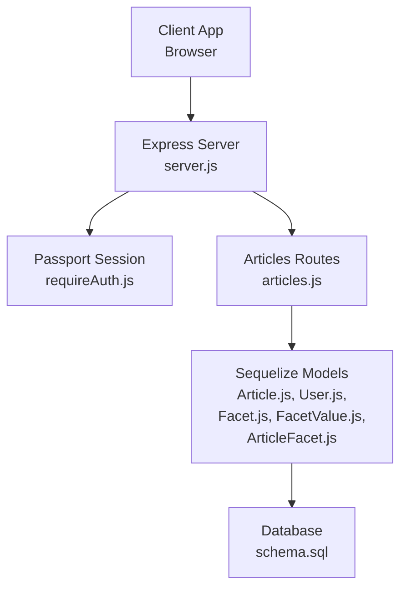
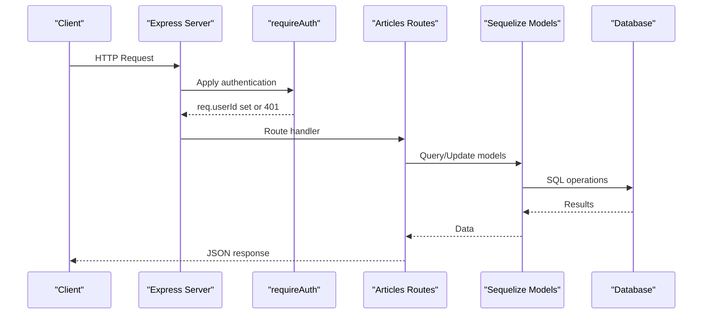
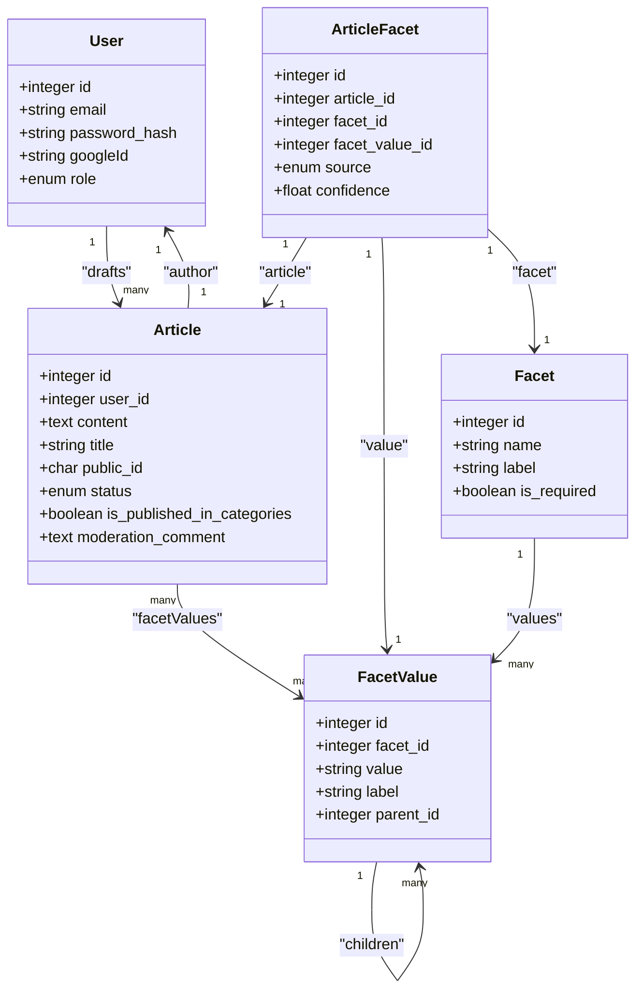

# Articles API

<cite>
**Referenced Files in This Document**
- [server.js](file://server/server.js)
- [articles.js](file://server/routes/articles.js)
- [requireAuth.js](file://server/middleware/requireAuth.js)
- [Article.js](file://server/models/Article.js)
- [User.js](file://server/models/User.js)
- [Facet.js](file://server/models/Facet.js)
- [FacetValue.js](file://server/models/FacetValue.js)
- [ArticleFacet.js](file://server/models/ArticleFacet.js)
- [index.js](file://server/models/index.js)
- [schema.sql](file://server/schema.sql)
- [FACETS_API.md](file://server/FACETS_API.md)
- [ArticleEditorApp.js](file://src/components/ArticleEditorApp.js)
</cite>

## Table of Contents
1. [Introduction](#introduction)
2. [Project Structure](#project-structure)
3. [Core Components](#core-components)
4. [Architecture Overview](#architecture-overview)
5. [Detailed Component Analysis](#detailed-component-analysis)
6. [Dependency Analysis](#dependency-analysis)
7. [Performance Considerations](#performance-considerations)
8. [Troubleshooting Guide](#troubleshooting-guide)
9. [Conclusion](#conclusion)
10. [Appendices](#appendices)

## Introduction
This document provides comprehensive API documentation for the articles endpoints in article-page-v11. It covers:
- Creating guest drafts
- Attaching drafts to authenticated users
- Updating owned articles
- Retrieving user-specific drafts
- Deleting owned articles
- Retrieving published articles by category with hierarchical facet metadata
- Submitting articles for moderation
It includes request/response schemas, authentication requirements, error conditions, and client-side handling for guest-to-user draft attachment.

## Project Structure
The articles API is implemented as Express routes backed by Sequelize models. Authentication is handled via Passport sessions, and the server exposes CORS-enabled endpoints under /api.

**Diagram sources**
- [server.js](file://server/server.js#L1-L59)
- [articles.js](file://server/routes/articles.js#L1-L228)
- [requireAuth.js](file://server/middleware/requireAuth.js#L1-L14)
- [Article.js](file://server/models/Article.js#L1-L53)
- [User.js](file://server/models/User.js#L1-L39)
- [Facet.js](file://server/models/Facet.js#L1-L35)
- [FacetValue.js](file://server/models/FacetValue.js#L1-L59)
- [ArticleFacet.js](file://server/models/ArticleFacet.js#L1-L76)
- [schema.sql](file://server/schema.sql#L1-L134)

**Section sources**
- [server.js](file://server/server.js#L1-L59)

## Core Components
- Authentication middleware: requireAuth enforces session-based authentication and injects req.userId.
- Articles route module: Implements all article endpoints and applies authorization checks.
- Models: Article, User, Facet, FacetValue, ArticleFacet define the domain and relationships.
- Database schema: Adds status, publication flag, and indexes for performance.

**Section sources**
- [requireAuth.js](file://server/middleware/requireAuth.js#L1-L14)
- [articles.js](file://server/routes/articles.js#L1-L228)
- [Article.js](file://server/models/Article.js#L1-L53)
- [User.js](file://server/models/User.js#L1-L39)
- [Facet.js](file://server/models/Facet.js#L1-L35)
- [FacetValue.js](file://server/models/FacetValue.js#L1-L59)
- [ArticleFacet.js](file://server/models/ArticleFacet.js#L1-L76)
- [schema.sql](file://server/schema.sql#L1-L134)

## Architecture Overview
The Articles API follows a layered architecture:
- HTTP layer: Express routes
- Authorization layer: requireAuth middleware
- Persistence layer: Sequelize ORM with associations
- Database layer: PostgreSQL-compatible schema with indexes

**Diagram sources**
- [server.js](file://server/server.js#L1-L59)
- [requireAuth.js](file://server/middleware/requireAuth.js#L1-L14)
- [articles.js](file://server/routes/articles.js#L1-L228)
- [Article.js](file://server/models/Article.js#L1-L53)
- [User.js](file://server/models/User.js#L1-L39)
- [Facet.js](file://server/models/Facet.js#L1-L35)
- [FacetValue.js](file://server/models/FacetValue.js#L1-L59)
- [ArticleFacet.js](file://server/models/ArticleFacet.js#L1-L76)
- [schema.sql](file://server/schema.sql#L1-L134)

## Detailed Component Analysis

### POST /api/articles
- Purpose: Create a guest draft article.
- Authentication: Not required.
- Request body:
  - title: string (optional; defaults to "Untitled" if missing)
  - content: object (serialized to JSON string before storage)
- Behavior:
  - Stores content as a JSON string in the content field.
  - Sets user_id to null to mark as guest draft.
  - Returns 201 Created with the created article object.
- Response:
  - 201 Created with article object.
  - On error: 500 Internal Server Error.

Notes:
- The content is stored as a long text field to accommodate large article structures.
- There is no explicit validation for content shape; clients should ensure content is serializable.

**Section sources**
- [articles.js](file://server/routes/articles.js#L9-L24)
- [Article.js](file://server/models/Article.js#L1-L53)

### PUT /api/articles/:id/attach
- Purpose: Attach a guest draft to the authenticated user.
- Authentication: Required (session).
- Authorization: Must be the draft owner (user_id equals req.userId).
- Path params:
  - id: integer (article id)
- Behavior:
  - If the article does not belong to a user yet, assigns user_id to req.userId.
  - If the article already belongs to the requesting user, returns the article without changes.
  - If the article belongs to another user, returns 403.
- Response:
  - 200 OK with article object.
  - 404 Not Found if article not found.
  - 403 Forbidden if not authorized.
  - 500 Internal Server Error on failure.

Client-side note:
- The editor creates a guest draft, then attaches it to the authenticated user in a two-step process.

**Section sources**
- [articles.js](file://server/routes/articles.js#L27-L53)
- [ArticleEditorApp.js](file://src/components/ArticleEditorApp.js#L374-L406)

### PUT /api/articles/:id
- Purpose: Update an owned article.
- Authentication: Required (session).
- Authorization: Must be the article owner (user_id equals req.userId).
- Path params:
  - id: integer (article id)
- Request body:
  - title: string
  - content: object (serialized to JSON string)
- Behavior:
  - Validates existence and ownership.
  - Updates title and content (JSON stringified).
  - Returns the updated article.
- Response:
  - 200 OK with article object.
  - 404 Not Found if article not found.
  - 403 Forbidden if not authorized.
  - 500 Internal Server Error on failure.

**Section sources**
- [articles.js](file://server/routes/articles.js#L56-L81)
- [Article.js](file://server/models/Article.js#L1-L53)

### GET /api/articles/user/:userId
- Purpose: Retrieve user-specific drafts.
- Authentication: Required (session).
- Authorization: Must be the requested user (userId equals req.userId).
- Path params:
  - userId: integer (must match req.userId)
- Behavior:
  - Returns all drafts for the authenticated user ordered by updated_at descending.
- Response:
  - 200 OK with drafts array.
  - 403 Forbidden if not authorized.
  - 500 Internal Server Error on failure.

**Section sources**
- [articles.js](file://server/routes/articles.js#L84-L101)
- [Article.js](file://server/models/Article.js#L1-L53)
- [index.js](file://server/models/index.js#L1-L48)

### DELETE /api/articles/:id
- Purpose: Delete an owned article.
- Authentication: Required (session).
- Authorization: Must be the article owner (user_id equals req.userId).
- Path params:
  - id: integer (article id)
- Behavior:
  - Validates existence and ownership.
  - Destroys the article.
- Response:
  - 200 OK with message.
  - 404 Not Found if article not found.
  - 403 Forbidden if not authorized.
  - 500 Internal Server Error on failure.

**Section sources**
- [articles.js](file://server/routes/articles.js#L104-L123)
- [Article.js](file://server/models/Article.js#L1-L53)

### GET /api/articles/categories/:facetValue
- Purpose: Retrieve published articles by category (facet value).
- Authentication: Not required.
- Path params:
  - facetValue: string (system name of the facet value)
- Behavior:
  - Resolves the facet value and its hierarchy (parent and facet).
  - Returns articles where is_published_in_categories is true and status is approved.
  - Includes author and facet assignments with hierarchical facet metadata.
  - Orders by created_at descending.
- Response:
  - 200 OK with { category, articles }.
  - 404 Not Found if category not found.
  - 500 Internal Server Error on failure.

Response schema outline:
- category: FacetValue with parent and facet included
- articles: Array of Article with author and facetAssignments

**Section sources**
- [articles.js](file://server/routes/articles.js#L125-L192)
- [Facet.js](file://server/models/Facet.js#L1-L35)
- [FacetValue.js](file://server/models/FacetValue.js#L1-L59)
- [Article.js](file://server/models/Article.js#L1-L53)
- [ArticleFacet.js](file://server/models/ArticleFacet.js#L1-L76)
- [index.js](file://server/models/index.js#L1-L48)
- [FACETS_API.md](file://server/FACETS_API.md#L225-L242)

### POST /api/articles/:id/submit-for-review
- Purpose: Progress an article from draft to pending_review status.
- Authentication: Required (session).
- Authorization: Must be the article owner (user_id equals req.userId).
- Path params:
  - id: integer (article id)
- Behavior:
  - Validates article exists and belongs to the user.
  - Validates status is draft.
  - Updates status to pending_review.
- Response:
  - 200 OK with { message, article }.
  - 404 Not Found if article not found.
  - 403 Forbidden if not authorized.
  - 400 Bad Request if article is not in draft status.
  - 500 Internal Server Error on failure.

Moderation workflow context:
- Moderators can later approve and publish articles, setting is_published_in_categories to true and creating facet assignments.

**Section sources**
- [articles.js](file://server/routes/articles.js#L194-L225)
- [Article.js](file://server/models/Article.js#L1-L53)
- [FACETS_API.md](file://server/FACETS_API.md#L225-L242)

## Dependency Analysis
The articles routes depend on Sequelize models and associations. The models define the domain and relationships, while indexes support efficient queries.

**Diagram sources**
- [User.js](file://server/models/User.js#L1-L39)
- [Article.js](file://server/models/Article.js#L1-L53)
- [Facet.js](file://server/models/Facet.js#L1-L35)
- [FacetValue.js](file://server/models/FacetValue.js#L1-L59)
- [ArticleFacet.js](file://server/models/ArticleFacet.js#L1-L76)
- [index.js](file://server/models/index.js#L1-L48)

**Section sources**
- [index.js](file://server/models/index.js#L1-L48)

## Performance Considerations
- Database indexes:
  - articles(status) and articles(is_published_in_categories) improve filtering for category retrieval and moderation queries.
  - article_facets indexes optimize joins and facet assignments.
  - facet_values indexes support hierarchical facet lookups.
- Recommendations:
  - Consider adding an index on articles(user_id) for frequent user draft queries.
  - Consider adding an index on articles(updated_at) for sorting user drafts by recency.
  - Ensure appropriate pagination for category listings to avoid large result sets.

**Section sources**
- [schema.sql](file://server/schema.sql#L1-L134)
- [ArticleFacet.js](file://server/models/ArticleFacet.js#L1-L76)
- [FacetValue.js](file://server/models/FacetValue.js#L1-L59)

## Troubleshooting Guide
Common errors and causes:
- 401 Not authenticated:
  - Occurs when accessing requireAuth-protected endpoints without a valid session.
- 403 Not authorized:
  - Occurs when attempting to update/delete an article that does not belong to the authenticated user.
  - Also occurs when trying to attach a guest draft that already belongs to another user.
- 404 Article not found:
  - Occurs when the article id does not exist.
- 400 Bad Request:
  - Occurs when submitting for review on an article that is not in draft status.
- 500 Internal Server Error:
  - General server failures during processing.

Client-side handling:
- Guest-to-user draft attachment:
  - The editor creates a guest draft, then attaches it to the authenticated user in sequence, including cookies for session persistence.

**Section sources**
- [articles.js](file://server/routes/articles.js#L27-L53)
- [articles.js](file://server/routes/articles.js#L56-L81)
- [articles.js](file://server/routes/articles.js#L104-L123)
- [articles.js](file://server/routes/articles.js#L194-L225)
- [ArticleEditorApp.js](file://src/components/ArticleEditorApp.js#L374-L406)

## Conclusion
The Articles API provides a robust foundation for guest editing, user ownership, moderation workflows, and category-based publishing. It leverages session-based authentication, strict ownership checks, and a faceted classification system for categorization. The schema and indexes support efficient querying for both editorial and public browsing experiences.

## Appendices

### Endpoint Reference

- POST /api/articles
  - Auth: None
  - Body: { title?: string, content: object }
  - Responses: 201, 500

- PUT /api/articles/:id/attach
  - Auth: Required
  - Body: none
  - Responses: 200, 404, 403, 500

- PUT /api/articles/:id
  - Auth: Required
  - Body: { title: string, content: object }
  - Responses: 200, 404, 403, 500

- GET /api/articles/user/:userId
  - Auth: Required
  - Responses: 200, 403, 500

- DELETE /api/articles/:id
  - Auth: Required
  - Responses: 200, 404, 403, 500

- GET /api/articles/categories/:facetValue
  - Auth: None
  - Responses: 200, 404, 500

- POST /api/articles/:id/submit-for-review
  - Auth: Required
  - Responses: 200, 404, 403, 400, 500

### Request/Response Schemas

- POST /api/articles
  - Request: { title?: string, content: object }
  - Response: { article: Article }

- PUT /api/articles/:id/attach
  - Request: none
  - Response: { article: Article }

- PUT /api/articles/:id
  - Request: { title: string, content: object }
  - Response: { article: Article }

- GET /api/articles/user/:userId
  - Response: { drafts: Article[] }

- DELETE /api/articles/:id
  - Response: { message: string }

- GET /api/articles/categories/:facetValue
  - Response: { category: FacetValue, articles: Article[] }

- POST /api/articles/:id/submit-for-review
  - Response: { message: string, article: Article }

### Client-Side Handling Notes
- Guest-to-user draft attachment:
  - Create guest draft, then attach to authenticated user in sequence.
  - Uses session cookies for authentication.

**Section sources**
- [ArticleEditorApp.js](file://src/components/ArticleEditorApp.js#L374-L406)