# Authentication API

<cite>
**Referenced Files in This Document**
- [server.js](file://server/server.js)
- [auth.js](file://server/routes/auth.js)
- [passport.js](file://server/config/passport.js)
- [User.js](file://server/models/User.js)
- [AuthContext.js](file://src/context/AuthContext.js)
- [.env](file://.env)
</cite>

## Table of Contents
1. [Introduction](#introduction)
2. [Project Structure](#project-structure)
3. [Core Components](#core-components)
4. [Architecture Overview](#architecture-overview)
5. [Detailed Component Analysis](#detailed-component-analysis)
6. [Dependency Analysis](#dependency-analysis)
7. [Performance Considerations](#performance-considerations)
8. [Troubleshooting Guide](#troubleshooting-guide)
9. [Conclusion](#conclusion)
10. [Appendices](#appendices)

## Introduction
This document provides comprehensive API documentation for the authentication endpoints in article-page-v11. It covers:
- POST /api/auth/register: email/password registration with bcrypt password hashing and automatic login via Passport.js session
- POST /api/auth/login: local strategy authentication, session establishment, and error handling
- GET /api/auth/google and GET /api/auth/google/callback: Google OAuth initiation and completion with redirect behavior and session setup
- GET /api/auth/me: retrieving current user session state
- POST /api/auth/logout: session termination, cookie clearing, and session destruction
- Security considerations: password hashing, session protection, CSRF mitigation, and secure cookie handling
- Client implementation guidelines for React using AuthContext.js and handling redirects after OAuth completion

## Project Structure
The authentication system spans the backend server and the frontend React application:
- Backend: Express server initializes CORS, sessions, and Passport; routes define authentication endpoints; Passport strategies handle local and Google OAuth; Sequelize model defines the User entity.
- Frontend: React context manages authentication state, performs fetch requests with credentials, and handles redirects.

**Diagram sources**
- [server.js](file://server/server.js#L1-L59)
- [auth.js](file://server/routes/auth.js#L1-L100)
- [passport.js](file://server/config/passport.js#L1-L91)
- [User.js](file://server/models/User.js#L1-L39)
- [AuthContext.js](file://src/context/AuthContext.js#L1-L110)

**Section sources**
- [server.js](file://server/server.js#L1-L59)
- [auth.js](file://server/routes/auth.js#L1-L100)
- [passport.js](file://server/config/passport.js#L1-L91)
- [User.js](file://server/models/User.js#L1-L39)
- [AuthContext.js](file://src/context/AuthContext.js#L1-L110)

## Core Components
- Express server initializes CORS, session storage, and Passport middleware. It exposes the authentication routes under /api/auth.
- Passport strategies:
  - Local strategy validates email/password against hashed passwords stored in the database.
  - Google OAuth strategy authenticates via Google and creates/updates users accordingly.
- User model stores email, password hash, Google ID, and role.
- Frontend AuthContext coordinates authentication state, performs fetch calls with credentials, and triggers redirects for OAuth.

**Section sources**
- [server.js](file://server/server.js#L1-L59)
- [passport.js](file://server/config/passport.js#L1-L91)
- [User.js](file://server/models/User.js#L1-L39)
- [AuthContext.js](file://src/context/AuthContext.js#L1-L110)

## Architecture Overview
The authentication flow integrates Express, Passport, and React:
- Sessions are managed via express-session with cookie storage.
- Passport serializes/deserializes users for session persistence.
- Frontend uses fetch with credentials to maintain session cookies across origins.

```mermaid
sequenceDiagram
participant FE as "Frontend App"
participant Auth as "AuthContext"
participant API as "Auth Routes"
participant Pass as "Passport"
participant DB as "User Model"
FE->>Auth : "useAuth()"
Auth->>API : "GET /api/auth/me" (credentials : include)
API->>Pass : "check isAuthenticated()"
Pass-->>API : "user or not authenticated"
API-->>Auth : "{user} or 401"
Auth-->>FE : "set user state"
FE->>Auth : "login(email,password)"
Auth->>API : "POST /api/auth/login" (credentials : include)
API->>Pass : "authenticate('local')"
Pass->>DB : "find user by email"
DB-->>Pass : "user record"
Pass->>DB : "compare password hash"
DB-->>Pass : "match or not"
Pass-->>API : "user or error"
API-->>Auth : "{user}"
Auth-->>FE : "set user state"
```

**Diagram sources**
- [auth.js](file://server/routes/auth.js#L46-L62)
- [passport.js](file://server/config/passport.js#L22-L50)
- [User.js](file://server/models/User.js#L1-L39)
- [AuthContext.js](file://src/context/AuthContext.js#L1-L110)

## Detailed Component Analysis

### POST /api/auth/register
- Purpose: Register a new user with email and password.
- Request body schema:
  - email: string (required)
  - password: string (required)
- Processing logic:
  - Validates presence of email and password.
  - Checks for existing user by email.
  - Hashes password using bcrypt.
  - Creates user record with email and password_hash.
  - Automatically logs in the user via req.login and returns user object.
- Responses:
  - 201 Created: { user: { id, email } }
  - 400 Bad Request: { error: "Email and password are required" } or { error: "Email already in use" }
  - 500 Internal Server Error: { error: "Server error" }

**Diagram sources**
- [auth.js](file://server/routes/auth.js#L9-L44)
- [User.js](file://server/models/User.js#L1-L39)

**Section sources**
- [auth.js](file://server/routes/auth.js#L9-L44)
- [User.js](file://server/models/User.js#L1-L39)

### POST /api/auth/login
- Purpose: Authenticate user with email/password using local strategy.
- Request body schema:
  - email: string (required)
  - password: string (required)
- Processing logic:
  - Uses passport.authenticate('local').
  - On success, establishes session via req.logIn and returns user object.
  - On failure, returns error with message.
- Responses:
  - 200 OK: { user: { id, email } }
  - 400 Bad Request: { error: "Invalid credentials" } or strategy message
  - 500 Internal Server Error: { error: "Server error" }

**Diagram sources**
- [auth.js](file://server/routes/auth.js#L46-L62)
- [passport.js](file://server/config/passport.js#L22-L50)
- [User.js](file://server/models/User.js#L1-L39)

**Section sources**
- [auth.js](file://server/routes/auth.js#L46-L62)
- [passport.js](file://server/config/passport.js#L22-L50)
- [User.js](file://server/models/User.js#L1-L39)

### GET /api/auth/google (Initiation)
- Purpose: Initiate Google OAuth flow.
- Behavior:
  - Uses passport.authenticate('google') with scopes ['profile','email'].
  - Redirects user to Google consent page.

**Section sources**
- [auth.js](file://server/routes/auth.js#L64-L66)
- [passport.js](file://server/config/passport.js#L52-L89)

### GET /api/auth/google/callback (Completion)
- Purpose: Complete Google OAuth callback.
- Behavior:
  - Uses passport.authenticate('google', { failureRedirect: '/' }).
  - On success, redirects to http://localhost:3000/profile.
  - On failure, redirects to '/'.
- Session setup:
  - Passport Google strategy locates or creates a user based on Google profile and email, then serializes the user into the session.

**Diagram sources**
- [auth.js](file://server/routes/auth.js#L64-L73)
- [passport.js](file://server/config/passport.js#L52-L89)
- [User.js](file://server/models/User.js#L1-L39)

**Section sources**
- [auth.js](file://server/routes/auth.js#L64-L73)
- [passport.js](file://server/config/passport.js#L52-L89)
- [User.js](file://server/models/User.js#L1-L39)

### GET /api/auth/me
- Purpose: Retrieve current authenticated user session state.
- Behavior:
  - Returns user object if authenticated; otherwise returns 401.
- Responses:
  - 200 OK: { user: { id, email } }
  - 401 Unauthorized: { error: "Not authenticated" }

**Section sources**
- [auth.js](file://server/routes/auth.js#L91-L99)

### POST /api/auth/logout
- Purpose: Terminate user session and clear cookies.
- Behavior:
  - Calls req.logout and req.session.destroy.
  - Clears the session cookie 'connect.sid'.
  - Returns success message.
- Responses:
  - 200 OK: { message: "Logged out successfully" }
  - 500 Internal Server Error: { error: "Could not log out" } or { error: "Could not destroy session" }

**Section sources**
- [auth.js](file://server/routes/auth.js#L75-L89)

### Frontend Client Implementation (React)
- AuthContext responsibilities:
  - Initial auth check via GET /api/auth/me with credentials included.
  - Login and registration via POST /api/auth/login and POST /api/auth/register with credentials included.
  - Logout via POST /api/auth/logout with credentials included.
  - Google login redirection to GET /api/auth/google.
- Fetch behavior:
  - credentials: 'include' ensures cookies are sent with cross-origin requests.
- Redirects:
  - Google OAuth callback redirects to http://localhost:3000/profile.

**Diagram sources**
- [AuthContext.js](file://src/context/AuthContext.js#L1-L110)
- [auth.js](file://server/routes/auth.js#L46-L62)

**Section sources**
- [AuthContext.js](file://src/context/AuthContext.js#L1-L110)

## Dependency Analysis
- Backend dependencies:
  - express-session manages sessions and cookies.
  - passport and passport strategies manage authentication.
  - bcryptjs hashes passwords.
  - dotenv loads environment variables (SESSION_SECRET, GOOGLE_CLIENT_ID, GOOGLE_CLIENT_SECRET).
- Frontend dependencies:
  - react, react-router-dom, and AuthContext coordinate UI and state.
  - fetch with credentials enables cross-origin session cookie handling.

**Diagram sources**
- [server.js](file://server/server.js#L1-L59)
- [auth.js](file://server/routes/auth.js#L1-L100)
- [passport.js](file://server/config/passport.js#L1-L91)
- [User.js](file://server/models/User.js#L1-L39)
- [AuthContext.js](file://src/context/AuthContext.js#L1-L110)
- [.env](file://.env#L1-L10)

**Section sources**
- [server.js](file://server/server.js#L1-L59)
- [auth.js](file://server/routes/auth.js#L1-L100)
- [passport.js](file://server/config/passport.js#L1-L91)
- [User.js](file://server/models/User.js#L1-L39)
- [AuthContext.js](file://src/context/AuthContext.js#L1-L110)
- [.env](file://.env#L1-L10)

## Performance Considerations
- Password hashing cost: bcrypt uses a configurable salt rounds; the current implementation uses a moderate cost suitable for development. Adjust salt rounds for production environments to balance security and performance.
- Session storage: express-session uses memory store by default; for production, configure a scalable session store (e.g., Redis) to avoid memory pressure.
- Database queries: Local strategy and Google strategy perform lookups by email and Google ID; ensure appropriate indexes exist on these fields for optimal performance.

[No sources needed since this section provides general guidance]

## Troubleshooting Guide
- 400 Bad Request during registration:
  - Missing email or password fields.
  - Duplicate email address.
- 400 Bad Request during login:
  - Invalid credentials returned by local strategy.
- 401 Unauthorized for GET /api/auth/me:
  - User not authenticated; verify session cookies are being sent with credentials.
- 500 Internal Server Error:
  - Logout failures indicate issues with req.logout or req.session.destroy.
  - General server errors during registration/login should be logged and retried.

**Section sources**
- [auth.js](file://server/routes/auth.js#L13-L21)
- [auth.js](file://server/routes/auth.js#L46-L62)
- [auth.js](file://server/routes/auth.js#L91-L99)
- [auth.js](file://server/routes/auth.js#L75-L89)

## Conclusion
The authentication system integrates Express, Passport, and React to provide a robust session-based authentication flow. It supports email/password registration and login, Google OAuth, and session management. The frontend uses a context provider to centralize authentication state and coordinate with backend endpoints. Security is addressed through bcrypt password hashing, session serialization/deserialization, and cookie-based session storage. For production, consider enabling HTTPS, secure cookies, CSRF protection, and a persistent session store.

[No sources needed since this section summarizes without analyzing specific files]

## Appendices

### Endpoint Reference

- POST /api/auth/register
  - Request body: { email, password }
  - Responses: 201, 400, 500

- POST /api/auth/login
  - Request body: { email, password }
  - Responses: 200, 400, 500

- GET /api/auth/google
  - Behavior: Redirects to Google consent page

- GET /api/auth/google/callback
  - Behavior: Redirects to http://localhost:3000/profile on success

- GET /api/auth/me
  - Responses: 200, 401

- POST /api/auth/logout
  - Responses: 200, 500

**Section sources**
- [auth.js](file://server/routes/auth.js#L1-L100)

### Security Considerations
- Password hashing: bcrypt is used to hash passwords during registration and verification in the local strategy.
- Session protection: Sessions are configured with secure=false in development; enable secure=true and SameSite attributes in production behind HTTPS.
- CSRF mitigation: No explicit CSRF protection is implemented in the current codebase; consider adding CSRF tokens or SameSite cookies for enhanced protection.
- Secure cookie handling: Configure cookie.secure=true and appropriate SameSite policies in production environments.

**Section sources**
- [auth.js](file://server/routes/auth.js#L23-L31)
- [passport.js](file://server/config/passport.js#L22-L50)
- [server.js](file://server/server.js#L19-L25)
- [.env](file://.env#L1-L10)

### Environment Variables
- SESSION_SECRET: Secret for signing session cookies.
- GOOGLE_CLIENT_ID and GOOGLE_CLIENT_SECRET: Credentials for Google OAuth.
- JWT_SECRET: Present in environment but not used by the current authentication flow.

**Section sources**
- [.env](file://.env#L1-L10)