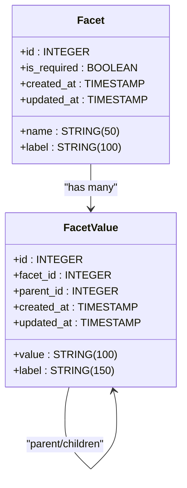
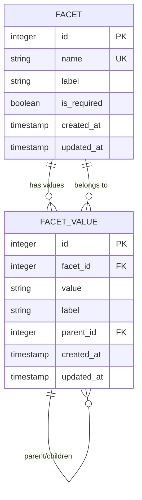

# Facets API

<cite>
**Referenced Files in This Document**   
- [facets.js](file://server/routes/facets.js)
- [Facet.js](file://server/models/Facet.js)
- [FacetValue.js](file://server/models/FacetValue.js)
- [index.js](file://server/models/index.js)
- [FACETS_API.md](file://server/FACETS_API.md)
- [schema.sql](file://server/schema.sql)
- [seed-facets.js](file://server/seed-facets.js)
</cite>

## Table of Contents
1. [Introduction](#introduction)
2. [Core Components](#core-components)
3. [GET /api/facets - Retrieve All Facets](#get-apifacets---retrieve-all-facets)
4. [GET /api/facets/:facetName/values - Retrieve Specific Facet Values](#get-apifacetsfacetnamevalues---retrieve-specific-facet-values)
5. [Database Model Relationships](#database-model-relationships)
6. [Frontend Usage and Caching Strategy](#frontend-usage-and-caching-strategy)
7. [Performance Optimization and Indexing](#performance-optimization-and-indexing)

## Introduction
The Facets API provides classification endpoints for organizing and filtering content in the article-page-v11 application. This API enables hierarchical categorization of articles through a flexible facet system that supports required fields, nested values, and efficient data retrieval. The system is designed to power filter systems and category browsers in the frontend interface, allowing users to navigate content by domain, difficulty, technology, and other classification dimensions.

**Section sources**
- [FACETS_API.md](file://server/FACETS_API.md#L1-L255)

## Core Components
The facets classification system consists of two primary models: Facet and FacetValue. The Facet model represents classification categories (such as domain, difficulty, or technology), while the FacetValue model represents specific values within those categories. These models support hierarchical relationships through self-referencing parent-child relationships in the FacetValue model, enabling tree-like category structures.



**Diagram sources**
- [Facet.js](file://server/models/Facet.js#L4-L34)
- [FacetValue.js](file://server/models/FacetValue.js#L4-L58)
- [index.js](file://server/models/index.js#L12-L18)

**Section sources**
- [Facet.js](file://server/models/Facet.js#L1-L35)
- [FacetValue.js](file://server/models/FacetValue.js#L1-L59)
- [index.js](file://server/models/index.js#L12-L18)

## GET /api/facets - Retrieve All Facets
The `GET /api/facets` endpoint retrieves all facets with their hierarchical values in a single request. This endpoint performs Sequelize eager loading to include top-level facet values and their children, providing a complete view of the classification system.

### Response Structure
The response returns an array of facet objects, each containing:
- **id**: Unique identifier for the facet
- **name**: System name (e.g., "domain", "difficulty")
- **label**: Human-readable label
- **is_required**: Boolean indicating if the facet is required for published articles
- **values**: Array of top-level facet values with their children nested

### Ordering and Filtering
Results are ordered by:
1. `is_required` in descending order (required facets first)
2. `name` in ascending alphabetical order
3. Value labels in ascending order

The query uses Sequelize's `include` with `where: { parent_id: null }` to load only top-level values, while still including their children through nested eager loading.

### Example Response
```json
[
  {
    "id": 1,
    "name": "domain",
    "label": "Предметная область",
    "is_required": true,
    "values": [
      {
        "id": 10,
        "value": "programming_development",
        "label": "Programming & Development",
        "parent_id": null,
        "children": [
          {
            "id": 11,
            "value": "web_development",
            "label": "Web Development"
          }
        ]
      }
    ]
  }
]
```

**Section sources**
- [facets.js](file://server/routes/facets.js#L9-L34)
- [FACETS_API.md](file://server/FACETS_API.md#L56-L84)

## GET /api/facets/:facetName/values - Retrieve Specific Facet Values
The `GET /api/facets/:facetName/values` endpoint retrieves all values for a specific facet by its name. This endpoint is used when detailed information about a particular classification category is needed.

### Request Parameters
- **facetName**: URL parameter specifying the facet name (e.g., "domain", "difficulty")

### Response Structure
The response returns a single facet object with all its values, including:
- **id**: Facet identifier
- **name**: Facet system name
- **label**: Human-readable label
- **is_required**: Required status
- **values**: Array of all facet values with parent references
  - Each value includes `parent` object with details of its parent value

### Error Handling
The endpoint implements proper error handling:
- Returns 404 status with "Facet not found" message if no facet exists with the specified name
- Returns 500 status with error message for server-side failures

### Example Usage
```
GET /api/facets/domain/values
GET /api/facets/difficulty/values
```

**Section sources**
- [facets.js](file://server/routes/facets.js#L40-L65)
- [FACETS_API.md](file://server/FACETS_API.md#L86-L91)

## Database Model Relationships
The facets system implements a hierarchical relationship structure through Sequelize model associations. The database schema defines foreign key relationships that enable efficient querying and data integrity.

### Primary Relationships


**Diagram sources**
- [schema.sql](file://server/schema.sql#L24-L77)
- [index.js](file://server/models/index.js#L12-L18)

### Sequelize Associations
The model relationships are defined in the index.js file:
- **Facet to FacetValue**: One-to-many relationship with cascade deletion
- **FacetValue to FacetValue**: Self-referencing one-to-many for parent-child hierarchy
  - Parent values can have multiple children
  - Children reference parent via `parent_id`
  - Deletion of parent sets `parent_id` to NULL (SET NULL constraint)

The associations enable Sequelize's eager loading capabilities, allowing efficient retrieval of related data in a single query.

**Section sources**
- [index.js](file://server/models/index.js#L12-L18)
- [schema.sql](file://server/schema.sql#L24-L77)

## Frontend Usage and Caching Strategy
The facets data is primarily used in the frontend for populating filter systems and category browsers. The API design supports efficient client-side implementation of navigation interfaces.

### Use Cases
- **Category Browser**: The CategoriesPage component uses facet data to display hierarchical navigation
- **Filter System**: Facets enable content filtering by domain, difficulty, technology, etc.
- **Article Classification**: Required facets ensure articles are properly categorized before publication

### Client-Side Caching
Due to the low mutation frequency of facet data, client-side caching is recommended:
- Cache facet data for extended periods (e.g., 24 hours)
- Implement cache invalidation only when administrative changes occur
- Use cached data to improve page load performance and reduce server requests

The hierarchical structure returned by the API allows frontend components to render nested category trees without additional requests.

**Section sources**
- [CategoriesPage.js](file://src/components/CategoriesPage.js#L1-L86)
- [FACETS_API.md](file://server/FACETS_API.md#L236-L237)

## Performance Optimization and Indexing
The facets system includes several performance optimizations to ensure efficient data retrieval and query execution.

### Database Indexing
The schema includes strategic indexes:
- **facets.name**: Unique index on facet name for fast lookups by name
- **facet_values.facet_id**: Index for efficient joining with facets
- **facet_values.parent_id**: Index for hierarchical queries
- **facet_values(facet_id, value)**: Unique composite index to prevent duplicates

These indexes optimize the most common query patterns, including retrieving facets by name and navigating hierarchical relationships.

### Query Optimization
The API endpoints implement efficient querying patterns:
- **Sequelize eager loading**: Reduces N+1 query problems by loading related data in single queries
- **Targeted includes**: Only loads necessary relationships (top-level values or parent references)
- **Proper ordering**: Database-level sorting rather than client-side sorting

The combination of indexing and optimized queries ensures fast response times even as the facet system grows.

**Section sources**
- [FacetValue.js](file://server/models/FacetValue.js#L44-L54)
- [schema.sql](file://server/schema.sql#L51-L53)
- [facets.js](file://server/routes/facets.js#L11-L26)