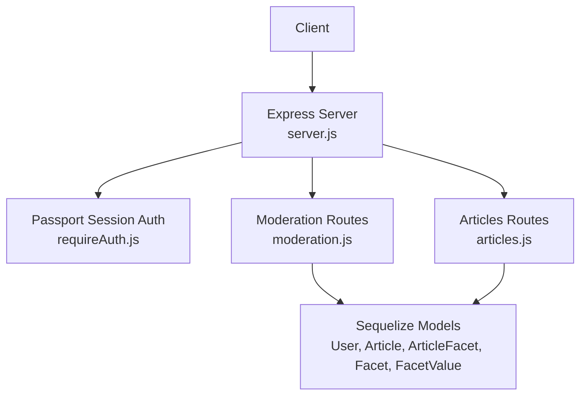
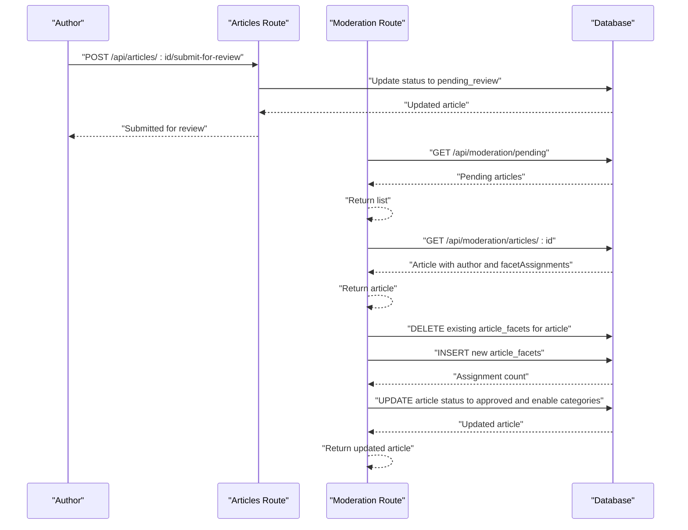
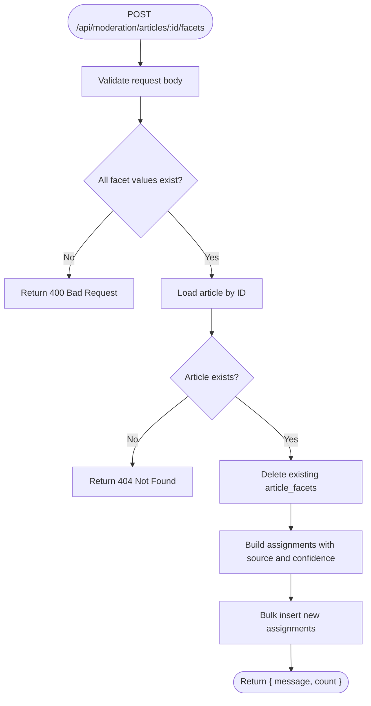
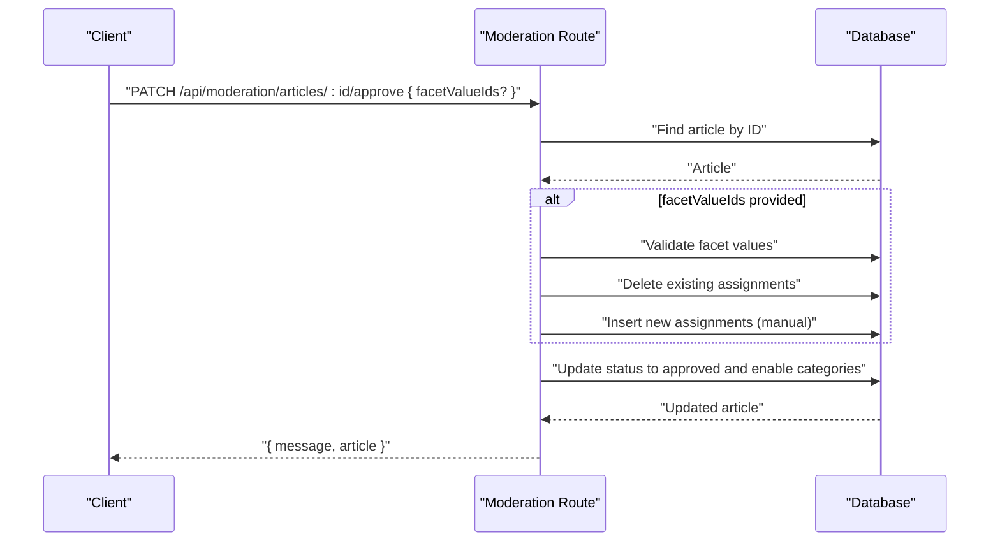
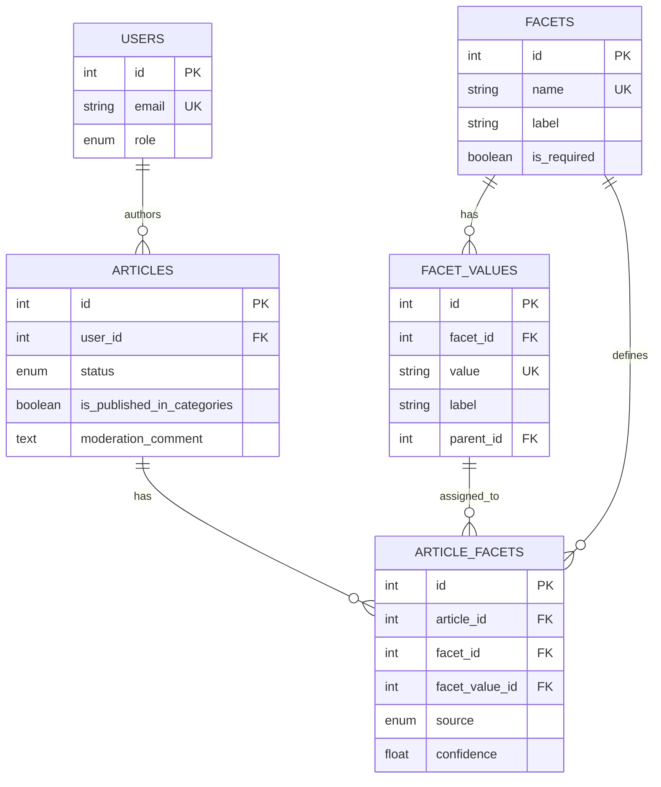

# Moderation API

<cite>
**Referenced Files in This Document**
- [server.js](file://server/server.js)
- [moderation.js](file://server/routes/moderation.js)
- [requireAuth.js](file://server/middleware/requireAuth.js)
- [User.js](file://server/models/User.js)
- [Article.js](file://server/models/Article.js)
- [ArticleFacet.js](file://server/models/ArticleFacet.js)
- [Facet.js](file://server/models/Facet.js)
- [FacetValue.js](file://server/models/FacetValue.js)
- [articles.js](file://server/routes/articles.js)
- [FACETS_API.md](file://server/FACETS_API.md)
- [schema.sql](file://server/schema.sql)
</cite>

## Table of Contents
1. [Introduction](#introduction)
2. [Project Structure](#project-structure)
3. [Core Components](#core-components)
4. [Architecture Overview](#architecture-overview)
5. [Detailed Component Analysis](#detailed-component-analysis)
6. [Dependency Analysis](#dependency-analysis)
7. [Performance Considerations](#performance-considerations)
8. [Troubleshooting Guide](#troubleshooting-guide)
9. [Conclusion](#conclusion)

## Introduction
This document provides detailed API documentation for the moderation endpoints in article-page-v11. It focuses on endpoints that manage article moderation workflows for moderator and admin roles. The documentation covers:
- Retrieving pending articles
- Fetching a specific article with complete facet assignments and hierarchical value data
- Assigning classification tags to an article
- Approving articles and publishing them to categories
- Rejecting articles with moderation feedback
It also outlines authentication and role-based access control, request/response examples, error handling, and workflow integration with the article submission process.

## Project Structure
The moderation endpoints are implemented under the Express route module for moderation and backed by Sequelize models. Authentication is handled via Passport sessions, and the server initializes middleware and routes.

**Diagram sources**
- [server.js](file://server/server.js#L1-L59)
- [moderation.js](file://server/routes/moderation.js#L1-L213)
- [requireAuth.js](file://server/middleware/requireAuth.js#L1-L14)
- [User.js](file://server/models/User.js#L1-L39)
- [Article.js](file://server/models/Article.js#L1-L53)
- [ArticleFacet.js](file://server/models/ArticleFacet.js#L1-L76)
- [Facet.js](file://server/models/Facet.js#L1-L35)
- [FacetValue.js](file://server/models/FacetValue.js#L1-L59)
- [articles.js](file://server/routes/articles.js#L195-L228)

**Section sources**
- [server.js](file://server/server.js#L1-L59)
- [moderation.js](file://server/routes/moderation.js#L1-L213)
- [requireAuth.js](file://server/middleware/requireAuth.js#L1-L14)
- [User.js](file://server/models/User.js#L1-L39)
- [Article.js](file://server/models/Article.js#L1-L53)
- [ArticleFacet.js](file://server/models/ArticleFacet.js#L1-L76)
- [Facet.js](file://server/models/Facet.js#L1-L35)
- [FacetValue.js](file://server/models/FacetValue.js#L1-L59)
- [articles.js](file://server/routes/articles.js#L195-L228)

## Core Components
- Authentication and session middleware: Validates that a user is authenticated via Passport session and attaches user identity to the request.
- Moderation routes: Expose endpoints for pending retrieval, article inspection, facet assignment, approval, and rejection.
- Models:
  - User: Provides role enumeration for user roles.
  - Article: Tracks article status and publication flag.
  - ArticleFacet: Stores facet assignments with source and confidence.
  - Facet and FacetValue: Define classification taxonomy and hierarchical values.

Key implementation notes:
- Authentication is enforced via Passport session in the articles route for submission; moderation routes currently have a TODO to enforce role checks.
- Facet assignment deletes existing assignments and creates new ones in a single operation.
- Approval sets status to approved and enables category visibility; rejection updates status and stores moderation feedback.

**Section sources**
- [requireAuth.js](file://server/middleware/requireAuth.js#L1-L14)
- [moderation.js](file://server/routes/moderation.js#L1-L213)
- [User.js](file://server/models/User.js#L1-L39)
- [Article.js](file://server/models/Article.js#L1-L53)
- [ArticleFacet.js](file://server/models/ArticleFacet.js#L1-L76)
- [Facet.js](file://server/models/Facet.js#L1-L35)
- [FacetValue.js](file://server/models/FacetValue.js#L1-L59)

## Architecture Overview
The moderation workflow integrates with the article submission process. Authors submit drafts, which transition to pending_review. Moderators/admins then review, assign facets, approve (publish), or reject with feedback.

**Diagram sources**
- [articles.js](file://server/routes/articles.js#L195-L228)
- [moderation.js](file://server/routes/moderation.js#L1-L213)
- [ArticleFacet.js](file://server/models/ArticleFacet.js#L1-L76)
- [Article.js](file://server/models/Article.js#L1-L53)

## Detailed Component Analysis

### Authentication and Role-Based Access Control
- Authentication: The server initializes Passport and sessions. The articles route demonstrates authentication enforcement for author-only actions.
- Role enforcement: The moderation routes currently include a TODO indicating that role-based access control (moderator/admin) is not yet implemented. The User model defines roles including moderator and admin.

Recommendations:
- Apply role checks in moderation routes to restrict endpoints to moderator/admin users.
- Integrate role verification alongside the existing authentication middleware.

**Section sources**
- [server.js](file://server/server.js#L1-L59)
- [requireAuth.js](file://server/middleware/requireAuth.js#L1-L14)
- [User.js](file://server/models/User.js#L1-L39)
- [moderation.js](file://server/routes/moderation.js#L1-L213)

### Endpoint: GET /api/moderation/pending
- Purpose: Retrieve all articles with status pending_review, ordered chronologically.
- Response: Array of articles including author information.
- Notes: Requires authentication; role restriction is not yet implemented.

Response shape:
- Array of articles with author metadata.

**Section sources**
- [moderation.js](file://server/routes/moderation.js#L10-L29)
- [Article.js](file://server/models/Article.js#L1-L53)

### Endpoint: GET /api/moderation/articles/:id
- Purpose: Fetch a specific article with author details and complete facet assignments, including hierarchical value data.
- Response: Single article object with author and facetAssignments populated.

Response shape:
- Article with author and facetAssignments containing facet and value, where value includes parent for hierarchy.

**Section sources**
- [moderation.js](file://server/routes/moderation.js#L31-L76)
- [Article.js](file://server/models/Article.js#L1-L53)
- [ArticleFacet.js](file://server/models/ArticleFacet.js#L1-L76)
- [Facet.js](file://server/models/Facet.js#L1-L35)
- [FacetValue.js](file://server/models/FacetValue.js#L1-L59)

### Endpoint: POST /api/moderation/articles/:id/facets
- Purpose: Assign classification tags to an article.
- Request body:
  - facetValueIds: array of facet value IDs to assign
  - source: string, either manual or auto_suggested (default manual)
- Behavior:
  - Validates presence and existence of facetValueIds
  - Deletes existing facet assignments for the article
  - Creates new assignments with source and confidence (manual: 1.0, auto_suggested: 0.8)
  - Returns assignment count

Response shape:
- Object with message and count

**Diagram sources**
- [moderation.js](file://server/routes/moderation.js#L78-L129)
- [ArticleFacet.js](file://server/models/ArticleFacet.js#L1-L76)
- [FacetValue.js](file://server/models/FacetValue.js#L1-L59)

**Section sources**
- [moderation.js](file://server/routes/moderation.js#L78-L129)
- [ArticleFacet.js](file://server/models/ArticleFacet.js#L1-L76)
- [FacetValue.js](file://server/models/FacetValue.js#L1-L59)

### Endpoint: PATCH /api/moderation/articles/:id/approve
- Purpose: Publish an article by transitioning status to approved and enabling category visibility. Optionally assign facets before approval.
- Request body:
  - facetValueIds: optional array of facet value IDs to assign
- Behavior:
  - If facetValueIds provided, validates and replaces assignments (same transactional semantics as POST)
  - Updates article status to approved and sets is_published_in_categories to true
  - Returns the updated article

Response shape:
- Object with message and article

**Diagram sources**
- [moderation.js](file://server/routes/moderation.js#L131-L180)
- [Article.js](file://server/models/Article.js#L1-L53)
- [ArticleFacet.js](file://server/models/ArticleFacet.js#L1-L76)
- [FacetValue.js](file://server/models/FacetValue.js#L1-L59)

**Section sources**
- [moderation.js](file://server/routes/moderation.js#L131-L180)
- [Article.js](file://server/models/Article.js#L1-L53)
- [ArticleFacet.js](file://server/models/ArticleFacet.js#L1-L76)
- [FacetValue.js](file://server/models/FacetValue.js#L1-L59)

### Endpoint: PATCH /api/moderation/articles/:id/reject
- Purpose: Reject an article submission with moderation feedback.
- Request body:
  - moderation_comment: string feedback for rejection
- Behavior:
  - Updates article status to rejected
  - Stores moderation_comment
  - Disables category visibility
  - Returns the updated article

Response shape:
- Object with message and article

**Section sources**
- [moderation.js](file://server/routes/moderation.js#L182-L211)
- [Article.js](file://server/models/Article.js#L1-L53)

### Workflow Integration and Data Integrity
- Submission workflow:
  - Author submits a draft to pending_review via the articles route.
  - Moderation queue displays pending articles.
  - Moderators review, assign facets, approve (publish), or reject with feedback.
- Data integrity considerations:
  - Facet reassignment replaces all previous assignments for the article to ensure consistency.
  - Unique constraint on article_id and facet_value_id prevents duplicates.
  - Status transitions and category visibility flags are updated atomically within the endpoint logic.

**Section sources**
- [articles.js](file://server/routes/articles.js#L195-L228)
- [moderation.js](file://server/routes/moderation.js#L1-L213)
- [schema.sql](file://server/schema.sql#L1-L134)
- [ArticleFacet.js](file://server/models/ArticleFacet.js#L1-L76)

## Dependency Analysis
The moderation endpoints depend on the following models and relationships:
- Article: status and publication flags
- ArticleFacet: junction table for facets with source and confidence
- Facet and FacetValue: taxonomy and hierarchical values
- User: author association and role for access control

**Diagram sources**
- [User.js](file://server/models/User.js#L1-L39)
- [Article.js](file://server/models/Article.js#L1-L53)
- [Facet.js](file://server/models/Facet.js#L1-L35)
- [FacetValue.js](file://server/models/FacetValue.js#L1-L59)
- [ArticleFacet.js](file://server/models/ArticleFacet.js#L1-L76)
- [schema.sql](file://server/schema.sql#L1-L134)

**Section sources**
- [User.js](file://server/models/User.js#L1-L39)
- [Article.js](file://server/models/Article.js#L1-L53)
- [Facet.js](file://server/models/Facet.js#L1-L35)
- [FacetValue.js](file://server/models/FacetValue.js#L1-L59)
- [ArticleFacet.js](file://server/models/ArticleFacet.js#L1-L76)
- [schema.sql](file://server/schema.sql#L1-L134)

## Performance Considerations
- Indexes: The schema includes indexes on articles and article_facets to optimize status filtering and facet lookups.
- Bulk operations: Facet assignment uses bulk inserts for efficient creation of multiple assignments.
- Transactional behavior: Facet reassignment deletes old assignments before inserting new ones; ensure database transactions are used to guarantee atomicity in production deployments.

[No sources needed since this section provides general guidance]

## Troubleshooting Guide
Common issues and resolutions:
- Authentication failures:
  - Ensure the client authenticates via Passport session and includes credentials as configured.
- Authorization failures:
  - Role restrictions are not yet enforced in moderation routes; implement role checks to allow only moderator/admin users.
- Validation errors:
  - facetValueIds must be a non-empty array; invalid or missing IDs will cause 400 responses.
  - Non-existent article IDs will cause 404 responses.
- Internal errors:
  - Server-side exceptions return 500 with a generic error message; inspect server logs for details.

**Section sources**
- [requireAuth.js](file://server/middleware/requireAuth.js#L1-L14)
- [moderation.js](file://server/routes/moderation.js#L1-L213)

## Conclusion
The moderation endpoints provide a clear workflow for managing article submissions: viewing pending articles, reviewing details with facet assignments, assigning classifications, and publishing or rejecting submissions. While authentication is established, role-based access control for moderation endpoints is currently pending implementation. The schema and models support robust facet classification with hierarchical values and transactional facet reassignment. Integrating role checks and ensuring transactional safety will improve reliability and security.