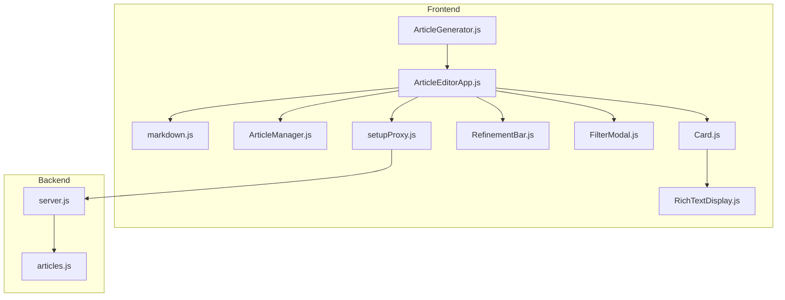
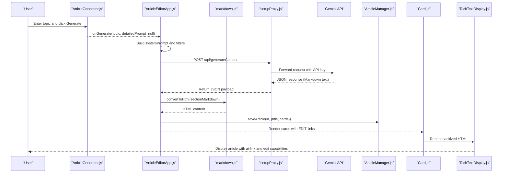
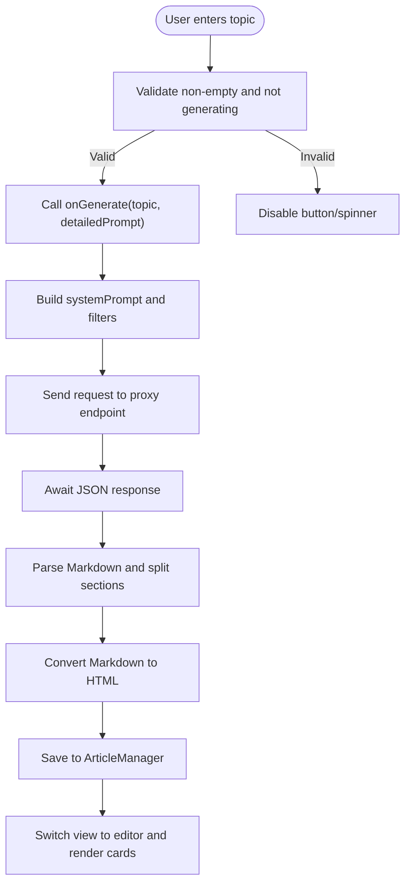
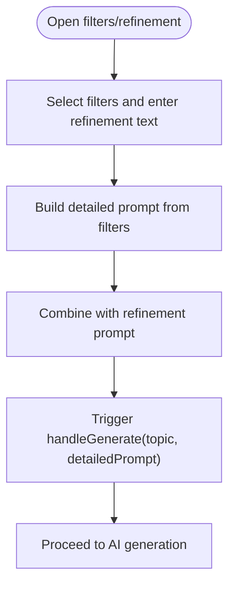
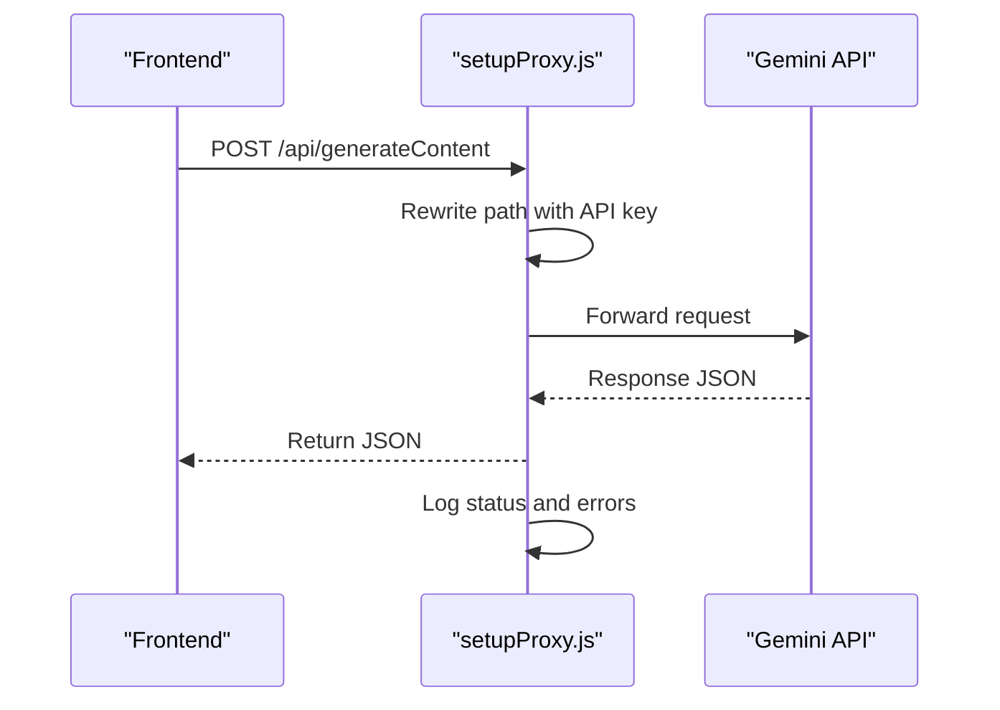
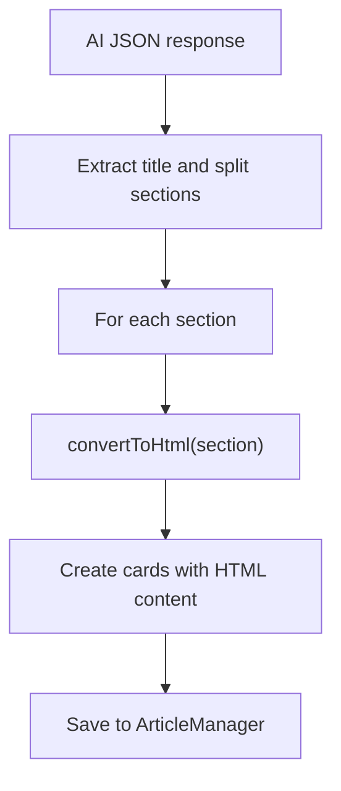
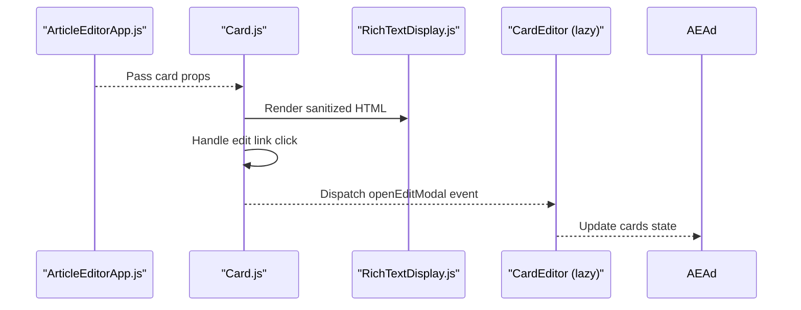
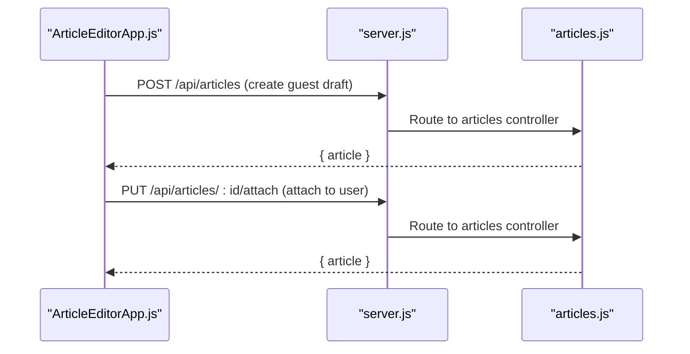
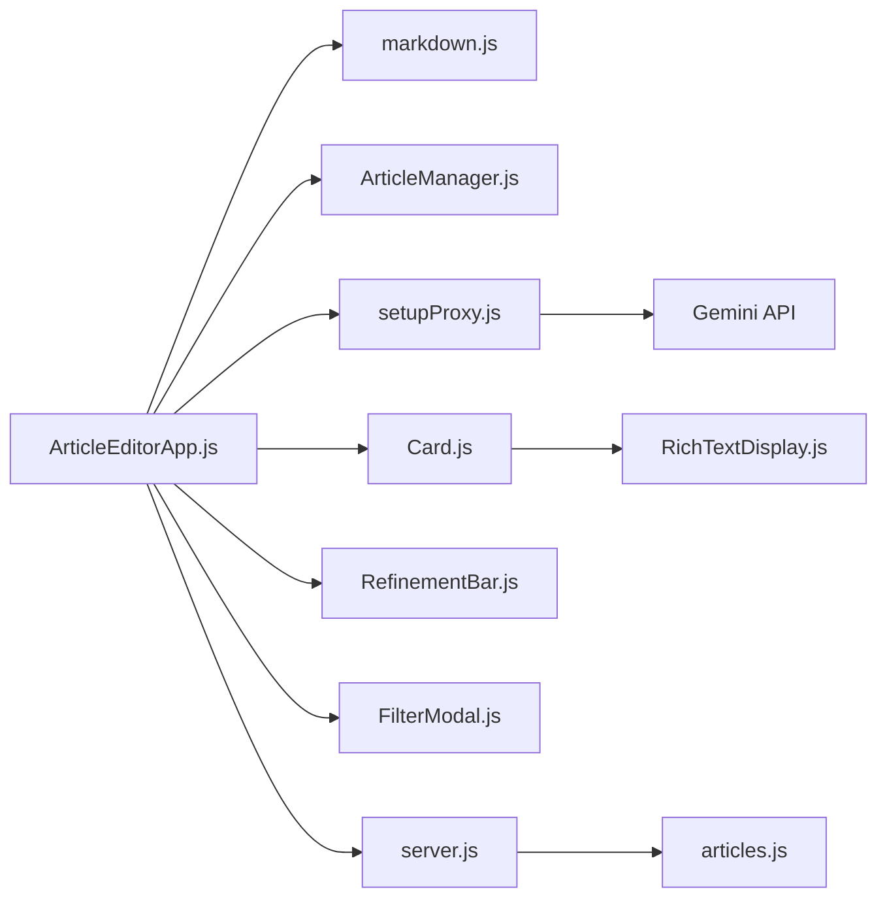

# Article Generation Workflow

<cite>
**Referenced Files in This Document**
- [ArticleGenerator.js](file://src/components/ArticleGenerator.js)
- [ArticleEditorApp.js](file://src/components/ArticleEditorApp.js)
- [setupProxy.js](file://src/setupProxy.js)
- [markdown.js](file://src/utils/markdown.js)
- [ArticleManager.js](file://src/utils/ArticleManager.js)
- [Card.js](file://src/components/Card.js)
- [RefinementBar.js](file://src/components/RefinementBar.js)
- [FilterModal.js](file://src/components/FilterModal.js)
- [RichTextDisplay.js](file://src/components/RichTextDisplay.js)
- [server.js](file://server/server.js)
- [articles.js](file://server/routes/articles.js)
- [README.md](file://README.md)
- [package.json](file://package.json)
</cite>

## Table of Contents
1. [Introduction](#introduction)
2. [Project Structure](#project-structure)
3. [Core Components](#core-components)
4. [Architecture Overview](#architecture-overview)
5. [Detailed Component Analysis](#detailed-component-analysis)
6. [Dependency Analysis](#dependency-analysis)
7. [Performance Considerations](#performance-considerations)
8. [Troubleshooting Guide](#troubleshooting-guide)
9. [Conclusion](#conclusion)
10. [Appendices](#appendices)

## Introduction
This document explains the end-to-end article generation workflow powered by AI. It traces the user journey from entering a topic to receiving a rendered, card-based article. The process includes:
- Topic entry and generation initiation
- Prompt construction with filters and refinement
- Proxying requests to the Gemini API
- Parsing AI Markdown responses
- Converting Markdown to HTML
- Rendering cards and enabling edits
- Managing state transitions and views

It also covers how refinement prompts influence subsequent AI requests, the role of the proxy for secure routing, and robustness against common issues such as empty responses, malformed Markdown, and network timeouts.

## Project Structure
The article generation workflow spans frontend components, utilities, and a local proxy to route Gemini API requests securely. The backend exposes article-related endpoints used for saving and attaching drafts.

**Diagram sources**
- [ArticleGenerator.js](file://src/components/ArticleGenerator.js#L1-L91)
- [ArticleEditorApp.js](file://src/components/ArticleEditorApp.js#L1-L649)
- [markdown.js](file://src/utils/markdown.js#L1-L128)
- [ArticleManager.js](file://src/utils/ArticleManager.js#L1-L152)
- [Card.js](file://src/components/Card.js#L1-L34)
- [RichTextDisplay.js](file://src/components/RichTextDisplay.js#L1-L51)
- [RefinementBar.js](file://src/components/RefinementBar.js#L1-L62)
- [FilterModal.js](file://src/components/FilterModal.js#L1-L111)
- [setupProxy.js](file://src/setupProxy.js#L1-L29)
- [server.js](file://server/server.js#L1-L59)
- [articles.js](file://server/routes/articles.js#L1-L228)

**Section sources**
- [README.md](file://README.md#L1-L45)
- [package.json](file://package.json#L1-L53)

## Core Components
- ArticleGenerator.js: Provides the initial topic input and triggers generation. It disables controls while generating and renders a spinner.
- ArticleEditorApp.js: Orchestrates the entire workflow: handles generation, builds prompts, parses Markdown, converts to HTML, manages views, and coordinates filters and refinement.
- markdown.js: Converts Markdown to HTML and includes a detection heuristic to choose between Markdown and plain text conversion.
- ArticleManager.js: Manages local storage of articles, IDs, and migration from legacy formats.
- setupProxy.js: Proxies requests to the Gemini API through a local Express route, embedding the API key and logging lifecycle events.
- Card.js and RichTextDisplay.js: Render cards and sanitize HTML, including support for custom <ai-link> tags.
- RefinementBar.js and FilterModal.js: Provide UI for refinement prompts and detailed filters that influence subsequent generations.

**Section sources**
- [ArticleGenerator.js](file://src/components/ArticleGenerator.js#L1-L91)
- [ArticleEditorApp.js](file://src/components/ArticleEditorApp.js#L1-L649)
- [markdown.js](file://src/utils/markdown.js#L1-L128)
- [ArticleManager.js](file://src/utils/ArticleManager.js#L1-L152)
- [setupProxy.js](file://src/setupProxy.js#L1-L29)
- [Card.js](file://src/components/Card.js#L1-L34)
- [RichTextDisplay.js](file://src/components/RichTextDisplay.js#L1-L51)
- [RefinementBar.js](file://src/components/RefinementBar.js#L1-L62)
- [FilterModal.js](file://src/components/FilterModal.js#L1-L111)

## Architecture Overview
The workflow begins with user input in the generator, proceeds through prompt construction and AI generation, and concludes with card-based rendering. The proxy ensures the API key remains hidden and simplifies CORS handling.

**Diagram sources**
- [ArticleGenerator.js](file://src/components/ArticleGenerator.js#L1-L91)
- [ArticleEditorApp.js](file://src/components/ArticleEditorApp.js#L41-L178)
- [markdown.js](file://src/utils/markdown.js#L107-L128)
- [setupProxy.js](file://src/setupProxy.js#L1-L29)
- [ArticleManager.js](file://src/utils/ArticleManager.js#L35-L66)
- [Card.js](file://src/components/Card.js#L1-L34)
- [RichTextDisplay.js](file://src/components/RichTextDisplay.js#L1-L51)

## Detailed Component Analysis

### User Input and Generation Initiation
- ArticleGenerator.js captures the topic, validates input, and invokes onGenerate when the user submits. It disables controls during generation and shows a spinner.
- ArticleEditorApp.js receives the topic and detailed prompt (from filters/refinement), sets isGenerating, and creates a new article ID if needed.

**Diagram sources**
- [ArticleGenerator.js](file://src/components/ArticleGenerator.js#L1-L91)
- [ArticleEditorApp.js](file://src/components/ArticleEditorApp.js#L41-L178)
- [ArticleManager.js](file://src/utils/ArticleManager.js#L35-L66)

**Section sources**
- [ArticleGenerator.js](file://src/components/ArticleGenerator.js#L1-L91)
- [ArticleEditorApp.js](file://src/components/ArticleEditorApp.js#L41-L178)

### Prompt Construction and Filters
- System prompt includes explicit formatting rules and AI-link instructions.
- Filters and refinement prompts are combined into a detailed prompt and appended to the base system prompt.
- RefinementBar.js and FilterModal.js manage user selections and trigger regeneration.

**Diagram sources**
- [ArticleEditorApp.js](file://src/components/ArticleEditorApp.js#L180-L288)
- [RefinementBar.js](file://src/components/RefinementBar.js#L1-L62)
- [FilterModal.js](file://src/components/FilterModal.js#L1-L111)

**Section sources**
- [ArticleEditorApp.js](file://src/components/ArticleEditorApp.js#L180-L288)
- [RefinementBar.js](file://src/components/RefinementBar.js#L1-L62)
- [FilterModal.js](file://src/components/FilterModal.js#L1-L111)

### Proxy Request to Gemini API
- setupProxy.js forwards requests to the Gemini API with the API key embedded in the rewritten path. It logs lifecycle events and returns structured error responses on failure.
- The frontend sends a POST to /api/generateContent, which the proxy rewrites to the Gemini endpoint.

**Diagram sources**
- [setupProxy.js](file://src/setupProxy.js#L1-L29)

**Section sources**
- [setupProxy.js](file://src/setupProxy.js#L1-L29)

### Markdown Parsing and HTML Conversion
- ArticleEditorApp.js extracts the title and splits content into sections, then converts each section’s Markdown to HTML using convertToHtml.
- convertToHtml detects Markdown vs plain text and applies appropriate transformations.

**Diagram sources**
- [ArticleEditorApp.js](file://src/components/ArticleEditorApp.js#L103-L168)
- [markdown.js](file://src/utils/markdown.js#L107-L128)

**Section sources**
- [ArticleEditorApp.js](file://src/components/ArticleEditorApp.js#L103-L168)
- [markdown.js](file://src/utils/markdown.js#L1-L128)

### Card-Based Rendering and Edit Flow
- ArticleEditorApp.js renders cards and passes onEdit handlers.
- Card.js intercepts edit and ai-link clicks, dispatches custom events, and opens the edit modal.
- RichTextDisplay.js sanitizes HTML and allows custom ai-link tags.

**Diagram sources**
- [ArticleEditorApp.js](file://src/components/ArticleEditorApp.js#L546-L561)
- [Card.js](file://src/components/Card.js#L1-L34)
- [RichTextDisplay.js](file://src/components/RichTextDisplay.js#L1-L51)

**Section sources**
- [ArticleEditorApp.js](file://src/components/ArticleEditorApp.js#L546-L561)
- [Card.js](file://src/components/Card.js#L1-L34)
- [RichTextDisplay.js](file://src/components/RichTextDisplay.js#L1-L51)

### Backend Integration for Saving Articles
- ArticleEditorApp.js saves the article to the backend and attaches it to the authenticated user.
- server.js configures CORS, sessions, and Passport.
- articles.js defines endpoints for creating drafts, attaching to users, updating, and retrieving user drafts.

**Diagram sources**
- [ArticleEditorApp.js](file://src/components/ArticleEditorApp.js#L372-L418)
- [server.js](file://server/server.js#L1-L59)
- [articles.js](file://server/routes/articles.js#L1-L228)

**Section sources**
- [ArticleEditorApp.js](file://src/components/ArticleEditorApp.js#L372-L418)
- [server.js](file://server/server.js#L1-L59)
- [articles.js](file://server/routes/articles.js#L1-L228)

## Dependency Analysis
- ArticleEditorApp.js depends on:
  - markdown.js for HTML conversion
  - ArticleManager.js for persistence
  - setupProxy.js for secure API routing
  - Card.js and RichTextDisplay.js for rendering
  - RefinementBar.js and FilterModal.js for refinement
- setupProxy.js depends on http-proxy-middleware and targets the Gemini API.
- Backend routes depend on Express, Sequelize, and Passport for authentication.

**Diagram sources**
- [ArticleEditorApp.js](file://src/components/ArticleEditorApp.js#L1-L649)
- [markdown.js](file://src/utils/markdown.js#L1-L128)
- [ArticleManager.js](file://src/utils/ArticleManager.js#L1-L152)
- [setupProxy.js](file://src/setupProxy.js#L1-L29)
- [Card.js](file://src/components/Card.js#L1-L34)
- [RichTextDisplay.js](file://src/components/RichTextDisplay.js#L1-L51)
- [RefinementBar.js](file://src/components/RefinementBar.js#L1-L62)
- [FilterModal.js](file://src/components/FilterModal.js#L1-L111)
- [server.js](file://server/server.js#L1-L59)
- [articles.js](file://server/routes/articles.js#L1-L228)

**Section sources**
- [ArticleEditorApp.js](file://src/components/ArticleEditorApp.js#L1-L649)
- [setupProxy.js](file://src/setupProxy.js#L1-L29)
- [server.js](file://server/server.js#L1-L59)
- [articles.js](file://server/routes/articles.js#L1-L228)

## Performance Considerations
- Loading states: The isGenerating flag disables controls and shows a spinner, preventing concurrent requests and improving UX.
- Response handling: The app awaits JSON and parses Markdown; consider adding streaming support for long responses.
- Client-side caching: ArticleManager persists articles locally; consider adding cache invalidation and optimistic updates.
- Rendering: Card.js uses React.memo to avoid unnecessary re-renders; ensure large articles chunk rendering.
- Network resilience: Implement retry/backoff for transient failures and timeouts.

[No sources needed since this section provides general guidance]

## Troubleshooting Guide
Common issues and solutions:
- Empty responses: Validate that the AI response contains candidates and parts; add a guard to handle missing content and surface a user-friendly error.
- Malformed Markdown: The parser expects a leading title and section markers; ensure the system prompt enforces strict formatting. Consider adding a fallback title and robust splitting logic.
- Network timeouts: The proxy logs status and errors; wrap fetch in try/catch and present a retry mechanism. Add timeout handling for fetch.
- XSS and unsafe HTML: RichTextDisplay sanitizes HTML and allows ai-link tags; ensure custom attributes are validated and escaped.
- Authentication and saving: Confirm the backend endpoints are reachable and that cookies/session are configured for cross-origin requests.

**Section sources**
- [ArticleEditorApp.js](file://src/components/ArticleEditorApp.js#L96-L178)
- [RichTextDisplay.js](file://src/components/RichTextDisplay.js#L1-L51)
- [setupProxy.js](file://src/setupProxy.js#L1-L29)

## Conclusion
The article generation workflow integrates user input, prompt engineering, secure proxy routing, Markdown parsing, and card-based rendering. The system emphasizes robustness through validation, error handling, and safe HTML rendering. Enhancements such as streaming responses, improved retry logic, and stricter Markdown enforcement would further strengthen reliability and user experience.

[No sources needed since this section summarizes without analyzing specific files]

## Appendices

### State Management During Generation (ArticleEditorApp.js)
- isGenerating: Controls UI state and prevents concurrent requests.
- view: Manages transitions between loading, generator, and editor.
- cards: Stores rendered HTML sections.
- articleTitle: Holds the extracted title.
- currentArticleId: Tracks the active article.
- refinementPrompt and selectedFilters: Drive subsequent generations.

**Section sources**
- [ArticleEditorApp.js](file://src/components/ArticleEditorApp.js#L1-L120)
- [ArticleEditorApp.js](file://src/components/ArticleEditorApp.js#L258-L288)

### Secure Routing with setupProxy.js
- Embeds the API key in the proxied path.
- Rewrites /api to the Gemini endpoint.
- Logs lifecycle events and returns structured error responses.

**Section sources**
- [setupProxy.js](file://src/setupProxy.js#L1-L29)

### Relationship Between Components
- ArticleGenerator.js feeds ArticleEditorApp.js with the topic.
- ArticleEditorApp.js constructs prompts and delegates to setupProxy.js for Gemini.
- markdown.js transforms Markdown to HTML.
- ArticleManager.js persists articles locally and migrates legacy data.
- Card.js and RichTextDisplay.js render and sanitize content.
- RefinementBar.js and FilterModal.js refine subsequent generations.

**Section sources**
- [ArticleGenerator.js](file://src/components/ArticleGenerator.js#L1-L91)
- [ArticleEditorApp.js](file://src/components/ArticleEditorApp.js#L41-L178)
- [markdown.js](file://src/utils/markdown.js#L107-L128)
- [ArticleManager.js](file://src/utils/ArticleManager.js#L1-L152)
- [Card.js](file://src/components/Card.js#L1-L34)
- [RichTextDisplay.js](file://src/components/RichTextDisplay.js#L1-L51)
- [RefinementBar.js](file://src/components/RefinementBar.js#L1-L62)
- [FilterModal.js](file://src/components/FilterModal.js#L1-L111)