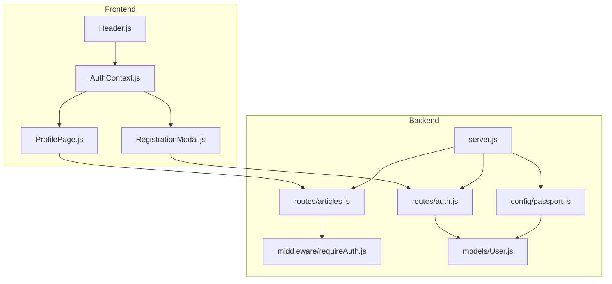
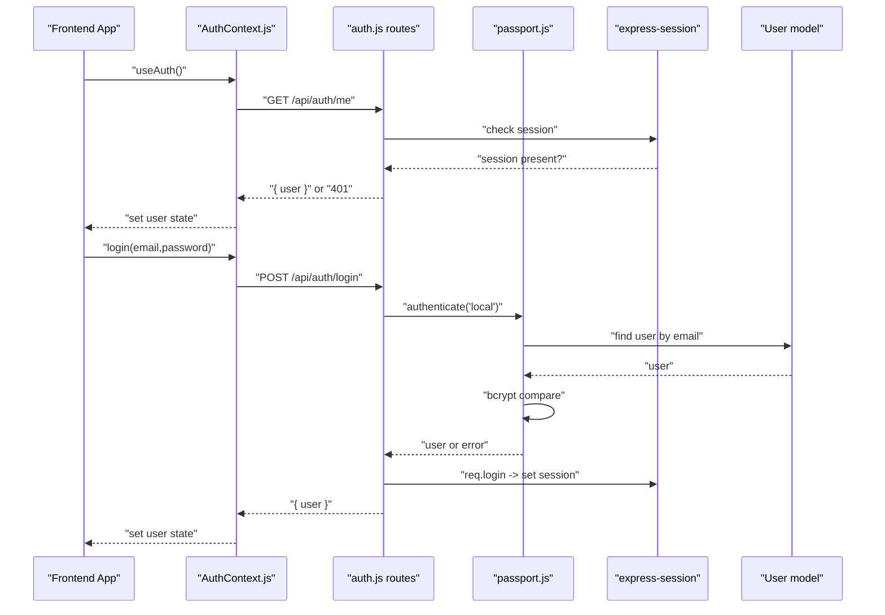
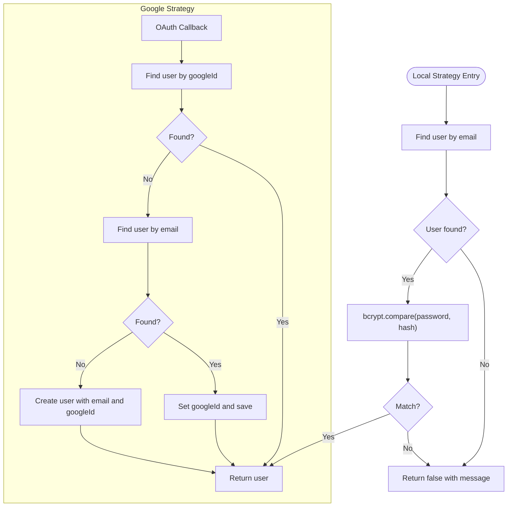
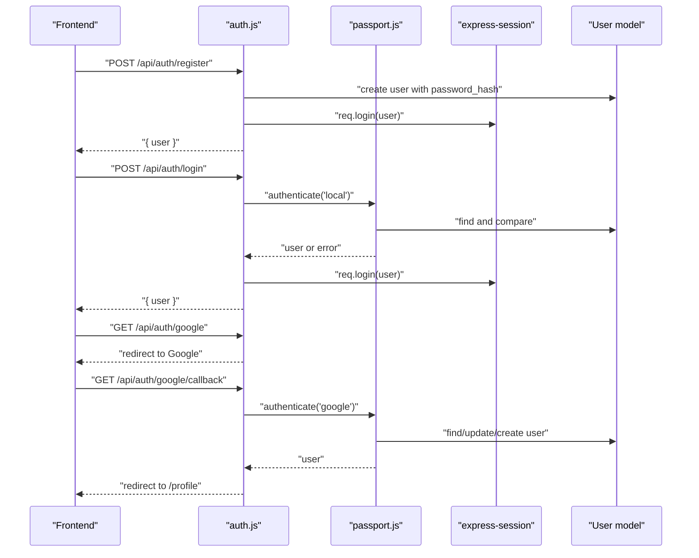
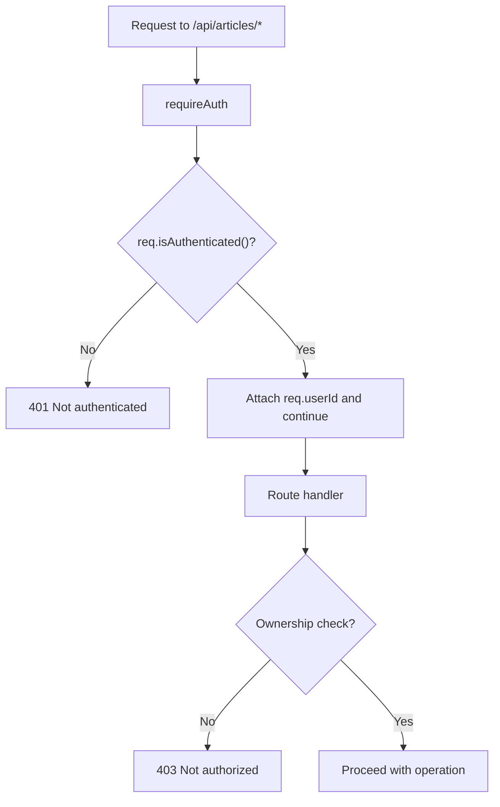
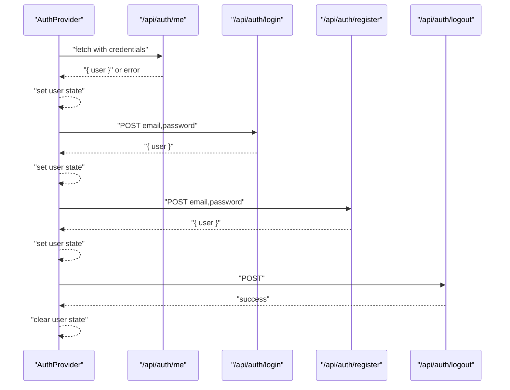
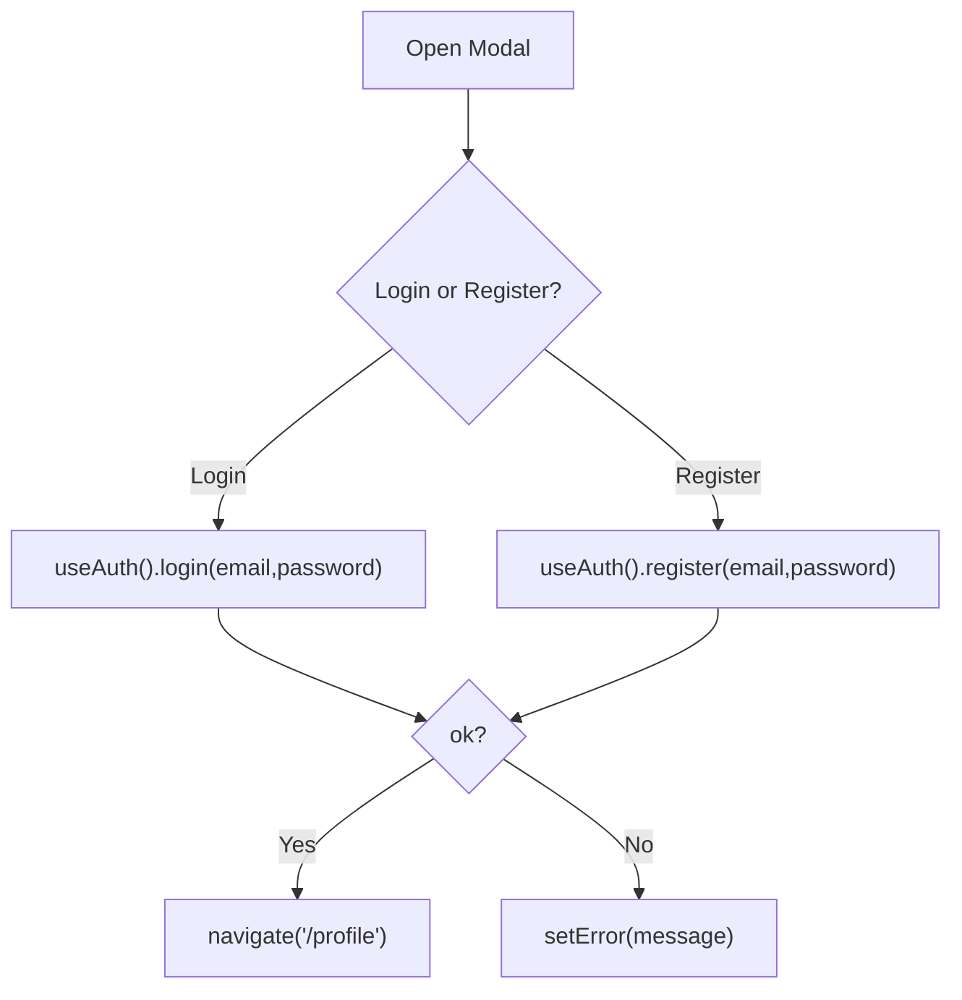
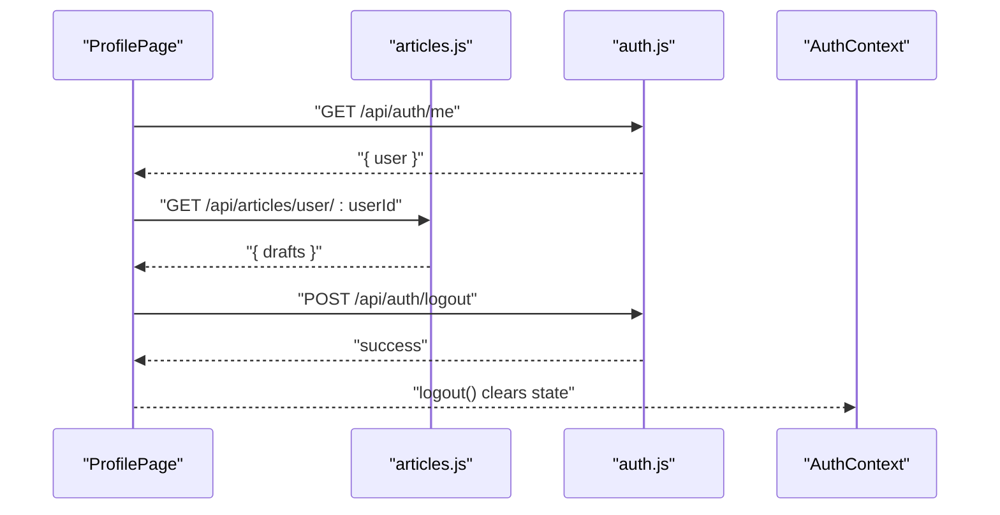
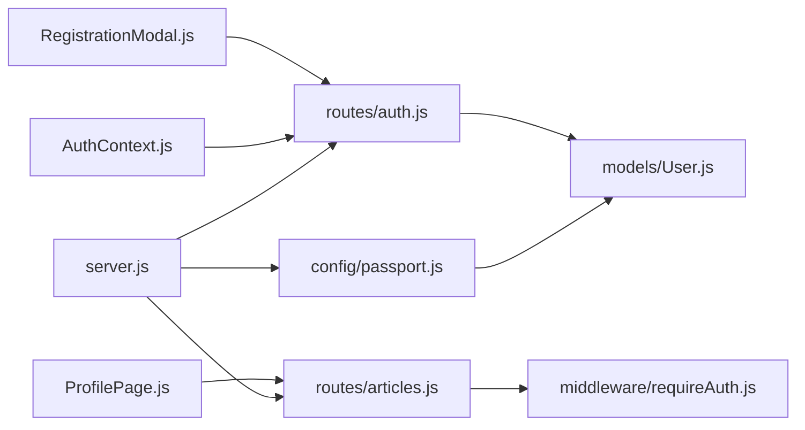

# Authentication System

<cite>
**Referenced Files in This Document**
- [server/server.js](file://server/server.js)
- [server/config/passport.js](file://server/config/passport.js)
- [server/routes/auth.js](file://server/routes/auth.js)
- [server/middleware/requireAuth.js](file://server/middleware/requireAuth.js)
- [server/models/User.js](file://server/models/User.js)
- [src/context/AuthContext.js](file://src/context/AuthContext.js)
- [src/components/RegistrationModal.js](file://src/components/RegistrationModal.js)
- [src/components/ProfilePage.js](file://src/components/ProfilePage.js)
- [src/components/Header.js](file://src/components/Header.js)
- [server/routes/articles.js](file://server/routes/articles.js)
- [.env](file://.env)
</cite>

## Table of Contents
1. [Introduction](#introduction)
2. [Project Structure](#project-structure)
3. [Core Components](#core-components)
4. [Architecture Overview](#architecture-overview)
5. [Detailed Component Analysis](#detailed-component-analysis)
6. [Dependency Analysis](#dependency-analysis)
7. [Performance Considerations](#performance-considerations)
8. [Troubleshooting Guide](#troubleshooting-guide)
9. [Security Considerations](#security-considerations)
10. [Conclusion](#conclusion)

## Introduction
This document explains the authentication system for user management in article-page-v11. It covers:
- Email/password authentication using Passport.js local strategy with bcrypt password hashing
- Google OAuth integration using Passport’s Google strategy with proper callback handling
- Server-side session management and token-based authentication flow
- Frontend state management with AuthContext.js and the RegistrationModal.js component
- How authentication state controls article saving and profile access
- Configuration options (OAuth client IDs, cookie/session settings)
- Troubleshooting common issues and security best practices

## Project Structure
Authentication spans both the backend (Express server) and the frontend (React):
- Backend: Passport configuration, auth routes, session middleware, and protected article routes
- Frontend: AuthContext provider, RegistrationModal, and ProfilePage

**Diagram sources**
- [server/server.js](file://server/server.js#L1-L59)
- [server/config/passport.js](file://server/config/passport.js#L1-L91)
- [server/routes/auth.js](file://server/routes/auth.js#L1-L100)
- [server/middleware/requireAuth.js](file://server/middleware/requireAuth.js#L1-L14)
- [server/routes/articles.js](file://server/routes/articles.js#L1-L228)
- [server/models/User.js](file://server/models/User.js#L1-L39)
- [src/context/AuthContext.js](file://src/context/AuthContext.js#L1-L110)
- [src/components/RegistrationModal.js](file://src/components/RegistrationModal.js#L1-L146)
- [src/components/ProfilePage.js](file://src/components/ProfilePage.js#L1-L147)
- [src/components/Header.js](file://src/components/Header.js#L1-L87)

**Section sources**
- [server/server.js](file://server/server.js#L1-L59)
- [src/context/AuthContext.js](file://src/context/AuthContext.js#L1-L110)

## Core Components
- Passport.js configuration defines local and Google strategies, serializes/deserializes users, and integrates with the session store.
- Auth routes implement registration, login, logout, and current-user retrieval using sessions.
- Frontend AuthContext manages user state, login/logout, and Google OAuth redirection.
- RegistrationModal provides the login/register UI and triggers authentication actions.
- Protected article routes enforce authentication via requireAuth middleware.

**Section sources**
- [server/config/passport.js](file://server/config/passport.js#L1-L91)
- [server/routes/auth.js](file://server/routes/auth.js#L1-L100)
- [src/context/AuthContext.js](file://src/context/AuthContext.js#L1-L110)
- [src/components/RegistrationModal.js](file://src/components/RegistrationModal.js#L1-L146)
- [server/middleware/requireAuth.js](file://server/middleware/requireAuth.js#L1-L14)
- [server/routes/articles.js](file://server/routes/articles.js#L1-L228)

## Architecture Overview
The system uses server-side sessions for authentication. The frontend maintains user state via AuthContext and communicates with backend endpoints that rely on Passport for authentication.

**Diagram sources**
- [src/context/AuthContext.js](file://src/context/AuthContext.js#L1-L110)
- [server/routes/auth.js](file://server/routes/auth.js#L1-L100)
- [server/config/passport.js](file://server/config/passport.js#L1-L91)
- [server/server.js](file://server/server.js#L1-L59)
- [server/models/User.js](file://server/models/User.js#L1-L39)

## Detailed Component Analysis

### Backend: Passport Configuration
- Serializes user.id to session and deserializes user by id on subsequent requests.
- Local strategy validates email/password against hashed passwords stored in the User model.
- Google strategy authenticates via OAuth, linking existing users by googleId or email, or creating a new user.

**Diagram sources**
- [server/config/passport.js](file://server/config/passport.js#L1-L91)
- [server/models/User.js](file://server/models/User.js#L1-L39)

**Section sources**
- [server/config/passport.js](file://server/config/passport.js#L1-L91)
- [server/models/User.js](file://server/models/User.js#L1-L39)

### Backend: Auth Routes
- Registration hashes passwords and logs in the user immediately after creation.
- Login uses Passport local strategy and sets a session cookie.
- Google OAuth initiates authentication and handles callback, redirecting to the profile page.
- Logout destroys the session and clears the session cookie.
- Me endpoint returns the current authenticated user.

**Diagram sources**
- [server/routes/auth.js](file://server/routes/auth.js#L1-L100)
- [server/config/passport.js](file://server/config/passport.js#L1-L91)
- [server/server.js](file://server/server.js#L1-L59)
- [server/models/User.js](file://server/models/User.js#L1-L39)

**Section sources**
- [server/routes/auth.js](file://server/routes/auth.js#L1-L100)
- [server/server.js](file://server/server.js#L1-L59)

### Backend: Protected Article Routes
- requireAuth middleware checks session-based authentication and attaches req.userId for protected endpoints.
- Article routes enforce ownership and authorization for saving, attaching, and deleting drafts.

**Diagram sources**
- [server/middleware/requireAuth.js](file://server/middleware/requireAuth.js#L1-L14)
- [server/routes/articles.js](file://server/routes/articles.js#L1-L228)

**Section sources**
- [server/middleware/requireAuth.js](file://server/middleware/requireAuth.js#L1-L14)
- [server/routes/articles.js](file://server/routes/articles.js#L1-L228)

### Frontend: AuthContext.js
- Initializes user state by calling /api/auth/me with credentials included.
- Provides login, register, logout, and Google OAuth redirection functions.
- Exposes loading state while checking auth status.

**Diagram sources**
- [src/context/AuthContext.js](file://src/context/AuthContext.js#L1-L110)
- [server/routes/auth.js](file://server/routes/auth.js#L1-L100)

**Section sources**
- [src/context/AuthContext.js](file://src/context/AuthContext.js#L1-L110)
- [server/routes/auth.js](file://server/routes/auth.js#L1-L100)

### Frontend: RegistrationModal.js
- Toggles between login and register modes.
- Calls AuthContext login/register functions and navigates to profile on success.
- Provides Google login button that redirects to backend Google OAuth endpoint.

**Diagram sources**
- [src/components/RegistrationModal.js](file://src/components/RegistrationModal.js#L1-L146)
- [src/context/AuthContext.js](file://src/context/AuthContext.js#L1-L110)

**Section sources**
- [src/components/RegistrationModal.js](file://src/components/RegistrationModal.js#L1-L146)
- [src/context/AuthContext.js](file://src/context/AuthContext.js#L1-L110)

### Frontend: ProfilePage.js and Header.js
- ProfilePage displays user’s articles and allows logout; it uses credentials to call protected endpoints.
- Header renders a profile link when user is logged in and a login/register button otherwise.

**Diagram sources**
- [src/components/ProfilePage.js](file://src/components/ProfilePage.js#L1-L147)
- [src/components/Header.js](file://src/components/Header.js#L1-L87)
- [server/routes/auth.js](file://server/routes/auth.js#L1-L100)
- [server/routes/articles.js](file://server/routes/articles.js#L1-L228)
- [src/context/AuthContext.js](file://src/context/AuthContext.js#L1-L110)

**Section sources**
- [src/components/ProfilePage.js](file://src/components/ProfilePage.js#L1-L147)
- [src/components/Header.js](file://src/components/Header.js#L1-L87)
- [server/routes/articles.js](file://server/routes/articles.js#L1-L228)

## Dependency Analysis
- Express server initializes CORS, session, Passport, and mounts auth and article routes.
- Passport depends on User model for serialization/deserialization and strategy lookups.
- Auth routes depend on Passport and the User model.
- Protected article routes depend on requireAuth middleware and the User model.
- Frontend AuthContext depends on auth routes and uses credentials to persist sessions.

**Diagram sources**
- [server/server.js](file://server/server.js#L1-L59)
- [server/config/passport.js](file://server/config/passport.js#L1-L91)
- [server/routes/auth.js](file://server/routes/auth.js#L1-L100)
- [server/middleware/requireAuth.js](file://server/middleware/requireAuth.js#L1-L14)
- [server/routes/articles.js](file://server/routes/articles.js#L1-L228)
- [server/models/User.js](file://server/models/User.js#L1-L39)
- [src/context/AuthContext.js](file://src/context/AuthContext.js#L1-L110)
- [src/components/RegistrationModal.js](file://src/components/RegistrationModal.js#L1-L146)
- [src/components/ProfilePage.js](file://src/components/ProfilePage.js#L1-L147)

**Section sources**
- [server/server.js](file://server/server.js#L1-L59)
- [server/config/passport.js](file://server/config/passport.js#L1-L91)
- [server/routes/auth.js](file://server/routes/auth.js#L1-L100)
- [server/middleware/requireAuth.js](file://server/middleware/requireAuth.js#L1-L14)
- [server/routes/articles.js](file://server/routes/articles.js#L1-L228)
- [server/models/User.js](file://server/models/User.js#L1-L39)
- [src/context/AuthContext.js](file://src/context/AuthContext.js#L1-L110)
- [src/components/RegistrationModal.js](file://src/components/RegistrationModal.js#L1-L146)
- [src/components/ProfilePage.js](file://src/components/ProfilePage.js#L1-L147)

## Performance Considerations
- Password hashing uses bcrypt with a moderate cost; adjust salt rounds if needed for your environment.
- Sessions are stored server-side; keep session lifetime reasonable to reduce memory pressure.
- Avoid excessive revalidation of authentication state; AuthContext already checks once on mount.
- For production, consider adding rate limiting to auth endpoints to mitigate brute-force attempts.

[No sources needed since this section provides general guidance]

## Troubleshooting Guide
Common issues and resolutions:
- Failed OAuth callback
  - Verify GOOGLE_CLIENT_ID and GOOGLE_CLIENT_SECRET are set in environment variables.
  - Ensure callback URL matches the configured callbackURL in the Google strategy.
  - Confirm the frontend redirect target aligns with the backend route.
  - Check that the server is reachable at the callback URL and that cookies are accepted cross-origin.
  - Review server logs for OAuth errors during callback handling.

- Expired or missing session
  - The session cookie is cleared on logout; ensure credentials are included in subsequent requests.
  - Verify CORS configuration allows credentials and the correct origin.
  - Confirm the session secret is set and consistent across restarts.

- Session persistence problems
  - Ensure cookies are sent with credentials: include option in fetch calls.
  - Check that the frontend calls /api/auth/me on mount to hydrate user state.

- Registration/login failures
  - Validate required fields and error messages returned by auth endpoints.
  - Inspect server logs for bcrypt hashing or database errors.

- Protected route access denied
  - Confirm the user is authenticated and the session is active.
  - Verify requireAuth middleware is applied to protected routes.

**Section sources**
- [.env](file://.env#L1-L10)
- [server/config/passport.js](file://server/config/passport.js#L1-L91)
- [server/routes/auth.js](file://server/routes/auth.js#L1-L100)
- [src/context/AuthContext.js](file://src/context/AuthContext.js#L1-L110)
- [server/server.js](file://server/server.js#L1-L59)

## Security Considerations
- Password storage
  - Passwords are hashed with bcrypt before being stored; ensure salt rounds are appropriate for your threat model.
  - Do not store plain-text passwords.

- Token usage
  - The system relies on server-side sessions rather than JWT tokens. There is no JWT generation in the provided code.
  - If JWT tokens are desired later, implement signing with a strong secret and set short expiration times.

- Cookie settings
  - The session cookie is configured with secure=false and a 24-hour max age. For production, enable secure=true and consider SameSite policies.
  - Ensure the session secret is strong and rotated periodically.

- CSRF protection
  - There is no explicit CSRF middleware configured. For forms requiring CSRF protection, integrate a CSRF library and apply it to sensitive endpoints.

- Cross-origin requests
  - CORS is enabled with credentials support for the frontend origin. Ensure the origin remains correct and restrict it to trusted domains.

**Section sources**
- [server/server.js](file://server/server.js#L1-L59)
- [server/config/passport.js](file://server/config/passport.js#L1-L91)
- [.env](file://.env#L1-L10)

## Conclusion
The authentication system in article-page-v11 uses Passport.js with server-side sessions for email/password and Google OAuth. The frontend maintains user state with AuthContext and exposes a unified login/register interface via RegistrationModal. Protected article operations rely on requireAuth middleware to enforce ownership. While the current implementation focuses on sessions, future enhancements could include JWT tokens and CSRF protection for stronger security posture.