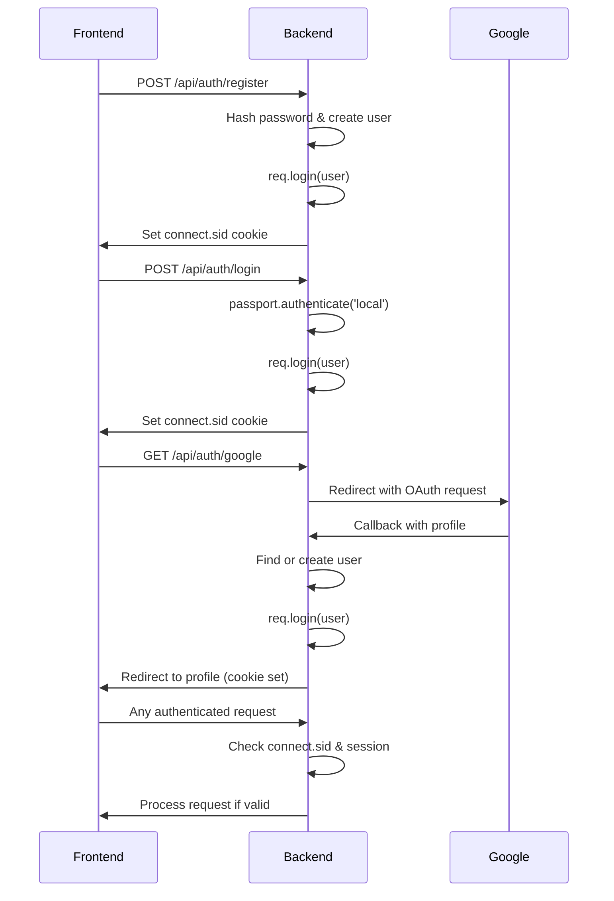
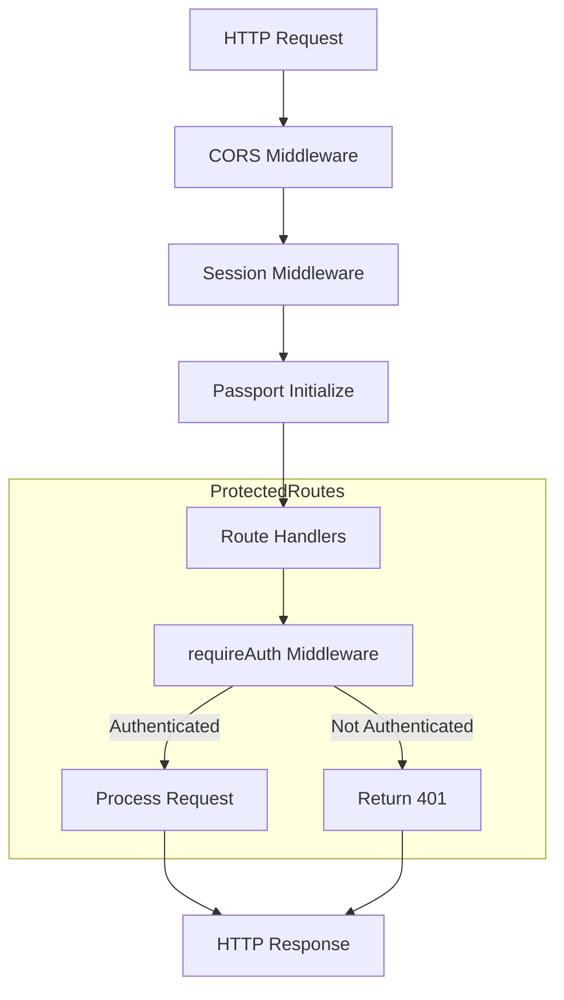
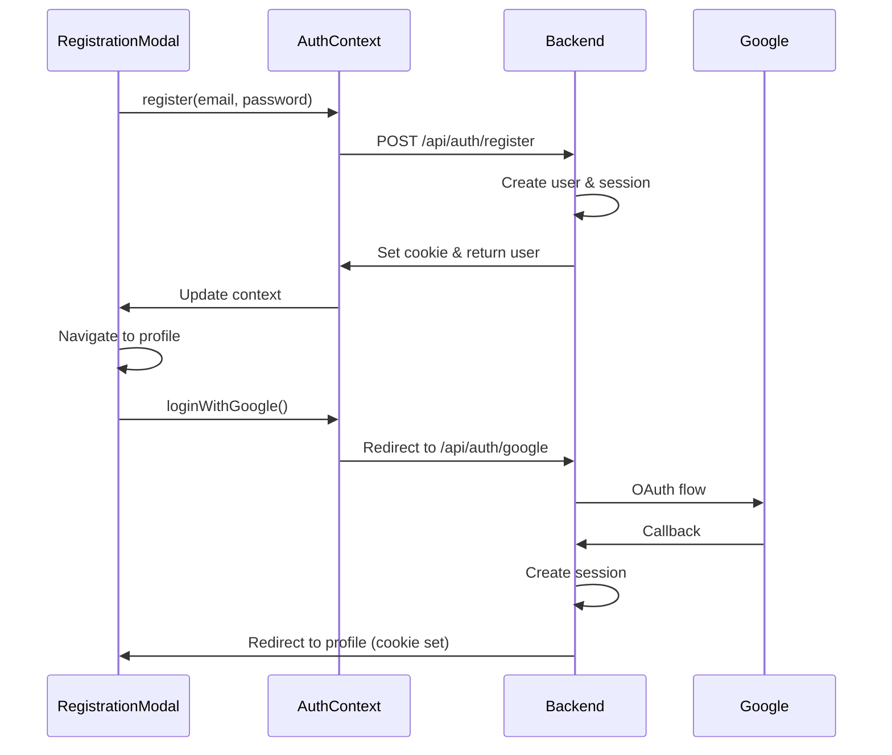

# API Endpoints

<cite>
**Referenced Files in This Document**   
- [auth.js](file://server/routes/auth.js)
- [articles.js](file://server/routes/articles.js)
- [facets.js](file://server/routes/facets.js)
- [moderation.js](file://server/routes/moderation.js)
- [requireAuth.js](file://server/middleware/requireAuth.js)
- [passport.js](file://server/config/passport.js)
- [server.js](file://server/server.js)
- [User.js](file://server/models/User.js)
- [Article.js](file://server/models/Article.js)
- [Facet.js](file://server/models/Facet.js)
- [FacetValue.js](file://server/models/FacetValue.js)
- [RegistrationModal.js](file://src/components/RegistrationModal.js)
- [ProfilePage.js](file://src/components/ProfilePage.js)
- [AuthContext.js](file://src/context/AuthContext.js)
</cite>

## Table of Contents
1. [Introduction](#introduction)
2. [Authentication Flow](#authentication-flow)
3. [Route Group: /api/auth](#route-group-apiauth)
4. [Route Group: /api/articles](#route-group-apiarticles)
5. [Route Group: /api/facets](#route-group-apifactors)
6. [Route Group: /api/moderation](#route-group-apimoderation)
7. [Middleware and Security](#middleware-and-security)
8. [Frontend Integration](#frontend-integration)
9. [Common Issues and Troubleshooting](#common-issues-and-troubleshooting)
10. [Conclusion](#conclusion)

## Introduction
This document provides comprehensive API documentation for the backend endpoints of the article-page-v11 application. The API is organized into four main route groups: `/api/auth` for user authentication, `/api/articles` for article management, `/api/facets` for classification data retrieval, and `/api/moderation` for content moderation operations. The system uses Passport.js for authentication with both email/password and Google OAuth strategies, maintaining stateful sessions without JWT tokens. All routes are protected by appropriate middleware to ensure secure access.

## Authentication Flow
The authentication system implements Passport.js with session-based login, supporting both email/password and Google OAuth flows. Sessions are stateful and stored server-side with cookies, eliminating the need for JWT tokens. The flow begins with user registration or login, followed by session creation and cookie-based authentication for subsequent requests.



**Diagram sources**
- [auth.js](file://server/routes/auth.js#L9-L98)
- [passport.js](file://server/config/passport.js#L7-L90)
- [server.js](file://server/server.js#L19-L29)

**Section sources**
- [auth.js](file://server/routes/auth.js#L9-L98)
- [passport.js](file://server/config/passport.js#L7-L90)
- [requireAuth.js](file://server/middleware/requireAuth.js#L3-L13)

## Route Group: /api/auth
This route group handles user authentication, registration, and session management. It supports both traditional email/password authentication and Google OAuth integration.

### POST /api/auth/register
Registers a new user with email and password.

**Request**
- Method: POST
- URL: `/api/auth/register`
- Content-Type: `application/json`
- Body:
```json
{
  "email": "user@example.com",
  "password": "securepassword"
}
```

**Response**
- Success (201): 
```json
{
  "user": {
    "id": 1,
    "email": "user@example.com"
  }
}
```
- Error (400): 
```json
{
  "error": "Email already in use"
}
```

**Authentication**: None

**Section sources**
- [auth.js](file://server/routes/auth.js#L9-L44)

### POST /api/auth/login
Logs in an existing user with email and password.

**Request**
- Method: POST
- URL: `/api/auth/login`
- Content-Type: `application/json`
- Body:
```json
{
  "email": "user@example.com",
  "password": "securepassword"
}
```

**Response**
- Success (200): 
```json
{
  "user": {
    "id": 1,
    "email": "user@example.com"
  }
}
```
- Error (400): 
```json
{
  "error": "Invalid credentials"
}
```

**Authentication**: None

**Section sources**
- [auth.js](file://server/routes/auth.js#L47-L62)

### GET /api/auth/google
Initiates Google OAuth authentication flow.

**Request**
- Method: GET
- URL: `/api/auth/google`

**Response**
- Redirects to Google OAuth consent screen

**Authentication**: None

**Section sources**
- [auth.js](file://server/routes/auth.js#L64-L65)

### GET /api/auth/google/callback
Handles Google OAuth callback and creates session.

**Request**
- Method: GET
- URL: `/api/auth/google/callback`

**Response**
- Success: Redirects to `http://localhost:3000/profile`
- Failure: Redirects to `/`

**Authentication**: None

**Section sources**
- [auth.js](file://server/routes/auth.js#L67-L73)

### POST /api/auth/logout
Terminates the current user session.

**Request**
- Method: POST
- URL: `/api/auth/logout`

**Response**
- Success (200): 
```json
{
  "message": "Logged out successfully"
}
```

**Authentication**: Session-based (connect.sid cookie)

**Section sources**
- [auth.js](file://server/routes/auth.js#L76-L88)

### GET /api/auth/me
Retrieves the currently authenticated user's information.

**Request**
- Method: GET
- URL: `/api/auth/me`

**Response**
- Success (200): 
```json
{
  "user": {
    "id": 1,
    "email": "user@example.com"
  }
}
```
- Error (401): 
```json
{
  "error": "Not authenticated"
}
```

**Authentication**: Session-based (connect.sid cookie)

**Section sources**
- [auth.js](file://server/routes/auth.js#L92-L98)

## Route Group: /api/articles
This route group manages article creation, editing, deletion, and retrieval. Articles can be created as guest drafts before authentication and later attached to a user account.

### POST /api/articles
Creates a new guest draft article.

**Request**
- Method: POST
- URL: `/api/articles`
- Content-Type: `application/json`
- Body:
```json
{
  "title": "My Article",
  "content": "[{ \"type\": \"text\", \"data\": \"Article content\" }]"
}
```

**Response**
- Success (201): 
```json
{
  "article": {
    "id": 1,
    "title": "My Article",
    "content": "[{ \"type\": \"text\", \"data\": \"Article content\" }]",
    "user_id": null,
    "status": "draft"
  }
}
```

**Authentication**: None (creates guest draft)

**Section sources**
- [articles.js](file://server/routes/articles.js#L9-L24)

### PUT /api/articles/:id/attach
Attaches a guest draft to the authenticated user.

**Request**
- Method: PUT
- URL: `/api/articles/1/attach`
- Authentication: Required via requireAuth middleware

**Response**
- Success (200): 
```json
{
  "article": {
    "id": 1,
    "user_id": 1,
    "title": "My Article"
  }
}
```
- Error (403): 
```json
{
  "error": "Article already belongs to a user"
}
```

**Authentication**: Session-based (connect.sid cookie)

**Section sources**
- [articles.js](file://server/routes/articles.js#L27-L53)

### PUT /api/articles/:id
Updates an existing article.

**Request**
- Method: PUT
- URL: `/api/articles/1`
- Content-Type: `application/json`
- Body:
```json
{
  "title": "Updated Title",
  "content": "[{ \"type\": \"text\", \"data\": \"Updated content\" }]"
}
```

**Response**
- Success (200): 
```json
{
  "article": {
    "id": 1,
    "title": "Updated Title",
    "content": "[{ \"type\": \"text\", \"data\": \"Updated content\" }]"
  }
}
```
- Error (403): 
```json
{
  "error": "Not authorized"
}
```

**Authentication**: Session-based (connect.sid cookie)

**Section sources**
- [articles.js](file://server/routes/articles.js#L56-L81)

### GET /api/articles/user/:userId
Retrieves all articles belonging to a user.

**Request**
- Method: GET
- URL: `/api/articles/user/1`
- Authentication: Required via requireAuth middleware

**Response**
- Success (200): 
```json
{
  "drafts": [
    {
      "id": 1,
      "title": "My Article",
      "content": "...",
      "user_id": 1
    }
  ]
}
```

**Authentication**: Session-based (connect.sid cookie)

**Section sources**
- [articles.js](file://server/routes/articles.js#L84-L101)

### DELETE /api/articles/:id
Deletes an article.

**Request**
- Method: DELETE
- URL: `/api/articles/1`
- Authentication: Required via requireAuth middleware

**Response**
- Success (200): 
```json
{
  "message": "Article deleted"
}
```

**Authentication**: Session-based (connect.sid cookie)

**Section sources**
- [articles.js](file://server/routes/articles.js#L104-L123)

### GET /api/articles/categories/:facetValue
Retrieves published articles by category.

**Request**
- Method: GET
- URL: `/api/articles/categories/web_development`

**Response**
- Success (200): 
```json
{
  "category": {
    "id": 1,
    "value": "web_development",
    "label": "Web Development"
  },
  "articles": [
    {
      "id": 1,
      "title": "React Tutorial",
      "content": "...",
      "status": "approved"
    }
  ]
}
```

**Authentication**: None

**Section sources**
- [articles.js](file://server/routes/articles.js#L130-L192)

### POST /api/articles/:id/submit-for-review
Submits an article for moderation review.

**Request**
- Method: POST
- URL: `/api/articles/1/submit-for-review`
- Authentication: Required via requireAuth middleware

**Response**
- Success (200): 
```json
{
  "message": "Article submitted for review",
  "article": {
    "id": 1,
    "status": "pending_review"
  }
}
```

**Authentication**: Session-based (connect.sid cookie)

**Section sources**
- [articles.js](file://server/routes/articles.js#L198-L225)

## Route Group: /api/facets
This route group provides classification data for article categorization.

### GET /api/facets
Retrieves all facets with their hierarchical values.

**Request**
- Method: GET
- URL: `/api/facets`

**Response**
- Success (200): 
```json
[
  {
    "id": 1,
    "name": "domain",
    "label": "Domain",
    "values": [
      {
        "id": 1,
        "value": "web_development",
        "label": "Web Development",
        "parent_id": null
      }
    ]
  }
]
```

**Authentication**: None

**Section sources**
- [facets.js](file://server/routes/facets.js#L9-L34)

### GET /api/facets/:facetName/values
Retrieves all values for a specific facet.

**Request**
- Method: GET
- URL: `/api/facets/domain/values`

**Response**
- Success (200): 
```json
{
  "id": 1,
  "name": "domain",
  "label": "Domain",
  "values": [
    {
      "id": 1,
      "value": "web_development",
      "label": "Web Development",
      "parent_id": null
    }
  ]
}
```
- Error (404): 
```json
{
  "error": "Facet not found"
}
```

**Authentication**: None

**Section sources**
- [facets.js](file://server/routes/facets.js#L40-L65)

## Route Group: /api/moderation
This route group handles content moderation operations, allowing moderators to review, approve, reject, and classify articles.

### GET /api/moderation/pending
Retrieves all articles pending moderation review.

**Request**
- Method: GET
- URL: `/api/moderation/pending`

**Response**
- Success (200): 
```json
[
  {
    "id": 1,
    "title": "New Article",
    "status": "pending_review",
    "author": {
      "id": 1,
      "email": "user@example.com"
    }
  }
]
```

**Authentication**: None (currently unprotected, TODO: add role-based access)

**Section sources**
- [moderation.js](file://server/routes/moderation.js#L10-L28)

### GET /api/moderation/articles/:id
Retrieves a specific article with all facet assignments for moderation.

**Request**
- Method: GET
- URL: `/api/moderation/articles/1`

**Response**
- Success (200): 
```json
{
  "id": 1,
  "title": "Article Title",
  "content": "...",
  "status": "pending_review",
  "facetAssignments": [
    {
      "facet_id": 1,
      "value": {
        "id": 1,
        "value": "web_development",
        "label": "Web Development"
      }
    }
  ]
}
```

**Authentication**: None (currently unprotected, TODO: add role-based access)

**Section sources**
- [moderation.js](file://server/routes/moderation.js#L35-L76)

### POST /api/moderation/articles/:id/facets
Assigns facets to an article during moderation.

**Request**
- Method: POST
- URL: `/api/moderation/articles/1/facets`
- Content-Type: `application/json`
- Body:
```json
{
  "facetValueIds": [1, 2],
  "source": "manual"
}
```

**Response**
- Success (200): 
```json
{
  "message": "Facets assigned successfully",
  "count": 2
}
```
- Error (400): 
```json
{
  "error": "facetValueIds array is required"
}
```

**Authentication**: None (currently unprotected, TODO: add role-based access)

**Section sources**
- [moderation.js](file://server/routes/moderation.js#L83-L128)

### PATCH /api/moderation/articles/:id/approve
Approves an article and publishes it to categories.

**Request**
- Method: PATCH
- URL: `/api/moderation/articles/1/approve`
- Content-Type: `application/json`
- Body:
```json
{
  "facetValueIds": [1, 2]
}
```

**Response**
- Success (200): 
```json
{
  "message": "Article approved and published",
  "article": {
    "id": 1,
    "status": "approved",
    "is_published_in_categories": true
  }
}
```

**Authentication**: None (currently unprotected, TODO: add role-based access)

**Section sources**
- [moderation.js](file://server/routes/moderation.js#L136-L179)

### PATCH /api/moderation/articles/:id/reject
Rejects an article with optional moderation comment.

**Request**
- Method: PATCH
- URL: `/api/moderation/articles/1/reject`
- Content-Type: `application/json`
- Body:
```json
{
  "moderation_comment": "Needs more technical depth"
}
```

**Response**
- Success (200): 
```json
{
  "message": "Article rejected",
  "article": {
    "id": 1,
    "status": "rejected",
    "moderation_comment": "Needs more technical depth"
  }
}
```

**Authentication**: None (currently unprotected, TODO: add role-based access)

**Section sources**
- [moderation.js](file://server/routes/moderation.js#L187-L211)

## Middleware and Security
The API uses several middleware components to ensure security and proper request handling. The `requireAuth` middleware protects routes that require authentication, while CORS configuration allows controlled access from the frontend.



**Diagram sources**
- [server.js](file://server/server.js#L13-L29)
- [requireAuth.js](file://server/middleware/requireAuth.js#L3-L13)

**Section sources**
- [server.js](file://server/server.js#L13-L29)
- [requireAuth.js](file://server/middleware/requireAuth.js#L3-L13)

## Frontend Integration
The frontend components integrate with the backend API through the AuthContext and direct fetch calls. The RegistrationModal and ProfilePage components demonstrate how authentication and article management are handled in the UI.



**Diagram sources**
- [RegistrationModal.js](file://src/components/RegistrationModal.js#L5-L146)
- [AuthContext.js](file://src/context/AuthContext.js#L1-L110)

**Section sources**
- [RegistrationModal.js](file://src/components/RegistrationModal.js#L5-L146)
- [ProfilePage.js](file://src/components/ProfilePage.js#L6-L147)
- [AuthContext.js](file://src/context/AuthContext.js#L1-L110)

## Common Issues and Troubleshooting
This section addresses common issues developers may encounter when working with the API.

### CORS Configuration
The server is configured to allow requests from `http://localhost:3000` with credentials. If the frontend is running on a different port, update the CORS configuration in `server.js`.

**Solution**: Modify the origin in the CORS middleware:
```javascript
app.use(cors({
  origin: 'http://localhost:3000', // Update as needed
  credentials: true
}));
```

**Section sources**
- [server.js](file://server/server.js#L13-L16)

### Session Expiration
Sessions expire after 24 hours as configured in the session middleware. Users will need to re-authenticate after expiration.

**Solution**: Adjust the cookie maxAge in session configuration:
```javascript
cookie: { secure: false, maxAge: 24 * 60 * 60 * 1000 } // 24 hours
```

**Section sources**
- [server.js](file://server/server.js#L24-L25)

### Input Validation Errors
The API returns 400 errors for missing required fields. Ensure all required fields are included in requests.

**Common validation errors**:
- Missing email or password in registration/login
- Invalid facetValueIds array in moderation routes
- Attempting to attach an article that already has an owner

**Section sources**
- [auth.js](file://server/routes/auth.js#L13-L15)
- [moderation.js](file://server/routes/moderation.js#L88-L90)

## Conclusion
The article-page-v11 backend API provides a comprehensive set of endpoints for user authentication, article management, classification, and content moderation. The system uses Passport.js with session-based authentication, supporting both email/password and Google OAuth login methods. The API is organized into logical route groups with appropriate middleware protection. Frontend components integrate seamlessly with the backend through the AuthContext provider and direct API calls. While the current implementation works well, future improvements should include role-based access control for moderation endpoints and enhanced error handling.