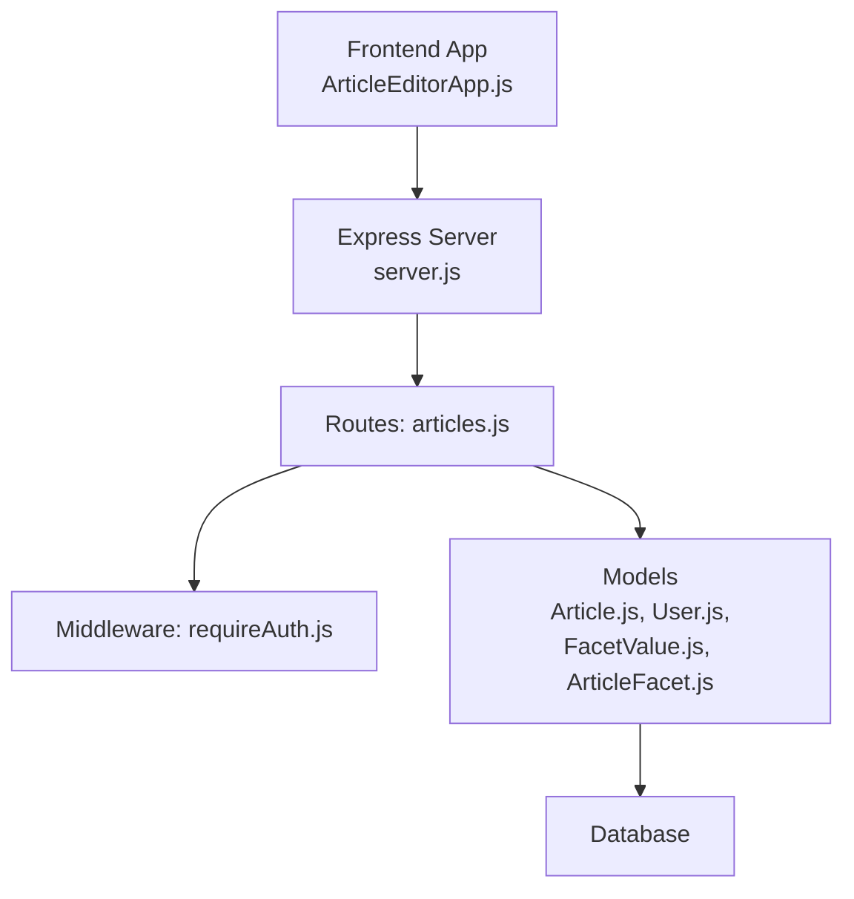
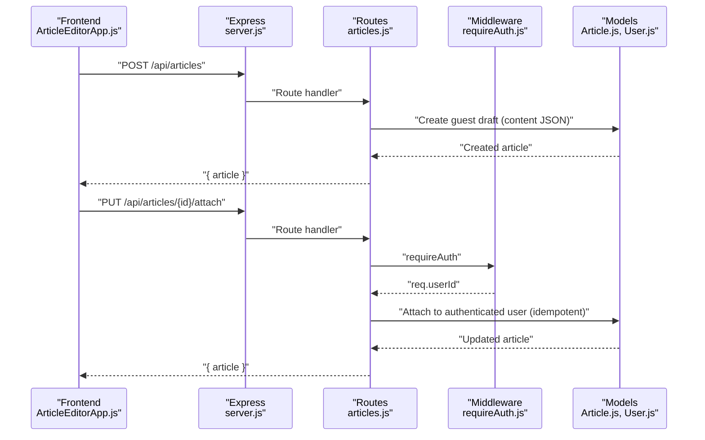
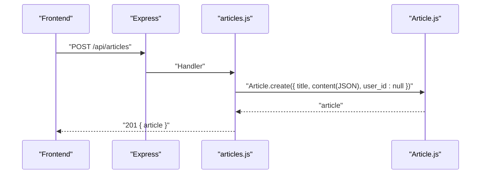
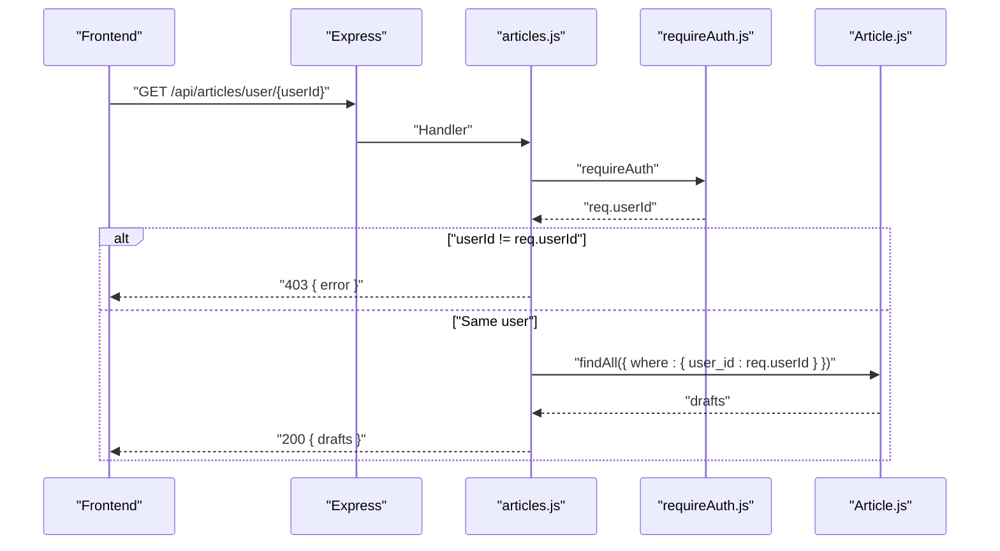
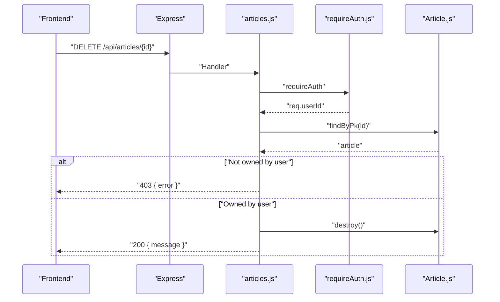
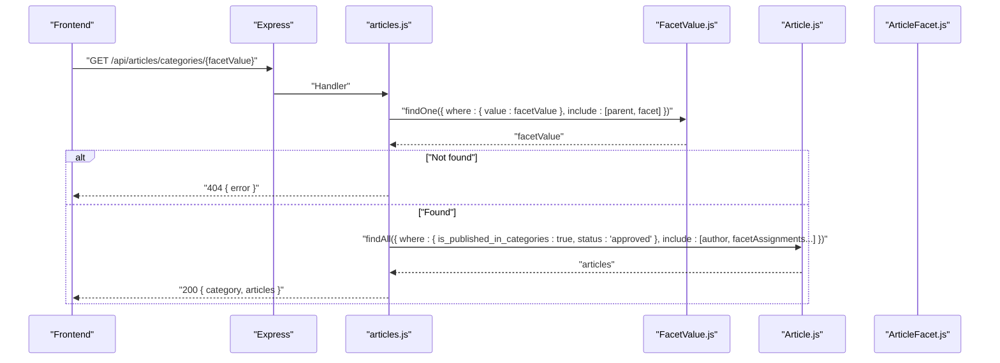
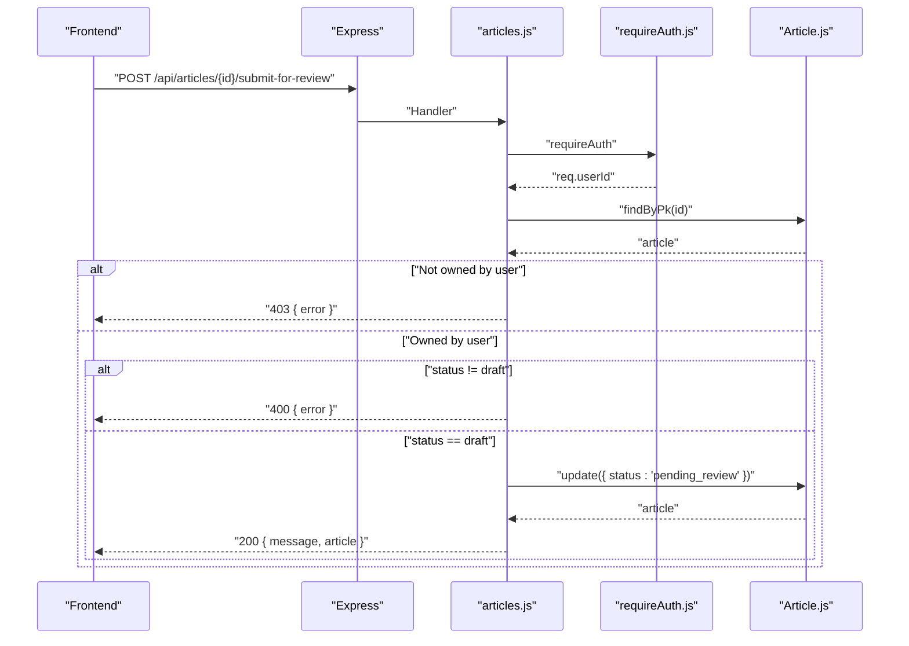
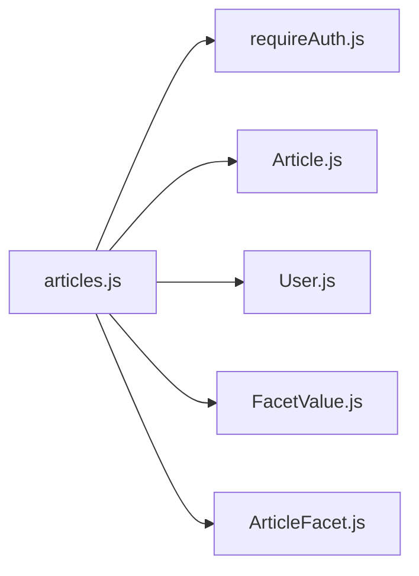

# Article Management API

<cite>
**Referenced Files in This Document**
- [server.js](file://server/server.js)
- [articles.js](file://server/routes/articles.js)
- [requireAuth.js](file://server/middleware/requireAuth.js)
- [Article.js](file://server/models/Article.js)
- [User.js](file://server/models/User.js)
- [FacetValue.js](file://server/models/FacetValue.js)
- [ArticleFacet.js](file://server/models/ArticleFacet.js)
- [ArticleManager.js](file://src/utils/ArticleManager.js)
- [ArticleEditorApp.js](file://src/components/ArticleEditorApp.js)
</cite>

## Table of Contents
1. [Introduction](#introduction)
2. [Project Structure](#project-structure)
3. [Core Components](#core-components)
4. [Architecture Overview](#architecture-overview)
5. [Detailed Component Analysis](#detailed-component-analysis)
6. [Dependency Analysis](#dependency-analysis)
7. [Performance Considerations](#performance-considerations)
8. [Troubleshooting Guide](#troubleshooting-guide)
9. [Conclusion](#conclusion)
10. [Appendices](#appendices)

## Introduction
This document provides comprehensive API documentation for the article management endpoints implemented in the server-side routing module. It covers the complete lifecycle of article drafts and published content, including creation, attachment to authenticated users, updates, retrieval, deletion, submission for review, and category-based publication browsing. Each endpoint specifies HTTP methods, URL patterns, request/response schemas, authentication requirements enforced by the requireAuth middleware, and error handling behavior. Integration points with frontend components such as ArticleEditorApp and ArticleManager are also explained to help developers implement client-side flows.

## Project Structure
The article management API is implemented as Express routes mounted under /api/articles. Authentication relies on a session-based Passport strategy, and the requireAuth middleware attaches the authenticated user’s id to the request for authorization checks. The database schema supports guest drafts (nullable user_id), content stored as JSON-encoded card arrays, and a faceted classification system for categorizing published articles.



**Diagram sources**
- [server.js](file://server/server.js#L1-L59)
- [articles.js](file://server/routes/articles.js#L1-L228)
- [requireAuth.js](file://server/middleware/requireAuth.js#L1-L14)
- [Article.js](file://server/models/Article.js#L1-L53)
- [User.js](file://server/models/User.js#L1-L39)
- [FacetValue.js](file://server/models/FacetValue.js#L1-L59)
- [ArticleFacet.js](file://server/models/ArticleFacet.js#L1-L76)

**Section sources**
- [server.js](file://server/server.js#L1-L59)
- [articles.js](file://server/routes/articles.js#L1-L228)

## Core Components
- Express Router for articles: Defines all article-related endpoints and applies requireAuth where necessary.
- requireAuth middleware: Enforces authentication via Passport sessions and injects req.userId for authorization checks.
- Article model: Stores article metadata, content (JSON-encoded card arrays), ownership (user_id), status, and publication flags.
- Faceted classification models: FacetValue and ArticleFacet support hierarchical categories and assignment of facet values to articles.
- Frontend integration: ArticleEditorApp orchestrates guest draft creation, user attachment, and local persistence via ArticleManager.

**Section sources**
- [articles.js](file://server/routes/articles.js#L1-L228)
- [requireAuth.js](file://server/middleware/requireAuth.js#L1-L14)
- [Article.js](file://server/models/Article.js#L1-L53)
- [FacetValue.js](file://server/models/FacetValue.js#L1-L59)
- [ArticleFacet.js](file://server/models/ArticleFacet.js#L1-L76)
- [ArticleManager.js](file://src/utils/ArticleManager.js#L1-L152)
- [ArticleEditorApp.js](file://src/components/ArticleEditorApp.js#L352-L418)

## Architecture Overview
The API follows a layered architecture:
- Presentation: Express routes define endpoints and handle HTTP requests/responses.
- Authorization: requireAuth middleware validates sessions and sets req.userId.
- Persistence: Sequelize models map to database tables for articles, users, facets, and assignments.
- Frontend orchestration: ArticleEditorApp manages local state and coordinates with backend endpoints for guest draft creation and user attachment.



**Diagram sources**
- [server.js](file://server/server.js#L34-L39)
- [articles.js](file://server/routes/articles.js#L1-L53)
- [requireAuth.js](file://server/middleware/requireAuth.js#L1-L14)
- [Article.js](file://server/models/Article.js#L1-L53)

## Detailed Component Analysis

### POST /api/articles
- Purpose: Create a guest draft article.
- Method: POST
- URL: /api/articles
- Authentication: Not required (guest draft)
- Request body:
  - title: string (optional; defaults to Untitled if missing)
  - content: array/object (serialized as JSON string and stored in content field)
- Response:
  - 201 Created with JSON payload containing the created article object.
- Behavior:
  - Creates an article record with user_id null.
  - Serializes content as a JSON string before storage.
- Error handling:
  - 500 Server error on internal failures.



**Diagram sources**
- [articles.js](file://server/routes/articles.js#L9-L24)
- [Article.js](file://server/models/Article.js#L1-L53)

**Section sources**
- [articles.js](file://server/routes/articles.js#L9-L24)
- [Article.js](file://server/models/Article.js#L1-L53)

### PUT /api/articles/:id/attach
- Purpose: Attach a guest draft to the authenticated user.
- Method: PUT
- URL: /api/articles/:id/attach
- Authentication: Required (via requireAuth)
- Path parameters:
  - id: integer (article id)
- Response:
  - 200 OK with JSON payload containing the attached article.
- Authorization and idempotency:
  - If the article already belongs to the authenticated user, returns success without modification (idempotent).
  - If the article already belongs to another user, returns 403 Forbidden.
- Error handling:
  - 404 Article not found.
  - 403 Not authorized (already owned by another user).
  - 500 Server error on internal failures.

```mermaid
sequenceDiagram
participant FE as "Frontend"
participant API as "Express"
participant R as "articles.js"
participant MW as "requireAuth.js"
participant DB as "Article.js"
FE->>API : "PUT /api/articles/{id}/attach"
API->>R : "Handler"
R->>MW : "requireAuth"
MW-->>R : "req.userId"
R->>DB : "findByPk(id)"
DB-->>R : "article"
alt "Already owned by authenticated user"
R-->>FE : "200 { article }"
else "Already owned by another user"
R-->>FE : "403 { error }"
else "No owner yet"
R->>DB : "article.user_id = req.userId; save()"
DB-->>R : "article"
R-->>FE : "200 { article }"
end
```

**Diagram sources**
- [articles.js](file://server/routes/articles.js#L27-L53)
- [requireAuth.js](file://server/middleware/requireAuth.js#L1-L14)
- [Article.js](file://server/models/Article.js#L1-L53)

**Section sources**
- [articles.js](file://server/routes/articles.js#L27-L53)
- [requireAuth.js](file://server/middleware/requireAuth.js#L1-L14)

### PUT /api/articles/:id
- Purpose: Update an article owned by the authenticated user.
- Method: PUT
- URL: /api/articles/:id
- Authentication: Required (via requireAuth)
- Path parameters:
  - id: integer (article id)
- Request body:
  - title: string
  - content: array/object (serialized as JSON string)
- Response:
  - 200 OK with JSON payload containing the updated article.
- Authorization:
  - Requires ownership (article.user_id must equal req.userId).
- Error handling:
  - 404 Article not found.
  - 403 Not authorized (not the owner).
  - 500 Server error on internal failures.

```mermaid
sequenceDiagram
participant FE as "Frontend"
participant API as "Express"
participant R as "articles.js"
participant MW as "requireAuth.js"
participant DB as "Article.js"
FE->>API : "PUT /api/articles/{id}"
API->>R : "Handler"
R->>MW : "requireAuth"
MW-->>R : "req.userId"
R->>DB : "findByPk(id)"
DB-->>R : "article"
alt "Not owned by user"
R-->>FE : "403 { error }"
else "Owned by user"
R->>DB : "update title/content(JSON); save()"
DB-->>R : "article"
R-->>FE : "200 { article }"
end
```

**Diagram sources**
- [articles.js](file://server/routes/articles.js#L56-L81)
- [requireAuth.js](file://server/middleware/requireAuth.js#L1-L14)
- [Article.js](file://server/models/Article.js#L1-L53)

**Section sources**
- [articles.js](file://server/routes/articles.js#L56-L81)
- [requireAuth.js](file://server/middleware/requireAuth.js#L1-L14)

### GET /api/articles/user/:userId
- Purpose: Retrieve drafts owned by a specific user.
- Method: GET
- URL: /api/articles/user/:userId
- Authentication: Required (via requireAuth)
- Path parameters:
  - userId: integer (target user id)
- Authorization:
  - Enforces that the requesting user must match the requested userId.
- Response:
  - 200 OK with JSON payload containing an array of drafts ordered by updated_at descending.
- Error handling:
  - 403 Not authorized (not the requested user).
  - 500 Server error on internal failures.



**Diagram sources**
- [articles.js](file://server/routes/articles.js#L83-L101)
- [requireAuth.js](file://server/middleware/requireAuth.js#L1-L14)
- [Article.js](file://server/models/Article.js#L1-L53)

**Section sources**
- [articles.js](file://server/routes/articles.js#L83-L101)
- [requireAuth.js](file://server/middleware/requireAuth.js#L1-L14)

### DELETE /api/articles/:id
- Purpose: Delete an article owned by the authenticated user.
- Method: DELETE
- URL: /api/articles/:id
- Authentication: Required (via requireAuth)
- Path parameters:
  - id: integer (article id)
- Response:
  - 200 OK with JSON payload containing a deletion confirmation message.
- Authorization:
  - Requires ownership (article.user_id must equal req.userId).
- Error handling:
  - 404 Article not found.
  - 403 Not authorized (not the owner).
  - 500 Server error on internal failures.



**Diagram sources**
- [articles.js](file://server/routes/articles.js#L103-L123)
- [requireAuth.js](file://server/middleware/requireAuth.js#L1-L14)
- [Article.js](file://server/models/Article.js#L1-L53)

**Section sources**
- [articles.js](file://server/routes/articles.js#L103-L123)
- [requireAuth.js](file://server/middleware/requireAuth.js#L1-L14)

### GET /api/articles/categories/:facetValue
- Purpose: Fetch published articles filtered by a specific facet value.
- Method: GET
- URL: /api/articles/categories/:facetValue
- Authentication: Not required
- Path parameters:
  - facetValue: string (system name of the facet value)
- Response:
  - 200 OK with JSON payload containing:
    - category: the matched FacetValue with parent and facet relations
    - articles: array of articles with author and facetAssignments
- Filtering:
  - Articles must have is_published_in_categories true and status approved.
  - Articles are joined with ArticleFacet and filtered by facet_value_id.
- Error handling:
  - 404 Category not found (no matching FacetValue).
  - 500 Server error on internal failures.



**Diagram sources**
- [articles.js](file://server/routes/articles.js#L125-L192)
- [FacetValue.js](file://server/models/FacetValue.js#L1-L59)
- [Article.js](file://server/models/Article.js#L1-L53)
- [ArticleFacet.js](file://server/models/ArticleFacet.js#L1-L76)

**Section sources**
- [articles.js](file://server/routes/articles.js#L125-L192)
- [FacetValue.js](file://server/models/FacetValue.js#L1-L59)
- [Article.js](file://server/models/Article.js#L1-L53)
- [ArticleFacet.js](file://server/models/ArticleFacet.js#L1-L76)

### POST /api/articles/:id/submit-for-review
- Purpose: Submit a draft article for moderation review.
- Method: POST
- URL: /api/articles/:id/submit-for-review
- Authentication: Required (via requireAuth)
- Path parameters:
  - id: integer (article id)
- Request body: none
- Response:
  - 200 OK with JSON payload containing a success message and the updated article.
- Authorization and state checks:
  - Requires ownership (article.user_id must equal req.userId).
  - Only draft articles can be submitted; non-drafts return 400 Bad Request.
- Error handling:
  - 404 Article not found.
  - 403 Not authorized (not the owner).
  - 400 Article already submitted or processed.
  - 500 Server error on internal failures.



**Diagram sources**
- [articles.js](file://server/routes/articles.js#L194-L225)
- [requireAuth.js](file://server/middleware/requireAuth.js#L1-L14)
- [Article.js](file://server/models/Article.js#L1-L53)

**Section sources**
- [articles.js](file://server/routes/articles.js#L194-L225)
- [requireAuth.js](file://server/middleware/requireAuth.js#L1-L14)

## Dependency Analysis
The article endpoints depend on the following relationships:
- Route handlers in articles.js depend on requireAuth middleware for protected endpoints.
- Article model defines content storage as JSON and ownership via user_id.
- Category retrieval depends on FacetValue and ArticleFacet joins to filter published, approved articles.



**Diagram sources**
- [articles.js](file://server/routes/articles.js#L1-L228)
- [requireAuth.js](file://server/middleware/requireAuth.js#L1-L14)
- [Article.js](file://server/models/Article.js#L1-L53)
- [User.js](file://server/models/User.js#L1-L39)
- [FacetValue.js](file://server/models/FacetValue.js#L1-L59)
- [ArticleFacet.js](file://server/models/ArticleFacet.js#L1-L76)

**Section sources**
- [articles.js](file://server/routes/articles.js#L1-L228)
- [requireAuth.js](file://server/middleware/requireAuth.js#L1-L14)
- [Article.js](file://server/models/Article.js#L1-L53)
- [User.js](file://server/models/User.js#L1-L39)
- [FacetValue.js](file://server/models/FacetValue.js#L1-L59)
- [ArticleFacet.js](file://server/models/ArticleFacet.js#L1-L76)

## Performance Considerations
- Content serialization: Storing content as JSON strings allows flexible card-based editing while keeping the database schema simple. For large articles, consider pagination or streaming responses if clients request many articles.
- Indexes: Article and ArticleFacet models include indexes on frequently queried fields (e.g., article_id, facet_value_id), which improve filtering performance for category queries.
- Authentication overhead: requireAuth reads session state; ensure session storage is efficient and cookies are configured appropriately for cross-origin requests.

[No sources needed since this section provides general guidance]

## Troubleshooting Guide
- Authentication failures:
  - Symptom: 401 Not authenticated on protected endpoints.
  - Cause: Missing or invalid session.
  - Resolution: Ensure the frontend includes credentials and authenticates via the auth route before calling protected endpoints.
- Authorization failures:
  - Symptom: 403 Not authorized on update/delete/attach.
  - Cause: Attempting to modify another user’s article or requesting another user’s drafts.
  - Resolution: Verify ownership checks and that the authenticated user matches the required userId.
- Not found errors:
  - Symptom: 404 Article not found or Category not found.
  - Cause: Non-existent ids or incorrect facet values.
  - Resolution: Validate ids and facet values before making requests.
- Submission errors:
  - Symptom: 400 Article already submitted or processed.
  - Cause: Submitting a non-draft article.
  - Resolution: Ensure the article status is draft before submission.

**Section sources**
- [articles.js](file://server/routes/articles.js#L27-L53)
- [articles.js](file://server/routes/articles.js#L56-L81)
- [articles.js](file://server/routes/articles.js#L83-L123)
- [articles.js](file://server/routes/articles.js#L125-L192)
- [articles.js](file://server/routes/articles.js#L194-L225)
- [requireAuth.js](file://server/middleware/requireAuth.js#L1-L14)

## Conclusion
The article management API provides a robust foundation for guest draft creation, user attachment, updates, retrieval, deletion, and category-based publication browsing. Authentication is enforced consistently via requireAuth, and content is persisted as JSON-encoded card arrays for flexibility. Frontend integration through ArticleEditorApp enables seamless creation and saving workflows, including guest-to-user attachment and local persistence via ArticleManager.

[No sources needed since this section summarizes without analyzing specific files]

## Appendices

### Endpoint Reference Summary
- POST /api/articles
  - Auth: Not required
  - Body: { title, content }
  - Response: 201 { article }
- PUT /api/articles/:id/attach
  - Auth: Required
  - Body: none
  - Response: 200 { article }
  - Idempotent: Yes (attaching to self succeeds)
- PUT /api/articles/:id
  - Auth: Required
  - Body: { title, content }
  - Response: 200 { article }
- GET /api/articles/user/:userId
  - Auth: Required
  - Response: 200 { drafts }
- DELETE /api/articles/:id
  - Auth: Required
  - Response: 200 { message }
- GET /api/articles/categories/:facetValue
  - Auth: Not required
  - Response: 200 { category, articles }
- POST /api/articles/:id/submit-for-review
  - Auth: Required
  - Body: none
  - Response: 200 { message, article }

**Section sources**
- [articles.js](file://server/routes/articles.js#L1-L228)
- [requireAuth.js](file://server/middleware/requireAuth.js#L1-L14)

### Frontend Integration Notes
- ArticleEditorApp orchestrates:
  - Guest draft creation via POST /api/articles.
  - User attachment via PUT /api/articles/:id/attach.
  - Local persistence using ArticleManager for offline editing and restoration.
- The frontend includes credentials to maintain session state across requests.

**Section sources**
- [ArticleEditorApp.js](file://src/components/ArticleEditorApp.js#L352-L418)
- [ArticleManager.js](file://src/utils/ArticleManager.js#L1-L152)