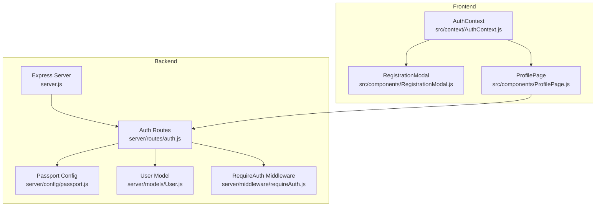
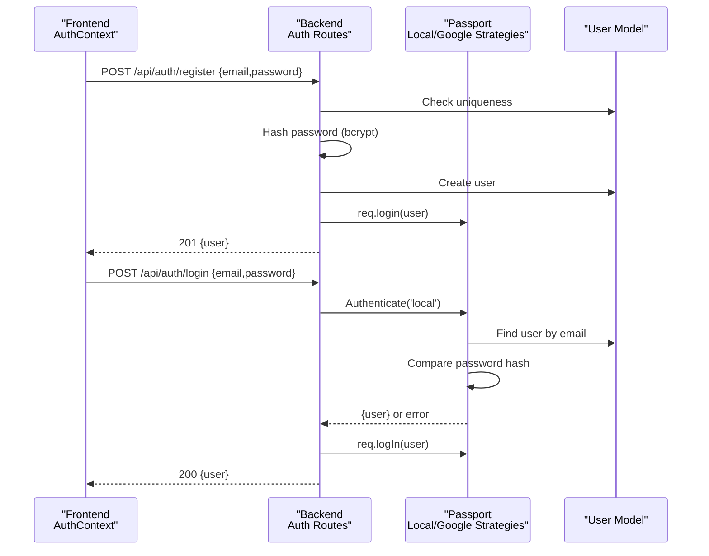
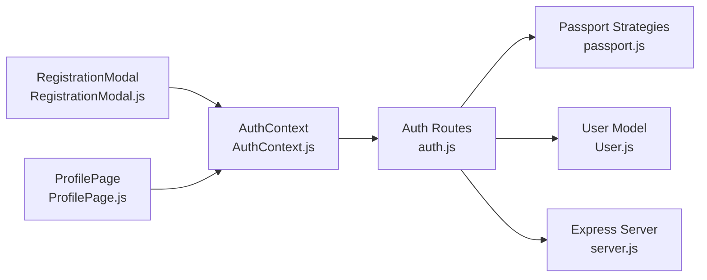

# Authentication API

<cite>
**Referenced Files in This Document**
- [auth.js](file://server/routes/auth.js)
- [passport.js](file://server/config/passport.js)
- [requireAuth.js](file://server/middleware/requireAuth.js)
- [User.js](file://server/models/User.js)
- [server.js](file://server/server.js)
- [AuthContext.js](file://src/context/AuthContext.js)
- [RegistrationModal.js](file://src/components/RegistrationModal.js)
- [ProfilePage.js](file://src/components/ProfilePage.js)
</cite>

## Table of Contents
1. [Introduction](#introduction)
2. [Project Structure](#project-structure)
3. [Core Components](#core-components)
4. [Architecture Overview](#architecture-overview)
5. [Detailed Component Analysis](#detailed-component-analysis)
6. [Dependency Analysis](#dependency-analysis)
7. [Performance Considerations](#performance-considerations)
8. [Troubleshooting Guide](#troubleshooting-guide)
9. [Conclusion](#conclusion)
10. [Appendices](#appendices)

## Introduction
This document provides comprehensive API documentation for the authentication endpoints implemented in the backend and their integration with the frontend. It covers:
- Registration and login with email/password
- Google OAuth integration
- Logout and session management
- Retrieving the current authenticated user
- Middleware protection and session-based authentication
- Frontend integration patterns used by RegistrationModal and ProfilePage

## Project Structure
The authentication system spans the backend route handlers, Passport.js configuration, session management, and the frontend context and components.

**Diagram sources**
- [server.js](file://server/server.js#L1-L59)
- [auth.js](file://server/routes/auth.js#L1-L100)
- [passport.js](file://server/config/passport.js#L1-L91)
- [User.js](file://server/models/User.js#L1-L39)
- [requireAuth.js](file://server/middleware/requireAuth.js#L1-L14)
- [AuthContext.js](file://src/context/AuthContext.js#L1-L110)
- [RegistrationModal.js](file://src/components/RegistrationModal.js#L1-L146)
- [ProfilePage.js](file://src/components/ProfilePage.js#L1-L147)

**Section sources**
- [server.js](file://server/server.js#L1-L59)
- [auth.js](file://server/routes/auth.js#L1-L100)
- [passport.js](file://server/config/passport.js#L1-L91)
- [User.js](file://server/models/User.js#L1-L39)
- [requireAuth.js](file://server/middleware/requireAuth.js#L1-L14)
- [AuthContext.js](file://src/context/AuthContext.js#L1-L110)
- [RegistrationModal.js](file://src/components/RegistrationModal.js#L1-L146)
- [ProfilePage.js](file://src/components/ProfilePage.js#L1-L147)

## Core Components
- Auth routes module: Implements all authentication endpoints and integrates with Passport.js and the User model.
- Passport configuration: Defines session serialization/deserialization and local and Google OAuth strategies.
- User model: Defines the schema for storing email, hashed passwords, and Google identifiers.
- RequireAuth middleware: Enforces session-based authentication for protected routes.
- Frontend AuthContext: Centralizes authentication state and exposes login/register/logout functions and Google OAuth redirection.

**Section sources**
- [auth.js](file://server/routes/auth.js#L1-L100)
- [passport.js](file://server/config/passport.js#L1-L91)
- [User.js](file://server/models/User.js#L1-L39)
- [requireAuth.js](file://server/middleware/requireAuth.js#L1-L14)
- [AuthContext.js](file://src/context/AuthContext.js#L1-L110)

## Architecture Overview
The authentication flow relies on Express sessions managed by Passport. The frontend communicates with the backend using fetch requests with credentials included to persist cookies across origins.

**Diagram sources**
- [auth.js](file://server/routes/auth.js#L1-L100)
- [passport.js](file://server/config/passport.js#L1-L91)
- [User.js](file://server/models/User.js#L1-L39)
- [AuthContext.js](file://src/context/AuthContext.js#L1-L110)

## Detailed Component Analysis

### POST /api/auth/register
- Method: POST
- URL: /api/auth/register
- Request Body Schema:
  - email: string, required
  - password: string, required
- Behavior:
  - Validates presence of email and password.
  - Checks for existing user by email.
  - Hashes password using bcrypt.
  - Creates a new user record with email and password_hash.
  - Automatically logs in the user via req.login and returns the user object.
- Responses:
  - 201 Created: { user: { id, email } }
  - 400 Bad Request: { error: "Email already in use" } or validation errors
  - 500 Internal Server Error: { error: "Server error" }
- Authentication Requirements: None
- Notes:
  - Uses bcrypt for password hashing.
  - req.login triggers Passport serialization and stores a session cookie.

**Section sources**
- [auth.js](file://server/routes/auth.js#L1-L44)
- [passport.js](file://server/config/passport.js#L1-L20)
- [User.js](file://server/models/User.js#L1-L39)

### POST /api/auth/login
- Method: POST
- URL: /api/auth/login
- Request Body Schema:
  - email: string, required
  - password: string, required
- Behavior:
  - Uses Passport local strategy to authenticate credentials.
  - On success, establishes a session via req.logIn and returns the user object.
  - On failure, returns an error with the message from the strategy.
- Responses:
  - 200 OK: { user: { id, email } }
  - 400 Bad Request: { error: "Invalid credentials" } or strategy message
  - 500 Internal Server Error: { error: "Server error" }
- Authentication Requirements: None
- Notes:
  - Username and password fields are mapped to email and password respectively.

**Section sources**
- [auth.js](file://server/routes/auth.js#L46-L62)
- [passport.js](file://server/config/passport.js#L22-L50)
- [User.js](file://server/models/User.js#L1-L39)

### GET /api/auth/google
- Method: GET
- URL: /api/auth/google
- Behavior:
  - Initiates Google OAuth by requesting profile and email scopes.
  - Redirects the user to Google for consent.
- Responses:
  - 302 Found: Redirect to Google OAuth consent page.
- Authentication Requirements: None
- Notes:
  - Scope includes profile and email.
  - Callback URL configured in Passport Google strategy.

**Section sources**
- [auth.js](file://server/routes/auth.js#L64-L73)
- [passport.js](file://server/config/passport.js#L52-L89)

### GET /api/auth/google/callback
- Method: GET
- URL: /api/auth/google/callback
- Behavior:
  - Handles the OAuth callback.
  - On success, redirects to the frontend profile page.
  - On failure, redirects to the root path.
- Responses:
  - 302 Found: Redirect to frontend profile or root.
- Authentication Requirements: None
- Notes:
  - Strategy locates or creates a user based on Google profile and email.

**Section sources**
- [auth.js](file://server/routes/auth.js#L64-L73)
- [passport.js](file://server/config/passport.js#L52-L89)

### POST /api/auth/logout
- Method: POST
- URL: /api/auth/logout
- Behavior:
  - Destroys the Passport user session.
  - Clears the session cookie.
  - Returns a success message.
- Responses:
  - 200 OK: { message: "Logged out successfully" }
  - 500 Internal Server Error: { error: "Could not log out" } or session destruction error
- Authentication Requirements: None
- Notes:
  - Requires credentials to be included in requests from the frontend.

**Section sources**
- [auth.js](file://server/routes/auth.js#L75-L89)

### GET /api/auth/me
- Method: GET
- URL: /api/auth/me
- Behavior:
  - Returns the currently authenticated user’s data if the session is active.
  - Otherwise returns a 401 Not Authenticated.
- Responses:
  - 200 OK: { user: { id, email } }
  - 401 Unauthorized: { error: "Not authenticated" }
- Authentication Requirements: Session-based (requires active Passport session)
- Notes:
  - Used by the frontend to hydrate the AuthContext on initial load.

**Section sources**
- [auth.js](file://server/routes/auth.js#L91-L98)
- [AuthContext.js](file://src/context/AuthContext.js#L1-L29)

### requireAuth Middleware
- Purpose: Protects routes by ensuring the request is authenticated via Passport session.
- Behavior:
  - If authenticated, attaches userId to req and calls next().
  - Otherwise, returns 401 Not Authenticated.
- Usage:
  - Apply to routes that require a logged-in user.
- Authentication Requirements: Session-based

**Section sources**
- [requireAuth.js](file://server/middleware/requireAuth.js#L1-L14)

## Dependency Analysis
The authentication endpoints depend on Passport strategies, the User model, and session configuration. Frontend components rely on AuthContext to coordinate with the backend.

**Diagram sources**
- [auth.js](file://server/routes/auth.js#L1-L100)
- [passport.js](file://server/config/passport.js#L1-L91)
- [User.js](file://server/models/User.js#L1-L39)
- [server.js](file://server/server.js#L1-L59)
- [AuthContext.js](file://src/context/AuthContext.js#L1-L110)
- [RegistrationModal.js](file://src/components/RegistrationModal.js#L1-L146)
- [ProfilePage.js](file://src/components/ProfilePage.js#L1-L147)

**Section sources**
- [auth.js](file://server/routes/auth.js#L1-L100)
- [passport.js](file://server/config/passport.js#L1-L91)
- [User.js](file://server/models/User.js#L1-L39)
- [server.js](file://server/server.js#L1-L59)
- [AuthContext.js](file://src/context/AuthContext.js#L1-L110)
- [RegistrationModal.js](file://src/components/RegistrationModal.js#L1-L146)
- [ProfilePage.js](file://src/components/ProfilePage.js#L1-L147)

## Performance Considerations
- Password hashing cost: bcrypt uses a salt and a configurable cost; ensure the server environment is tuned appropriately.
- Session storage: Configure session store (e.g., Redis) for production deployments to scale horizontally.
- Cookie security: Enable secure cookies and appropriate SameSite attributes in production.
- Rate limiting: Consider adding rate limits to login/register endpoints to mitigate brute force attacks.

[No sources needed since this section provides general guidance]

## Troubleshooting Guide
Common issues and resolutions:
- Duplicate email during registration:
  - Symptom: 400 error indicating email already in use.
  - Resolution: Prompt the user to log in or use a different email.
- Invalid credentials on login:
  - Symptom: 400 error with invalid credentials message.
  - Resolution: Verify email and password; ensure the user exists and the password matches the stored hash.
- Not authenticated on protected routes:
  - Symptom: 401 error when accessing protected endpoints.
  - Resolution: Ensure the client includes credentials and that the session is active.
- Logout failures:
  - Symptom: 500 error when attempting to log out.
  - Resolution: Check server-side session destruction and cookie clearing logic.
- Google OAuth failures:
  - Symptom: Redirect loops or failure to redirect to profile.
  - Resolution: Verify GOOGLE_CLIENT_ID and GOOGLE_CLIENT_SECRET environment variables and callback URL configuration.

**Section sources**
- [auth.js](file://server/routes/auth.js#L1-L100)
- [passport.js](file://server/config/passport.js#L1-L91)
- [AuthContext.js](file://src/context/AuthContext.js#L1-L110)

## Conclusion
The authentication system provides a robust, session-based solution for email/password and Google OAuth flows, integrated seamlessly with the frontend via AuthContext. The endpoints are straightforward, well-protected, and support typical user workflows such as registration, login, logout, and retrieval of the current user.

[No sources needed since this section summarizes without analyzing specific files]

## Appendices

### Endpoint Reference Summary
- POST /api/auth/register
  - Body: { email, password }
  - Responses: 201, 400, 500
  - Auth: None
- POST /api/auth/login
  - Body: { email, password }
  - Responses: 200, 400, 500
  - Auth: None
- GET /api/auth/google
  - Body: None
  - Responses: 302
  - Auth: None
- GET /api/auth/google/callback
  - Body: None
  - Responses: 302
  - Auth: None
- POST /api/auth/logout
  - Body: None
  - Responses: 200, 500
  - Auth: None
- GET /api/auth/me
  - Body: None
  - Responses: 200, 401
  - Auth: Session-based

**Section sources**
- [auth.js](file://server/routes/auth.js#L1-L100)
- [AuthContext.js](file://src/context/AuthContext.js#L1-L110)

### Frontend Integration Notes
- RegistrationModal:
  - Uses AuthContext to call register and login functions.
  - Navigates to the profile page on success.
- ProfilePage:
  - Fetches user articles using credentials to include cookies.
  - Provides logout functionality via AuthContext.

**Section sources**
- [RegistrationModal.js](file://src/components/RegistrationModal.js#L1-L146)
- [ProfilePage.js](file://src/components/ProfilePage.js#L1-L147)
- [AuthContext.js](file://src/context/AuthContext.js#L1-L110)