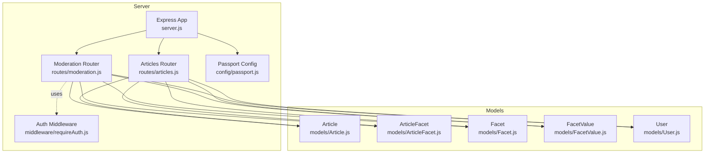
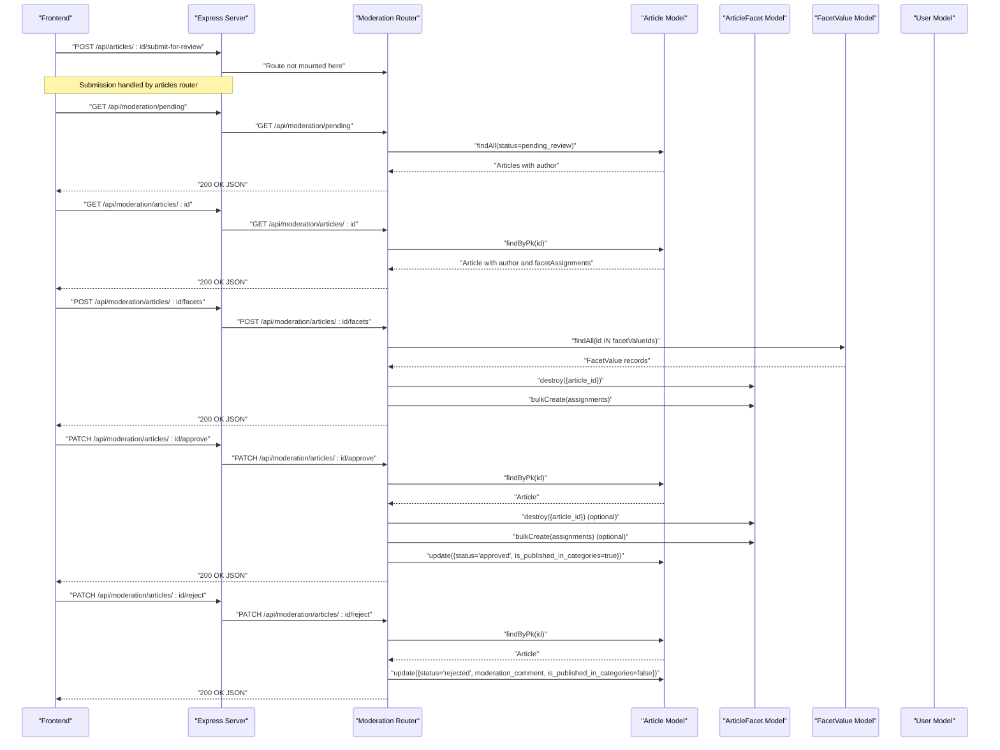
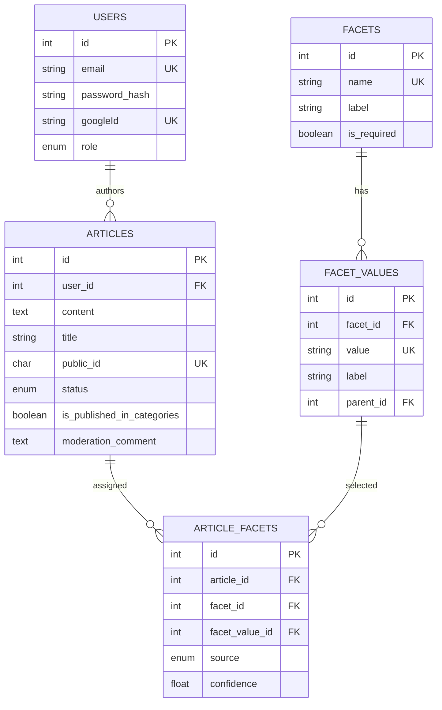
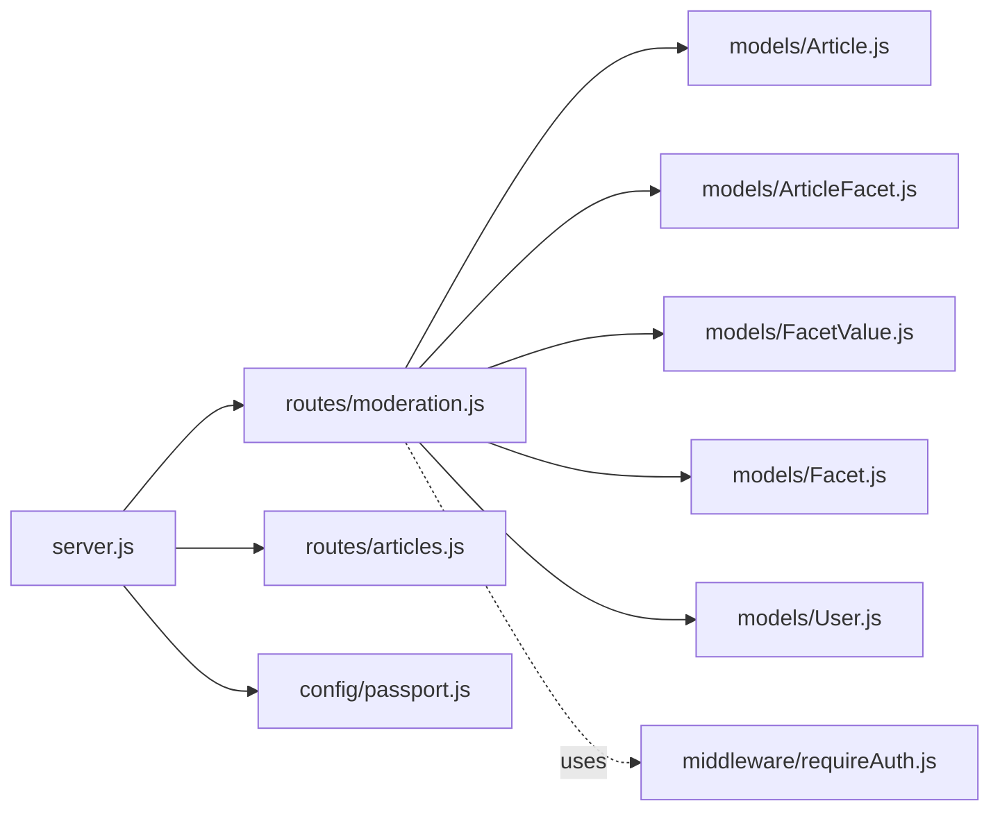

# Content Moderation API

<cite>
**Referenced Files in This Document**
- [moderation.js](file://server/routes/moderation.js)
- [requireAuth.js](file://server/middleware/requireAuth.js)
- [server.js](file://server/server.js)
- [FACETS_API.md](file://server/FACETS_API.md)
- [Article.js](file://server/models/Article.js)
- [ArticleFacet.js](file://server/models/ArticleFacet.js)
- [Facet.js](file://server/models/Facet.js)
- [FacetValue.js](file://server/models/FacetValue.js)
- [User.js](file://server/models/User.js)
- [passport.js](file://server/config/passport.js)
- [articles.js](file://server/routes/articles.js)
</cite>

## Table of Contents
1. [Introduction](#introduction)
2. [Project Structure](#project-structure)
3. [Core Components](#core-components)
4. [Architecture Overview](#architecture-overview)
5. [Detailed Component Analysis](#detailed-component-analysis)
6. [Dependency Analysis](#dependency-analysis)
7. [Performance Considerations](#performance-considerations)
8. [Troubleshooting Guide](#troubleshooting-guide)
9. [Conclusion](#conclusion)
10. [Appendices](#appendices)

## Introduction
This document provides detailed API documentation for the content moderation endpoints implemented in the backend. It covers:
- Retrieving articles awaiting review
- Fetching a specific article with complete facet assignments and author information
- Assigning classification facets to articles
- Approving articles with optional facet reassignment and publication status updates
- Rejecting articles with moderation comments

It also outlines planned role-based access control for moderator roles, the ArticleFacet junction table usage for many-to-many relationships, and the integration with the article submission workflow in the frontend application.

## Project Structure
The moderation endpoints are implemented as Express routes under the /api/moderation namespace and are mounted in the server application. Authentication relies on Passport sessions configured in the server bootstrap.

**Diagram sources**
- [server.js](file://server/server.js#L34-L39)
- [moderation.js](file://server/routes/moderation.js#L1-L213)
- [articles.js](file://server/routes/articles.js#L194-L225)
- [requireAuth.js](file://server/middleware/requireAuth.js#L1-L14)
- [passport.js](file://server/config/passport.js#L1-L91)
- [Article.js](file://server/models/Article.js#L1-L53)
- [ArticleFacet.js](file://server/models/ArticleFacet.js#L1-L76)
- [Facet.js](file://server/models/Facet.js#L1-L35)
- [FacetValue.js](file://server/models/FacetValue.js#L1-L59)
- [User.js](file://server/models/User.js#L1-L39)

**Section sources**
- [server.js](file://server/server.js#L34-L39)
- [moderation.js](file://server/routes/moderation.js#L1-L213)

## Core Components
- Moderation Router: Implements GET /api/moderation/pending, GET /api/moderation/articles/:id, POST /api/moderation/articles/:id/facets, PATCH /api/moderation/articles/:id/approve, PATCH /api/moderation/articles/:id/reject.
- Authentication Middleware: Provides session-based authentication via Passport.
- Models:
  - Article: Tracks status, publication flag, moderation comment, and author.
  - ArticleFacet: Junction table linking articles to facets and values, with source and confidence.
  - Facet and FacetValue: Define classification taxonomy and hierarchical values.
  - User: Defines roles (user, moderator, admin).

Key behaviors:
- Pending retrieval filters by status and includes author metadata.
- Article retrieval includes author and full facet assignment graph with nested parent values.
- Facet assignment validates facet values, replaces prior assignments, and sets source and confidence.
- Approval updates status and publication flag, optionally reassigning facets.
- Rejection updates status, stores moderation comment, and unpublishes.

**Section sources**
- [moderation.js](file://server/routes/moderation.js#L10-L211)
- [Article.js](file://server/models/Article.js#L1-L53)
- [ArticleFacet.js](file://server/models/ArticleFacet.js#L1-L76)
- [Facet.js](file://server/models/Facet.js#L1-L35)
- [FacetValue.js](file://server/models/FacetValue.js#L1-L59)
- [User.js](file://server/models/User.js#L1-L39)

## Architecture Overview
The moderation endpoints are mounted under /api/moderation and rely on Passport session authentication. They operate against Sequelize models representing the domain entities. The approval workflow integrates with the article submission flow to move articles from draft to published state.

**Diagram sources**
- [server.js](file://server/server.js#L34-L39)
- [moderation.js](file://server/routes/moderation.js#L10-L211)
- [articles.js](file://server/routes/articles.js#L194-L225)
- [Article.js](file://server/models/Article.js#L1-L53)
- [ArticleFacet.js](file://server/models/ArticleFacet.js#L1-L76)
- [FacetValue.js](file://server/models/FacetValue.js#L1-L59)
- [User.js](file://server/models/User.js#L1-L39)

## Detailed Component Analysis

### Endpoint: GET /api/moderation/pending
- Method: GET
- URL: /api/moderation/pending
- Authentication: Required (planned moderator/admin role check)
- Behavior:
  - Retrieves all articles with status pending_review.
  - Includes author information (id, email).
  - Orders by created_at ascending.
- Response:
  - Array of articles with author metadata.
- Error handling:
  - 500 Internal Server Error on failure.

Planned access control:
- Requires moderator or admin role. The route currently contains a TODO indicating requireAuth middleware should enforce role checks.

**Section sources**
- [moderation.js](file://server/routes/moderation.js#L10-L29)
- [FACETS_API.md](file://server/FACETS_API.md#L140-L161)

### Endpoint: GET /api/moderation/articles/:id
- Method: GET
- URL: /api/moderation/articles/:id
- Authentication: Required (planned moderator/admin role check)
- Behavior:
  - Fetches a single article by ID.
  - Includes author information.
  - Includes facetAssignments with nested facet and value, and value.parent.
- Response:
  - Single article object with author and facetAssignments.
- Error handling:
  - 404 Not Found if article does not exist.
  - 500 Internal Server Error on failure.

**Section sources**
- [moderation.js](file://server/routes/moderation.js#L35-L76)
- [Article.js](file://server/models/Article.js#L1-L53)
- [ArticleFacet.js](file://server/models/ArticleFacet.js#L1-L76)
- [Facet.js](file://server/models/Facet.js#L1-L35)
- [FacetValue.js](file://server/models/FacetValue.js#L1-L59)
- [User.js](file://server/models/User.js#L1-L39)

### Endpoint: POST /api/moderation/articles/:id/facets
- Method: POST
- URL: /api/moderation/articles/:id/facets
- Authentication: Required (planned moderator/admin role check)
- Request body:
  - facetValueIds: array<number> (required)
  - source: string ('manual' or 'auto_suggested')
- Validation:
  - facetValueIds must be a non-empty array.
  - All facetValueIds must correspond to existing FacetValue records.
- Behavior:
  - Deletes existing ArticleFacet assignments for the article.
  - Creates new assignments with computed facet_id from facet_value_id.
  - Sets source to manual or auto_suggested and confidence accordingly.
- Response:
  - message: string
  - count: number
- Error handling:
  - 400 Bad Request for invalid or missing facetValueIds or unknown facet values.
  - 404 Not Found if article does not exist.
  - 500 Internal Server Error on failure.

Assignment logic and confidence scoring:
- Manual assignments receive confidence 1.0.
- Auto-suggested assignments receive confidence 0.8 (when source is auto_suggested).

**Section sources**
- [moderation.js](file://server/routes/moderation.js#L83-L129)
- [ArticleFacet.js](file://server/models/ArticleFacet.js#L1-L76)
- [FacetValue.js](file://server/models/FacetValue.js#L1-L59)

### Endpoint: PATCH /api/moderation/articles/:id/approve
- Method: PATCH
- URL: /api/moderation/articles/:id/approve
- Authentication: Required (planned moderator/admin role check)
- Request body:
  - facetValueIds: array<number> (optional)
- Behavior:
  - Optionally reassigns facets (same validation and replacement logic as POST /facets).
  - Updates article status to approved and is_published_in_categories to true.
- Response:
  - message: string
  - article: updated article object
- Error handling:
  - 404 Not Found if article does not exist.
  - 500 Internal Server Error on failure.

Integration with approval workflow:
- This endpoint moves articles from pending_review to approved and publishes them to categories.

**Section sources**
- [moderation.js](file://server/routes/moderation.js#L136-L180)
- [Article.js](file://server/models/Article.js#L1-L53)
- [ArticleFacet.js](file://server/models/ArticleFacet.js#L1-L76)

### Endpoint: PATCH /api/moderation/articles/:id/reject
- Method: PATCH
- URL: /api/moderation/articles/:id/reject
- Authentication: Required (planned moderator/admin role check)
- Request body:
  - moderation_comment: string (required)
- Behavior:
  - Updates article status to rejected.
  - Stores moderation_comment.
  - Sets is_published_in_categories to false.
- Response:
  - message: string
  - article: updated article object
- Error handling:
  - 404 Not Found if article does not exist.
  - 500 Internal Server Error on failure.

**Section sources**
- [moderation.js](file://server/routes/moderation.js#L187-L211)
- [Article.js](file://server/models/Article.js#L1-L53)

### Authentication and Authorization
- Authentication:
  - Session-based via Passport initialized in server bootstrap.
  - requireAuth middleware checks req.isAuthenticated and attaches req.userId.
- Authorization:
  - Current moderation endpoints are unguarded and marked with TODOs for role checks.
  - Planned: require moderator or admin role for all moderation endpoints.
  - User roles are defined in the User model.

**Section sources**
- [server.js](file://server/server.js#L20-L33)
- [requireAuth.js](file://server/middleware/requireAuth.js#L1-L14)
- [User.js](file://server/models/User.js#L1-L39)
- [moderation.js](file://server/routes/moderation.js#L12-L12)

### Data Models and Relationships
The moderation endpoints operate on the following models and relationships:

- Many-to-many between articles and facet values is represented by the ArticleFacet junction table.
- Hierarchical facet values are supported via parent_id in FacetValue.
- Status transitions:
  - draft -> pending_review (via articles submission)
  - pending_review -> approved (via moderation approve)
  - pending_review -> rejected (via moderation reject)

**Diagram sources**
- [Article.js](file://server/models/Article.js#L1-L53)
- [ArticleFacet.js](file://server/models/ArticleFacet.js#L1-L76)
- [Facet.js](file://server/models/Facet.js#L1-L35)
- [FacetValue.js](file://server/models/FacetValue.js#L1-L59)
- [User.js](file://server/models/User.js#L1-L39)

**Section sources**
- [Article.js](file://server/models/Article.js#L1-L53)
- [ArticleFacet.js](file://server/models/ArticleFacet.js#L1-L76)
- [Facet.js](file://server/models/Facet.js#L1-L35)
- [FacetValue.js](file://server/models/FacetValue.js#L1-L59)
- [User.js](file://server/models/User.js#L1-L39)

### Moderation Workflow Examples
- Author workflow:
  - Create article (draft).
  - Submit for review (transitions to pending_review).
- Moderator/admin workflow:
  - View pending articles.
  - Review article details and facet assignments.
  - Assign facets (optional).
  - Approve (sets approved and publishes).
  - Reject (sets rejected with moderation comment).

These workflows are documented in the FACETS_API.md and complement the moderation endpoints.

**Section sources**
- [FACETS_API.md](file://server/FACETS_API.md#L220-L239)
- [articles.js](file://server/routes/articles.js#L194-L225)
- [moderation.js](file://server/routes/moderation.js#L10-L211)

## Dependency Analysis
- Route mounting:
  - /api/moderation is mounted in server.js.
- Route dependencies:
  - moderation.js depends on Article, User, ArticleFacet, FacetValue, Facet models.
- Authentication:
  - requireAuth middleware is session-based via Passport.
- Frontend integration:
  - The ArticleEditorApp frontend interacts with the backend for article creation and submission, while moderation endpoints are intended for moderator/admin use.

**Diagram sources**
- [server.js](file://server/server.js#L34-L39)
- [moderation.js](file://server/routes/moderation.js#L1-L213)
- [articles.js](file://server/routes/articles.js#L194-L225)
- [requireAuth.js](file://server/middleware/requireAuth.js#L1-L14)
- [passport.js](file://server/config/passport.js#L1-L91)
- [Article.js](file://server/models/Article.js#L1-L53)
- [ArticleFacet.js](file://server/models/ArticleFacet.js#L1-L76)
- [Facet.js](file://server/models/Facet.js#L1-L35)
- [FacetValue.js](file://server/models/FacetValue.js#L1-L59)
- [User.js](file://server/models/User.js#L1-L39)

**Section sources**
- [server.js](file://server/server.js#L34-L39)
- [moderation.js](file://server/routes/moderation.js#L1-L213)
- [articles.js](file://server/routes/articles.js#L194-L225)
- [requireAuth.js](file://server/middleware/requireAuth.js#L1-L14)
- [passport.js](file://server/config/passport.js#L1-L91)

## Performance Considerations
- Bulk operations:
  - Facet assignment uses bulkCreate for efficient insertion after clearing previous assignments.
- Indexes:
  - ArticleFacet table defines indexes on article_id, facet_value_id, and facet_id, plus a unique composite index on (article_id, facet_value_id).
- Query patterns:
  - Pending retrieval orders by created_at.
  - Article retrieval includes associations; consider limiting fields if performance becomes a concern.
- Validation:
  - facetValueIds are validated by fetching corresponding FacetValue records to ensure existence.

[No sources needed since this section provides general guidance]

## Troubleshooting Guide
Common issues and resolutions:
- 401 Not authenticated:
  - Ensure the client is authenticated via Passport session and that requireAuth middleware is applied to moderation routes.
- 403 Forbidden:
  - Role-based access control is not yet enforced; implement role checks for moderator/admin.
- 404 Article not found:
  - Verify the article ID exists and belongs to the expected author for submission.
- 400 Invalid facetValueIds:
  - Ensure facetValueIds is a non-empty array and all IDs correspond to existing FacetValue records.
- 500 Internal Server Error:
  - Inspect server logs for detailed errors during database operations.

**Section sources**
- [requireAuth.js](file://server/middleware/requireAuth.js#L1-L14)
- [moderation.js](file://server/routes/moderation.js#L83-L129)
- [articles.js](file://server/routes/articles.js#L194-L225)

## Conclusion
The moderation endpoints provide a clear pathway for reviewing, classifying, and publishing articles. They leverage a robust many-to-many classification system through the ArticleFacet junction table and integrate with the article submission workflow. Role-based access control is planned and should be implemented to restrict moderation actions to moderators and admins. The documentation and schema support a scalable moderation pipeline suitable for future enhancements such as auto-tagging with confidence scores.

[No sources needed since this section summarizes without analyzing specific files]

## Appendices

### Appendix A: Endpoint Reference
- GET /api/moderation/pending
  - Auth: Required (moderator/admin)
  - Response: Array of articles with author
- GET /api/moderation/articles/:id
  - Auth: Required (moderator/admin)
  - Response: Article with author and facetAssignments
- POST /api/moderation/articles/:id/facets
  - Auth: Required (moderator/admin)
  - Body: { facetValueIds: [number], source: 'manual' | 'auto_suggested' }
  - Response: { message: string, count: number }
- PATCH /api/moderation/articles/:id/approve
  - Auth: Required (moderator/admin)
  - Body: { facetValueIds?: [number] }
  - Response: { message: string, article }
- PATCH /api/moderation/articles/:id/reject
  - Auth: Required (moderator/admin)
  - Body: { moderation_comment: string }
  - Response: { message: string, article }

**Section sources**
- [FACETS_API.md](file://server/FACETS_API.md#L140-L217)
- [moderation.js](file://server/routes/moderation.js#L10-L211)

### Appendix B: Article Submission Integration
- Authors submit drafts for review, transitioning status to pending_review.
- Moderators then approve or reject, updating publication flags and classifications.

**Section sources**
- [articles.js](file://server/routes/articles.js#L194-L225)
- [FACETS_API.md](file://server/FACETS_API.md#L220-L239)