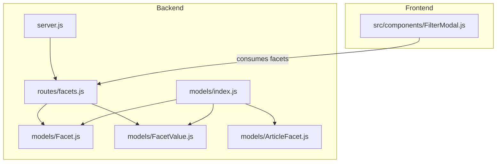
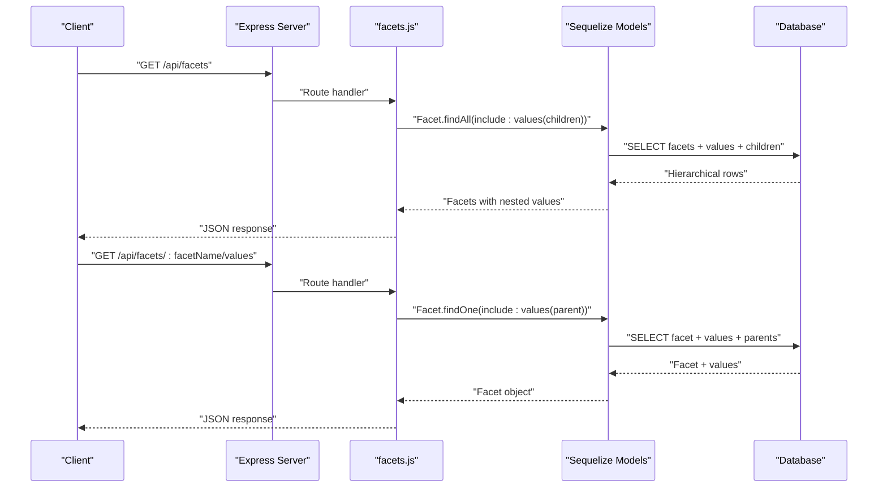
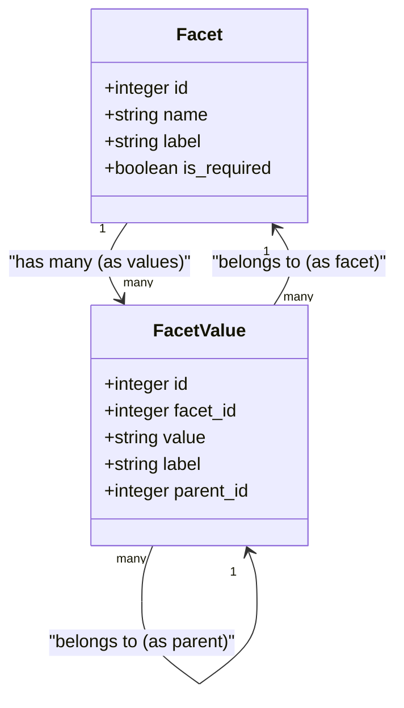
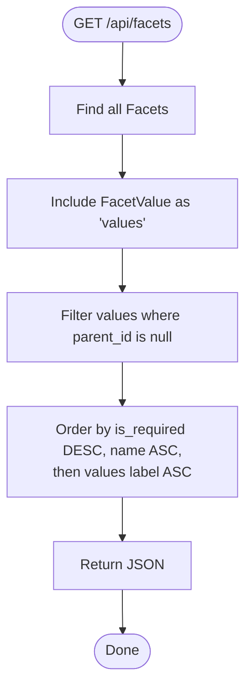
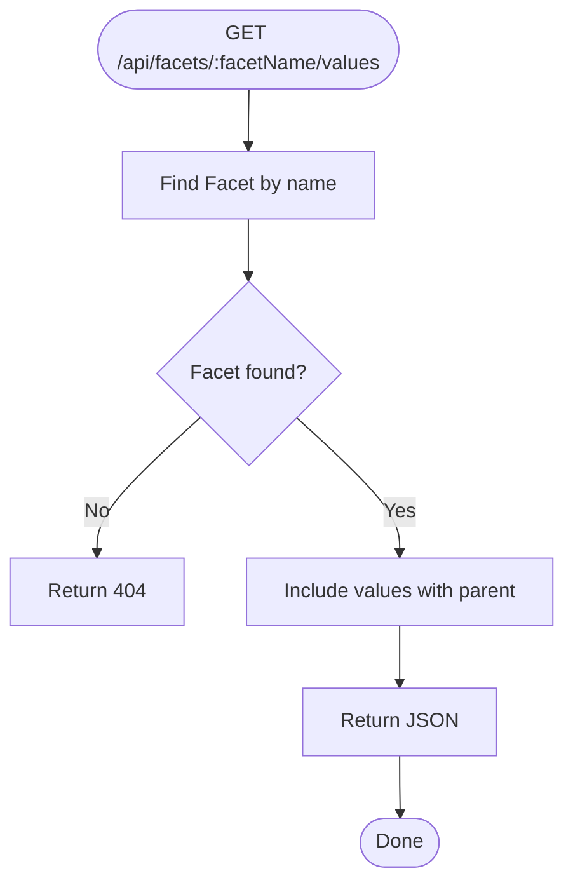
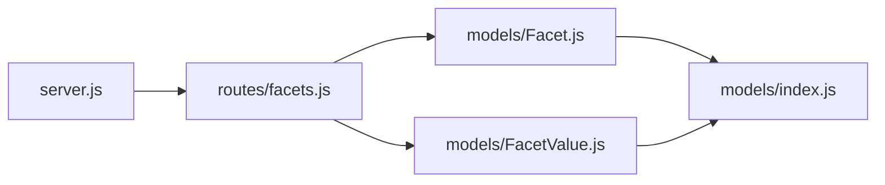

# Facets Classification API

<cite>
**Referenced Files in This Document**
- [server.js](file://server/server.js)
- [facets.js](file://server/routes/facets.js)
- [Facet.js](file://server/models/Facet.js)
- [FacetValue.js](file://server/models/FacetValue.js)
- [ArticleFacet.js](file://server/models/ArticleFacet.js)
- [index.js](file://server/models/index.js)
- [FACETS_API.md](file://server/FACETS_API.md)
- [seed-facets.js](file://server/seed-facets.js)
- [FilterModal.js](file://src/components/FilterModal.js)
</cite>

## Table of Contents
1. [Introduction](#introduction)
2. [Project Structure](#project-structure)
3. [Core Components](#core-components)
4. [Architecture Overview](#architecture-overview)
5. [Detailed Component Analysis](#detailed-component-analysis)
6. [Dependency Analysis](#dependency-analysis)
7. [Performance Considerations](#performance-considerations)
8. [Troubleshooting Guide](#troubleshooting-guide)
9. [Conclusion](#conclusion)
10. [Appendices](#appendices)

## Introduction
This document provides comprehensive API documentation for the facets classification endpoints. It covers:
- GET /api/facets: retrieves all facets with hierarchical values (top-level values and their children).
- GET /api/facets/:facetName/values: retrieves all values for a specific facet (flat list).
It explains the data model relationships between Facet and FacetValue, including the parent-child hierarchy, and describes how the backend uses Sequelize includes and ordering logic. It also outlines how the frontend FilterModal component consumes the facets data for dynamic filter generation and provides guidance on extending the facet system with new classification categories.

## Project Structure
The facets API is implemented in the backend under server/routes/facets.js and backed by Sequelize models in server/models/. The frontend FilterModal component renders filters based on the facets data.

**Diagram sources**
- [server.js](file://server/server.js#L31-L40)
- [facets.js](file://server/routes/facets.js#L1-L67)
- [Facet.js](file://server/models/Facet.js#L1-L35)
- [FacetValue.js](file://server/models/FacetValue.js#L1-L59)
- [ArticleFacet.js](file://server/models/ArticleFacet.js#L1-L76)
- [index.js](file://server/models/index.js#L1-L49)
- [FilterModal.js](file://src/components/FilterModal.js#L1-L111)

**Section sources**
- [server.js](file://server/server.js#L31-L40)
- [facets.js](file://server/routes/facets.js#L1-L67)
- [index.js](file://server/models/index.js#L1-L49)

## Core Components
- Facet model: represents a classification category (e.g., domain, difficulty).
- FacetValue model: represents the values for a facet, including hierarchical parent-child relationships.
- Association layer: defines relationships and self-referencing for parent/children.
- Routes: expose GET endpoints for facets and facet values.

Key implementation references:
- Facet model definition and attributes.
- FacetValue model definition, parent_id self-reference, and indexes.
- Associations between Facet and FacetValue, and self-referencing for children.
- Route handlers for GET /api/facets and GET /api/facets/:facetName/values.

**Section sources**
- [Facet.js](file://server/models/Facet.js#L1-L35)
- [FacetValue.js](file://server/models/FacetValue.js#L1-L59)
- [index.js](file://server/models/index.js#L12-L19)
- [facets.js](file://server/routes/facets.js#L1-L67)

## Architecture Overview
The facets API uses Sequelize to fetch hierarchical data with nested includes and applies ordering to ensure consistent presentation. The frontend receives structured data and renders filter sections accordingly.

**Diagram sources**
- [server.js](file://server/server.js#L31-L40)
- [facets.js](file://server/routes/facets.js#L1-L67)
- [Facet.js](file://server/models/Facet.js#L1-L35)
- [FacetValue.js](file://server/models/FacetValue.js#L1-L59)
- [index.js](file://server/models/index.js#L12-L19)

## Detailed Component Analysis

### GET /api/facets
- Method: GET
- URL: /api/facets
- Authentication: None
- Purpose: Retrieve all facets with hierarchical values. Top-level values are included, and each top-level value includes its immediate children. Ordering ensures required facets appear first, facets are sorted by name, and values are sorted by label.

Response schema (high-level):
- Array of facets, each with:
  - id: integer
  - name: string
  - label: string
  - is_required: boolean
  - values: array of top-level facet values, each with:
    - id: integer
    - value: string
    - label: string
    - parent_id: null
    - children: array of child facet values, each with:
      - id: integer
      - value: string
      - label: string

Implementation highlights:
- Uses Sequelize Facet.findAll with include for FacetValue as 'values'.
- Filters top-level values via where clause on parent_id being null.
- Applies order by is_required DESC, name ASC, and values label ASC.
- Returns JSON directly.

Typical response example:
- See the example response in the API documentation file.

How the frontend uses it:
- The FilterModal component expects a flat list of filter sections. While the backend returns a hierarchical structure, the frontend can flatten or adapt the data to render segmented controls and chips. The FACETS_API.md file demonstrates the expected shape for hierarchical display.

**Section sources**
- [facets.js](file://server/routes/facets.js#L9-L34)
- [FACETS_API.md](file://server/FACETS_API.md#L56-L84)
- [FilterModal.js](file://src/components/FilterModal.js#L1-L111)

### GET /api/facets/:facetName/values
- Method: GET
- URL: /api/facets/:facetName/values
- Path parameter: facetName (string)
- Authentication: None
- Purpose: Retrieve all values for a specific facet. The response includes the facet object and its values, with each value optionally including its parent (for hierarchical display).

Response schema (high-level):
- Facet object with:
  - id: integer
  - name: string
  - label: string
  - is_required: boolean
  - values: array of facet values, each with:
    - id: integer
    - value: string
    - label: string
    - parent_id: integer or null
    - parent: object (when included) representing the parent facet value

Parameter validation and error handling:
- If the facet does not exist, returns 404 with error message.
- On internal errors, returns 500 with error message.

Typical response example:
- See the API documentation file for example usage.

How the frontend uses it:
- The FilterModal component can consume the flat list of values to populate chips or segmented controls. The FACETS_API.md shows how the values are used in the broader system.

**Section sources**
- [facets.js](file://server/routes/facets.js#L40-L65)
- [FACETS_API.md](file://server/FACETS_API.md#L86-L91)
- [FilterModal.js](file://src/components/FilterModal.js#L1-L111)

### Data Model Relationships and Hierarchical Values
- Facet and FacetValue association:
  - Facet has many FacetValue (as values).
  - FacetValue belongs to Facet (as facet).
- Parent-child hierarchy:
  - FacetValue.self has many FacetValue.children via parent_id.
  - FacetValue.parent belongs to FacetValue (self-reference).
- Ordering logic:
  - Facets ordered by is_required DESC, name ASC.
  - Values ordered by label ASC.

**Diagram sources**
- [Facet.js](file://server/models/Facet.js#L1-L35)
- [FacetValue.js](file://server/models/FacetValue.js#L1-L59)
- [index.js](file://server/models/index.js#L12-L19)

**Section sources**
- [Facet.js](file://server/models/Facet.js#L1-L35)
- [FacetValue.js](file://server/models/FacetValue.js#L1-L59)
- [index.js](file://server/models/index.js#L12-L19)

### Endpoint Implementation Details

#### GET /api/facets
- Includes:
  - FacetValue as 'values' with nested include for children.
  - Filters values where parent_id is null to ensure only top-level values are included.
- Ordering:
  - Facets: is_required DESC, name ASC.
  - Values: label ASC.
- Error handling:
  - Catches exceptions and returns 500 with error message.

**Diagram sources**
- [facets.js](file://server/routes/facets.js#L9-L34)

**Section sources**
- [facets.js](file://server/routes/facets.js#L9-L34)

#### GET /api/facets/:facetName/values
- Includes:
  - FacetValue as 'values' with nested include for parent.
- Parameter validation:
  - If facet not found, returns 404.
- Error handling:
  - Catches exceptions and returns 500 with error message.

**Diagram sources**
- [facets.js](file://server/routes/facets.js#L40-L65)

**Section sources**
- [facets.js](file://server/routes/facets.js#L40-L65)

### Frontend Integration with FilterModal
- The FilterModal component renders filter sections with either segmented controls or chip groups.
- The backend’s hierarchical response can be adapted to feed the component’s filters prop.
- The FACETS_API.md illustrates how the values are used in the broader system.

Note: The current frontend code in ArticleEditorApp generates static filters. To integrate the facets API, the frontend would fetch facets from the backend and transform the hierarchical data into the component’s expected format.

**Section sources**
- [FilterModal.js](file://src/components/FilterModal.js#L1-L111)
- [FACETS_API.md](file://server/FACETS_API.md#L56-L91)

## Dependency Analysis
- Backend routing depends on Sequelize models Facet and FacetValue.
- Associations defined in models/index.js enable nested includes and parent-child navigation.
- The server mounts the facets route under /api/facets.

**Diagram sources**
- [server.js](file://server/server.js#L31-L40)
- [facets.js](file://server/routes/facets.js#L1-L67)
- [Facet.js](file://server/models/Facet.js#L1-L35)
- [FacetValue.js](file://server/models/FacetValue.js#L1-L59)
- [index.js](file://server/models/index.js#L1-L49)

**Section sources**
- [server.js](file://server/server.js#L31-L40)
- [facets.js](file://server/routes/facets.js#L1-L67)
- [index.js](file://server/models/index.js#L1-L49)

## Performance Considerations
- Indexes:
  - FacetValue has indexes on facet_id, parent_id, and a unique composite index on (facet_id, value). These support efficient filtering and uniqueness checks.
- Ordering:
  - The backend orders facets by is_required DESC and name ASC, and values by label ASC. This reduces client-side sorting overhead.
- Includes:
  - Nested includes fetch related data in a single query, minimizing round-trips. For large datasets, consider pagination or limiting depth if needed.

**Section sources**
- [FacetValue.js](file://server/models/FacetValue.js#L44-L55)
- [facets.js](file://server/routes/facets.js#L22-L26)

## Troubleshooting Guide
- 404 Not Found:
  - Occurs when requesting a non-existent facet by name in GET /api/facets/:facetName/values.
- 500 Internal Server Error:
  - Returned when the server encounters an unexpected error while fetching facets or values.
- Validation:
  - The route validates the presence of the facet before returning values. Ensure the facet name matches the stored name.

**Section sources**
- [facets.js](file://server/routes/facets.js#L56-L65)

## Conclusion
The facets classification API provides a clean, hierarchical representation of classification categories and their values. The backend uses Sequelize includes and ordering to deliver structured data suitable for dynamic filter generation. The frontend FilterModal component can consume this data to render segmented controls and chips. Extending the system with new classification categories involves adding a new Facet and associated FacetValues, leveraging the existing associations and ordering logic.

## Appendices

### How to Extend the Facet System with New Classification Categories
- Add a new Facet record with a unique name and human-readable label.
- Add FacetValue records for the new facet. For hierarchical categories, set parent_id to the desired parent value.
- Optionally, seed data using the provided script to populate initial values.

References:
- Seed script demonstrates creating facets and values, including hierarchical parent-child relationships.

**Section sources**
- [seed-facets.js](file://server/seed-facets.js#L1-L151)