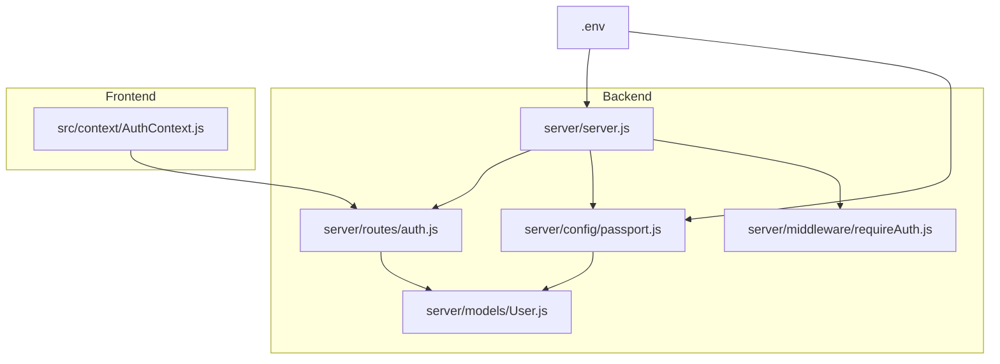
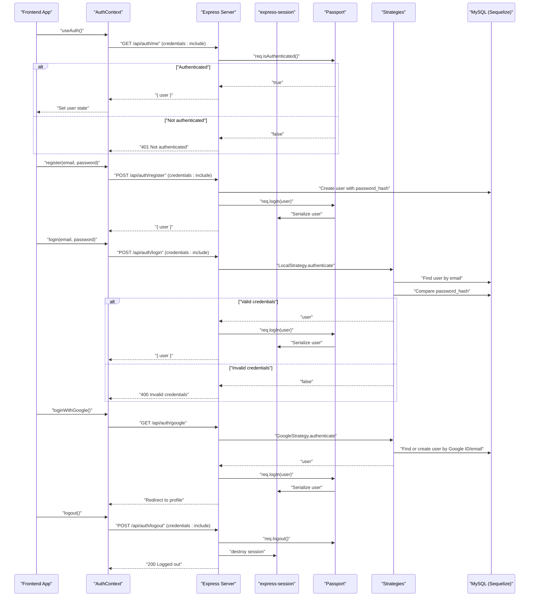
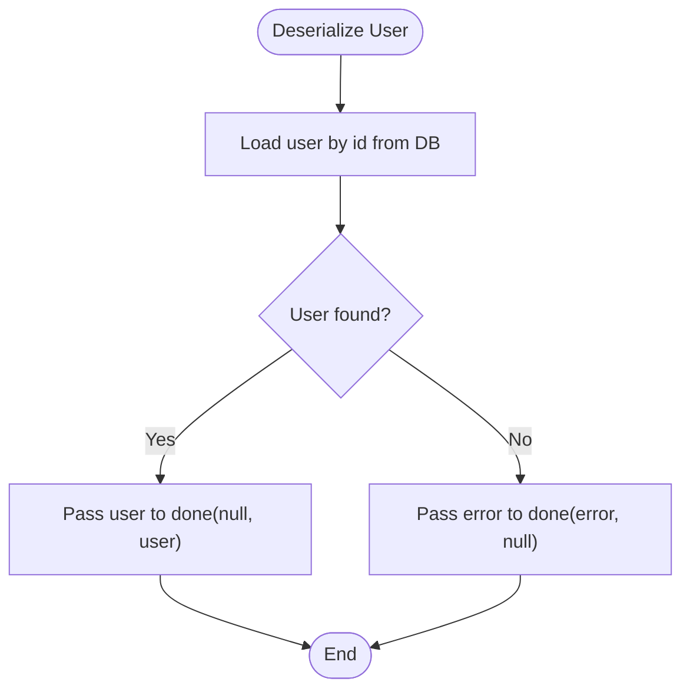
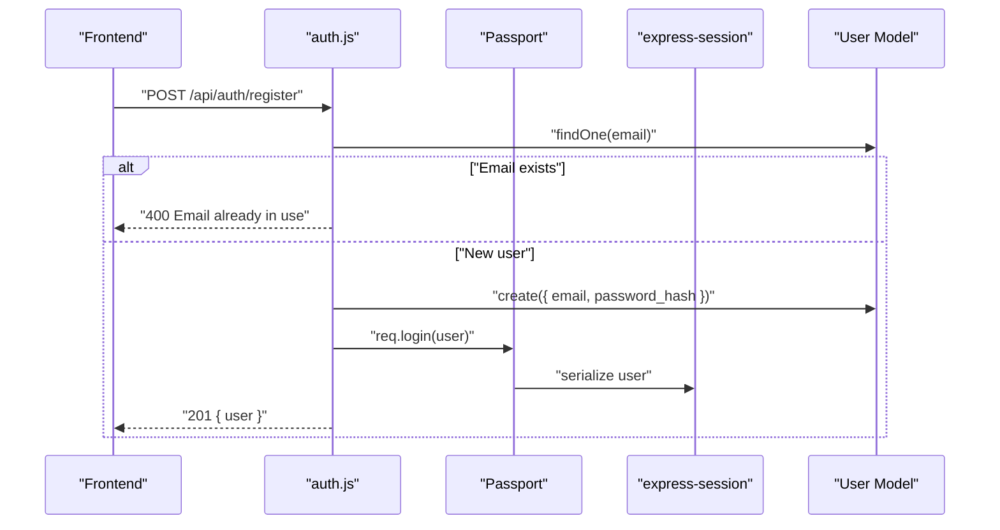
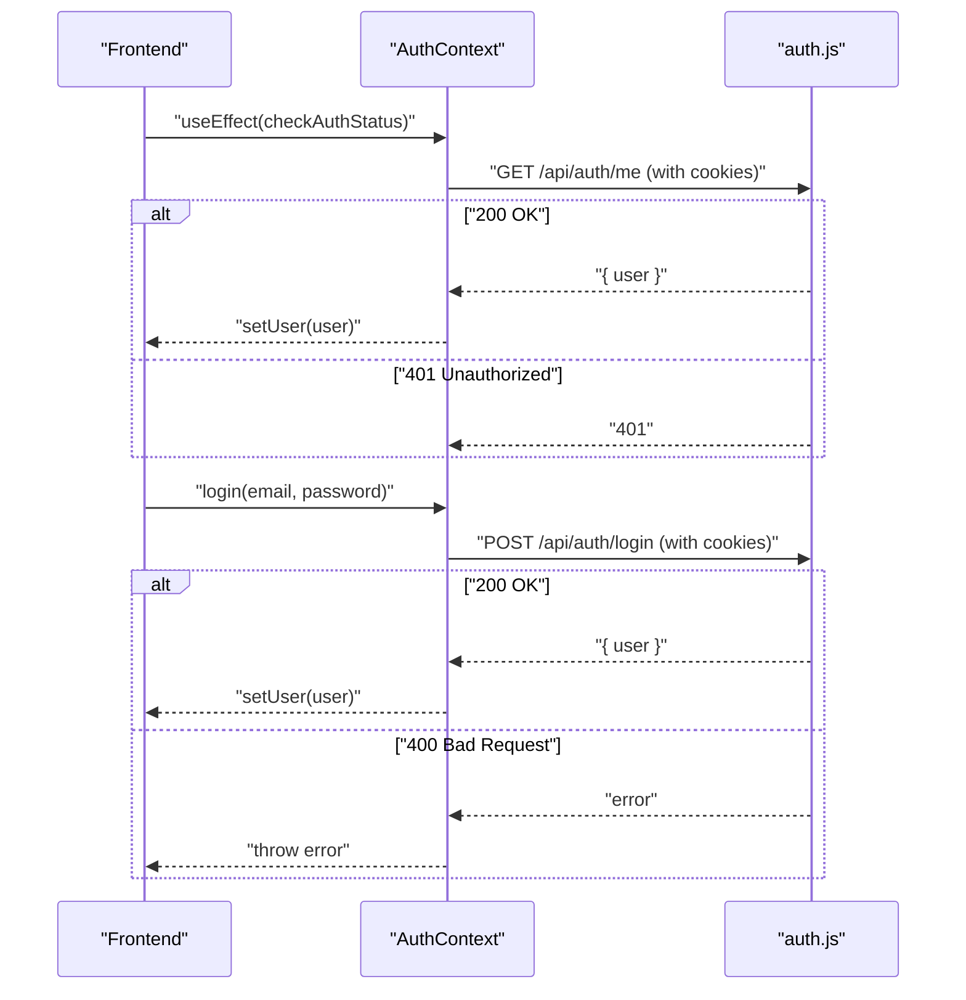
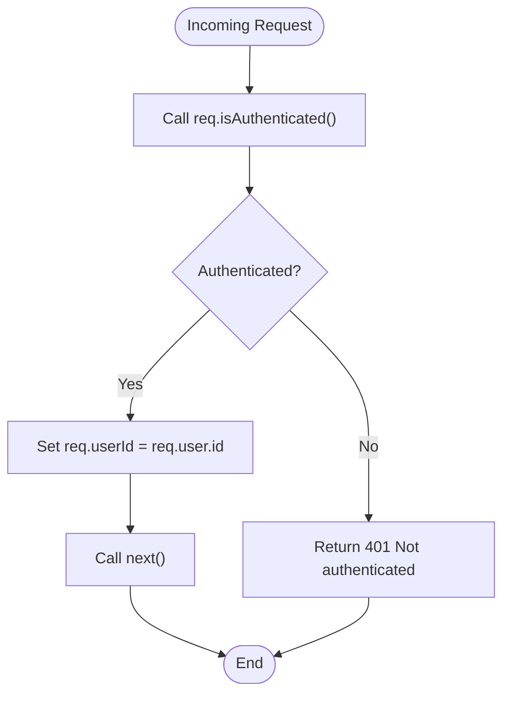
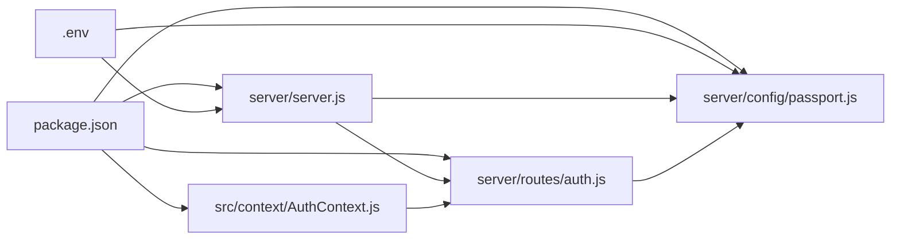

# Authentication Flow

<cite>
**Referenced Files in This Document**
- [server.js](file://server/server.js)
- [passport.js](file://server/config/passport.js)
- [auth.js](file://server/routes/auth.js)
- [requireAuth.js](file://server/middleware/requireAuth.js)
- [User.js](file://server/models/User.js)
- [AuthContext.js](file://src/context/AuthContext.js)
- [.env](file://.env)
- [package.json](file://package.json)
</cite>

## Table of Contents
1. [Introduction](#introduction)
2. [Project Structure](#project-structure)
3. [Core Components](#core-components)
4. [Architecture Overview](#architecture-overview)
5. [Detailed Component Analysis](#detailed-component-analysis)
6. [Dependency Analysis](#dependency-analysis)
7. [Performance Considerations](#performance-considerations)
8. [Troubleshooting Guide](#troubleshooting-guide)
9. [Conclusion](#conclusion)

## Introduction
This document explains the authentication system in article-page-v11, focusing on session-based authentication powered by Passport.js with two strategies:
- Local strategy using email/password
- Google OAuth 2.0 strategy

It covers the complete flow from registration and login to logout and current user retrieval, including session serialization/deserialization, express-session configuration, cookie management, and frontend integration via React’s AuthContext. Security considerations such as bcrypt password hashing, session fixation protection, and cookie settings are addressed.

## Project Structure
The authentication system spans backend route handlers, Passport configuration, session middleware, and a frontend React context provider. The following diagram shows the key files and their roles.

**Diagram sources**
- [server.js](file://server/server.js#L1-L59)
- [auth.js](file://server/routes/auth.js#L1-L100)
- [passport.js](file://server/config/passport.js#L1-L91)
- [requireAuth.js](file://server/middleware/requireAuth.js#L1-L14)
- [User.js](file://server/models/User.js#L1-L39)
- [AuthContext.js](file://src/context/AuthContext.js#L1-L110)
- [.env](file://.env#L1-L10)

**Section sources**
- [server.js](file://server/server.js#L1-L59)
- [auth.js](file://server/routes/auth.js#L1-L100)
- [passport.js](file://server/config/passport.js#L1-L91)
- [requireAuth.js](file://server/middleware/requireAuth.js#L1-L14)
- [User.js](file://server/models/User.js#L1-L39)
- [AuthContext.js](file://src/context/AuthContext.js#L1-L110)
- [.env](file://.env#L1-L10)

## Core Components
- Session and CORS middleware: Initializes express-session with a secret and cookie settings, and enables cross-origin requests with credentials.
- Passport initialization: Initializes Passport and binds session middleware.
- Passport strategies: Local strategy for email/password and Google OAuth strategy.
- Auth routes: Registration, login, logout, and current user retrieval endpoints.
- Frontend AuthContext: Provides authentication state and performs authenticated fetches to backend endpoints.
- User model: Defines fields for email, password hash, Google ID, and role.

Key implementation references:
- Session and Passport setup: [server.js](file://server/server.js#L19-L30)
- Local strategy and Google strategy: [passport.js](file://server/config/passport.js#L22-L89)
- Auth endpoints: [auth.js](file://server/routes/auth.js#L1-L100)
- Frontend AuthContext: [AuthContext.js](file://src/context/AuthContext.js#L1-L110)
- User model: [User.js](file://server/models/User.js#L1-L39)

**Section sources**
- [server.js](file://server/server.js#L19-L30)
- [passport.js](file://server/config/passport.js#L22-L89)
- [auth.js](file://server/routes/auth.js#L1-L100)
- [AuthContext.js](file://src/context/AuthContext.js#L1-L110)
- [User.js](file://server/models/User.js#L1-L39)

## Architecture Overview
The authentication flow integrates Passport.js with express-session and a MySQL-backed Sequelize model. The frontend uses a React context to manage authentication state and communicate with backend endpoints.

**Diagram sources**
- [server.js](file://server/server.js#L19-L30)
- [passport.js](file://server/config/passport.js#L7-L20)
- [auth.js](file://server/routes/auth.js#L1-L100)
- [AuthContext.js](file://src/context/AuthContext.js#L1-L110)
- [User.js](file://server/models/User.js#L1-L39)

## Detailed Component Analysis

### Backend Initialization and Middleware
- express-session is configured with a secret from environment variables, resave=false, saveUninitialized=false, and a cookie with secure=false and a 24-hour max age.
- Passport is initialized and bound to the session middleware.
- Routes are mounted under /api/auth.

References:
- Session and Passport setup: [server.js](file://server/server.js#L19-L30)

Security note:
- Cookie secure is set to false. For production, enable secure=true and set sameSite appropriately.

**Section sources**
- [server.js](file://server/server.js#L19-L30)
- [.env](file://.env#L1-L10)

### Passport Strategies and Session Serialization
- serializeUser stores the user id in the session.
- deserializeUser retrieves the user by id from the database during each request.
- LocalStrategy authenticates by email and compares hashed passwords using bcrypt.
- GoogleStrategy authenticates via Google OAuth, linking accounts by Google ID or email.

References:
- Serialization/deserialization: [passport.js](file://server/config/passport.js#L7-L20)
- LocalStrategy: [passport.js](file://server/config/passport.js#L22-L50)
- GoogleStrategy: [passport.js](file://server/config/passport.js#L52-L89)
- User model fields: [User.js](file://server/models/User.js#L1-L39)

**Diagram sources**
- [passport.js](file://server/config/passport.js#L12-L20)
- [User.js](file://server/models/User.js#L1-L39)

**Section sources**
- [passport.js](file://server/config/passport.js#L7-L20)
- [passport.js](file://server/config/passport.js#L22-L50)
- [passport.js](file://server/config/passport.js#L52-L89)
- [User.js](file://server/models/User.js#L1-L39)

### Auth Endpoints
Endpoints exposed under /api/auth:
- POST /register: Validates presence of email and password, checks uniqueness, hashes password with bcrypt, creates user, logs in automatically, and returns user.
- POST /login: Uses LocalStrategy to authenticate, logs in the user, and returns user.
- GET /google: Starts Google OAuth with scope profile and email.
- GET /google/callback: Completes OAuth, redirects to frontend profile page.
- POST /logout: Clears Passport session, destroys express-session, clears connect.sid cookie, and returns success.
- GET /me: Returns current user if authenticated.

References:
- Registration: [auth.js](file://server/routes/auth.js#L8-L44)
- Login: [auth.js](file://server/routes/auth.js#L46-L62)
- Google OAuth: [auth.js](file://server/routes/auth.js#L64-L73)
- Logout: [auth.js](file://server/routes/auth.js#L75-L89)
- Current user: [auth.js](file://server/routes/auth.js#L91-L99)

**Diagram sources**
- [auth.js](file://server/routes/auth.js#L8-L44)
- [passport.js](file://server/config/passport.js#L7-L20)
- [User.js](file://server/models/User.js#L1-L39)

**Section sources**
- [auth.js](file://server/routes/auth.js#L8-L44)
- [auth.js](file://server/routes/auth.js#L46-L62)
- [auth.js](file://server/routes/auth.js#L64-L73)
- [auth.js](file://server/routes/auth.js#L75-L89)
- [auth.js](file://server/routes/auth.js#L91-L99)

### Frontend AuthContext Integration
- On mount, fetches /api/auth/me with credentials: include to hydrate user state.
- login(email, password): POSTs to /api/auth/login with credentials: include.
- register(email, password): POSTs to /api/auth/register with credentials: include.
- logout(): POSTs to /api/auth/logout with credentials: include.
- loginWithGoogle(): Redirects to /api/auth/google.

References:
- AuthContext initialization and fetch: [AuthContext.js](file://src/context/AuthContext.js#L9-L25)
- login: [AuthContext.js](file://src/context/AuthContext.js#L31-L56)
- register: [AuthContext.js](file://src/context/AuthContext.js#L58-L83)
- logout: [AuthContext.js](file://src/context/AuthContext.js#L85-L96)
- Google login: [AuthContext.js](file://src/context/AuthContext.js#L98-L101)

**Diagram sources**
- [AuthContext.js](file://src/context/AuthContext.js#L9-L25)
- [AuthContext.js](file://src/context/AuthContext.js#L31-L56)
- [auth.js](file://server/routes/auth.js#L46-L62)

**Section sources**
- [AuthContext.js](file://src/context/AuthContext.js#L9-L25)
- [AuthContext.js](file://src/context/AuthContext.js#L31-L56)
- [AuthContext.js](file://src/context/AuthContext.js#L58-L83)
- [AuthContext.js](file://src/context/AuthContext.js#L85-L96)
- [AuthContext.js](file://src/context/AuthContext.js#L98-L101)

### requireAuth Middleware
- Validates requests by checking req.isAuthenticated().
- Sets req.userId from req.user.id and proceeds if authenticated.
- Returns 401 otherwise.

References:
- requireAuth: [requireAuth.js](file://server/middleware/requireAuth.js#L1-L14)

**Diagram sources**
- [requireAuth.js](file://server/middleware/requireAuth.js#L1-L14)

**Section sources**
- [requireAuth.js](file://server/middleware/requireAuth.js#L1-L14)

## Dependency Analysis
The authentication stack depends on several libraries and environment variables.

**Diagram sources**
- [package.json](file://package.json#L15-L36)
- [server.js](file://server/server.js#L1-L59)
- [passport.js](file://server/config/passport.js#L1-L91)
- [auth.js](file://server/routes/auth.js#L1-L100)
- [AuthContext.js](file://src/context/AuthContext.js#L1-L110)
- [.env](file://.env#L1-L10)

**Section sources**
- [package.json](file://package.json#L15-L36)
- [server.js](file://server/server.js#L1-L59)
- [passport.js](file://server/config/passport.js#L1-L91)
- [auth.js](file://server/routes/auth.js#L1-L100)
- [AuthContext.js](file://src/context/AuthContext.js#L1-L110)
- [.env](file://.env#L1-L10)

## Performance Considerations
- Password hashing cost: bcrypt uses a configurable salt rounds; the implementation uses a standard rounds value. Adjusting rounds increases security at the cost of CPU time.
- Session storage: express-session uses an in-memory store by default. For production, configure a scalable store (e.g., Redis) to support horizontal scaling.
- Cookie size: Keep session cookie minimal; only serialize essential user identifiers.
- Network latency: Frontend fetches with credentials: include incur overhead; cache user state in memory and minimize redundant requests.

[No sources needed since this section provides general guidance]

## Troubleshooting Guide
Common issues and resolutions:
- Not authenticated errors:
  - Ensure cookies are included in requests (credentials: include).
  - Verify req.isAuthenticated() is available after passport.session() middleware.
  - References: [server.js](file://server/server.js#L27-L30), [auth.js](file://server/routes/auth.js#L91-L99), [AuthContext.js](file://src/context/AuthContext.js#L13-L15)
- Registration failures:
  - Check for missing email or password fields.
  - Ensure email uniqueness and successful bcrypt hashing.
  - References: [auth.js](file://server/routes/auth.js#L11-L21), [auth.js](file://server/routes/auth.js#L23-L31)
- Login failures:
  - Confirm LocalStrategy credentials match stored password_hash.
  - References: [passport.js](file://server/config/passport.js#L22-L50)
- Logout issues:
  - Ensure req.logout(), session.destroy(), and clearCookie('connect.sid') are executed.
  - References: [auth.js](file://server/routes/auth.js#L75-L89)
- Google OAuth problems:
  - Verify GOOGLE_CLIENT_ID and GOOGLE_CLIENT_SECRET in environment.
  - Confirm callback URL matches configured value.
  - References: [passport.js](file://server/config/passport.js#L52-L58), [.env](file://.env#L7-L10)

**Section sources**
- [server.js](file://server/server.js#L27-L30)
- [auth.js](file://server/routes/auth.js#L11-L21)
- [auth.js](file://server/routes/auth.js#L23-L31)
- [passport.js](file://server/config/passport.js#L22-L50)
- [auth.js](file://server/routes/auth.js#L75-L89)
- [passport.js](file://server/config/passport.js#L52-L58)
- [.env](file://.env#L7-L10)

## Security Considerations
- Password hashing:
  - bcryptjs is used to hash passwords during registration and to compare during login.
  - References: [auth.js](file://server/routes/auth.js#L23-L31), [passport.js](file://server/config/passport.js#L38-L42)
- Session fixation protection:
  - The implementation does not explicitly regenerate session IDs on login. Consider adding session regeneration to mitigate session fixation risks.
  - References: [auth.js](file://server/routes/auth.js#L34-L40), [auth.js](file://server/routes/auth.js#L55-L60)
- Cookie settings:
  - secure is false; for HTTPS production, set secure=true and consider sameSite=Lax or Strict.
  - References: [server.js](file://server/server.js#L20-L25)
- Environment secrets:
  - SESSION_SECRET and JWT_SECRET are defined in .env; keep them secret and rotate periodically.
  - References: [.env](file://.env#L7-L10)

**Section sources**
- [auth.js](file://server/routes/auth.js#L23-L31)
- [passport.js](file://server/config/passport.js#L38-L42)
- [auth.js](file://server/routes/auth.js#L34-L40)
- [auth.js](file://server/routes/auth.js#L55-L60)
- [server.js](file://server/server.js#L20-L25)
- [.env](file://.env#L7-L10)

## Conclusion
The authentication system in article-page-v11 uses a robust session-based approach with Passport.js, supporting both email/password and Google OAuth. It leverages bcrypt for secure password hashing, express-session for session management, and a React context for frontend state synchronization. To harden the system for production, consider enabling secure cookies, implementing session regeneration on login, and using a persistent session store.