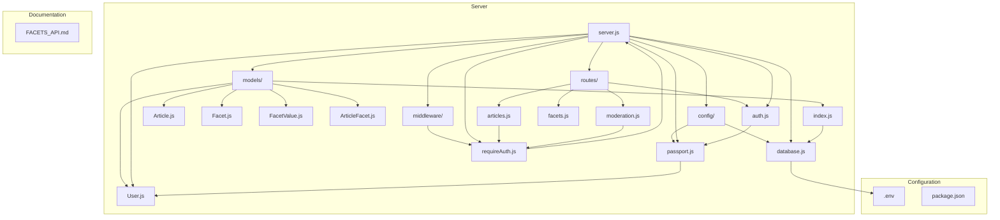
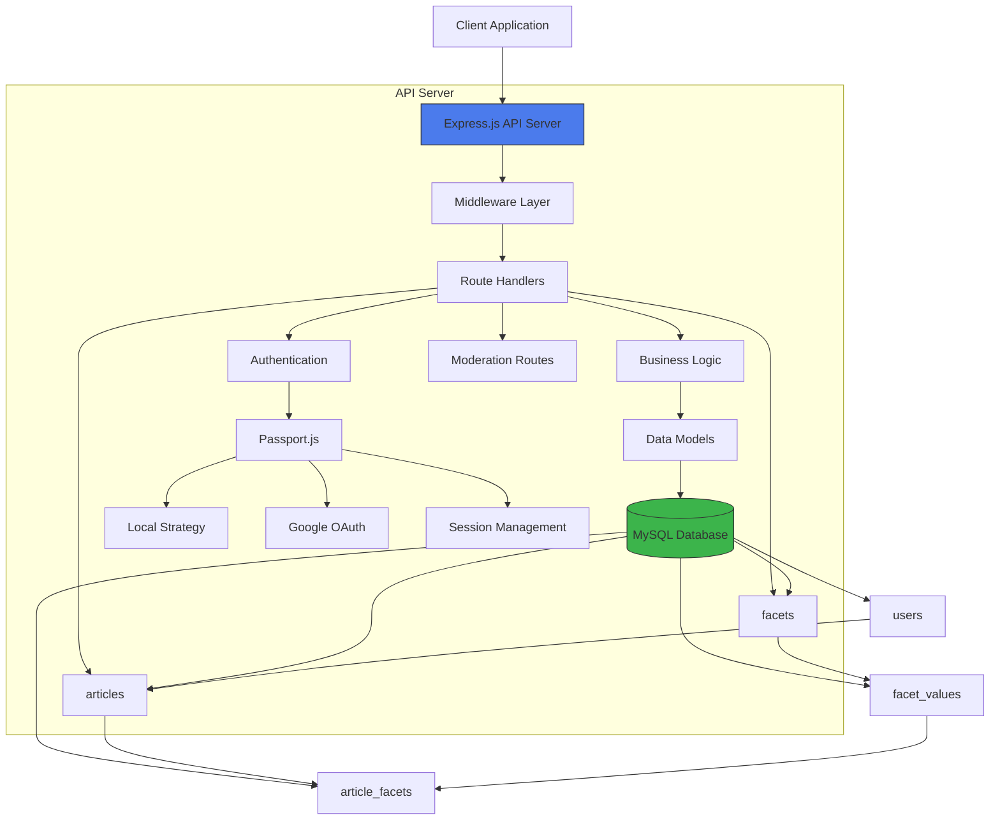
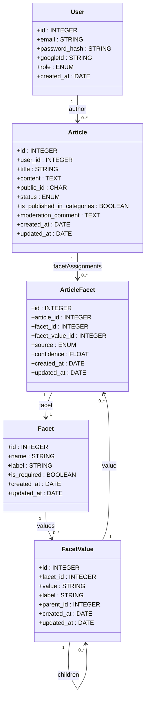
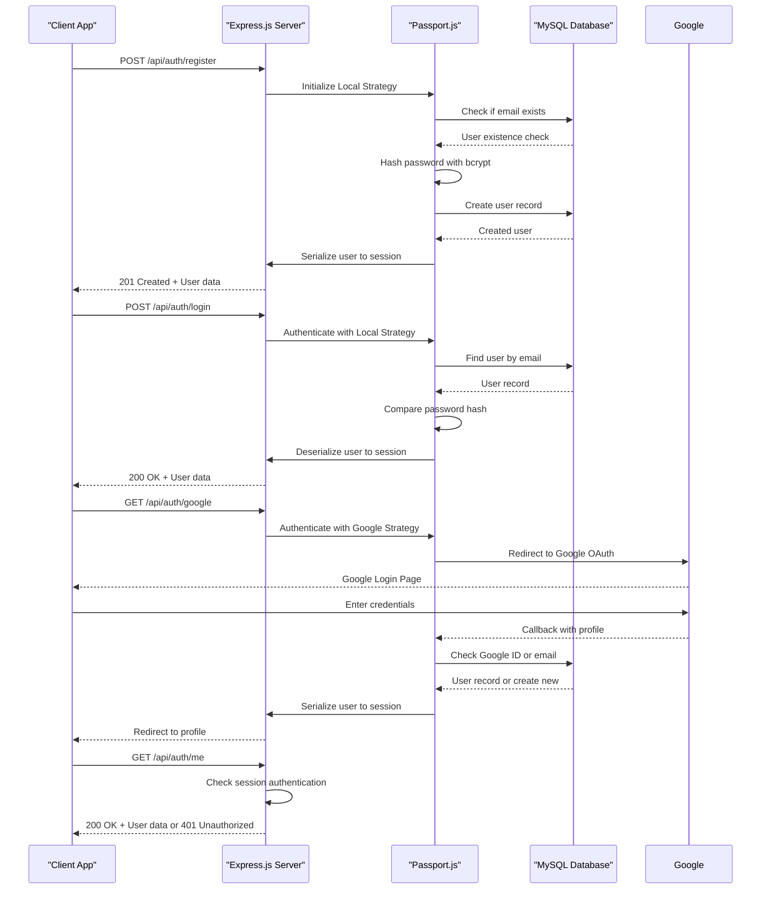

# Backend Architecture

<cite>
**Referenced Files in This Document**   
- [server.js](file://server/server.js)
- [database.js](file://server/config/database.js)
- [passport.js](file://server/config/passport.js)
- [requireAuth.js](file://server/middleware/requireAuth.js)
- [User.js](file://server/models/User.js)
- [Article.js](file://server/models/Article.js)
- [Facet.js](file://server/models/Facet.js)
- [FacetValue.js](file://server/models/FacetValue.js)
- [ArticleFacet.js](file://server/models/ArticleFacet.js)
- [index.js](file://server/models/index.js)
- [auth.js](file://server/routes/auth.js)
- [articles.js](file://server/routes/articles.js)
- [facets.js](file://server/routes/facets.js)
- [moderation.js](file://server/routes/moderation.js)
- [FACETS_API.md](file://server/FACETS_API.md)
- [.env](file://.env)
- [package.json](file://package.json)
</cite>

## Table of Contents
1. [Introduction](#introduction)
2. [Project Structure](#project-structure)
3. [Core Components](#core-components)
4. [Architecture Overview](#architecture-overview)
5. [Detailed Component Analysis](#detailed-component-analysis)
6. [Dependency Analysis](#dependency-analysis)
7. [Performance Considerations](#performance-considerations)
8. [Troubleshooting Guide](#troubleshooting-guide)
9. [Conclusion](#conclusion)

## Introduction
This document provides comprehensive architectural documentation for the backend component of article-page-v11, a content management system with faceted classification. The backend is built on Express.js with Sequelize ORM for MySQL, implementing a Model-View-Controller (MVC) pattern for structured code organization. The system supports both email/password and Google OAuth authentication through Passport.js, with session-based authentication and role-based access control. The architecture is designed to support a card-based article editor with moderation workflows, faceted categorization, and public content browsing.

## Project Structure



**Diagram sources**
- [server.js](file://server/server.js#L1-L59)
- [database.js](file://server/config/database.js#L1-L16)
- [passport.js](file://server/config/passport.js#L1-L91)
- [requireAuth.js](file://server/middleware/requireAuth.js#L1-L14)

**Section sources**
- [server.js](file://server/server.js#L1-L59)
- [config/database.js](file://server/config/database.js#L1-L16)
- [config/passport.js](file://server/config/passport.js#L1-L91)
- [middleware/requireAuth.js](file://server/middleware/requireAuth.js#L1-L14)

## Core Components

The backend architecture of article-page-v11 consists of several core components that work together to provide a robust content management system with faceted classification. The Express.js server serves as the foundation, handling HTTP requests and responses with proper middleware configuration. The MVC pattern is implemented with models representing database entities (User, Article, Facet, FacetValue, and ArticleFacet), routes handling HTTP requests, and controllers managing business logic within the route handlers. Authentication is handled through Passport.js with both local (email/password) and Google OAuth strategies, providing flexible user registration and login options. The system supports role-based access control with user, moderator, and admin roles, enabling different levels of functionality based on user permissions.

**Section sources**
- [server.js](file://server/server.js#L1-L59)
- [models/User.js](file://server/models/User.js#L1-L39)
- [models/Article.js](file://server/models/Article.js#L1-L53)
- [models/Facet.js](file://server/models/Facet.js#L1-L35)
- [models/FacetValue.js](file://server/models/FacetValue.js)
- [models/ArticleFacet.js](file://server/models/ArticleFacet.js)

## Architecture Overview



**Diagram sources**
- [server.js](file://server/server.js#L1-L59)
- [config/database.js](file://server/config/database.js#L1-L16)
- [models/index.js](file://server/models/index.js#L1-L49)

## Detailed Component Analysis

### MVC Pattern Implementation



**Diagram sources**
- [models/User.js](file://server/models/User.js#L1-L39)
- [models/Article.js](file://server/models/Article.js#L1-L53)
- [models/Facet.js](file://server/models/Facet.js#L1-L35)
- [models/FacetValue.js](file://server/models/FacetValue.js)
- [models/ArticleFacet.js](file://server/models/ArticleFacet.js)
- [models/index.js](file://server/models/index.js#L1-L49)

**Section sources**
- [models/User.js](file://server/models/User.js#L1-L39)
- [models/Article.js](file://server/models/Article.js#L1-L53)
- [models/Facet.js](file://server/models/Facet.js#L1-L35)
- [models/FacetValue.js](file://server/models/FacetValue.js)
- [models/ArticleFacet.js](file://server/models/ArticleFacet.js)
- [models/index.js](file://server/models/index.js#L1-L49)

### Authentication Flow



**Diagram sources**
- [config/passport.js](file://server/config/passport.js#L1-L91)
- [routes/auth.js](file://server/routes/auth.js#L1-L100)
- [middleware/requireAuth.js](file://server/middleware/requireAuth.js#L1-L14)

**Section sources**
- [config/passport.js](file://server/config/passport.js#L1-L91)
- [routes/auth.js](file://server/routes/auth.js#L1-L100)
- [middleware/requireAuth.js](file://server/middleware/requireAuth.js#L1-L14)

### API Endpoint Organization

```mermaid
graph TD
A[API Root] --> B[/api/auth]
A --> C[/api/articles]
A --> D[/api/facets]
A --> E[/api/moderation]
A --> F[/api/health]
B --> B1[POST /register]
B --> B2[POST /login]
B --> B3[GET /google]
B --> B4[GET /google/callback]
B --> B5[POST /logout]
B --> B6[GET /me]
C --> C1[POST /]
C --> C2[PUT /:id/attach]
C --> C3[PUT /:id]
C --> C4[GET /user/:userId]
C --> C5[DELETE /:id]
C --> C6[GET /categories/:facetValue]
C --> C7[POST /:id/submit-for-review]
D --> D1[GET /]
D --> D2[GET /:facetName/values]
E --> E1[GET /pending]
E --> E2[GET /articles/:id]
E --> E3[POST /articles/:id/facets]
E --> E4[PATCH /articles/:id/approve]
E --> E5[PATCH /articles/:id/reject]
style B fill:#FFD700,stroke:#333
style C fill:#FF6347,stroke:#333
style D fill:#4169E1,stroke:#333
style E fill:#32CD32,stroke:#333
style F fill:#8A2BE2,stroke:#333
```

**Diagram sources**
- [server.js](file://server/server.js#L35-L38)
- [routes/auth.js](file://server/routes/auth.js#L1-L100)
- [routes/articles.js](file://server/routes/articles.js#L1-L228)
- [routes/facets.js](file://server/routes/facets.js)
- [routes/moderation.js](file://server/routes/moderation.js#L1-L214)

**Section sources**
- [server.js](file://server/server.js#L35-L38)
- [routes/auth.js](file://server/routes/auth.js#L1-L100)
- [routes/articles.js](file://server/routes/articles.js#L1-L228)
- [routes/facets.js](file://server/routes/facets.js)
- [routes/moderation.js](file://server/routes/moderation.js#L1-L214)

### Data Flow from Client to Database

```mermaid
flowchart TD
Client[Client Request] --> Cors[CORS Middleware]
Cors --> Json[JSON Parsing]
Json --> Session[Session Management]
Session --> Passport[Passport Initialization]
Passport --> Routes[Route Dispatch]
subgraph "Authentication Routes"
Routes --> Auth[/api/auth/*]
Auth --> AuthLogic[Authentication Logic]
AuthLogic --> DB[(MySQL Database)]
DB --> AuthLogic
AuthLogic --> Response[Response to Client]
end
subgraph "Articles Routes"
Routes --> Articles[/api/articles/*]
Articles --> AuthCheck[requireAuth Middleware]
AuthCheck --> ArticlesLogic[Articles Business Logic]
ArticlesLogic --> DB
DB --> ArticlesLogic
ArticlesLogic --> Response
end
subgraph "Moderation Routes"
Routes --> Moderation[/api/moderation/*]
Moderation --> ModAuth[requireAuth Middleware]
ModAuth --> ModerationLogic[Moderation Business Logic]
ModerationLogic --> DB
DB --> ModerationLogic
ModerationLogic --> Response
end
style Cors fill:#20B2AA,stroke:#333
style Json fill:#20B2AA,stroke:#333
style Session fill:#20B2AA,stroke:#333
style Passport fill:#20B2AA,stroke:#333
style AuthCheck fill:#FF4500,stroke:#333
style ModAuth fill:#FF4500,stroke:#333
```

**Diagram sources**
- [server.js](file://server/server.js#L13-L29)
- [middleware/requireAuth.js](file://server/middleware/requireAuth.js#L1-L14)
- [routes/articles.js](file://server/routes/articles.js#L4-L5)
- [routes/moderation.js](file://server/routes/moderation.js#L3-L4)

**Section sources**
- [server.js](file://server/server.js#L13-L29)
- [middleware/requireAuth.js](file://server/middleware/requireAuth.js#L1-L14)
- [routes/articles.js](file://server/routes/articles.js#L1-L228)
- [routes/moderation.js](file://server/routes/moderation.js#L1-L214)

## Dependency Analysis

```mermaid
graph TD
server.js --> express
server.js --> cors
server.js --> express-session
server.js --> passport
server.js --> dotenv
server.js --> models
config/database.js --> sequelize
config/database.js --> dotenv
config/passport.js --> passport
config/passport.js --> passport-local
config/passport.js --> passport-google-oauth20
config/passport.js --> bcryptjs
config/passport.js --> models
middleware/requireAuth.js --> jsonwebtoken
models/index.js --> database.js
models/index.js --> User.js
models/index.js --> Article.js
models/index.js --> Facet.js
models/index.js --> FacetValue.js
models/index.js --> ArticleFacet.js
routes/auth.js --> express
routes/auth.js --> bcryptjs
routes/auth.js --> passport
routes/auth.js --> models
routes/auth.js --> config/passport.js
routes/articles.js --> express
routes/articles.js --> models
routes/articles.js --> middleware/requireAuth.js
routes/articles.js --> uuid
routes/articles.js --> sequelize
routes/facets.js --> express
routes/facets.js --> models
routes/moderation.js --> express
routes/moderation.js --> models
routes/moderation.js --> sequelize
package.json --> express
package.json --> sequelize
package.json --> mysql2
package.json --> passport
package.json --> cors
package.json --> express-session
package.json --> bcryptjs
package.json --> jsonwebtoken
package.json --> dotenv
style server.js fill:#4B7BEC,stroke:#333
style config/database.js fill:#4B7BEC,stroke:#333
style config/passport.js fill:#4B7BEC,stroke:#333
style middleware/requireAuth.js fill:#4B7BEC,stroke:#333
style models/index.js fill:#4B7BEC,stroke:#333
style routes/auth.js fill:#4B7BEC,stroke:#333
style routes/articles.js fill:#4B7BEC,stroke:#333
style routes/facets.js fill:#4B7BEC,stroke:#333
style routes/moderation.js fill:#4B7BEC,stroke:#333
style package.json fill:#FFD700,stroke:#333
```



**Diagram sources**
- [package.json](file://package.json#L1-L53)
- [server.js](file://server/server.js#L1-L59)
- [config/database.js](file://server/config/database.js#L1-L16)
- [config/passport.js](file://server/config/passport.js#L1-L91)
- [middleware/requireAuth.js](file://server/middleware/requireAuth.js#L1-L14)
- [models/index.js](file://server/models/index.js#L1-L49)
- [routes/auth.js](file://server/routes/auth.js#L1-L100)
- [routes/articles.js](file://server/routes/articles.js#L1-L228)
- [routes/facets.js](file://server/routes/facets.js)
- [routes/moderation.js](file://server/routes/moderation.js#L1-L214)

**Section sources**
- [package.json](file://package.json#L1-L53)
- [server.js](file://server/server.js#L1-L59)
- [config/database.js](file://server/config/database.js#L1-L16)
- [config/passport.js](file://server/config/passport.js#L1-L91)
- [middleware/requireAuth.js](file://server/middleware/requireAuth.js#L1-L14)

## Performance Considerations

The backend architecture incorporates several performance considerations to ensure efficient operation and scalability. The Sequelize ORM provides connection pooling by default, which helps manage database connections efficiently and prevents connection exhaustion under high load. The server is configured to handle JSON payloads up to 50MB, accommodating large article content from the card-based editor. The use of indexes on frequently queried fields such as email in the users table, status in the articles table, and foreign key relationships in the association tables ensures fast data retrieval. The faceted classification system is optimized with proper indexing on facet-related fields to support efficient category browsing. The authentication system uses bcrypt with a salt round of 10, providing a balance between security and performance. For production deployment, the architecture supports environment-specific configuration through the .env file, allowing optimization of settings like session secret, database credentials, and API keys.

**Section sources**
- [config/database.js](file://server/config/database.js#L4-L13)
- [server.js](file://server/server.js#L17)
- [models/User.js](file://server/models/User.js#L10-L13)
- [models/Article.js](file://server/models/Article.js#L31-L34)
- [.env](file://.env#L1-L10)

## Troubleshooting Guide

Common issues in the article-page-v11 backend typically relate to database connectivity, authentication flows, and API endpoint accessibility. For database connection issues, verify that the MySQL server is running and that the credentials in the .env file match the database configuration. Authentication problems may arise from incorrect Passport.js configuration or session management issues; ensure that the SESSION_SECRET environment variable is set and that the Google OAuth client ID and secret are correctly configured. CORS errors can occur if the frontend origin does not match the allowed origin in the server configuration; update the cors middleware settings in server.js if deploying to a different domain. API endpoint issues may result from incorrect route definitions or middleware application; verify that routes are properly mounted in server.js and that required middleware like requireAuth is correctly implemented. Database schema synchronization issues can be resolved by running the sync-db script, which ensures that the database structure matches the Sequelize model definitions.

**Section sources**
- [server.js](file://server/server.js#L48-L55)
- [.env](file://.env#L1-L10)
- [config/database.js](file://server/config/database.js#L4-L13)
- [config/passport.js](file://server/config/passport.js#L55-L57)
- [server.js](file://server/server.js#L13-L16)
- [package.json](file://package.json#L12)
- [sync-db.js](file://server/sync-db.js)

## Conclusion

The backend architecture of article-page-v11 provides a robust foundation for a content management system with faceted classification. The Express.js server with Sequelize ORM implements a clean MVC pattern, separating concerns between data models, route handlers, and business logic. The authentication system supports both local and Google OAuth strategies through Passport.js, with proper session management and role-based access control. The API is well-organized into logical modules for authentication, articles, facets, and moderation, with clear separation of user and moderator functionality. The data model supports complex faceted classification with hierarchical facet values and multiple tagging sources, enabling rich content categorization. The architecture incorporates essential cross-cutting concerns including security (bcrypt password hashing, input validation), monitoring (console logging), and scalability (connection pooling). With proper environment configuration and deployment practices, this backend can support a scalable content platform with sophisticated classification capabilities.