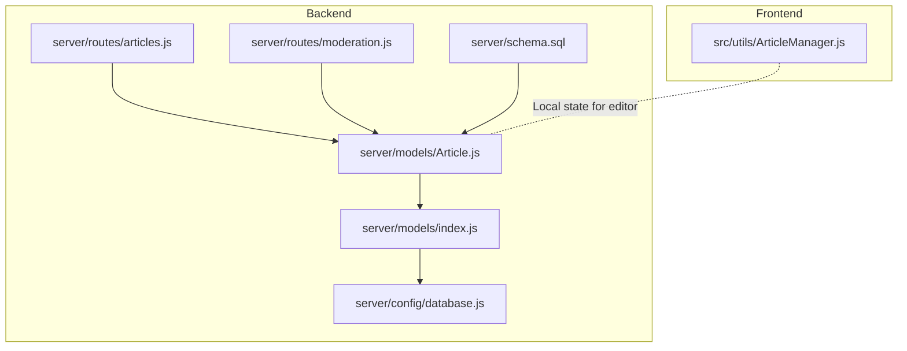
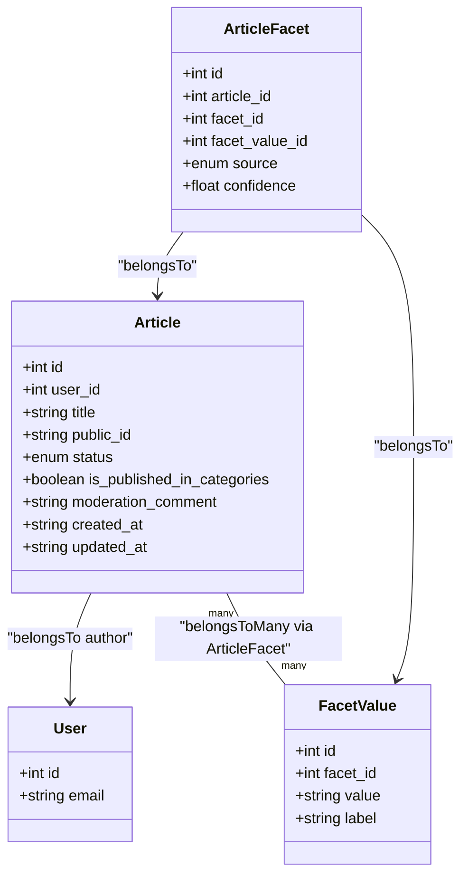
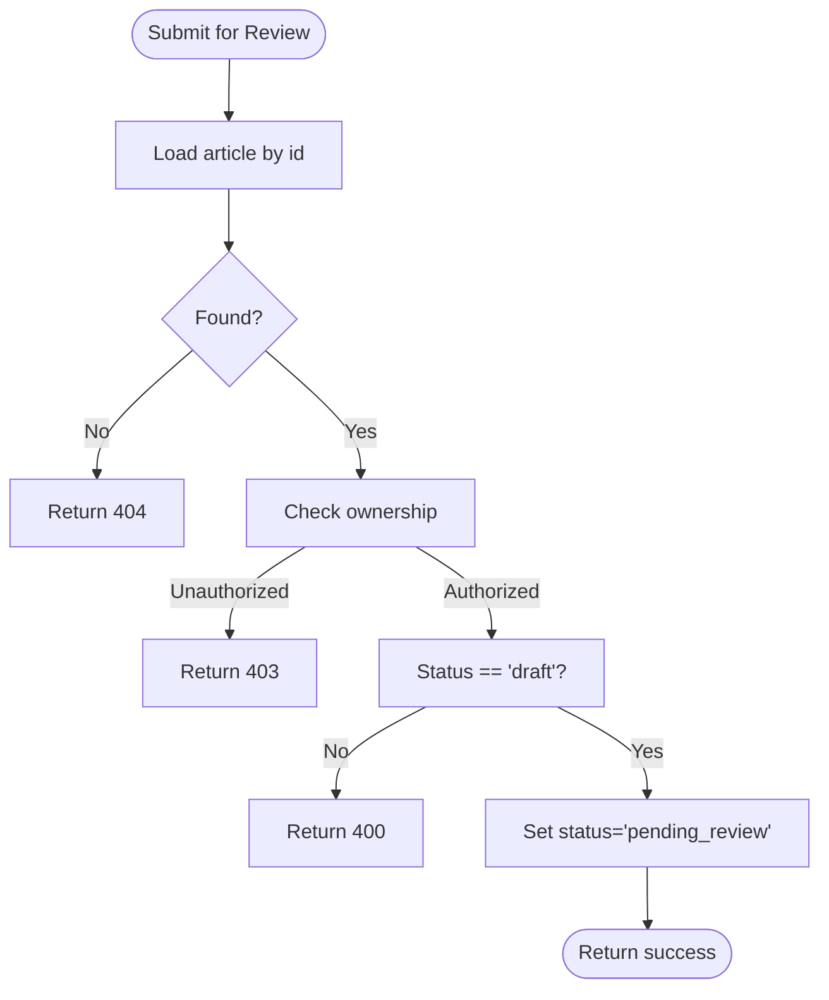
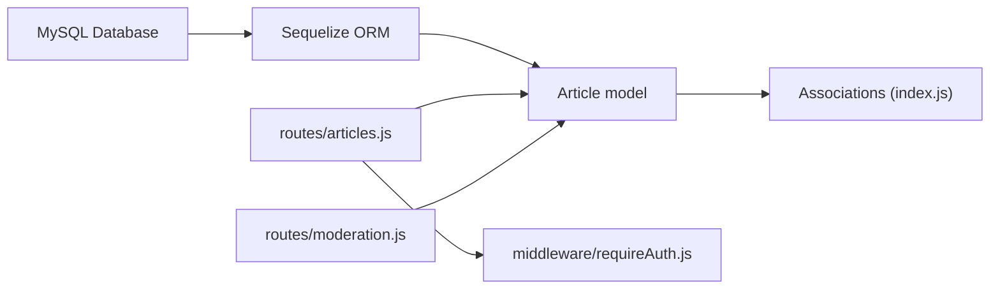

# Article Model

<cite>
**Referenced Files in This Document**
- [Article.js](file://server/models/Article.js)
- [articles.js](file://server/routes/articles.js)
- [moderation.js](file://server/routes/moderation.js)
- [index.js](file://server/models/index.js)
- [schema.sql](file://server/schema.sql)
- [database.js](file://server/config/database.js)
- [ArticleManager.js](file://src/utils/ArticleManager.js)
- [requireAuth.js](file://server/middleware/requireAuth.js)
</cite>

## Table of Contents
1. [Introduction](#introduction)
2. [Project Structure](#project-structure)
3. [Core Components](#core-components)
4. [Architecture Overview](#architecture-overview)
5. [Detailed Component Analysis](#detailed-component-analysis)
6. [Dependency Analysis](#dependency-analysis)
7. [Performance Considerations](#performance-considerations)
8. [Troubleshooting Guide](#troubleshooting-guide)
9. [Conclusion](#conclusion)

## Introduction
This document describes the Article model, which represents the core content entity in the system. It covers the model’s fields, constraints, relationships, and lifecycle, and explains how it integrates with backend routes and the frontend ArticleManager utility. It also documents the moderation pipeline, guest versus authenticated workflows, and performance considerations for querying and storing large text content.

## Project Structure
The Article model is defined in the backend ORM layer and integrated with Express routes for CRUD operations and moderation workflows. Frontend state management for local editing is handled by a dedicated utility.



**Diagram sources**
- [Article.js](file://server/models/Article.js#L1-L52)
- [index.js](file://server/models/index.js#L1-L48)
- [articles.js](file://server/routes/articles.js#L1-L228)
- [moderation.js](file://server/routes/moderation.js#L1-L214)
- [database.js](file://server/config/database.js#L1-L16)
- [schema.sql](file://server/schema.sql#L1-L33)
- [ArticleManager.js](file://src/utils/ArticleManager.js#L1-L152)

**Section sources**
- [Article.js](file://server/models/Article.js#L1-L52)
- [articles.js](file://server/routes/articles.js#L1-L228)
- [moderation.js](file://server/routes/moderation.js#L1-L214)
- [index.js](file://server/models/index.js#L1-L48)
- [schema.sql](file://server/schema.sql#L1-L33)
- [database.js](file://server/config/database.js#L1-L16)
- [ArticleManager.js](file://src/utils/ArticleManager.js#L1-L152)

## Core Components
- Article model definition with fields: id, user_id, content, title, public_id, status, is_published_in_categories, moderation_comment.
- Associations linking Articles to Users and FacetValues via ArticleFacet.
- Database schema additions for status, publication flag, and moderation comment, plus indexes for performance.
- Routes implementing guest draft creation, attaching drafts to authenticated users, saving updates, deleting drafts, and submitting for moderation.
- Moderation routes for reviewing, assigning facets, approving, and rejecting articles.
- Frontend ArticleManager utility for client-side article state management.

**Section sources**
- [Article.js](file://server/models/Article.js#L1-L52)
- [index.js](file://server/models/index.js#L1-L48)
- [schema.sql](file://server/schema.sql#L1-L33)
- [articles.js](file://server/routes/articles.js#L1-L228)
- [moderation.js](file://server/routes/moderation.js#L1-L214)
- [ArticleManager.js](file://src/utils/ArticleManager.js#L1-L152)

## Architecture Overview
The Article model participates in a moderation pipeline:
- Authors (guests or authenticated users) create drafts and optionally attach them to their accounts.
- Authors submit drafts for review; moderators/admins review, assign facets, and either approve or reject.
- Approved articles become eligible for category publication.

```mermaid
sequenceDiagram
participant Client as "Client Editor"
participant Routes as "articles.js"
participant Model as "Article model"
participant Moderation as "moderation.js"
participant DB as "Database"
Client->>Routes : "POST / (create guest draft)"
Routes->>Model : "Article.create({ title, content, user_id : null })"
Model->>DB : "INSERT INTO articles"
DB-->>Model : "article row"
Model-->>Routes : "article"
Routes-->>Client : "{ article }"
Client->>Routes : "PUT / : id/attach (attach to user)"
Routes->>Model : "findByPk(id)"
Model->>DB : "SELECT WHERE id=?"
DB-->>Model : "article"
Model-->>Routes : "article"
Routes->>Model : "article.user_id = userId; save()"
Model->>DB : "UPDATE articles SET user_id=userId"
Routes-->>Client : "{ article }"
Client->>Routes : "PUT / : id (save/update)"
Routes->>Model : "findByPk(id); update fields"
Model->>DB : "UPDATE articles"
Routes-->>Client : "{ article }"
Client->>Routes : "POST / : id/submit-for-review"
Routes->>Model : "findByPk(id); update status='pending_review'"
Model->>DB : "UPDATE articles SET status='pending_review'"
Routes-->>Client : "{ message, article }"
Moderation->>Model : "findByPk(id)"
Model->>DB : "SELECT WHERE id=?"
DB-->>Model : "article"
Model-->>Moderation : "article"
Moderation->>Model : "approve -> update status='approved', is_published_in_categories=true"
Model->>DB : "UPDATE articles"
Moderation-->>Client : "{ message, article }"
```

**Diagram sources**
- [articles.js](file://server/routes/articles.js#L1-L228)
- [moderation.js](file://server/routes/moderation.js#L1-L214)
- [Article.js](file://server/models/Article.js#L1-L52)

## Detailed Component Analysis

### Article Model Definition and Constraints
- Fields:
  - id: INTEGER, primary key, auto-increment.
  - user_id: INTEGER, nullable; references users.id; allows guest drafts.
  - content: TEXT('long'), required; stores structured article data as JSON string.
  - title: STRING, optional.
  - public_id: CHAR(12), optional; unique index enforced.
  - status: ENUM('draft','pending_review','approved','rejected'), default 'draft'.
  - is_published_in_categories: BOOLEAN, default false.
  - moderation_comment: TEXT, optional.
  - Timestamps: created_at, updated_at.
- Constraints:
  - Foreign key: user_id -> users(id).
  - ENUM validation for status.
  - Unique constraint on public_id.
  - Large text storage via LONGTEXT for content.



**Diagram sources**
- [Article.js](file://server/models/Article.js#L1-L52)
- [index.js](file://server/models/index.js#L1-L48)

**Section sources**
- [Article.js](file://server/models/Article.js#L1-L52)
- [schema.sql](file://server/schema.sql#L1-L33)
- [index.js](file://server/models/index.js#L1-L48)

### Backend Routes: CRUD and Moderation Integration
- Guest draft creation:
  - Endpoint: POST /
  - Behavior: Creates a draft with user_id null, title fallback to 'Untitled', content stored as JSON string.
- Attach draft to user:
  - Endpoint: PUT /:id/attach
  - Behavior: Validates ownership and attaches draft to authenticated user; prevents re-attachment by another user.
- Save/update article:
  - Endpoint: PUT /:id
  - Behavior: Requires authentication, checks ownership, updates title and content.
- Delete draft:
  - Endpoint: DELETE /:id
  - Behavior: Requires ownership and deletes the record.
- Submit for review:
  - Endpoint: POST /:id/submit-for-review
  - Behavior: Validates ownership and status, sets status to 'pending_review'.
- Category browsing:
  - Endpoint: GET /categories/:facetValue
  - Behavior: Returns approved, published articles filtered by facet value and includes author and facets.
- Moderation endpoints:
  - Pending reviews: GET /api/moderation/pending
  - Single article with facets: GET /api/moderation/articles/:id
  - Assign facets: POST /api/moderation/articles/:id/facets
  - Approve: PATCH /api/moderation/articles/:id/approve
  - Reject: PATCH /api/moderation/articles/:id/reject



**Diagram sources**
- [articles.js](file://server/routes/articles.js#L194-L225)

**Section sources**
- [articles.js](file://server/routes/articles.js#L1-L228)
- [moderation.js](file://server/routes/moderation.js#L1-L214)
- [requireAuth.js](file://server/middleware/requireAuth.js#L1-L14)

### Frontend Integration: ArticleManager.js
- Purpose: Manage local article state in browser storage for the editor.
- Capabilities:
  - Create, save, delete, and retrieve articles.
  - Track current article ID.
  - Migrate legacy single-article data to library format.
- Notes: This utility operates locally and does not directly persist to the backend; it complements the backend Article model by enabling offline-friendly editing.

**Section sources**
- [ArticleManager.js](file://src/utils/ArticleManager.js#L1-L152)

## Dependency Analysis
- Database layer:
  - Article model depends on Sequelize and the configured MySQL connection.
  - Schema.sql adds status, publication flag, moderation comment, and indexes.
- ORM associations:
  - Article belongs to User via user_id.
  - Article belongs to FacetValue via ArticleFacet junction table.
- Route dependencies:
  - articles.js depends on Article, User, ArticleFacet, FacetValue, Facet.
  - moderation.js depends on the same models and uses ArticleFacet for facet assignment.
- Middleware:
  - requireAuth enforces authentication for protected routes.



**Diagram sources**
- [database.js](file://server/config/database.js#L1-L16)
- [Article.js](file://server/models/Article.js#L1-L52)
- [index.js](file://server/models/index.js#L1-L48)
- [articles.js](file://server/routes/articles.js#L1-L228)
- [moderation.js](file://server/routes/moderation.js#L1-L214)
- [requireAuth.js](file://server/middleware/requireAuth.js#L1-L14)

**Section sources**
- [database.js](file://server/config/database.js#L1-L16)
- [index.js](file://server/models/index.js#L1-L48)
- [schema.sql](file://server/schema.sql#L1-L33)
- [articles.js](file://server/routes/articles.js#L1-L228)
- [moderation.js](file://server/routes/moderation.js#L1-L214)
- [requireAuth.js](file://server/middleware/requireAuth.js#L1-L14)

## Performance Considerations
- Indexes:
  - Status index: supports filtering by status efficiently.
  - Publication flag index: supports category publication filtering.
- Query patterns:
  - User drafts retrieval sorts by updated_at descending.
  - Category browsing filters by is_published_in_categories and status.
- Storage:
  - Content stored as LONGTEXT to accommodate large structured article data.
- Recommendations:
  - Consider adding an index on user_id for user-specific queries if frequently used.
  - For category browsing, ensure facet joins leverage indexes on article_facets.
  - Monitor query plans for category endpoints and add composite indexes if needed.

**Section sources**
- [schema.sql](file://server/schema.sql#L1-L33)
- [articles.js](file://server/routes/articles.js#L84-L101)
- [Article.js](file://server/models/Article.js#L1-L52)

## Troubleshooting Guide
- Authentication failures:
  - Protected routes return 401 when not authenticated; ensure sessions are established.
- Authorization failures:
  - Saving/deleting requires ownership; route returns 403 if unauthorized.
- Not found errors:
  - Routes return 404 when article does not exist.
- Submission constraints:
  - Submit for review only works on draft status; otherwise returns 400.
- Moderation workflows:
  - Approve sets status to approved and enables category publication.
  - Reject sets status to rejected and clears category publication; optional moderation comment can be included.

**Section sources**
- [requireAuth.js](file://server/middleware/requireAuth.js#L1-L14)
- [articles.js](file://server/routes/articles.js#L56-L123)
- [articles.js](file://server/routes/articles.js#L194-L225)
- [moderation.js](file://server/routes/moderation.js#L131-L211)

## Conclusion
The Article model centralizes content persistence with clear constraints and relationships. It supports guest drafts, authenticated workflows, and a robust moderation pipeline. The backend routes expose comprehensive CRUD and moderation capabilities, while the frontend ArticleManager provides practical local state management for the editor. Performance is aided by targeted indexes and large-text storage, with room to optimize further based on query patterns.