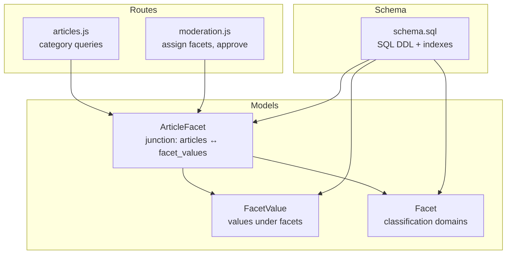
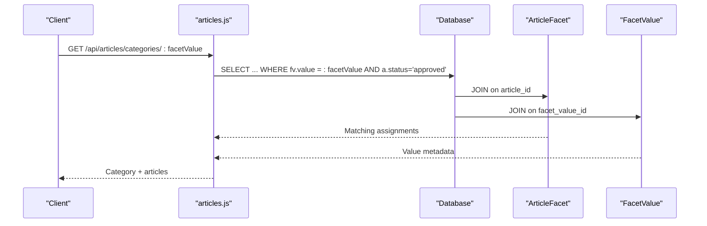
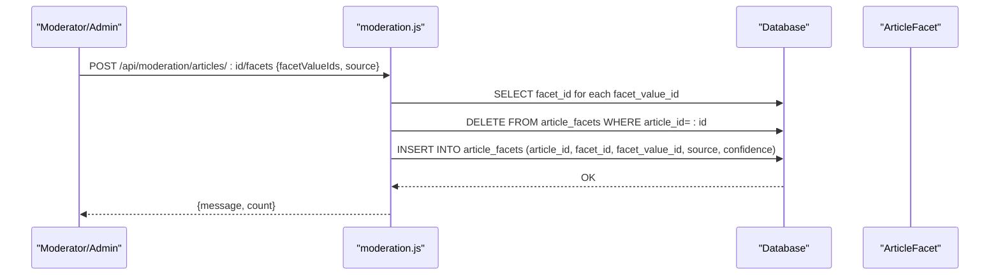
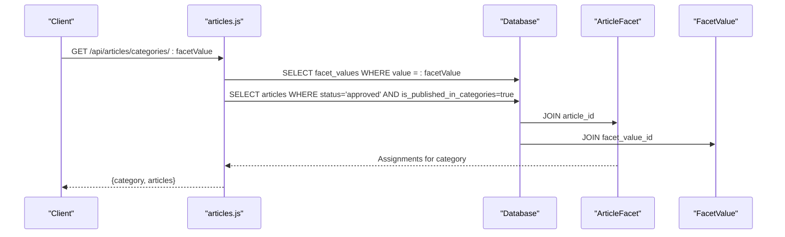
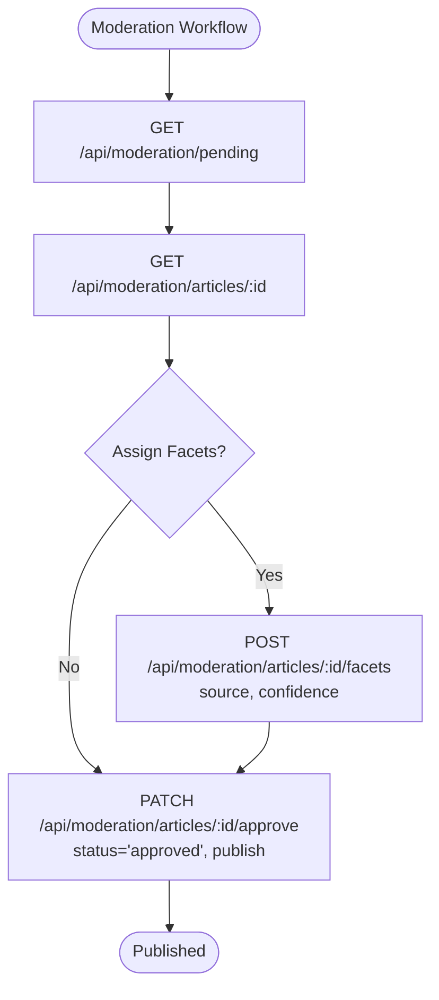
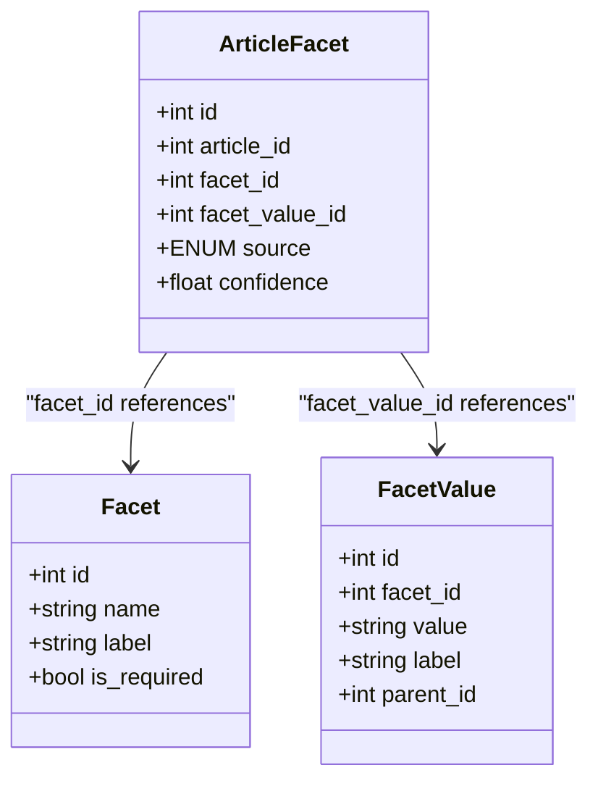

# ArticleFacet Model

<cite>
**Referenced Files in This Document**
- [ArticleFacet.js](file://server/models/ArticleFacet.js)
- [schema.sql](file://server/schema.sql)
- [FACETS_API.md](file://server/FACETS_API.md)
- [articles.js](file://server/routes/articles.js)
- [moderation.js](file://server/routes/moderation.js)
- [Facet.js](file://server/models/Facet.js)
- [FacetValue.js](file://server/models/FacetValue.js)
</cite>

## Table of Contents
1. [Introduction](#introduction)
2. [Project Structure](#project-structure)
3. [Core Components](#core-components)
4. [Architecture Overview](#architecture-overview)
5. [Detailed Component Analysis](#detailed-component-analysis)
6. [Dependency Analysis](#dependency-analysis)
7. [Performance Considerations](#performance-considerations)
8. [Troubleshooting Guide](#troubleshooting-guide)
9. [Conclusion](#conclusion)

## Introduction
This document describes the ArticleFacet junction model that connects articles to facet values, enabling classification metadata for filtering, AI refinement, and moderation. It explains the model’s fields, constraints, denormalization strategy, and usage patterns across the backend routes. It also covers advanced scenarios such as AI auto-tagging with confidence scoring, tag source tracking, and moderation workflows.

## Project Structure
The ArticleFacet model is part of the server-side data layer built with Sequelize ORM and backed by SQL schema definitions. It participates in many-to-many relationships between articles and facet values, with supporting models for facets and facet values.

**Diagram sources**
- [ArticleFacet.js](file://server/models/ArticleFacet.js#L1-L75)
- [Facet.js](file://server/models/Facet.js#L1-L35)
- [FacetValue.js](file://server/models/FacetValue.js#L1-L59)
- [articles.js](file://server/routes/articles.js#L125-L192)
- [moderation.js](file://server/routes/moderation.js#L78-L129)
- [schema.sql](file://server/schema.sql#L55-L77)

**Section sources**
- [ArticleFacet.js](file://server/models/ArticleFacet.js#L1-L75)
- [schema.sql](file://server/schema.sql#L55-L77)

## Core Components
- ArticleFacet: The junction table linking articles to facet values. It stores classification metadata and supports AI confidence scoring and manual assignment.
- Facet: Defines classification domains (e.g., domain, difficulty).
- FacetValue: Hierarchical values within facets (e.g., web development, backend development).

Key responsibilities:
- Enforce referential integrity via foreign keys.
- Prevent duplicate assignments per article/value via a unique compound index.
- Denormalize facet_id to accelerate filtering and analytics.

**Section sources**
- [ArticleFacet.js](file://server/models/ArticleFacet.js#L1-L75)
- [Facet.js](file://server/models/Facet.js#L1-L35)
- [FacetValue.js](file://server/models/FacetValue.js#L1-L59)
- [schema.sql](file://server/schema.sql#L55-L77)

## Architecture Overview
The ArticleFacet model participates in two primary workflows:
- Filtering and browsing: retrieving articles by facet values.
- Moderation: assigning facets to articles and publishing them.

**Diagram sources**
- [articles.js](file://server/routes/articles.js#L125-L192)
- [schema.sql](file://server/schema.sql#L105-L113)

## Detailed Component Analysis

### ArticleFacet Model Definition and Constraints
- Fields:
  - id: primary key
  - article_id: references articles with CASCADE delete
  - facet_id: denormalized facet reference for fast filtering
  - facet_value_id: specific classification value
  - source: ENUM('manual', 'auto_suggested')
  - confidence: FLOAT bounded 0–1 with default 1.0
- Indexes:
  - article_id
  - facet_value_id
  - facet_id
  - unique compound (article_id, facet_value_id)
- Timestamps: created_at, updated_at

Constraints and validations:
- Foreign keys cascade deletes for all referenced tables.
- Unique constraint prevents duplicate assignments of the same facet value to an article.
- ENUM and numeric validation ensure data integrity.

Denormalization rationale:
- Storing facet_id alongside facet_value_id allows efficient filtering and analytics without joining facets during common queries.

**Section sources**
- [ArticleFacet.js](file://server/models/ArticleFacet.js#L1-L75)
- [schema.sql](file://server/schema.sql#L55-L77)

### Usage Patterns in Routes

#### Saving Tags and Facets (Moderation)
- Endpoint: POST /api/moderation/articles/:id/facets
- Behavior:
  - Validates input facetValueIds.
  - Resolves facet_id for each facet_value_id.
  - Deletes existing assignments for the article.
  - Bulk inserts new assignments with source and confidence.
- Confidence semantics:
  - source='manual': confidence=1.0
  - source='auto_suggested': confidence set to a default value (e.g., 0.8) by the route.

**Diagram sources**
- [moderation.js](file://server/routes/moderation.js#L78-L129)

**Section sources**
- [moderation.js](file://server/routes/moderation.js#L78-L129)

#### Analytics and Filtering (Categories)
- Endpoint: GET /api/articles/categories/:facetValue
- Behavior:
  - Finds the facet value and its hierarchy metadata.
  - Retrieves published, approved articles that include the given facet value via ArticleFacet.
  - Returns category metadata plus article list with facetAssignments.

**Diagram sources**
- [articles.js](file://server/routes/articles.js#L125-L192)
- [schema.sql](file://server/schema.sql#L105-L113)

**Section sources**
- [articles.js](file://server/routes/articles.js#L125-L192)

### Advanced Use Cases

#### AI Auto-Tagging with Confidence Scoring
- Proposed flow:
  - System suggests facets with source='auto_suggested' and confidence between 0 and 1.
  - Moderator reviews suggestions.
  - On approval, update source='manual' and confidence=1.0.
- Implementation note:
  - The model supports source and confidence fields.
  - The moderation route demonstrates how to set source and confidence during bulk assignment.

**Section sources**
- [FACETS_API.md](file://server/FACETS_API.md#L249-L255)
- [ArticleFacet.js](file://server/models/ArticleFacet.js#L37-L52)
- [moderation.js](file://server/routes/moderation.js#L107-L119)

#### Tag Source Tracking and Moderation Review
- The source field enables distinguishing manual vs. AI-assigned tags.
- Moderation endpoints:
  - GET /api/moderation/pending: list articles awaiting review.
  - GET /api/moderation/articles/:id: fetch article with facetAssignments for review.
  - POST /api/moderation/articles/:id/facets: assign facets and set source/confidence.
  - PATCH /api/moderation/articles/:id/approve: approve and publish, optionally re-assigning facets.

**Diagram sources**
- [moderation.js](file://server/routes/moderation.js#L1-L214)

**Section sources**
- [moderation.js](file://server/routes/moderation.js#L1-L214)

## Dependency Analysis
The ArticleFacet model depends on:
- articles: CASCADE delete ensures orphan removal when articles are deleted.
- facets: denormalized facet_id enables fast filtering and reduces joins.
- facet_values: CASCADE delete ensures orphan removal when values are deleted.

**Diagram sources**
- [ArticleFacet.js](file://server/models/ArticleFacet.js#L1-L75)
- [Facet.js](file://server/models/Facet.js#L1-L35)
- [FacetValue.js](file://server/models/FacetValue.js#L1-L59)

**Section sources**
- [ArticleFacet.js](file://server/models/ArticleFacet.js#L1-L75)
- [Facet.js](file://server/models/Facet.js#L1-L35)
- [FacetValue.js](file://server/models/FacetValue.js#L1-L59)

## Performance Considerations
Indexing strategy for high-speed filtering and aggregation:
- article_id: supports queries that fetch all facets for a given article.
- facet_value_id: supports category-based filtering and reverse lookups.
- facet_id: accelerates filtering by classification domain without joining facets.
- unique (article_id, facet_value_id): prevents duplicates and speeds up conflict checks.

Additional recommendations:
- Maintain separate indexes for facet_id and facet_value_id to optimize diverse query patterns.
- Consider adding composite indexes for frequent filter combinations (e.g., article_id + facet_id) if analytics queries grow more complex.
- Monitor slow queries and add targeted indexes based on actual usage patterns.

**Section sources**
- [ArticleFacet.js](file://server/models/ArticleFacet.js#L58-L73)
- [schema.sql](file://server/schema.sql#L73-L77)

## Troubleshooting Guide
Common issues and resolutions:
- Duplicate assignment errors:
  - Symptom: Attempting to insert a row with the same (article_id, facet_value_id) fails.
  - Cause: Unique compound index prevents duplicates.
  - Resolution: Ensure existing assignments are removed before inserting new ones (as done in moderation route).
- Invalid source or confidence values:
  - Symptom: Validation errors when inserting or updating ArticleFacet.
  - Cause: ENUM and numeric bounds enforced by model definition.
  - Resolution: Use allowed values for source and keep confidence within 0–1.
- Missing facet_id resolution:
  - Symptom: Bulk assignment fails due to missing facet_id.
  - Cause: facet_value_id not found or mismatched facet.
  - Resolution: Verify facet_value_ids exist and resolve facet_id before bulk insertion (as done in moderation route).

**Section sources**
- [ArticleFacet.js](file://server/models/ArticleFacet.js#L37-L52)
- [moderation.js](file://server/routes/moderation.js#L83-L119)

## Conclusion
The ArticleFacet model is central to the classification system, enabling flexible filtering, robust moderation, and scalable performance through strategic denormalization and indexing. Its design supports both manual curation and future AI auto-tagging workflows, while maintaining data integrity via foreign keys and validations.