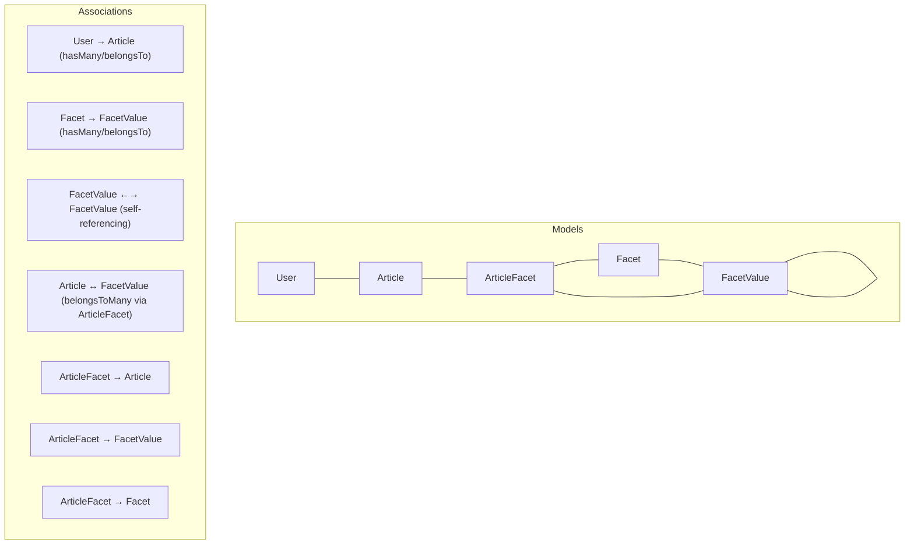
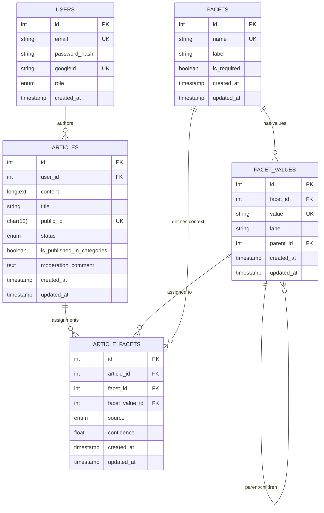
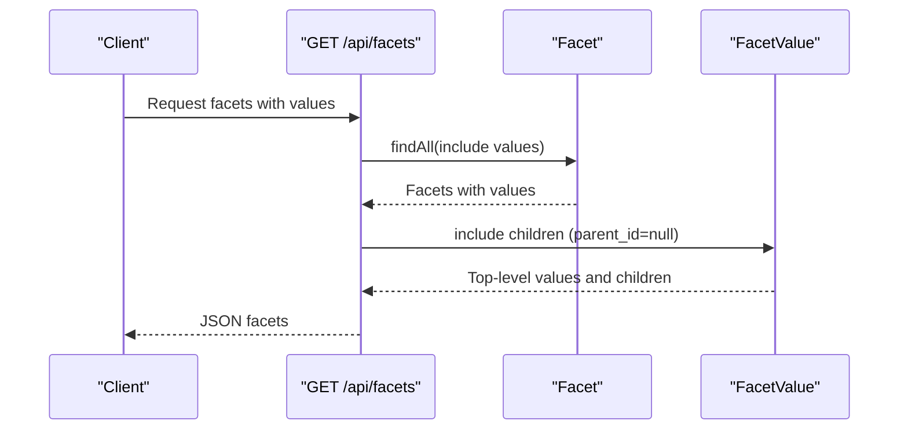
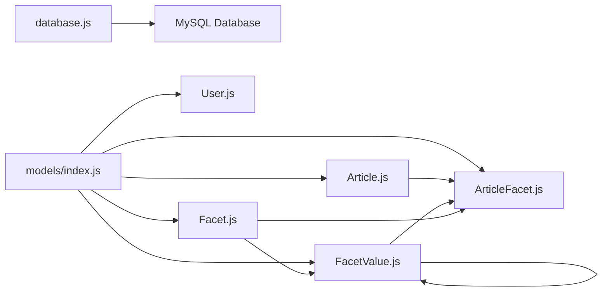

# Data Models

<cite>
**Referenced Files in This Document**
- [server/models/index.js](file://server/models/index.js)
- [server/models/User.js](file://server/models/User.js)
- [server/models/Article.js](file://server/models/Article.js)
- [server/models/Facet.js](file://server/models/Facet.js)
- [server/models/FacetValue.js](file://server/models/FacetValue.js)
- [server/models/ArticleFacet.js](file://server/models/ArticleFacet.js)
- [server/config/database.js](file://server/config/database.js)
- [server/schema.sql](file://server/schema.sql)
- [server/routes/articles.js](file://server/routes/articles.js)
- [server/routes/facets.js](file://server/routes/facets.js)
- [server/routes/moderation.js](file://server/routes/moderation.js)
- [server/routes/auth.js](file://server/routes/auth.js)
- [server/seed-facets.js](file://server/seed-facets.js)
</cite>

## Table of Contents
1. [Introduction](#introduction)
2. [Project Structure](#project-structure)
3. [Core Components](#core-components)
4. [Architecture Overview](#architecture-overview)
5. [Detailed Component Analysis](#detailed-component-analysis)
6. [Dependency Analysis](#dependency-analysis)
7. [Performance Considerations](#performance-considerations)
8. [Troubleshooting Guide](#troubleshooting-guide)
9. [Conclusion](#conclusion)
10. [Appendices](#appendices)

## Introduction
This document provides comprehensive data model documentation for the Sequelize ORM models in article-page-v11. It covers the five core entities: User, Article, Facet, FacetValue, and ArticleFacet. For each entity, we describe fields, types, constraints, indexes, and associations. We explain the database schema design, normalization strategy, and referential integrity. We also show practical usage patterns in routes and services, performance considerations for querying article-facet relationships, and outline data lifecycle considerations.

## Project Structure
The data models are defined under server/models and orchestrated by server/models/index.js. Associations are declared centrally to keep models decoupled while enabling rich joins and nested includes in routes.

**Diagram sources**
- [server/models/index.js](file://server/models/index.js#L8-L39)
- [server/models/User.js](file://server/models/User.js#L1-L39)
- [server/models/Article.js](file://server/models/Article.js#L1-L53)
- [server/models/Facet.js](file://server/models/Facet.js#L1-L35)
- [server/models/FacetValue.js](file://server/models/FacetValue.js#L1-L59)
- [server/models/ArticleFacet.js](file://server/models/ArticleFacet.js#L1-L76)

**Section sources**
- [server/models/index.js](file://server/models/index.js#L1-L49)
- [server/config/database.js](file://server/config/database.js#L1-L16)

## Core Components
This section summarizes each entity’s purpose, primary fields, and constraints.

- User
  - Purpose: Authentication and roles for authors and moderators/admins.
  - Key fields: id, email (unique), password_hash (nullable for Google), googleId (unique), role (ENUM).
  - Timestamps: created_at only.
  - Notes: Supports email/password and Google OAuth; role determines moderation capabilities.

- Article
  - Purpose: Stores article content and moderation lifecycle.
  - Key fields: id, user_id (nullable for guest drafts), content (LONGTEXT), title, public_id (unique), status (ENUM), is_published_in_categories (boolean), moderation_comment.
  - Timestamps: created_at, updated_at.
  - Notes: Supports drafts, submission for review, and moderation statuses.

- Facet
  - Purpose: Defines classification categories (e.g., domain, difficulty).
  - Key fields: id, name (unique), label, is_required.
  - Timestamps: created_at, updated_at.
  - Notes: Used to group FacetValue entries.

- FacetValue
  - Purpose: Specific classification values with optional hierarchy.
  - Key fields: id, facet_id (FK), value (unique per facet), label, parent_id (self-reference).
  - Indexes: facet_id, parent_id, unique(facet_id, value).
  - Notes: Hierarchical with one level deep via parent_id.

- ArticleFacet
  - Purpose: Many-to-many junction for articles and facet values; tracks assignment source and confidence.
  - Key fields: id, article_id (FK), facet_id (FK), facet_value_id (FK), source (ENUM), confidence (float 0–1).
  - Indexes: article_id, facet_value_id, facet_id, unique(article_id, facet_value_id).
  - Notes: Ensures uniqueness of assignments per article and enables fast lookups.

**Section sources**
- [server/models/User.js](file://server/models/User.js#L1-L39)
- [server/models/Article.js](file://server/models/Article.js#L1-L53)
- [server/models/Facet.js](file://server/models/Facet.js#L1-L35)
- [server/models/FacetValue.js](file://server/models/FacetValue.js#L1-L59)
- [server/models/ArticleFacet.js](file://server/models/ArticleFacet.js#L1-L76)

## Architecture Overview
The data model enforces a normalized schema with explicit referential integrity:
- Users author Articles (one-to-many).
- Facets define categories; FacetValues define values and optional hierarchy.
- Articles are tagged to FacetValues via the ArticleFacet junction table.
- Self-referencing FacetValue supports a single-level hierarchy (parent/child).

**Diagram sources**
- [server/models/User.js](file://server/models/User.js#L1-L39)
- [server/models/Article.js](file://server/models/Article.js#L1-L53)
- [server/models/Facet.js](file://server/models/Facet.js#L1-L35)
- [server/models/FacetValue.js](file://server/models/FacetValue.js#L1-L59)
- [server/models/ArticleFacet.js](file://server/models/ArticleFacet.js#L1-L76)
- [server/schema.sql](file://server/schema.sql#L1-L134)

## Detailed Component Analysis

### User Model
- Fields and constraints
  - id: integer, auto-increment, primary key.
  - email: string, unique, required, validated as email.
  - password_hash: string, nullable (supports Google sign-in).
  - googleId: string, unique, nullable.
  - role: enum('user','moderator','admin'), default 'user'.
  - created_at: timestamp (no updatedAt).
- Associations
  - Authorship: User hasMany Article (drafts).
  - Ownership: Article belongsTo User (author).
- Typical usage
  - Authentication endpoints create/update users and set role.
  - Moderation routes rely on role for access control.

**Section sources**
- [server/models/User.js](file://server/models/User.js#L1-L39)
- [server/models/index.js](file://server/models/index.js#L8-L11)
- [server/routes/auth.js](file://server/routes/auth.js#L1-L100)
- [server/routes/moderation.js](file://server/routes/moderation.js#L1-L214)

### Article Model
- Fields and constraints
  - id: integer, auto-increment, primary key.
  - user_id: integer, nullable (guest drafts), references users.id.
  - content: longtext, required.
  - title: string, nullable.
  - public_id: char(12), nullable, unique.
  - status: enum('draft','pending_review','approved','rejected'), default 'draft'.
  - is_published_in_categories: boolean, default false.
  - moderation_comment: text, nullable.
  - created_at, updated_at timestamps.
- Associations
  - Author: Article belongsTo User (author).
  - Facet assignments: Article hasMany ArticleFacet (facetAssignments).
  - Facet values: Article belongsToMany FacetValue via ArticleFacet (facetValues).
- Typical usage
  - Routes support guest drafts, attaching to users, updating, deleting, and querying published articles by category.

**Section sources**
- [server/models/Article.js](file://server/models/Article.js#L1-L53)
- [server/models/index.js](file://server/models/index.js#L8-L11)
- [server/models/index.js](file://server/models/index.js#L20-L33)
- [server/routes/articles.js](file://server/routes/articles.js#L1-L228)
- [server/routes/moderation.js](file://server/routes/moderation.js#L1-L214)

### Facet Model
- Fields and constraints
  - id: integer, auto-increment, primary key.
  - name: string(50), unique, required.
  - label: string(100), required.
  - is_required: boolean, default false.
  - created_at, updated_at timestamps.
- Associations
  - Values: Facet hasMany FacetValue (values).
- Typical usage
  - Routes expose hierarchical facets and values; ordering prioritizes required facets.

**Section sources**
- [server/models/Facet.js](file://server/models/Facet.js#L1-L35)
- [server/models/index.js](file://server/models/index.js#L12-L14)
- [server/routes/facets.js](file://server/routes/facets.js#L1-L68)

### FacetValue Model
- Fields and constraints
  - id: integer, auto-increment, primary key.
  - facet_id: integer, required, FK to facets.id with cascade delete.
  - value: string(100), required; unique constraint with facet_id.
  - label: string(150), required.
  - parent_id: integer, nullable, self-FK with SET NULL on delete.
  - created_at, updated_at timestamps.
- Indexes
  - facet_id
  - parent_id
  - unique(facet_id, value)
- Associations
  - Parent/children: FacetValue hasMany FacetValue (children) and belongsTo FacetValue (parent).
  - Category membership: Facet hasMany FacetValue (values); FacetValue belongsTo Facet.
- Typical usage
  - Hierarchical navigation and filtering by parent/child relationships.

**Section sources**
- [server/models/FacetValue.js](file://server/models/FacetValue.js#L1-L59)
- [server/models/index.js](file://server/models/index.js#L16-L18)
- [server/routes/facets.js](file://server/routes/facets.js#L1-L68)

### ArticleFacet Model
- Fields and constraints
  - id: integer, auto-increment, primary key.
  - article_id: integer, required, FK to articles.id with cascade delete.
  - facet_id: integer, required, FK to facets.id with cascade delete.
  - facet_value_id: integer, required, FK to facet_values.id with cascade delete.
  - source: enum('manual','auto_suggested'), default 'manual'.
  - confidence: float, default 1.0, validated 0..1.
  - created_at, updated_at timestamps.
- Indexes
  - article_id
  - facet_value_id
  - facet_id
  - unique(article_id, facet_value_id)
- Associations
  - Direct access: Article hasMany ArticleFacet (facetAssignments).
  - Reverse joins: ArticleFacet belongsTo Article, FacetValue, Facet.
  - Many-to-many: Article belongsToMany FacetValue via ArticleFacet; vice versa.
- Typical usage
  - Moderation assigns facets to articles and updates article status.
  - Public category browsing joins articles to facet values.

**Section sources**
- [server/models/ArticleFacet.js](file://server/models/ArticleFacet.js#L1-L76)
- [server/models/index.js](file://server/models/index.js#L20-L33)
- [server/models/index.js](file://server/models/index.js#L35-L39)
- [server/routes/moderation.js](file://server/routes/moderation.js#L78-L129)
- [server/routes/articles.js](file://server/routes/articles.js#L125-L192)

### Association and Relationship Flow

**Diagram sources**
- [server/routes/facets.js](file://server/routes/facets.js#L1-L68)
- [server/models/Facet.js](file://server/models/Facet.js#L1-L35)
- [server/models/FacetValue.js](file://server/models/FacetValue.js#L1-L59)
- [server/models/index.js](file://server/models/index.js#L12-L18)

## Dependency Analysis
- Internal dependencies
  - server/models/index.js defines all models and associations; routes import models from this central index.
  - server/config/database.js initializes Sequelize with environment variables.
- External dependencies
  - MySQL dialect via Sequelize.
  - Environment variables for database credentials.
- Referential integrity
  - Foreign keys enforce cascading deletes for facet values and article assignments.
  - Unique constraints prevent duplicate facet assignments per article and duplicate facet values per facet.

**Diagram sources**
- [server/config/database.js](file://server/config/database.js#L1-L16)
- [server/models/index.js](file://server/models/index.js#L1-L49)
- [server/models/FacetValue.js](file://server/models/FacetValue.js#L1-L59)
- [server/models/ArticleFacet.js](file://server/models/ArticleFacet.js#L1-L76)

**Section sources**
- [server/models/index.js](file://server/models/index.js#L1-L49)
- [server/config/database.js](file://server/config/database.js#L1-L16)

## Performance Considerations
- Index coverage
  - ArticleFacet: article_id, facet_value_id, facet_id, unique(article_id, facet_value_id) — supports fast lookups and prevents duplicates.
  - FacetValue: facet_id, parent_id, unique(facet_id, value) — supports hierarchical queries and fast facet-scoped lookups.
  - Articles: indexes on status and is_published_in_categories — supports moderation and category queries.
- Efficient querying patterns
  - Use includes with where clauses on junction table fields to limit joined rows (as seen in category listing).
  - Prefer bulk operations for facet assignment during moderation to minimize round-trips.
  - Order by created_at or updated_at for recent-first lists; leverage indexes for stable sorts.
- Additional recommendations
  - Consider adding composite indexes for frequent filter combinations (e.g., status + is_published_in_categories).
  - For hierarchical facet navigation, pre-fetch top-level parents and children to reduce N+1 queries.
  - Use pagination for large lists of articles or facets.

**Section sources**
- [server/models/ArticleFacet.js](file://server/models/ArticleFacet.js#L58-L73)
- [server/models/FacetValue.js](file://server/models/FacetValue.js#L44-L56)
- [server/schema.sql](file://server/schema.sql#L18-L20)
- [server/routes/articles.js](file://server/routes/articles.js#L125-L192)
- [server/routes/moderation.js](file://server/routes/moderation.js#L78-L129)

## Troubleshooting Guide
- Common errors and resolutions
  - Duplicate facet value per facet: unique(facet_id, value) prevents duplicates; handle conflicts when seeding or editing.
  - Missing parent_id: parent_id is nullable; ensure parent exists before setting child’s parent_id.
  - Cascade deletion: deleting a FacetValue removes its children (SET NULL) and ArticleFacet rows (CASCADE).
  - Authorization: moderation endpoints should enforce roles; current pending listing lacks role checks.
- Validation and constraints
  - ArticleFacet.confidence validated 0..1; ensure client-side and server-side bounds.
  - Article.status transitions: drafts can be submitted; moderation updates status and publishing flag.
- Logging and diagnostics
  - Routes log errors; enable Sequelize logging in development to inspect generated SQL.

**Section sources**
- [server/models/FacetValue.js](file://server/models/FacetValue.js#L1-L59)
- [server/models/ArticleFacet.js](file://server/models/ArticleFacet.js#L1-L76)
- [server/routes/moderation.js](file://server/routes/moderation.js#L1-L214)
- [server/config/database.js](file://server/config/database.js#L1-L16)

## Conclusion
The data model implements a normalized, extensible taxonomy system for categorizing articles. Associations and indexes are designed to support common workflows: authoring, moderation, and category-based browsing. The schema enforces referential integrity and provides clear extension points for future enhancements.

## Appendices

### Appendix A: Model Usage Examples in Routes
- Fetch facets with hierarchical values
  - Route: GET /api/facets
  - Behavior: Returns facets ordered by is_required and name; includes top-level values and their children.
  - References: [server/routes/facets.js](file://server/routes/facets.js#L1-L68)

- List published articles by category
  - Route: GET /api/articles/categories/:facetValue
  - Behavior: Resolves facet value, filters articles by status and publishing flag, includes author and facet assignments.
  - References: [server/routes/articles.js](file://server/routes/articles.js#L125-L192)

- Moderate article and assign facets
  - Route: POST /api/moderation/articles/:id/facets
  - Behavior: Deletes previous assignments and creates new ones; supports manual/auto assignment with confidence.
  - References: [server/routes/moderation.js](file://server/routes/moderation.js#L78-L129)

- Approve article and publish
  - Route: PATCH /api/moderation/articles/:id/approve
  - Behavior: Updates status to approved and sets publishing flag; optionally reassigns facets.
  - References: [server/routes/moderation.js](file://server/routes/moderation.js#L131-L180)

- Authentication and roles
  - Routes: register/login with email/password and Google OAuth; exposes current user.
  - References: [server/routes/auth.js](file://server/routes/auth.js#L1-L100)

### Appendix B: Data Lifecycle and Retention
- Draft lifecycle
  - Articles can be created as drafts (user_id may be null for guests). Ownership can be attached later.
  - References: [server/routes/articles.js](file://server/routes/articles.js#L1-L124)
- Moderation lifecycle
  - Status transitions: draft → pending_review → approved/rejected; approved articles may be published in categories.
  - References: [server/routes/articles.js](file://server/routes/articles.js#L194-L225), [server/routes/moderation.js](file://server/routes/moderation.js#L131-L180)
- Facet taxonomy maintenance
  - Facets and values are seeded and can be extended; hierarchical relationships are enforced via parent_id.
  - References: [server/seed-facets.js](file://server/seed-facets.js#L1-L151)

### Appendix C: Database Schema Reference
- Users table extended with role column.
- Articles table extended with status, publishing flag, and moderation comment; indexes on status and publishing flag.
- Facets and FacetValues define hierarchical taxonomy with unique constraints and foreign keys.
- ArticleFacets junction table with indexes and unique constraints.

**Section sources**
- [server/schema.sql](file://server/schema.sql#L1-L134)