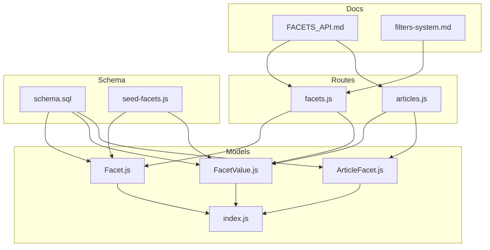
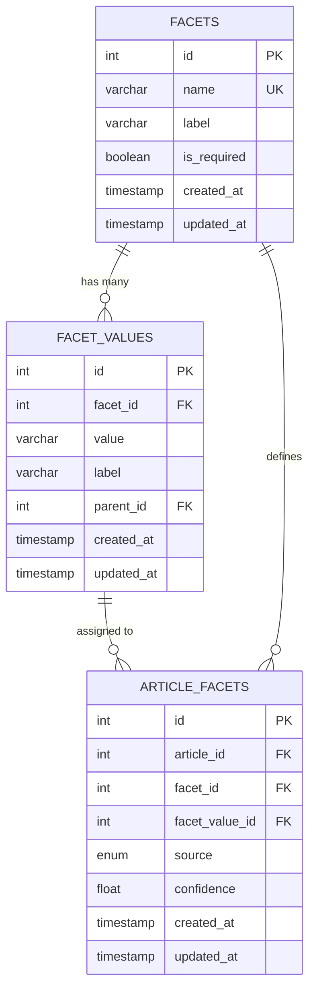
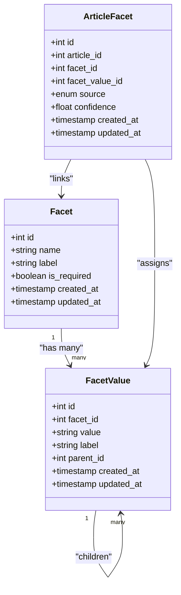
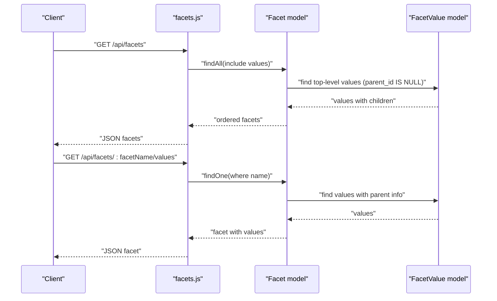
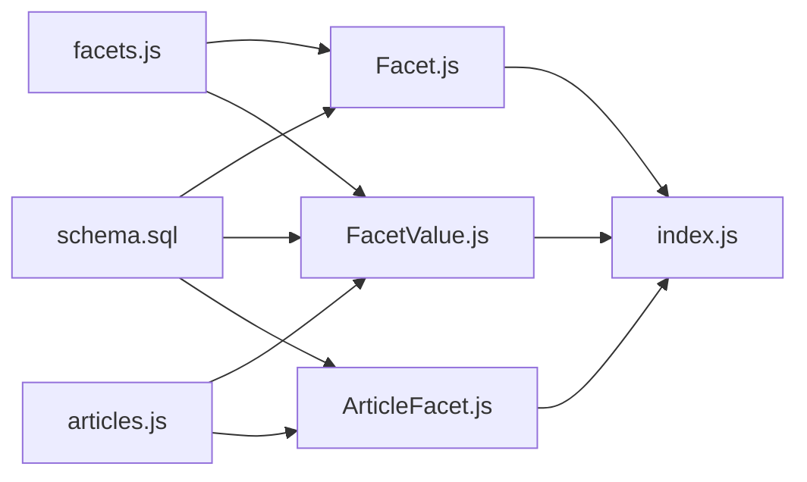

# Facet Model

<cite>
**Referenced Files in This Document**
- [Facet.js](file://server/models/Facet.js)
- [FacetValue.js](file://server/models/FacetValue.js)
- [ArticleFacet.js](file://server/models/ArticleFacet.js)
- [index.js](file://server/models/index.js)
- [facets.js](file://server/routes/facets.js)
- [articles.js](file://server/routes/articles.js)
- [schema.sql](file://server/schema.sql)
- [seed-facets.js](file://server/seed-facets.js)
- [FACETS_API.md](file://server/FACETS_API.md)
- [filters-system.md](file://docs/filters-system.md)
</cite>

## Table of Contents
1. [Introduction](#introduction)
2. [Project Structure](#project-structure)
3. [Core Components](#core-components)
4. [Architecture Overview](#architecture-overview)
5. [Detailed Component Analysis](#detailed-component-analysis)
6. [Dependency Analysis](#dependency-analysis)
7. [Performance Considerations](#performance-considerations)
8. [Troubleshooting Guide](#troubleshooting-guide)
9. [Conclusion](#conclusion)
10. [Appendices](#appendices)

## Introduction
This document describes the Facet model and its ecosystem for classification and filtering. The Facet model defines named classification dimensions (for example, domain, difficulty, target audience, instruction type, technology) that enable:
- Dynamic UI generation for editors and moderators
- Structured AI prompting for article generation
- Filtering and discovery of published articles
- Required-field enforcement for publishing

The model’s fields and constraints are designed to support a clean, extensible taxonomy with hierarchical values for certain facets.

## Project Structure
The Facet-related code spans models, routes, schema, and documentation:
- Models define the data structures and relationships
- Routes expose APIs for listing facets and values
- Schema defines database constraints and indexes
- Seeds initialize predefined facets and values
- Documentation explains API behavior and workflows

**Diagram sources**
- [Facet.js](file://server/models/Facet.js#L1-L34)
- [FacetValue.js](file://server/models/FacetValue.js#L1-L58)
- [ArticleFacet.js](file://server/models/ArticleFacet.js#L1-L76)
- [index.js](file://server/models/index.js#L1-L48)
- [facets.js](file://server/routes/facets.js#L1-L67)
- [articles.js](file://server/routes/articles.js#L122-L169)
- [schema.sql](file://server/schema.sql#L21-L77)
- [seed-facets.js](file://server/seed-facets.js#L1-L151)
- [FACETS_API.md](file://server/FACETS_API.md#L26-L49)
- [filters-system.md](file://docs/filters-system.md#L1-L176)

**Section sources**
- [Facet.js](file://server/models/Facet.js#L1-L34)
- [FacetValue.js](file://server/models/FacetValue.js#L1-L58)
- [ArticleFacet.js](file://server/models/ArticleFacet.js#L1-L76)
- [index.js](file://server/models/index.js#L1-L48)
- [facets.js](file://server/routes/facets.js#L1-L67)
- [articles.js](file://server/routes/articles.js#L122-L169)
- [schema.sql](file://server/schema.sql#L21-L77)
- [seed-facets.js](file://server/seed-facets.js#L1-L151)
- [FACETS_API.md](file://server/FACETS_API.md#L26-L49)
- [filters-system.md](file://docs/filters-system.md#L1-L176)

## Core Components
- Facet: Defines a classification dimension with a system name, human-readable label, and a flag indicating whether it is required for publishing.
- FacetValue: Options for a Facet, with optional parent-child hierarchy (one level deep).
- ArticleFacet: Many-to-many junction linking articles to facet values, including source and confidence metadata.

Key constraints and characteristics:
- Facet.name is unique and limited in length
- Facet.label and FacetValue.label have length limits
- Timestamps are tracked for all entities
- Hierarchical values are supported via parent_id with a one-level constraint
- Indexes exist on foreign keys and composite unique keys for performance

**Section sources**
- [Facet.js](file://server/models/Facet.js#L10-L26)
- [FacetValue.js](file://server/models/FacetValue.js#L10-L38)
- [ArticleFacet.js](file://server/models/ArticleFacet.js#L10-L36)
- [schema.sql](file://server/schema.sql#L24-L49)
- [schema.sql](file://server/schema.sql#L57-L76)

## Architecture Overview
The Facet model participates in a three-table taxonomy:
- facets: classification dimensions
- facet_values: options for each dimension, with optional hierarchy
- article_facets: many-to-many bridge with source and confidence

**Diagram sources**
- [Facet.js](file://server/models/Facet.js#L4-L32)
- [FacetValue.js](file://server/models/FacetValue.js#L4-L56)
- [ArticleFacet.js](file://server/models/ArticleFacet.js#L4-L73)
- [schema.sql](file://server/schema.sql#L24-L76)

## Detailed Component Analysis

### Facet Model
- Fields:
  - id: primary key
  - name: system identifier, unique, length-limited
  - label: human-readable display name, length-limited
  - is_required: publishing requirement flag
  - timestamps: created_at, updated_at
- Constraints:
  - name is unique and not null
  - label is not null
  - is_required is not null with default false
  - timestamps enabled
- Role:
  - Defines classification dimensions
  - Controls required-field behavior for publishing
  - Serves as the root container for FacetValue options

**Section sources**
- [Facet.js](file://server/models/Facet.js#L10-L26)
- [schema.sql](file://server/schema.sql#L24-L31)

### FacetValue Model
- Fields:
  - id: primary key
  - facet_id: foreign key to Facet
  - value: system name for the option
  - label: human-readable label
  - parent_id: self-reference for hierarchy (one level deep)
  - timestamps: created_at, updated_at
- Constraints:
  - facet_id references facets with cascade delete
  - parent_id references facet_values with set null on delete
  - unique composite key on (facet_id, value)
  - indexes on facet_id, parent_id
- Role:
  - Provides selectable options for each Facet
  - Supports hierarchical grouping (for example, a top-level domain with children)
  - Enables flat or hierarchical UI rendering

**Section sources**
- [FacetValue.js](file://server/models/FacetValue.js#L10-L38)
- [FacetValue.js](file://server/models/FacetValue.js#L44-L56)
- [schema.sql](file://server/schema.sql#L36-L49)

### ArticleFacet Model
- Fields:
  - id: primary key
  - article_id, facet_id, facet_value_id: foreign keys
  - source: manual vs auto_suggested
  - confidence: numeric score bounded 0–1
  - timestamps: created_at, updated_at
- Constraints:
  - foreign keys cascade deletes
  - unique composite key on (article_id, facet_value_id)
  - indexes on article_id, facet_value_id, facet_id
- Role:
  - Links articles to specific facet values
  - Tracks provenance and reliability of assignments
  - Enables efficient filtering and reporting

**Section sources**
- [ArticleFacet.js](file://server/models/ArticleFacet.js#L10-L36)
- [ArticleFacet.js](file://server/models/ArticleFacet.js#L58-L73)
- [schema.sql](file://server/schema.sql#L57-L76)

### Relationships and Associations
- Facet to FacetValue: one-to-many, cascade delete
- FacetValue to FacetValue (self): parent/children hierarchy (one level)
- Article to FacetValue: many-to-many via ArticleFacet
- Direct associations:
  - Article has many ArticleFacet
  - ArticleFacet belongs to Article, Facet, and FacetValue
  - Facet has many FacetValue
  - FacetValue belongs to Facet and optionally to parent FacetValue

**Diagram sources**
- [index.js](file://server/models/index.js#L12-L39)
- [Facet.js](file://server/models/Facet.js#L4-L32)
- [FacetValue.js](file://server/models/FacetValue.js#L4-L56)
- [ArticleFacet.js](file://server/models/ArticleFacet.js#L4-L73)

**Section sources**
- [index.js](file://server/models/index.js#L12-L39)

### API Usage: Listing Facets and Values
- GET /api/facets
  - Returns all facets with hierarchical values
  - Top-level values only are included; children are nested under each top-level value
  - Ordering prioritizes required facets, then by name, then by value label
- GET /api/facets/:facetName/values
  - Returns a specific facet with all its values
  - Values include parent information when present

These endpoints power the dynamic UI generation for editors and moderators, enabling:
- Building filter UIs from facet definitions
- Loading hierarchical options for domain-like facets
- Flat lists for facets without hierarchy

**Diagram sources**
- [facets.js](file://server/routes/facets.js#L9-L34)
- [facets.js](file://server/routes/facets.js#L40-L65)
- [Facet.js](file://server/models/Facet.js#L4-L32)
- [FacetValue.js](file://server/models/FacetValue.js#L4-L56)

**Section sources**
- [facets.js](file://server/routes/facets.js#L9-L34)
- [facets.js](file://server/routes/facets.js#L40-L65)
- [FACETS_API.md](file://server/FACETS_API.md#L56-L91)

### Filtering System and AI Prompting
- The filtering system uses facets to drive UI controls and prompt construction.
- Filters are combined into a structured “detailed prompt” that augments the user’s base prompt.
- The system supports:
  - Single-select segmented controls
  - Multi-select chip buttons
  - Dynamic composition of prompt segments

This enables:
- Consistent, discoverable controls
- Predictable AI behavior through explicit parameters
- Easy extension with new facets and values

**Section sources**
- [filters-system.md](file://docs/filters-system.md#L1-L176)

### Seeding and Extensibility
- The seed script initializes core facets and values, including hierarchical domains.
- New facets can be added by extending the seed or adding new rows; values can be added independently.
- The schema enforces uniqueness on (facet_id, value) to prevent duplicates.

Design decisions:
- Fixed hierarchy depth: one level deep via parent_id
- Extensibility: new facets and values can be added without changing schema or core logic
- Publishing requirement: is_required flag allows enforcing facet selection before publishing

**Section sources**
- [seed-facets.js](file://server/seed-facets.js#L1-L151)
- [schema.sql](file://server/schema.sql#L45-L49)

## Dependency Analysis
- Models depend on Sequelize for ORM mapping and database constraints.
- Routes depend on models to fetch facets and values.
- Database schema defines foreign keys, indexes, and unique constraints.
- Frontend workflows rely on API responses to build UI and compose prompts.

**Diagram sources**
- [schema.sql](file://server/schema.sql#L24-L76)
- [Facet.js](file://server/models/Facet.js#L4-L32)
- [FacetValue.js](file://server/models/FacetValue.js#L4-L56)
- [ArticleFacet.js](file://server/models/ArticleFacet.js#L4-L73)
- [index.js](file://server/models/index.js#L1-L48)
- [facets.js](file://server/routes/facets.js#L1-L67)
- [articles.js](file://server/routes/articles.js#L122-L169)

**Section sources**
- [index.js](file://server/models/index.js#L1-L48)
- [schema.sql](file://server/schema.sql#L24-L76)

## Performance Considerations
- Indexes:
  - Facet.name is unique; consider indexing name for fast lookups by system name
  - FacetValue has indexes on facet_id and parent_id
  - ArticleFacet has indexes on article_id, facet_value_id, and facet_id
- Caching:
  - Frequently accessed facet configurations can be cached at the application layer to reduce repeated database queries
- Query patterns:
  - Hierarchical facet retrieval uses includes and ordering; cache top-level facet lists
  - Category browsing uses joins; ensure appropriate indexes are present

**Section sources**
- [Facet.js](file://server/models/Facet.js#L10-L14)
- [FacetValue.js](file://server/models/FacetValue.js#L44-L56)
- [ArticleFacet.js](file://server/models/ArticleFacet.js#L58-L73)
- [schema.sql](file://server/schema.sql#L24-L49)
- [schema.sql](file://server/schema.sql#L57-L76)

## Troubleshooting Guide
- Duplicate facet name:
  - Symptom: Insert/update fails due to unique constraint on name
  - Resolution: Ensure name is unique before saving
- Duplicate (facet_id, value):
  - Symptom: Insert fails due to unique constraint on facet_id and value
  - Resolution: Ensure value is unique within a facet
- Missing facet or value:
  - Symptom: 404 when requesting a facet by name or a category by value
  - Resolution: Verify existence in seed or database
- Publishing validation:
  - Symptom: Article cannot be published if required facets are missing
  - Resolution: Assign values for facets marked is_required

**Section sources**
- [schema.sql](file://server/schema.sql#L24-L49)
- [schema.sql](file://server/schema.sql#L57-L76)
- [facets.js](file://server/routes/facets.js#L40-L65)
- [articles.js](file://server/routes/articles.js#L122-L169)

## Conclusion
The Facet model provides a robust, extensible foundation for classification and filtering. Its design balances simplicity and power:
- Clear system names and human-readable labels
- Required-field enforcement for publishing
- Hierarchical values for intuitive grouping
- Strong indexes and associations for performance
- APIs that support dynamic UI generation and structured AI prompting

Extending the system involves adding new facets and values; the schema and associations remain unchanged.

## Appendices

### API Endpoints Reference
- GET /api/facets
  - Returns facets with hierarchical values
- GET /api/facets/:facetName/values
  - Returns values for a specific facet

**Section sources**
- [FACETS_API.md](file://server/FACETS_API.md#L56-L91)
- [facets.js](file://server/routes/facets.js#L9-L34)
- [facets.js](file://server/routes/facets.js#L40-L65)

### Database Schema Highlights
- facets: id, name (unique), label, is_required, timestamps
- facet_values: id, facet_id (FK), value (unique per facet), label, parent_id (self-FK), timestamps
- article_facets: id, article_id (FK), facet_id (FK), facet_value_id (FK), source, confidence, timestamps

**Section sources**
- [schema.sql](file://server/schema.sql#L24-L76)