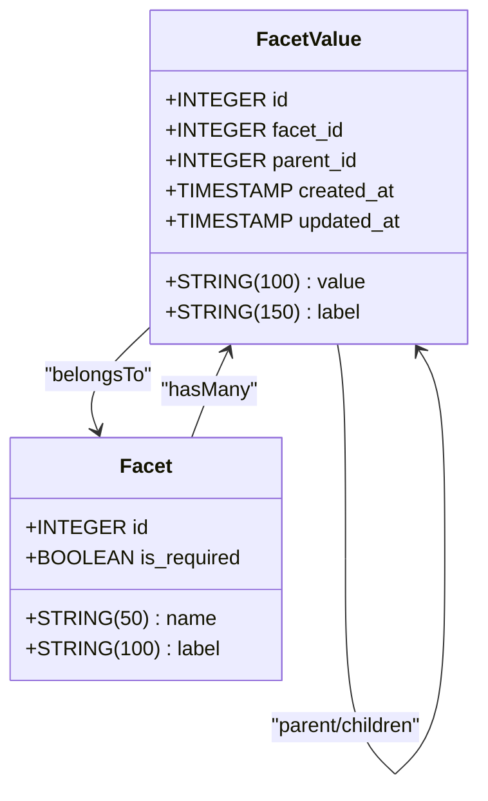
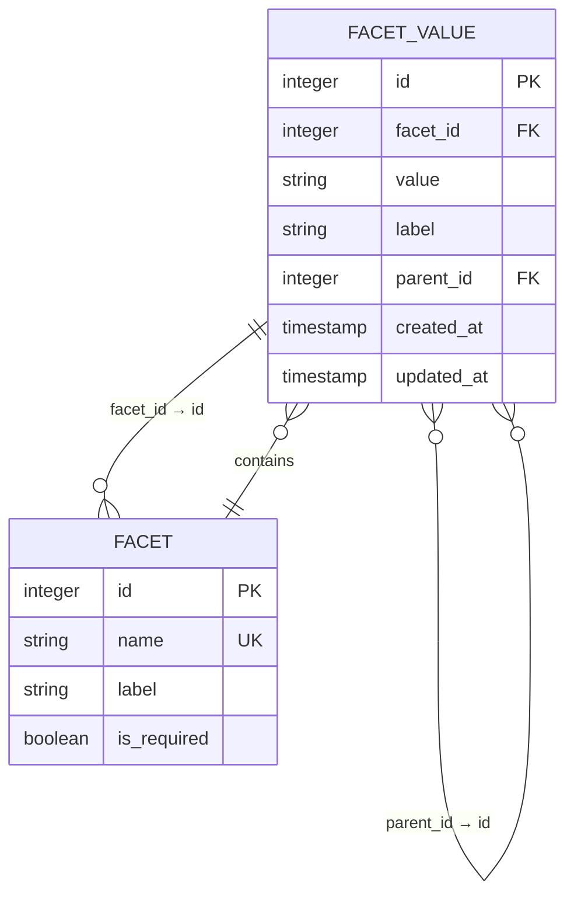
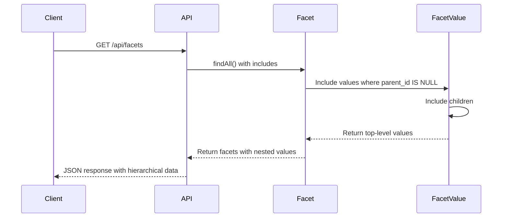

# FacetValue Model

<cite>
**Referenced Files in This Document**   
- [FacetValue.js](file://server/models/FacetValue.js)
- [Facet.js](file://server/models/Facet.js)
- [facets.js](file://server/routes/facets.js)
- [schema.sql](file://server/schema.sql)
- [seed-facets.js](file://server/seed-facets.js)
- [index.js](file://server/models/index.js)
- [filters-system.md](file://docs/filters-system.md)
- [FilterModal.js](file://src/components/FilterModal.js)
</cite>

## Table of Contents
1. [Introduction](#introduction)
2. [Model Definition](#model-definition)
3. [Field Specifications](#field-specifications)
4. [Constraints and Indexing](#constraints-and-indexing)
5. [Hierarchical Relationships](#hierarchical-relationships)
6. [API Endpoints](#api-endpoints)
7. [Usage in UI Generation](#usage-in-ui-generation)
8. [Data Integrity Considerations](#data-integrity-considerations)
9. [Performance Optimization](#performance-optimization)
10. [Examples](#examples)

## Introduction
The FacetValue model represents specific classification values within a Facet category, enabling a structured taxonomy system for content classification. This model supports hierarchical relationships up to one level deep, allowing for organized categorization such as 'web development' under 'programming & development'. The model plays a crucial role in dynamic filter UI generation and AI prompt construction based on selected values.

**Section sources**
- [FacetValue.js](file://server/models/FacetValue.js#L1-L58)
- [Facet.js](file://server/models/Facet.js#L1-L34)

## Model Definition
The FacetValue model is defined using Sequelize ORM with specific database schema requirements. It establishes relationships with the Facet model and supports self-referencing for hierarchical structures.

**Diagram sources**
- [FacetValue.js](file://server/models/FacetValue.js#L4-L58)
- [Facet.js](file://server/models/Facet.js#L4-L34)
- [index.js](file://server/models/index.js#L13-L18)

## Field Specifications
The FacetValue model contains five primary fields that define its structure and functionality:

- **id**: Primary key with auto-increment functionality
- **facet_id**: Foreign key referencing the Facet model
- **value**: System name for programmatic identification
- **label**: Human-readable display text
- **parent_id**: Self-referencing field for hierarchical organization

The model supports timestamps for creation and updates, with field names specified as 'created_at' and 'updated_at' to match database conventions.

**Section sources**
- [FacetValue.js](file://server/models/FacetValue.js#L5-L38)

## Constraints and Indexing
The model implements several constraints and indexes to ensure data integrity and optimize query performance:

- Unique compound index on facet_id + value to prevent duplicate values within a facet
- Index on facet_id for efficient filtering by facet
- Index on parent_id for optimized hierarchical queries
- Foreign key constraints with specific deletion rules

**Diagram sources**
- [FacetValue.js](file://server/models/FacetValue.js#L44-L55)
- [schema.sql](file://server/schema.sql#L36-L49)

## Hierarchical Relationships
The FacetValue model supports hierarchical relationships through self-referencing, allowing for a two-level taxonomy structure. This enables parent-child relationships where values can be organized under broader categories.

The relationship is implemented with:
- One-to-many relationship from parent to children
- Optional parent_id field (nullable)
- Cascade rules set to SET NULL on parent deletion
- Maximum depth limited to one level

This pattern allows for intuitive categorization such as:
- Programming & Development (parent)
  - Web Development (child)
  - Mobile Development (child)

**Section sources**
- [FacetValue.js](file://server/models/FacetValue.js#L29-L38)
- [index.js](file://server/models/index.js#L17-L18)
- [seed-facets.js](file://server/seed-facets.js#L15-L28)

## API Endpoints
The facets.js API provides endpoints for retrieving FacetValue data in different formats:

- **GET /api/facets**: Retrieves all facets with their hierarchical values
- **GET /api/facets/:facetName/values**: Retrieves all values for a specific facet

The primary endpoint includes nested values with their children, enabling efficient retrieval of hierarchical structures in a single request. The response is ordered by facet importance and alphabetical labels for consistent presentation.

**Diagram sources**
- [facets.js](file://server/routes/facets.js#L9-L27)
- [FacetValue.js](file://server/models/FacetValue.js#L4-L58)

## Usage in UI Generation
The FacetValue model is integral to dynamic filter UI generation in the application. The hierarchical structure enables organized presentation of filter options in the FilterModal component.

The UI implementation:
- Displays top-level values as primary categories
- Shows child values indented under their parents
- Uses the label field for display text
- Utilizes the value field for programmatic identification
- Supports multi-level selection for comprehensive filtering

The filter system combines these values with AI prompt construction, where selected facet values are translated into detailed instructions for content generation.

**Section sources**
- [FilterModal.js](file://src/components/FilterModal.js#L1-L111)
- [filters-system.md](file://docs/filters-system.md#L1-L176)

## Data Integrity Considerations
The model implements several mechanisms to maintain data integrity:

- **Foreign Key Constraints**: Ensures referential integrity with cascade rules
- **Circular Reference Prevention**: Application-level validation required
- **Consistency Maintenance**: Parent-child relationships must be validated
- **Deletion Rules**: CASCADE on facet deletion, SET NULL on parent deletion

The system prevents orphaned records through foreign key constraints while allowing parent values to be removed without deleting child values (setting parent_id to NULL instead).

**Section sources**
- [FacetValue.js](file://server/models/FacetValue.js#L13-L18)
- [FacetValue.js](file://server/models/FacetValue.js#L32-L36)
- [schema.sql](file://server/schema.sql#L45-L46)

## Performance Optimization
Several optimization strategies are employed for efficient tree traversal and bulk operations:

- Indexing on facet_id and parent_id for fast lookups
- Compound unique index on facet_id + value for constraint enforcement
- Bulk creation methods for efficient data loading
- Eager loading with Sequelize includes to minimize queries

For tree traversal, the two-level limitation simplifies queries and reduces complexity. The indexing strategy supports both facet-based filtering and hierarchical navigation with optimal performance.

**Section sources**
- [FacetValue.js](file://server/models/FacetValue.js#L44-L55)
- [seed-facets.js](file://server/seed-facets.js#L21-L28)
- [facets.js](file://server/routes/facets.js#L12-L18)

## Examples
The FacetValue model is used in various contexts throughout the application:

1. **Domain Classification**:
   - Parent: Programming & Development
   - Children: Web Development, Mobile Development

2. **Difficulty Levels**:
   - Beginner, Intermediate, Advanced, Expert (flat structure)

3. **Technology Stack**:
   - JavaScript, TypeScript, Python, React, Node.js

The seed-facets.js file provides comprehensive examples of hierarchical data structure implementation, demonstrating proper parent-child relationships and value organization.

**Section sources**
- [seed-facets.js](file://server/seed-facets.js#L1-L151)
- [schema.sql](file://server/schema.sql#L82-L90)
- [facets.js](file://server/routes/facets.js#L9-L27)