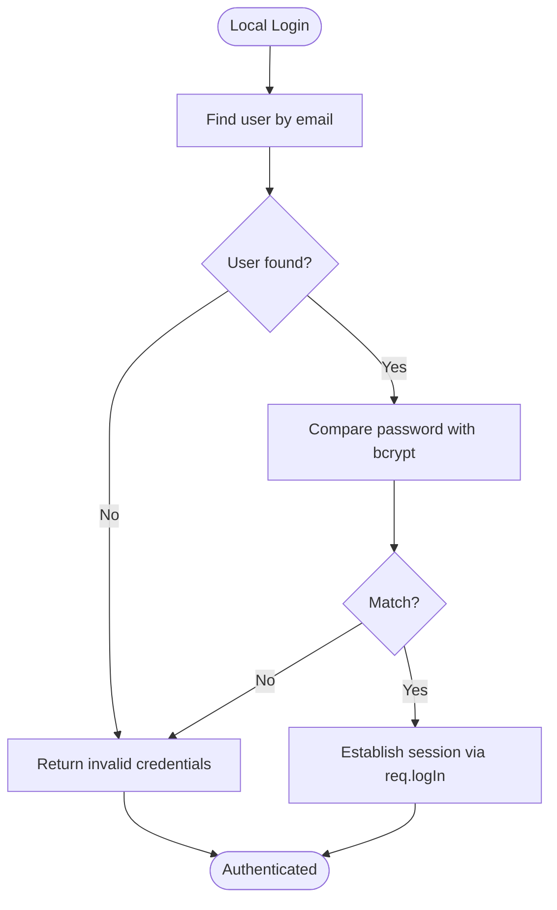

# User Model

<cite>
**Referenced Files in This Document**
- [User.js](file://server/models/User.js)
- [Article.js](file://server/models/Article.js)
- [index.js](file://server/models/index.js)
- [auth.js](file://server/routes/auth.js)
- [passport.js](file://server/config/passport.js)
- [database.js](file://server/config/database.js)
- [server.js](file://server/server.js)
- [AuthContext.js](file://src/context/AuthContext.js)
- [articles.js](file://server/routes/articles.js)
- [moderation.js](file://server/routes/moderation.js)
- [schema.sql](file://server/schema.sql)
</cite>

## Table of Contents
1. [Introduction](#introduction)
2. [Project Structure](#project-structure)
3. [Core Components](#core-components)
4. [Architecture Overview](#architecture-overview)
5. [Detailed Component Analysis](#detailed-component-analysis)
6. [Dependency Analysis](#dependency-analysis)
7. [Performance Considerations](#performance-considerations)
8. [Troubleshooting Guide](#troubleshooting-guide)
9. [Conclusion](#conclusion)

## Introduction
This document provides comprehensive data model documentation for the User model in the article-page-v11 application. It explains how the User entity manages user identities and authentication, details the schema constraints and relationships, and outlines security considerations and performance tips. It also connects the User model to Article ownership and demonstrates real authentication flows from the backend routes and frontend context.

## Project Structure
The User model is part of the server-side data layer built with Sequelize ORM. Authentication is handled via Passport.js with both local (email/password) and Google OAuth strategies. Sessions are managed by express-session, and the frontend integrates with the backend through a React context.

**Diagram sources**
- [server.js](file://server/server.js#L1-L59)
- [auth.js](file://server/routes/auth.js#L1-L100)
- [passport.js](file://server/config/passport.js#L1-L91)
- [User.js](file://server/models/User.js#L1-L39)
- [Article.js](file://server/models/Article.js#L1-L53)
- [index.js](file://server/models/index.js#L1-L49)
- [database.js](file://server/config/database.js#L1-L16)
- [AuthContext.js](file://src/context/AuthContext.js#L1-L110)

**Section sources**
- [server.js](file://server/server.js#L1-L59)
- [auth.js](file://server/routes/auth.js#L1-L100)
- [passport.js](file://server/config/passport.js#L1-L91)
- [User.js](file://server/models/User.js#L1-L39)
- [Article.js](file://server/models/Article.js#L1-L53)
- [index.js](file://server/models/index.js#L1-L49)
- [database.js](file://server/config/database.js#L1-L16)
- [AuthContext.js](file://src/context/AuthContext.js#L1-L110)

## Core Components
- User model fields and constraints:
  - id: INTEGER, primary key, auto-increment
  - email: STRING, unique, validated as email
  - password_hash: STRING, nullable (supports OAuth users)
  - googleId: STRING, unique, nullable
  - role: ENUM('user','moderator','admin'), default 'user'
  - Timestamps: createdAt mapped to created_at, updatedAt disabled
- Associations:
  - User has many Articles via user_id foreign key
  - Article belongs to User via user_id foreign key
- Authentication:
  - Local strategy (email/password) with bcrypt comparison
  - Google OAuth strategy with profile-driven user creation/update
  - Session-based authentication via express-session and Passport
- Frontend integration:
  - React context performs auth checks and handles login/logout flows

**Section sources**
- [User.js](file://server/models/User.js#L1-L39)
- [Article.js](file://server/models/Article.js#L1-L53)
- [index.js](file://server/models/index.js#L1-L49)
- [auth.js](file://server/routes/auth.js#L1-L100)
- [passport.js](file://server/config/passport.js#L1-L91)
- [AuthContext.js](file://src/context/AuthContext.js#L1-L110)

## Architecture Overview
The User model participates in two major flows:
- Identity and authentication: local registration/login and Google OAuth
- Ownership and moderation: authoring articles and moderation workflows

**Diagram sources**
- [auth.js](file://server/routes/auth.js#L1-L100)
- [passport.js](file://server/config/passport.js#L1-L91)
- [User.js](file://server/models/User.js#L1-L39)

## Detailed Component Analysis

### User Model Definition and Constraints
- Primary key: id (INTEGER, autoIncrement, primaryKey)
- Identity fields:
  - email: STRING, unique, validated as email
  - googleId: STRING, unique, nullable
- Security field:
  - password_hash: STRING, nullable (OAuth users do not set passwords)
- Access control:
  - role: ENUM('user','moderator','admin'), default 'user'
- Timestamps:
  - createdAt mapped to created_at
  - updatedAt disabled (no updated_at column in model)

These constraints ensure:
- Unique identity via email and googleId
- Role-based access control
- Consistent timestamp handling

**Section sources**
- [User.js](file://server/models/User.js#L1-L39)

### Authentication Flows
- Local registration:
  - Validates presence of email and password
  - Checks uniqueness of email
  - Hashes password with bcrypt
  - Creates user record
  - Automatically logs in the user
- Local login:
  - Uses passport-local strategy
  - Finds user by email
  - Compares password hash with bcrypt
  - Establishes session
- Google OAuth:
  - Uses passport-google-oauth20
  - Attempts to find existing user by googleId
  - If not found, attempts to find by email and attach googleId
  - Otherwise creates new user with email and googleId
  - Establishes session

**Diagram sources**
- [auth.js](file://server/routes/auth.js#L1-L100)
- [passport.js](file://server/config/passport.js#L1-L91)
- [User.js](file://server/models/User.js#L1-L39)

**Section sources**
- [auth.js](file://server/routes/auth.js#L1-L100)
- [passport.js](file://server/config/passport.js#L1-L91)

### Relationship with Article (Ownership)
- Association:
  - User has many Articles (drafts) via user_id
  - Article belongs to User (author) via user_id
- Implications:
  - Articles can be owned by authenticated users
  - Unauthenticated or guest contexts can create drafts with user_id null
  - Moderation endpoints rely on author association for display and control

**Diagram sources**
- [User.js](file://server/models/User.js#L1-L39)
- [Article.js](file://server/models/Article.js#L1-L53)
- [index.js](file://server/models/index.js#L1-L49)

**Section sources**
- [Article.js](file://server/models/Article.js#L1-L53)
- [index.js](file://server/models/index.js#L1-L49)

### Usage Examples from Authentication Flows
- Creating a user with local account:
  - Route: POST /api/auth/register
  - Behavior: validates input, checks email uniqueness, hashes password, persists user, logs in automatically
  - Reference: [auth.js](file://server/routes/auth.js#L1-L100)
- Logging in with local account:
  - Route: POST /api/auth/login
  - Behavior: passport-local strategy authenticates against stored password_hash
  - Reference: [auth.js](file://server/routes/auth.js#L1-L100), [passport.js](file://server/config/passport.js#L1-L91)
- Managing sessions:
  - Session configuration and Passport initialization
  - Reference: [server.js](file://server/server.js#L1-L59)
- Frontend integration:
  - Auth context performs login, logout, and checks current user
  - Reference: [AuthContext.js](file://src/context/AuthContext.js#L1-L110)

**Section sources**
- [auth.js](file://server/routes/auth.js#L1-L100)
- [passport.js](file://server/config/passport.js#L1-L91)
- [server.js](file://server/server.js#L1-L59)
- [AuthContext.js](file://src/context/AuthContext.js#L1-L110)

### Security Considerations
- Password hashing:
  - bcryptjs is used to hash passwords during registration
  - bcrypt compare is used during local login
  - References: [auth.js](file://server/routes/auth.js#L1-L100), [passport.js](file://server/config/passport.js#L1-L91)
- OAuth vs local accounts:
  - password_hash is nullable to support Google-authenticated users
  - Google strategy creates or updates users with googleId
  - References: [User.js](file://server/models/User.js#L1-L39), [passport.js](file://server/config/passport.js#L1-L91)
- Access control:
  - role field enables role-based access control
  - Moderation endpoints currently indicate moderator/admin requirement
  - References: [User.js](file://server/models/User.js#L1-L39), [moderation.js](file://server/routes/moderation.js#L1-L213)
- Session security:
  - express-session configured with cookie options
  - Passport session middleware enabled
  - References: [server.js](file://server/server.js#L1-L59)

**Section sources**
- [auth.js](file://server/routes/auth.js#L1-L100)
- [passport.js](file://server/config/passport.js#L1-L91)
- [User.js](file://server/models/User.js#L1-L39)
- [moderation.js](file://server/routes/moderation.js#L1-L213)
- [server.js](file://server/server.js#L1-L59)

### Database Schema Notes
- The users table includes a role column with ENUM values and a default value
- The schema also defines indexes for performance on articles table
- References: [schema.sql](file://server/schema.sql#L1-L134)

**Section sources**
- [schema.sql](file://server/schema.sql#L1-L134)

## Dependency Analysis
- Internal dependencies:
  - User model depends on database configuration
  - Auth routes depend on User model and Passport
  - Models index defines associations between User and Article
- External dependencies:
  - bcryptjs for password hashing
  - passport-local and passport-google-oauth20 for strategies
  - express-session for sessions
  - cors for cross-origin requests

**Diagram sources**
- [database.js](file://server/config/database.js#L1-L16)
- [User.js](file://server/models/User.js#L1-L39)
- [Article.js](file://server/models/Article.js#L1-L53)
- [index.js](file://server/models/index.js#L1-L49)
- [auth.js](file://server/routes/auth.js#L1-L100)
- [passport.js](file://server/config/passport.js#L1-L91)
- [server.js](file://server/server.js#L1-L59)
- [AuthContext.js](file://src/context/AuthContext.js#L1-L110)

**Section sources**
- [database.js](file://server/config/database.js#L1-L16)
- [User.js](file://server/models/User.js#L1-L39)
- [Article.js](file://server/models/Article.js#L1-L53)
- [index.js](file://server/models/index.js#L1-L49)
- [auth.js](file://server/routes/auth.js#L1-L100)
- [passport.js](file://server/config/passport.js#L1-L91)
- [server.js](file://server/server.js#L1-L59)
- [AuthContext.js](file://src/context/AuthContext.js#L1-L110)

## Performance Considerations
- Indexing:
  - email and googleId are unique in the model; ensure database-level unique indexes exist for fast lookups during login and OAuth flows
  - The schema already includes indexes for articles; similar attention to unique indexes on users.email and users.googleId is recommended
- Query patterns:
  - Local login and OAuth both query by email or googleId frequently
  - Ensure indexes exist on these columns to avoid table scans
- Timestamps:
  - createdAt is mapped to created_at; consider adding an index if frequent sorting by creation time is needed

**Section sources**
- [User.js](file://server/models/User.js#L1-L39)
- [schema.sql](file://server/schema.sql#L1-L134)

## Troubleshooting Guide
- Registration errors:
  - Duplicate email: route returns a 400 error indicating email already in use
  - Reference: [auth.js](file://server/routes/auth.js#L1-L100)
- Login errors:
  - Incorrect email or password: passport-local strategy returns an authentication error
  - Reference: [passport.js](file://server/config/passport.js#L1-L91)
- Session issues:
  - Ensure express-session and passport.session middleware are initialized
  - Verify cookie settings and CORS configuration
  - Reference: [server.js](file://server/server.js#L1-L59)
- Frontend auth state:
  - Auth context fetches current user via /api/auth/me and sets state accordingly
  - Reference: [AuthContext.js](file://src/context/AuthContext.js#L1-L110)

**Section sources**
- [auth.js](file://server/routes/auth.js#L1-L100)
- [passport.js](file://server/config/passport.js#L1-L91)
- [server.js](file://server/server.js#L1-L59)
- [AuthContext.js](file://src/context/AuthContext.js#L1-L110)

## Conclusion
The User model in article-page-v11 provides a robust foundation for identity and authentication, supporting both local and Google OAuth flows while enforcing unique identity constraints and role-based access control. Its association with Article establishes clear ownership semantics for content creation and moderation workflows. Proper indexing on email and googleId, combined with bcrypt-based password hashing and secure session management, ensures both usability and security. The documented flows and relationships enable developers to extend functionality confidently while maintaining data integrity and performance.