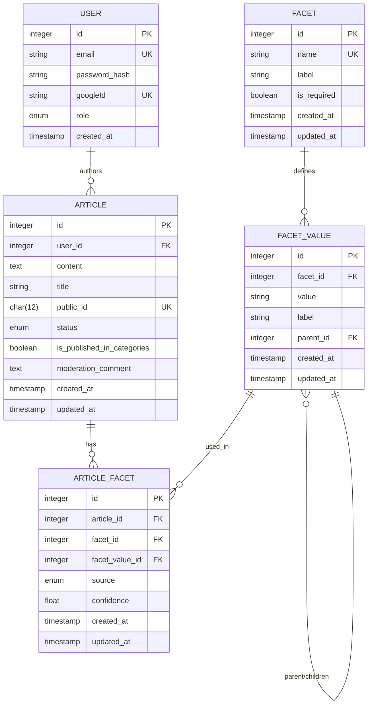
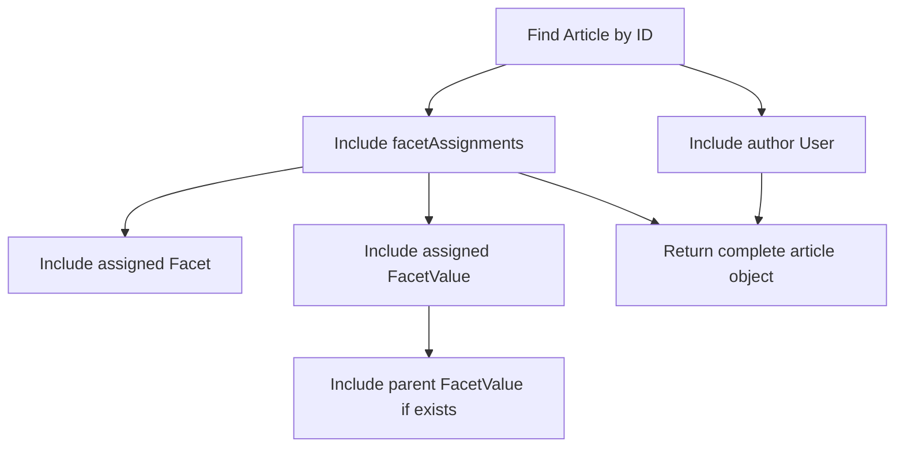
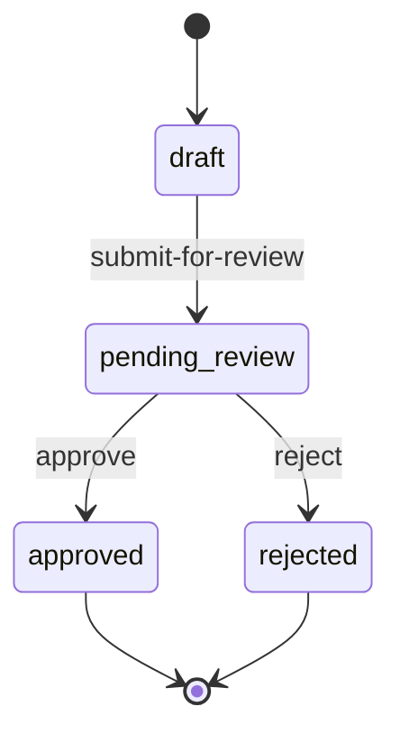
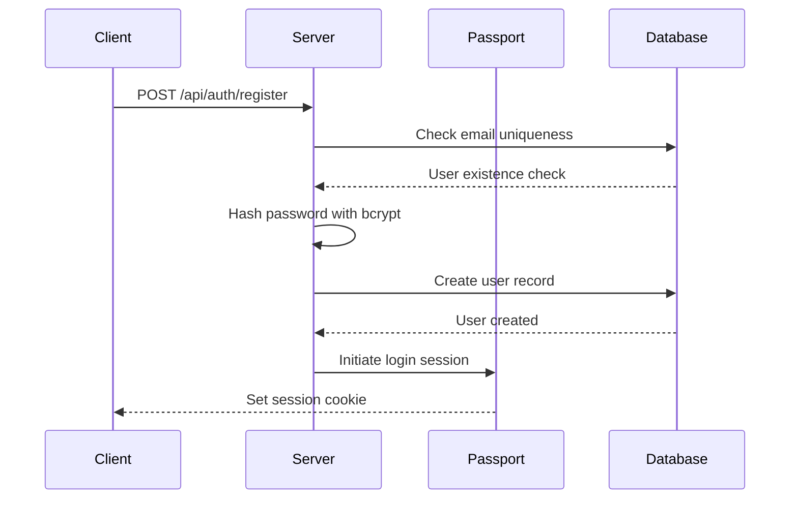

# Data Model

<cite>
**Referenced Files in This Document**   
- [User.js](file://server/models/User.js)
- [Article.js](file://server/models/Article.js)
- [Facet.js](file://server/models/Facet.js)
- [FacetValue.js](file://server/models/FacetValue.js)
- [ArticleFacet.js](file://server/models/ArticleFacet.js)
- [schema.sql](file://server/schema.sql)
- [index.js](file://server/models/index.js)
- [passport.js](file://server/config/passport.js)
- [auth.js](file://server/routes/auth.js)
- [articles.js](file://server/routes/articles.js)
- [moderation.js](file://server/routes/moderation.js)
</cite>

## Table of Contents
1. [Introduction](#introduction)
2. [Entity Relationship Model](#entity-relationship-model)
3. [Core Entities](#core-entities)
4. [Data Access Patterns](#data-access-patterns)
5. [Data Lifecycle Management](#data-lifecycle-management)
6. [Security and Access Control](#security-and-access-control)
7. [Sample Data and API Output](#sample-data-and-api-output)
8. [Conclusion](#conclusion)

## Introduction
This document provides comprehensive documentation for the database schema of article-page-v11, focusing on the data model that supports a faceted classification system for articles. The schema enables rich categorization through a flexible tagging system where articles can be associated with multiple facets (such as domain, difficulty, or technology) and their corresponding values. The system supports both user-generated content and moderator-controlled publication workflows, with robust security measures for user authentication and role-based access control.

**Section sources**
- [schema.sql](file://server/schema.sql#L1-L134)

## Entity Relationship Model



**Diagram sources**
- [schema.sql](file://server/schema.sql#L24-L72)
- [index.js](file://server/models/index.js#L8-L40)

## Core Entities

### User Entity
The User entity represents system participants with authentication capabilities. Users can authenticate via email/password or Google OAuth. The entity supports role-based access control with three permission levels: user, moderator, and admin.

**Section sources**
- [User.js](file://server/models/User.js#L4-L37)
- [passport.js](file://server/config/passport.js#L22-L91)
- [auth.js](file://server/routes/auth.js#L9-L40)

### Article Entity
The Article entity stores content created by users. Articles support guest drafting (nullable user_id) and have a defined lifecycle through status transitions. Each article contains rich content stored as JSON and can be published to categories when approved.

**Section sources**
- [Article.js](file://server/models/Article.js#L4-L50)

### Facet and FacetValue Entities
The Facet entity defines classification dimensions (e.g., domain, difficulty), while FacetValue represents specific values within those dimensions. FacetValues support hierarchical relationships (one level deep) through parent-child references, enabling category trees like "Programming & Development" → "Web Development".

**Section sources**
- [Facet.js](file://server/models/Facet.js#L4-L32)
- [FacetValue.js](file://server/models/FacetValue.js#L4-L56)

### ArticleFacet Junction Table
The ArticleFacet entity serves as a many-to-many junction table between Articles and FacetValues, with additional metadata about the assignment source (manual or auto_suggested) and confidence scoring for algorithmically suggested tags. The unique constraint on (article_id, facet_value_id) prevents duplicate facet assignments.

**Section sources**
- [ArticleFacet.js](file://server/models/ArticleFacet.js#L4-L73)

## Data Access Patterns

### Fetching Articles with Associated Facets
Articles can be retrieved with their associated facets using Sequelize's eager loading with the `include` option. The following pattern demonstrates fetching an article with all its facet assignments and related metadata:



**Section sources**
- [articles.js](file://server/routes/articles.js#L130-L187)
- [moderation.js](file://server/routes/moderation.js#L35-L71)

### Retrieving Facet Hierarchies
The system provides endpoints to retrieve facets with their hierarchical value structures, enabling UI components to display category trees. This is achieved through nested includes in Sequelize queries.

**Section sources**
- [facets.js](file://server/routes/facets.js#L9-L33)

## Data Lifecycle Management

### Article Status Transitions
Articles progress through a defined state machine:
- **draft** → **pending_review**: When user submits for moderation
- **pending_review** → **approved**: When moderator approves
- **pending_review** → **rejected**: When moderator rejects

Approved articles are published to categories (is_published_in_categories = true), while rejected articles remain as drafts.



**Section sources**
- [Article.js](file://server/models/Article.js#L31-L34)
- [articles.js](file://server/routes/articles.js#L198-L224)
- [moderation.js](file://server/routes/moderation.js#L136-L179)

## Security and Access Control

### Password Security
User passwords are securely hashed using bcrypt.js with a salt factor of 10. The system follows industry best practices by never storing plaintext passwords and using strong adaptive hashing.

**Section sources**
- [passport.js](file://server/config/passport.js#L39)
- [auth.js](file://server/routes/auth.js#L24-L25)

### Authentication and Authorization
The system implements Passport.js for authentication with both local (email/password) and Google OAuth strategies. Session-based authentication is used with role-based access control enforced through middleware.



**Section sources**
- [passport.js](file://server/config/passport.js#L22-L89)
- [requireAuth.js](file://server/middleware/requireAuth.js#L3-L13)
- [auth.js](file://server/routes/auth.js#L9-L40)

## Sample Data and API Output

### Example Article with Facet Assignments
The following example illustrates a typical article with multiple facet assignments:

```json
{
  "article": {
    "id": 100,
    "title": "How to build REST API",
    "content": "[{ \"type\": \"text\", \"data\": \"Express.js tutorial...\" }]",
    "status": "approved",
    "is_published_in_categories": true,
    "created_at": "2024-01-15T10:30:00Z",
    "author": {
      "id": 5,
      "email": "user@example.com"
    },
    "facetAssignments": [
      {
        "facet": { "name": "domain", "label": "Subject Area" },
        "value": { 
          "value": "web_development", 
          "label": "Web Development",
          "parent": { "value": "programming_development" }
        },
        "source": "manual",
        "confidence": 1.0
      },
      {
        "facet": { "name": "difficulty", "label": "Difficulty Level" },
        "value": { "value": "intermediate", "label": "Intermediate" },
        "source": "manual",
        "confidence": 1.0
      }
    ]
  }
}
```

**Section sources**
- [schema.sql](file://server/schema.sql#L81-L98)
- [articles.js](file://server/routes/articles.js#L130-L187)

## Conclusion
The article-page-v11 data model provides a robust foundation for a faceted content classification system with support for hierarchical categorization, moderated publishing workflows, and secure user authentication. The schema design enables flexible content organization while maintaining data integrity through proper constraints and relationships. The implementation leverages Sequelize ORM effectively to manage complex associations and provides clear data access patterns for both user-facing and moderation interfaces.