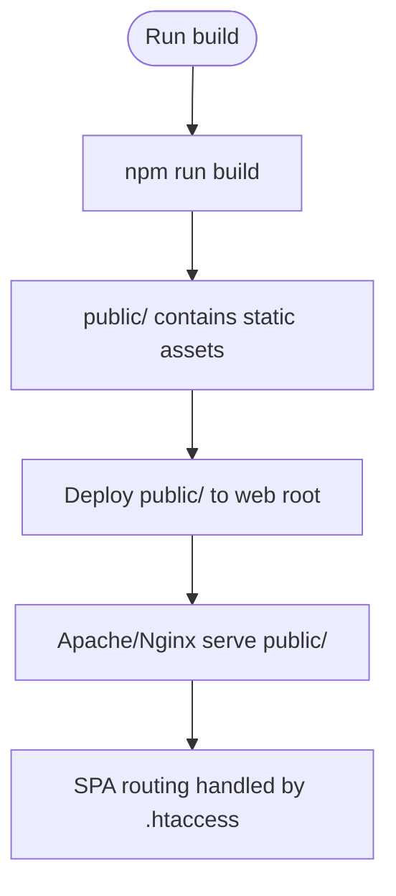

# Deployment Guide

<cite>
**Referenced Files in This Document**
- [package.json](file://package.json)
- [README.md](file://README.md)
- [public/.htaccess](file://public/.htaccess)
- [server/server.js](file://server/server.js)
- [server/config/database.js](file://server/config/database.js)
- [server/models/index.js](file://server/models/index.js)
- [server/config/passport.js](file://server/config/passport.js)
- [server/middleware/requireAuth.js](file://server/middleware/requireAuth.js)
- [server/routes/auth.js](file://server/routes/auth.js)
- [server/routes/articles.js](file://server/routes/articles.js)
- [server/create-db.js](file://server/create-db.js)
- [server/sync-db.js](file://server/sync-db.js)
- [server/schema.sql](file://server/schema.sql)
- [server/seed-facets.js](file://server/seed-facets.js)
- [src/setupProxy.js](file://src/setupProxy.js)
- [.env](file://.env)
</cite>

## Table of Contents
1. [Introduction](#introduction)
2. [Project Structure](#project-structure)
3. [Core Components](#core-components)
4. [Architecture Overview](#architecture-overview)
5. [Detailed Component Analysis](#detailed-component-analysis)
6. [Dependency Analysis](#dependency-analysis)
7. [Performance Considerations](#performance-considerations)
8. [Troubleshooting Guide](#troubleshooting-guide)
9. [Conclusion](#conclusion)
10. [Appendices](#appendices)

## Introduction
This deployment guide focuses on production setup for article-page-v11. It explains the two-environment architecture:
- Development: React app runs locally with a proxy to external APIs.
- Production: Static React build served by a Node.js server that also serves the API and connects to a MySQL database.

It covers building static assets, configuring the production server, database provisioning and migrations, environment configuration, web server routing, security hardening, performance optimization, monitoring/logging, and common deployment issues.

## Project Structure
The repository separates the frontend (React) and backend (Node.js + Express + Sequelize) into distinct areas:
- Frontend build artifacts are placed under the public directory for static hosting.
- The backend server exposes REST endpoints and manages sessions and authentication.
- Database initialization and synchronization scripts are provided for provisioning and schema updates.

**Diagram sources**
- [server/server.js](file://server/server.js#L1-L59)
- [server/config/database.js](file://server/config/database.js#L1-L16)
- [server/models/index.js](file://server/models/index.js#L1-L49)
- [server/config/passport.js](file://server/config/passport.js#L1-L91)
- [server/middleware/requireAuth.js](file://server/middleware/requireAuth.js#L1-L14)
- [server/routes/auth.js](file://server/routes/auth.js#L1-L100)
- [server/routes/articles.js](file://server/routes/articles.js#L1-L228)
- [server/create-db.js](file://server/create-db.js#L1-L24)
- [server/sync-db.js](file://server/sync-db.js#L1-L22)
- [server/schema.sql](file://server/schema.sql#L1-L134)
- [public/.htaccess](file://public/.htaccess#L1-L25)

**Section sources**
- [package.json](file://package.json#L1-L53)
- [README.md](file://README.md#L1-L45)

## Core Components
- Static build and routing:
  - The React app builds static assets into the public directory. A .htaccess file handles SPA routing so deep links resolve to index.html.
- Production server:
  - A Node.js server initializes Express, configures CORS, sessions, and Passport authentication, mounts API routes, and starts listening on a configurable port.
- Database connectivity:
  - Sequelize connects to MySQL using credentials from environment variables.
- Authentication:
  - Passport local and Google OAuth strategies are configured and used by protected routes.
- Database provisioning and migrations:
  - Scripts create the database, synchronize models, and seed initial facet taxonomy data.

**Section sources**
- [package.json](file://package.json#L1-L53)
- [public/.htaccess](file://public/.htaccess#L1-L25)
- [server/server.js](file://server/server.js#L1-L59)
- [server/config/database.js](file://server/config/database.js#L1-L16)
- [server/config/passport.js](file://server/config/passport.js#L1-L91)
- [server/middleware/requireAuth.js](file://server/middleware/requireAuth.js#L1-L14)
- [server/routes/auth.js](file://server/routes/auth.js#L1-L100)
- [server/routes/articles.js](file://server/routes/articles.js#L1-L228)
- [server/create-db.js](file://server/create-db.js#L1-L24)
- [server/sync-db.js](file://server/sync-db.js#L1-L22)
- [server/schema.sql](file://server/schema.sql#L1-L134)
- [server/seed-facets.js](file://server/seed-facets.js#L1-L151)

## Architecture Overview
The production architecture consists of:
- A web server (Apache or Nginx) serving static files from the public directory.
- A reverse proxy or direct Node.js server handling API requests and serving the React app’s index.html for SPA routing.
- A MySQL database managed by Sequelize, with pre-provisioning and schema synchronization scripts.

**Diagram sources**
- [public/.htaccess](file://public/.htaccess#L1-L25)
- [server/server.js](file://server/server.js#L1-L59)
- [server/config/database.js](file://server/config/database.js#L1-L16)

## Detailed Component Analysis

### Build Process and Static Hosting
- Build command:
  - Use the standard build script to generate static assets in the public directory.
- Static hosting:
  - Serve the public directory with Apache or Nginx. The .htaccess file rewrites unmatched requests to index.html to support client-side routing.

**Diagram sources**
- [package.json](file://package.json#L1-L53)
- [public/.htaccess](file://public/.htaccess#L1-L25)

**Section sources**
- [package.json](file://package.json#L1-L53)
- [public/.htaccess](file://public/.htaccess#L1-L25)

### Production Server Configuration (server.js)
- Initialization:
  - Loads environment variables, sets up Express, CORS, JSON body parser, sessions, and Passport.
- Routes:
  - Mounts authentication, articles, facets, and moderation endpoints.
- Health check:
  - Exposes a simple health endpoint.
- Startup:
  - Authenticates database connection and starts the server on a configurable port.

**Diagram sources**
- [server/server.js](file://server/server.js#L1-L59)

**Section sources**
- [server/server.js](file://server/server.js#L1-L59)

### Database Connectivity and Environment Configuration
- Connection:
  - Sequelize reads database credentials from environment variables and connects to MySQL.
- Environment variables:
  - Define database host, user, password, name, JWT and session secrets, and Google OAuth client credentials.

**Diagram sources**
- [.env](file://.env#L1-L10)
- [server/config/database.js](file://server/config/database.js#L1-L16)

**Section sources**
- [.env](file://.env#L1-L10)
- [server/config/database.js](file://server/config/database.js#L1-L16)

### Authentication and Authorization
- Strategies:
  - Local strategy (email/password) and Google OAuth strategy are configured.
- Protected routes:
  - Middleware checks session-based authentication for protected endpoints.
- Sessions:
  - Express session configured with a secret and cookie settings.

**Diagram sources**
- [server/config/passport.js](file://server/config/passport.js#L1-L91)
- [server/middleware/requireAuth.js](file://server/middleware/requireAuth.js#L1-L14)
- [server/routes/auth.js](file://server/routes/auth.js#L1-L100)
- [server/models/index.js](file://server/models/index.js#L1-L49)

**Section sources**
- [server/config/passport.js](file://server/config/passport.js#L1-L91)
- [server/middleware/requireAuth.js](file://server/middleware/requireAuth.js#L1-L14)
- [server/routes/auth.js](file://server/routes/auth.js#L1-L100)
- [server/models/index.js](file://server/models/index.js#L1-L49)

### Database Provisioning and Migration Strategy
- Create database:
  - A script connects to MySQL and creates the target database if it does not exist.
- Synchronize schema:
  - A script authenticates to the database and synchronizes models with the alter flag to update existing tables.
- Initial data:
  - A seed script inserts the facet taxonomy used by the application.

**Diagram sources**
- [server/create-db.js](file://server/create-db.js#L1-L24)
- [server/sync-db.js](file://server/sync-db.js#L1-L22)
- [server/seed-facets.js](file://server/seed-facets.js#L1-L151)

**Section sources**
- [server/create-db.js](file://server/create-db.js#L1-L24)
- [server/sync-db.js](file://server/sync-db.js#L1-L22)
- [server/seed-facets.js](file://server/seed-facets.js#L1-L151)
- [server/schema.sql](file://server/schema.sql#L1-L134)

### Development vs Production Routing
- Development:
  - A proxy forwards API calls to external services while the React app runs on a separate dev server.
- Production:
  - The Node.js server serves both static assets and API routes. The .htaccess file ensures SPA routing works by rewriting unmatched paths to index.html.

**Diagram sources**
- [src/setupProxy.js](file://src/setupProxy.js#L1-L29)
- [public/.htaccess](file://public/.htaccess#L1-L25)

**Section sources**
- [src/setupProxy.js](file://src/setupProxy.js#L1-L29)
- [public/.htaccess](file://public/.htaccess#L1-L25)

## Dependency Analysis
- Frontend build depends on the React scripts build pipeline.
- Backend depends on Express, Sequelize, Passport, and environment variables.
- Database depends on MySQL availability and credentials.

**Diagram sources**
- [package.json](file://package.json#L1-L53)
- [server/server.js](file://server/server.js#L1-L59)
- [server/config/database.js](file://server/config/database.js#L1-L16)

**Section sources**
- [package.json](file://package.json#L1-L53)
- [server/server.js](file://server/server.js#L1-L59)
- [server/config/database.js](file://server/config/database.js#L1-L16)

## Performance Considerations
- Asset minification and bundling:
  - Use the standard React build pipeline to produce optimized static assets.
- Compression:
  - Enable gzip/brotli compression at the web server level.
- Database indexing:
  - The schema defines indexes on frequently queried columns; ensure they persist after synchronization.
- Caching:
  - Consider caching static assets and API responses where appropriate.
- CDN:
  - Serve static assets via a CDN to reduce latency.

[No sources needed since this section provides general guidance]

## Troubleshooting Guide
- File permission errors:
  - Ensure the web server user has read access to the public directory and write access to logs if configured.
- Database connection failures:
  - Verify database credentials and network connectivity. Confirm the database exists and is reachable.
- Asset loading problems:
  - Confirm the public directory is served by the web server and that .htaccess rewrite rules are enabled.
- Authentication issues:
  - Check session cookie settings and ensure cookies are accepted by the browser.
- CORS errors:
  - Adjust the allowed origin and credentials in the server configuration for production domains.

**Section sources**
- [server/server.js](file://server/server.js#L1-L59)
- [server/config/database.js](file://server/config/database.js#L1-L16)
- [public/.htaccess](file://public/.htaccess#L1-L25)

## Conclusion
This guide outlines a clear path to deploy article-page-v11 in production: build static assets, configure the web server to serve them and handle SPA routing, run the Node.js server with proper environment variables, provision and migrate the database, and harden security and performance. Following these steps will deliver a reliable, scalable deployment.

[No sources needed since this section summarizes without analyzing specific files]

## Appendices

### A. Environment Variables Reference
- Database:
  - DB_HOST, DB_USER, DB_PASS, DB_NAME
- Application:
  - PORT, JWT_SECRET, SESSION_SECRET
- OAuth:
  - GOOGLE_CLIENT_ID, GOOGLE_CLIENT_SECRET
- Frontend API key:
  - REACT_APP_GEMINI_API_KEY

**Section sources**
- [.env](file://.env#L1-L10)

### B. Web Server Setup Notes
- Apache:
  - Ensure mod_rewrite is enabled and AllowOverride allows .htaccess directives.
  - Point DocumentRoot to the public directory.
- Nginx:
  - Configure static file serving for the public directory.
  - Add a location block to proxy unmatched routes to the Node.js server if desired, or rely on SPA routing via static index.html.

[No sources needed since this section provides general guidance]

### C. Security Hardening Checklist
- Protect API keys:
  - Move client-side API keys to a backend proxy or environment variables only accessible server-side.
- Enforce HTTPS:
  - Use TLS termination at the web server or load balancer.
- Input validation:
  - Sanitize and validate all inputs; apply rate limiting and sanitization libraries.
- Secrets rotation:
  - Rotate JWT and session secrets regularly.
- Least privilege:
  - Use minimal-privilege database accounts for application access.

[No sources needed since this section provides general guidance]