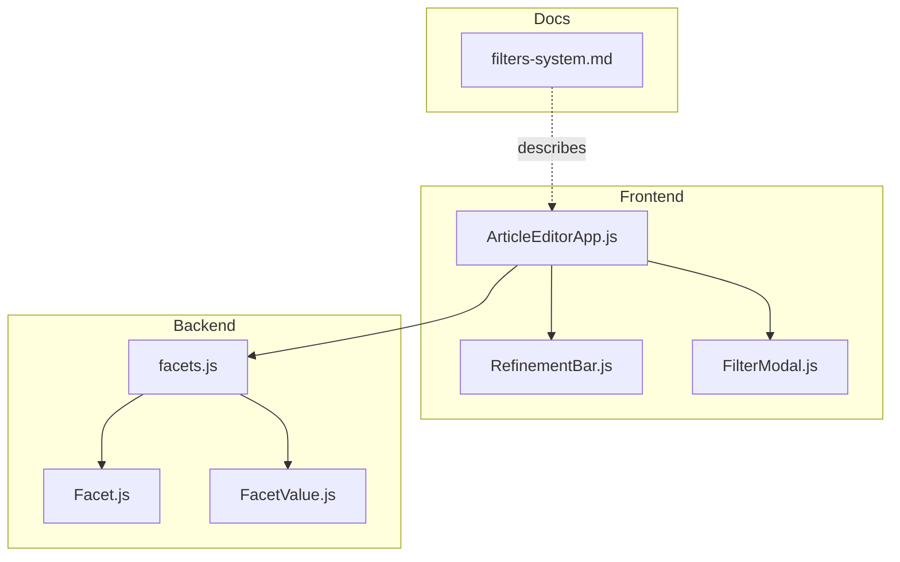
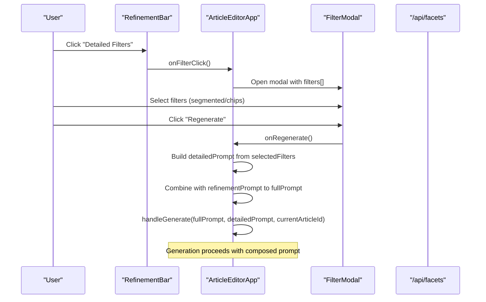
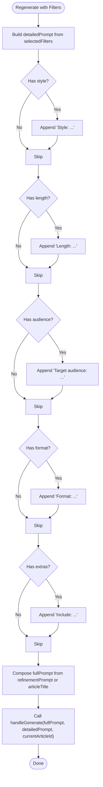
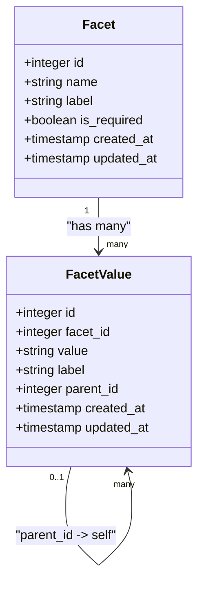
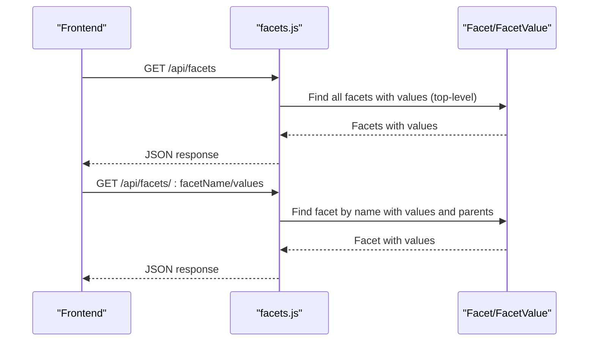
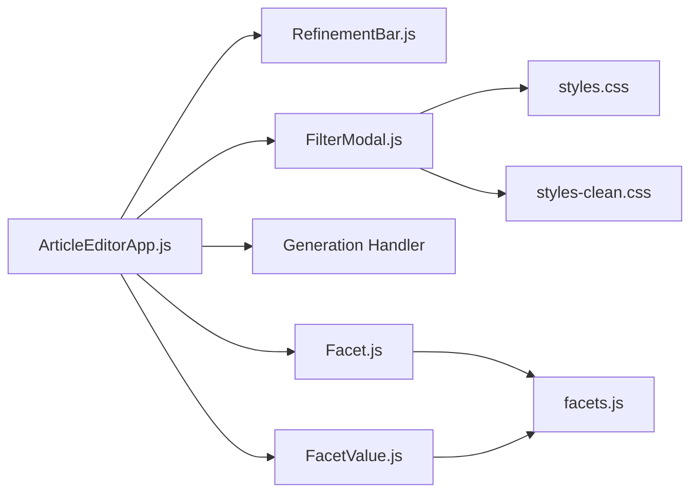

# Filters System

<cite>
**Referenced Files in This Document**
- [filters-system.md](file://docs/filters-system.md)
- [RefinementBar.js](file://src/components/RefinementBar.js)
- [FilterModal.js](file://src/components/FilterModal.js)
- [ArticleEditorApp.js](file://src/components/ArticleEditorApp.js)
- [Facet.js](file://server/models/Facet.js)
- [FacetValue.js](file://server/models/FacetValue.js)
- [facets.js](file://server/routes/facets.js)
- [FACETS_API.md](file://server/FACETS_API.md)
- [seed-facets.js](file://server/seed-facets.js)
- [styles.css](file://src/styles.css)
- [styles-clean.css](file://src/styles-clean.css)
</cite>

## Table of Contents
1. [Introduction](#introduction)
2. [Project Structure](#project-structure)
3. [Core Components](#core-components)
4. [Architecture Overview](#architecture-overview)
5. [Detailed Component Analysis](#detailed-component-analysis)
6. [Dependency Analysis](#dependency-analysis)
7. [Performance Considerations](#performance-considerations)
8. [Troubleshooting Guide](#troubleshooting-guide)
9. [Conclusion](#conclusion)
10. [Appendices](#appendices)

## Introduction
This document explains the filters system used to refine AI-generated articles in article-page-v11. It covers the frontend components that present quick filters and comprehensive filter options, the backend models and endpoints that define and expose filter categories and options, and how filter selections are translated into AI prompts during generation. It also provides guidance for extending the system with new filter types, troubleshooting common issues, and optimizing performance.

## Project Structure
The filters system spans frontend components and backend models/endpoints:
- Frontend: RefinementBar and FilterModal manage user selection and prompt composition.
- Backend: Facet and FacetValue define categories and options; /api/facets exposes them.
- Documentation: filters-system.md describes the intended behavior and prompt construction.

**Diagram sources**
- [RefinementBar.js](file://src/components/RefinementBar.js#L1-L62)
- [FilterModal.js](file://src/components/FilterModal.js#L1-L111)
- [ArticleEditorApp.js](file://src/components/ArticleEditorApp.js#L200-L399)
- [Facet.js](file://server/models/Facet.js#L1-L35)
- [FacetValue.js](file://server/models/FacetValue.js#L1-L59)
- [facets.js](file://server/routes/facets.js#L1-L68)
- [filters-system.md](file://docs/filters-system.md#L1-L176)

**Section sources**
- [filters-system.md](file://docs/filters-system.md#L1-L176)
- [RefinementBar.js](file://src/components/RefinementBar.js#L1-L62)
- [FilterModal.js](file://src/components/FilterModal.js#L1-L111)
- [ArticleEditorApp.js](file://src/components/ArticleEditorApp.js#L200-L399)
- [Facet.js](file://server/models/Facet.js#L1-L35)
- [FacetValue.js](file://server/models/FacetValue.js#L1-L59)
- [facets.js](file://server/routes/facets.js#L1-L68)

## Core Components
- Quick filters bar (RefinementBar): Presents a compact filter toggle, a prompt refinement field, and a send button. It signals whether filters are active and triggers regeneration when combined with a refinement prompt.
- Comprehensive filters modal (FilterModal): Renders filter sections (segmented controls for single-choice and chip groups for multi-select), loading skeletons, and footer actions to clean or regenerate.

These components synchronize state via props and callbacks passed from the main app component.

**Section sources**
- [RefinementBar.js](file://src/components/RefinementBar.js#L1-L62)
- [FilterModal.js](file://src/components/FilterModal.js#L1-L111)
- [ArticleEditorApp.js](file://src/components/ArticleEditorApp.js#L580-L649)

## Architecture Overview
The filters system integrates with the article generation workflow as follows:
- The app maintains a selectedFilters object and a refinementPrompt string.
- When the user clicks Regenerate, the app composes a detailedPrompt from selectedFilters and combines it with the refinementPrompt to form the fullPrompt.
- The fullPrompt is passed to the generation handler along with the current article identifier.

**Diagram sources**
- [RefinementBar.js](file://src/components/RefinementBar.js#L1-L62)
- [FilterModal.js](file://src/components/FilterModal.js#L1-L111)
- [ArticleEditorApp.js](file://src/components/ArticleEditorApp.js#L200-L399)
- [facets.js](file://server/routes/facets.js#L1-L68)

## Detailed Component Analysis

### Frontend: RefinementBar
- Purpose: Provide quick access to filters and a refinement prompt input; enable regeneration when either a refinement prompt or active filters exist.
- Behavior:
  - Toggles the filter modal on click.
  - Disables the send button when generating or when both refinement prompt and filters are empty.
  - Triggers regeneration when the send action is invoked.

**Section sources**
- [RefinementBar.js](file://src/components/RefinementBar.js#L1-L62)
- [ArticleEditorApp.js](file://src/components/ArticleEditorApp.js#L580-L649)

### Frontend: FilterModal
- Purpose: Present filter sections grouped by type (segmented/single choice vs chips/multi-select), allow toggling, and trigger regeneration.
- Rendering:
  - Segmented controls render buttons; active selection is indicated by an active class.
  - Chip groups render toggleable chips; active chips are highlighted.
  - Skeleton loaders are shown while filters are loading.
- Actions:
  - Clean resets all selected filters.
  - Regenerate builds a detailed prompt from selected filters and invokes the generation handler.

**Section sources**
- [FilterModal.js](file://src/components/FilterModal.js#L1-L111)
- [styles.css](file://src/styles.css#L171-L308)
- [styles-clean.css](file://src/styles-clean.css#L1200-L1339)

### Frontend: ArticleEditorApp (State and Prompt Composition)
- Selected filters and refinement prompt:
  - selectedFilters stores filter selections keyed by filter id.
  - refinementPrompt holds the user’s textual refinement input.
- Filter definitions:
  - generateFilters defines filter sections with ids, labels, types, and options for style, length, audience, format, and extras.
- Filter change handling:
  - Single-choice filters update the value directly.
  - Multi-select chips toggle inclusion/exclusion of values.
- Cleaning filters:
  - Resets selectedFilters to an empty object.
- Regenerating with filters:
  - Builds detailedPrompt by concatenating selected values for each filter group.
  - Constructs fullPrompt from refinementPrompt or falls back to article title.
  - Invokes handleGenerate with the composed prompts and current article id.

**Diagram sources**
- [ArticleEditorApp.js](file://src/components/ArticleEditorApp.js#L200-L399)

**Section sources**
- [ArticleEditorApp.js](file://src/components/ArticleEditorApp.js#L200-L399)

### Backend: Facet and FacetValue Models
- Facet: Defines filter categories (e.g., domain, difficulty, instruction_type, target_audience, technology) with system name, human-readable label, and requirement flag.
- FacetValue: Defines options for each facet, including hierarchical parent-child relationships and unique constraints on facet/value pairs.

**Diagram sources**
- [Facet.js](file://server/models/Facet.js#L1-L35)
- [FacetValue.js](file://server/models/FacetValue.js#L1-L59)

**Section sources**
- [Facet.js](file://server/models/Facet.js#L1-L35)
- [FacetValue.js](file://server/models/FacetValue.js#L1-L59)

### Backend: /api/facets Endpoints
- GET /api/facets: Returns all facets with their values, ordered by requirement and label, including hierarchical children for top-level values.
- GET /api/facets/:facetName/values: Returns a specific facet with all its values and parent references.

**Diagram sources**
- [facets.js](file://server/routes/facets.js#L1-L68)
- [Facet.js](file://server/models/Facet.js#L1-L35)
- [FacetValue.js](file://server/models/FacetValue.js#L1-L59)

**Section sources**
- [facets.js](file://server/routes/facets.js#L1-L68)
- [FACETS_API.md](file://server/FACETS_API.md#L52-L120)

### Filter Types and Prompt Translation
- Style (single choice): Translated to a style instruction appended to detailedPrompt.
- Length (single choice): Translated to a length instruction appended to detailedPrompt.
- Target Audience (multi-select): Translated to a comma-separated audience list appended to detailedPrompt.
- Format (multi-select): Translated to a comma-separated format list appended to detailedPrompt.
- Additional Sections (multi-select): Translated to an include list appended to detailedPrompt.

The documentation specifies how the final prompt is constructed and how it is passed to the generation handler.

**Section sources**
- [filters-system.md](file://docs/filters-system.md#L22-L110)
- [ArticleEditorApp.js](file://src/components/ArticleEditorApp.js#L200-L399)

### Adding New Filter Types
To add a new filter type:
- Extend the filter definition list in the app to include the new filter id, label, type, and options.
- Update the prompt composition logic to append the new filter’s selected values to detailedPrompt.

The documentation outlines the steps for extending filters and updating prompt generation.

**Section sources**
- [filters-system.md](file://docs/filters-system.md#L145-L168)
- [ArticleEditorApp.js](file://src/components/ArticleEditorApp.js#L200-L399)

## Dependency Analysis
- Frontend-to-backend:
  - The app does not currently fetch filters from /api/facets in the provided code. Instead, it generates filter definitions locally and passes them to FilterModal.
  - The backend models and routes are ready to serve hierarchical facets and values for dynamic filter loading.
- Cohesion and coupling:
  - Filter rendering and state updates are cohesive within FilterModal and ArticleEditorApp.
  - The prompt composition logic is centralized in ArticleEditorApp, minimizing duplication.
- Potential circular dependencies:
  - None observed among the analyzed files.

**Diagram sources**
- [ArticleEditorApp.js](file://src/components/ArticleEditorApp.js#L200-L399)
- [RefinementBar.js](file://src/components/RefinementBar.js#L1-L62)
- [FilterModal.js](file://src/components/FilterModal.js#L1-L111)
- [Facet.js](file://server/models/Facet.js#L1-L35)
- [FacetValue.js](file://server/models/FacetValue.js#L1-L59)
- [facets.js](file://server/routes/facets.js#L1-L68)
- [styles.css](file://src/styles.css#L171-L308)
- [styles-clean.css](file://src/styles-clean.css#L1200-L1339)

**Section sources**
- [ArticleEditorApp.js](file://src/components/ArticleEditorApp.js#L200-L399)
- [facets.js](file://server/routes/facets.js#L1-L68)

## Performance Considerations
- State updates:
  - Filter changes use immutable updates to selectedFilters; ensure minimal re-renders by avoiding unnecessary state churn.
- Rendering:
  - FilterModal renders skeletons while filters are loading; keep the skeleton count small to reduce layout thrashing.
- Prompt composition:
  - Detailed prompt assembly is O(n) over selected filters; keep the number of filter groups reasonable.
- API calls:
  - Currently, filters are generated locally. If you switch to fetching from /api/facets, cache responses and debounce requests to avoid redundant network calls.
- CSS:
  - Active states and transitions are lightweight; avoid excessive DOM nesting in filter sections to keep rendering smooth.

[No sources needed since this section provides general guidance]

## Troubleshooting Guide
- Filters not applying to generation:
  - Verify that selectedFilters contains the expected keys and values before invoking regeneration.
  - Confirm that the Regenerate action is triggered when either refinementPrompt or selectedFilters exist.
- Missing filter options:
  - If dynamically loading filters from /api/facets, ensure the endpoint returns values and that the client handles errors gracefully.
  - Check that the facet name used in the route matches the backend model.
- UI not reflecting active filters:
  - Ensure active classes are applied conditionally based on selectedFilters values.
  - Confirm that FilterModal receives the latest selectedFilters prop and that the component re-renders when props change.
- Backend schema mismatches:
  - Validate that facet names and values match the database schema and that unique constraints are respected.

**Section sources**
- [ArticleEditorApp.js](file://src/components/ArticleEditorApp.js#L200-L399)
- [FilterModal.js](file://src/components/FilterModal.js#L1-L111)
- [facets.js](file://server/routes/facets.js#L1-L68)
- [FACETS_API.md](file://server/FACETS_API.md#L52-L120)

## Conclusion
The filters system provides a clear separation between user-facing filter controls and backend-driven categorization. The frontend composes a detailed prompt from selected filters and merges it with user-provided refinements, while the backend models and endpoints support hierarchical classification. Extending the system involves adding new filter definitions and updating prompt composition, and optionally integrating dynamic filter loading from the backend.

[No sources needed since this section summarizes without analyzing specific files]

## Appendices

### Backend Setup and Seeding
- Initial facets and values can be seeded using the provided script, establishing domain, difficulty, instruction type, target audience, and technology categories.

**Section sources**
- [seed-facets.js](file://server/seed-facets.js#L1-L151)
- [FACETS_API.md](file://server/FACETS_API.md#L26-L84)