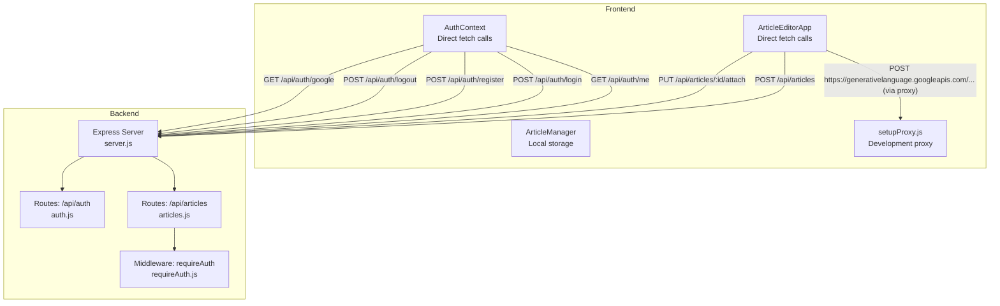
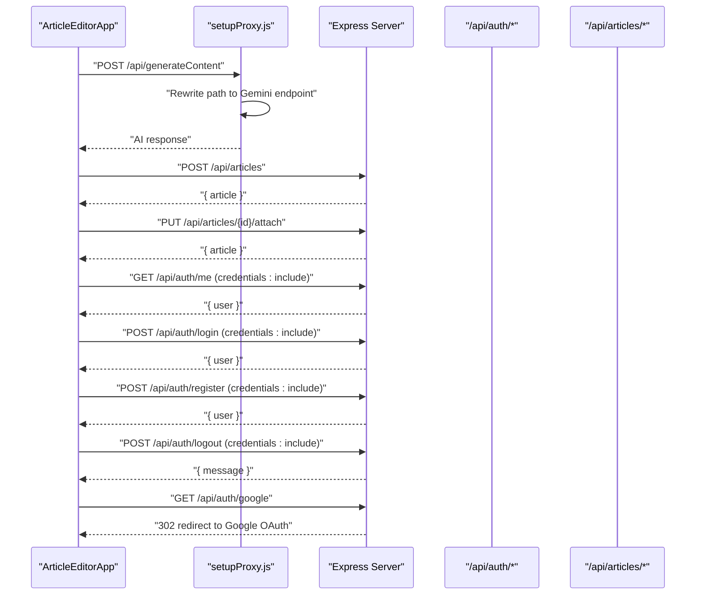
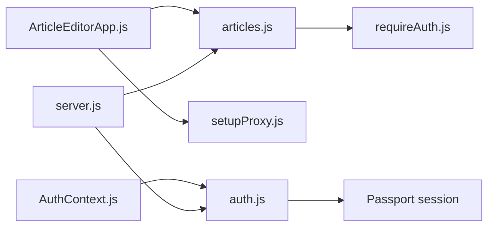

# API Clients

<cite>
**Referenced Files in This Document**
- [ArticleEditorApp.js](file://src/components/ArticleEditorApp.js)
- [AuthContext.js](file://src/context/AuthContext.js)
- [ArticleManager.js](file://src/utils/ArticleManager.js)
- [articles.js](file://server/routes/articles.js)
- [auth.js](file://server/routes/auth.js)
- [requireAuth.js](file://server/middleware/requireAuth.js)
- [setupProxy.js](file://src/setupProxy.js)
- [server.js](file://server/server.js)
- [README.md](file://README.md)
</cite>

## Table of Contents
1. [Introduction](#introduction)
2. [Project Structure](#project-structure)
3. [Core Components](#core-components)
4. [Architecture Overview](#architecture-overview)
5. [Detailed Component Analysis](#detailed-component-analysis)
6. [Dependency Analysis](#dependency-analysis)
7. [Performance Considerations](#performance-considerations)
8. [Troubleshooting Guide](#troubleshooting-guide)
9. [Conclusion](#conclusion)

## Introduction
This document describes the frontend API client system used by the React application to communicate with the Express.js backend. The application uses direct fetch calls from components and context rather than a centralized API client service. It covers:
- AI content generation flow using Google’s Gemini API
- Article persistence workflow via sequential POST and PUT requests
- Authentication flows including login, registration, logout, and Google OAuth initiation
- Authentication status checks on initial load
- Request/response cycles, headers, body serialization, error handling, and cookie-based session management
- Security considerations around API key exposure and credentials handling

## Project Structure
The frontend uses React components and a context provider to manage authentication state and issue fetch requests. The backend exposes REST endpoints under /api/auth and /api/articles. A development-time proxy is configured to route Gemini API requests through the local server.

**Diagram sources**
- [ArticleEditorApp.js](file://src/components/ArticleEditorApp.js#L352-L418)
- [AuthContext.js](file://src/context/AuthContext.js#L10-L107)
- [setupProxy.js](file://src/setupProxy.js#L1-L29)
- [server.js](file://server/server.js#L31-L39)
- [auth.js](file://server/routes/auth.js#L1-L100)
- [articles.js](file://server/routes/articles.js#L1-L228)
- [requireAuth.js](file://server/middleware/requireAuth.js#L1-L14)

**Section sources**
- [ArticleEditorApp.js](file://src/components/ArticleEditorApp.js#L352-L418)
- [AuthContext.js](file://src/context/AuthContext.js#L10-L107)
- [setupProxy.js](file://src/setupProxy.js#L1-L29)
- [server.js](file://server/server.js#L31-L39)

## Core Components
- ArticleEditorApp: Orchestrates AI generation and article persistence. Issues direct fetch calls to the backend and Gemini API.
- AuthContext: Manages authentication state and performs direct fetch calls for login, registration, logout, and Google OAuth initiation. Checks authentication status on initial load.
- ArticleManager: Provides local storage utilities for article data and migration helpers.
- Backend routes: Expose endpoints for authentication and article management.
- Middleware: Protects protected routes and injects user identity.
- Proxy: Routes Gemini API requests through the local server during development.

**Section sources**
- [ArticleEditorApp.js](file://src/components/ArticleEditorApp.js#L42-L178)
- [AuthContext.js](file://src/context/AuthContext.js#L10-L107)
- [ArticleManager.js](file://src/utils/ArticleManager.js#L1-L152)
- [articles.js](file://server/routes/articles.js#L1-L228)
- [auth.js](file://server/routes/auth.js#L1-L100)
- [requireAuth.js](file://server/middleware/requireAuth.js#L1-L14)
- [setupProxy.js](file://src/setupProxy.js#L1-L29)

## Architecture Overview
The frontend communicates directly with the backend using fetch. Authentication relies on cookie-based sessions managed by the backend. The AI generation flow uses a development proxy to route Gemini API requests through the backend to avoid exposing the API key in client-side code.

**Diagram sources**
- [ArticleEditorApp.js](file://src/components/ArticleEditorApp.js#L352-L418)
- [AuthContext.js](file://src/context/AuthContext.js#L10-L107)
- [setupProxy.js](file://src/setupProxy.js#L1-L29)
- [server.js](file://server/server.js#L31-L39)
- [auth.js](file://server/routes/auth.js#L1-L100)
- [articles.js](file://server/routes/articles.js#L1-L228)

## Detailed Component Analysis

### AI Content Generation Flow (ArticleEditorApp.handleGenerate)
- Purpose: Generate article content using Google Gemini API and parse Markdown into cards.
- Behavior:
  - Creates a new article identifier if needed and updates the URL.
  - Builds a structured system prompt and sends a POST request to the Gemini API endpoint.
  - Parses the AI response to extract title and sections, converts to HTML, and updates state.
  - Saves the article to local storage via ArticleManager.
  - Displays success/error notifications and toggles loading state.
- Request details:
  - Endpoint: Gemini API endpoint (proxied via development server).
  - Method: POST.
  - Headers: Content-Type application/json; x-goog-api-key header with API key.
  - Body: JSON payload containing contents and generationConfig.
  - Response: JSON with candidates; extracts first candidate text.
- Error handling:
  - Validates response.ok and throws on failure.
  - Catches exceptions and displays user-friendly notifications.
- Loading states:
  - setIsGenerating(true/false) controls UI feedback.

Security considerations:
- The Gemini API key is embedded in the frontend code. The README suggests moving it to an environment variable and using a backend proxy. The development proxy rewrites the path to include the API key, but this still exposes the key in development builds.

**Section sources**
- [ArticleEditorApp.js](file://src/components/ArticleEditorApp.js#L42-L178)
- [README.md](file://README.md#L11-L16)

### Article Persistence Workflow (ArticleEditorApp.saveAllData)
- Purpose: Persist article data to the backend and attach it to the authenticated user.
- Behavior:
  - Ensures authentication state is loaded; if not logged in, opens the registration modal.
  - Creates a guest draft via POST /api/articles with JSON payload (title, content).
  - Attaches the draft to the authenticated user via PUT /api/articles/:id/attach.
  - Saves locally via ArticleManager.
  - Displays success/error notifications.
- Request details:
  - POST /api/articles:
    - Method: POST.
    - Headers: Content-Type application/json; credentials: include.
    - Body: JSON with title and content.
    - Response: JSON with article object.
  - PUT /api/articles/:id/attach:
    - Method: PUT.
    - Headers: Content-Type application/json; credentials: include.
    - Response: JSON with article object.
- Error handling:
  - Throws on non-OK responses with descriptive messages.
  - Catches exceptions and displays user-friendly notifications.
- Backend protection:
  - The attach endpoint is protected by requireAuth middleware, which verifies session and sets req.userId.

**Section sources**
- [ArticleEditorApp.js](file://src/components/ArticleEditorApp.js#L352-L418)
- [articles.js](file://server/routes/articles.js#L1-L53)
- [requireAuth.js](file://server/middleware/requireAuth.js#L1-L14)

### Authentication API Calls (AuthContext)
- Purpose: Manage authentication state and perform direct fetch calls for login, registration, logout, and Google OAuth initiation. Check authentication status on initial load.
- Endpoints and flows:
  - GET /api/auth/me:
    - Method: GET.
    - Headers: None required; credentials: include to send cookies.
    - Response: JSON with user object if authenticated; 401 if not.
  - POST /api/auth/login:
    - Method: POST.
    - Headers: Content-Type application/json; credentials: include.
    - Body: JSON with email and password.
    - Response: JSON with user object; 400 on invalid credentials.
  - POST /api/auth/register:
    - Method: POST.
    - Headers: Content-Type application/json; credentials: include.
    - Body: JSON with email and password.
    - Response: JSON with user object; 400 if email exists.
  - POST /api/auth/logout:
    - Method: POST.
    - Headers: None required; credentials: include.
    - Response: JSON with message; clears connect.sid cookie on backend.
  - GET /api/auth/google:
    - Method: GET.
    - Response: 302 redirect to Google OAuth consent page.
- Error handling:
  - On login/register failures, attempts to parse JSON error payload; falls back to status text.
  - On logout, logs errors but ensures user state is cleared.
  - On initial load, catches auth check errors and proceeds with loading=false.

**Section sources**
- [AuthContext.js](file://src/context/AuthContext.js#L10-L107)
- [auth.js](file://server/routes/auth.js#L1-L100)

### Authentication Status Check on Initial Load
- Behavior:
  - On mount, fetches GET /api/auth/me with credentials: include to retrieve user data.
  - Sets loading=false regardless of outcome.
  - Updates context user state on success.
- Notes:
  - The backend responds with 401 when not authenticated; the frontend ignores this and continues.

**Section sources**
- [AuthContext.js](file://src/context/AuthContext.js#L10-L29)
- [auth.js](file://server/routes/auth.js#L91-L98)

### Development Proxy for Gemini API
- Purpose: Route Gemini API requests through the local server to avoid exposing the API key in client-side code during development.
- Behavior:
  - Rewrites /api to the Gemini endpoint with a development API key.
  - Logs proxying events and errors.
  - Returns JSON error on proxy errors.
- Notes:
  - The README recommends moving the API key to environment variables and using a backend proxy. The proxy demonstrates the intended pattern.

**Section sources**
- [setupProxy.js](file://src/setupProxy.js#L1-L29)
- [README.md](file://README.md#L11-L16)

## Dependency Analysis
- Frontend-to-backend dependencies:
  - ArticleEditorApp depends on server routes for article creation and attachment.
  - AuthContext depends on server routes for authentication and status checks.
- Backend middleware:
  - requireAuth enforces session-based authentication for protected endpoints.
- Proxy dependency:
  - setupProxy.js depends on http-proxy-middleware and the Gemini API base URL.

**Diagram sources**
- [ArticleEditorApp.js](file://src/components/ArticleEditorApp.js#L352-L418)
- [AuthContext.js](file://src/context/AuthContext.js#L10-L107)
- [articles.js](file://server/routes/articles.js#L1-L228)
- [auth.js](file://server/routes/auth.js#L1-L100)
- [requireAuth.js](file://server/middleware/requireAuth.js#L1-L14)
- [setupProxy.js](file://src/setupProxy.js#L1-L29)
- [server.js](file://server/server.js#L31-L39)

**Section sources**
- [ArticleEditorApp.js](file://src/components/ArticleEditorApp.js#L352-L418)
- [AuthContext.js](file://src/context/AuthContext.js#L10-L107)
- [articles.js](file://server/routes/articles.js#L1-L228)
- [auth.js](file://server/routes/auth.js#L1-L100)
- [requireAuth.js](file://server/middleware/requireAuth.js#L1-L14)
- [setupProxy.js](file://src/setupProxy.js#L1-L29)
- [server.js](file://server/server.js#L31-L39)

## Performance Considerations
- Network latency:
  - Gemini API calls are synchronous in the generation flow; consider adding retry/backoff logic and progress indicators.
- Request batching:
  - Article persistence performs two sequential requests; consider combining steps on the backend if feasible.
- Cookie-based sessions:
  - Credentials include improves UX but increases request overhead; ensure CORS and SameSite policies are configured appropriately.
- Local caching:
  - ArticleManager stores data locally; ensure migrations and conflict resolution are handled consistently.

[No sources needed since this section provides general guidance]

## Troubleshooting Guide
- Authentication failures:
  - Login/Register errors: The frontend parses JSON error payloads; check network tab for 400 responses and error messages.
  - Logout: Confirm backend clears the connect.sid cookie and destroys the session.
- AI generation failures:
  - Validate Gemini API key and proxy rewrite path. Check proxy logs for errors.
  - Ensure the system prompt and request body conform to Gemini API expectations.
- Article persistence failures:
  - Verify guest draft creation and attach endpoints. Check requireAuth middleware for session issues.
  - Confirm credentials: include is present for both POST /api/articles and PUT /api/articles/:id/attach.
- CORS and cookies:
  - Confirm backend CORS allows credentials and origin. Review cookie settings and SameSite policy.

**Section sources**
- [AuthContext.js](file://src/context/AuthContext.js#L31-L56)
- [AuthContext.js](file://src/context/AuthContext.js#L58-L83)
- [AuthContext.js](file://src/context/AuthContext.js#L85-L96)
- [auth.js](file://server/routes/auth.js#L46-L98)
- [articles.js](file://server/routes/articles.js#L1-L53)
- [server.js](file://server/server.js#L12-L25)

## Conclusion
The frontend employs a direct-fetch architecture to communicate with the backend and Gemini API. Authentication is session-based with cookie inclusion, and article persistence uses sequential POST and PUT requests. While convenient, embedding the Gemini API key in the frontend is a security risk; the README and proxy demonstrate the recommended approach to mitigate exposure. The system provides clear request/response patterns, user-friendly error handling, and loading states. For production, move the Gemini API key to a backend proxy and enforce stricter security configurations.