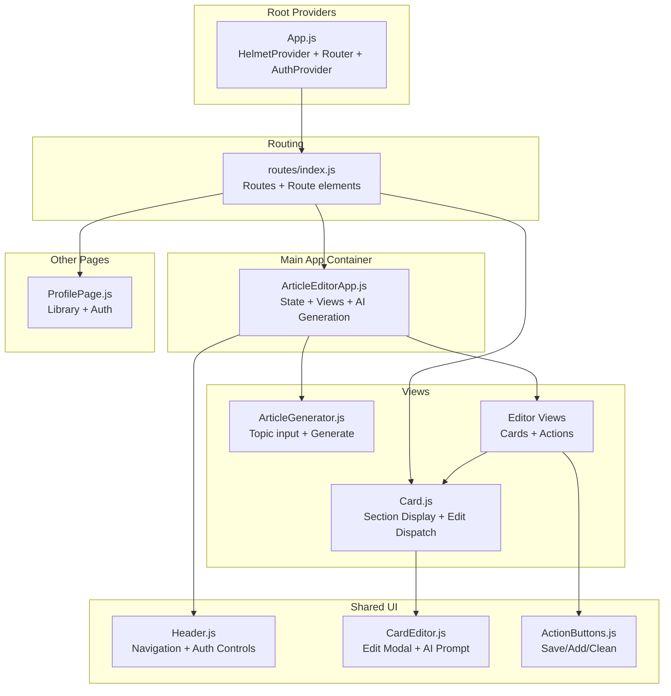
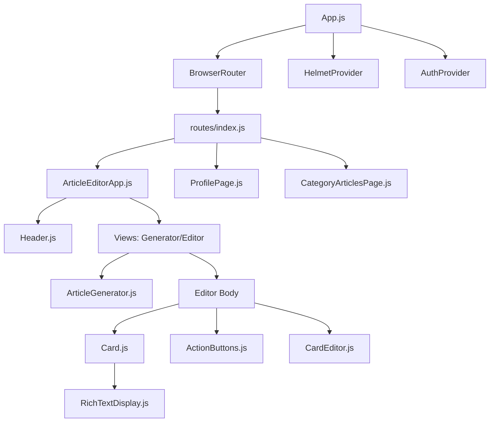
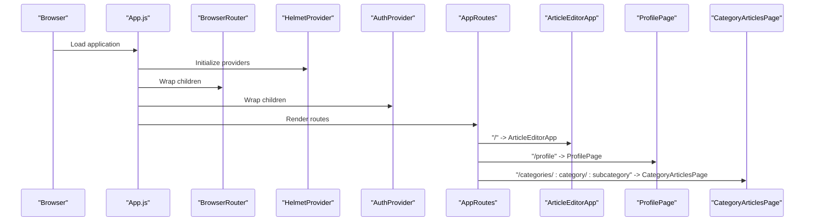
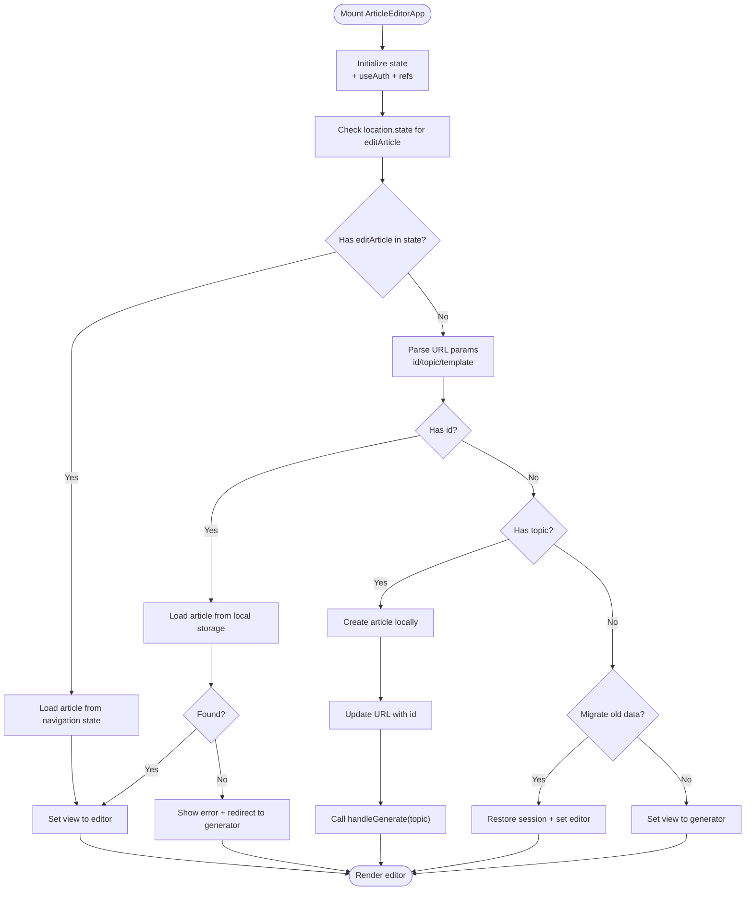
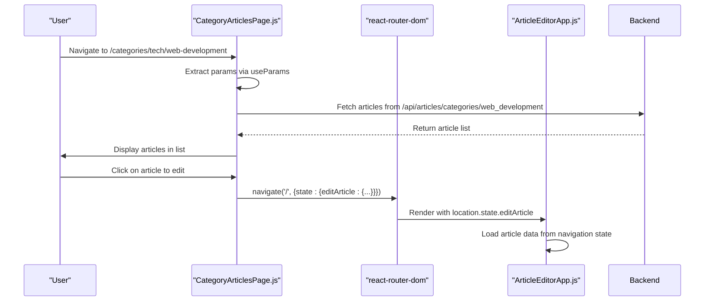
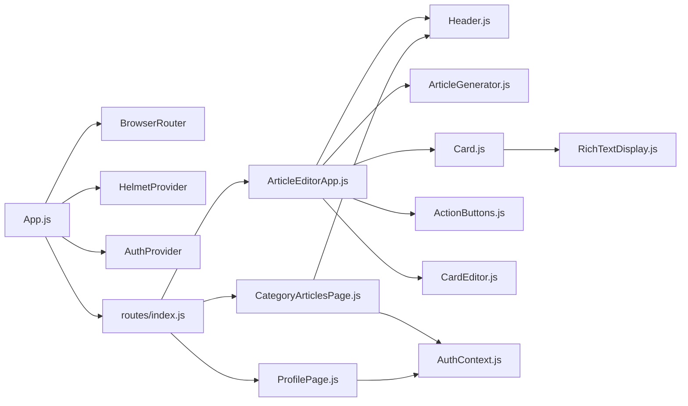

# Component Tree

<cite>
**Referenced Files in This Document**
- [App.js](file://src/App.js)
- [routes/index.js](file://src/routes/index.js)
- [ArticleEditorApp.js](file://src/components/ArticleEditorApp.js)
- [Header.js](file://src/components/Header.js)
- [ArticleGenerator.js](file://src/components/ArticleGenerator.js)
- [Card.js](file://src/components/Card.js)
- [CardEditor.js](file://src/components/CardEditor.js)
- [ActionButtons.js](file://src/components/ActionButtons.js)
- [ProfilePage.js](file://src/components/ProfilePage.js)
- [AuthContext.js](file://src/context/AuthContext.js)
- [RichTextDisplay.js](file://src/components/RichTextDisplay.js)
- [CategoryArticlesPage.js](file://src/components/CategoryArticlesPage.js)
</cite>

## Update Summary
**Changes Made**
- Added new section for CategoryArticlesPage component
- Updated architecture overview to include CategoryArticlesPage
- Updated component hierarchy diagram to include CategoryArticlesPage
- Added detailed analysis of useLocation hook in ArticleEditorApp
- Updated routing initialization section to include CategoryArticlesPage route
- Added dependency analysis for CategoryArticlesPage

## Table of Contents
1. [Introduction](#introduction)
2. [Project Structure](#project-structure)
3. [Core Components](#core-components)
4. [Architecture Overview](#architecture-overview)
5. [Detailed Component Analysis](#detailed-component-analysis)
6. [Dependency Analysis](#dependency-analysis)
7. [Performance Considerations](#performance-considerations)
8. [Troubleshooting Guide](#troubleshooting-guide)
9. [Conclusion](#conclusion)

## Introduction
This document describes the frontend component tree for article-page-v11, focusing on the hierarchical structure starting from App.js as the root component. It explains how routing and context providers are initialized, how App.js renders AppRoutes which maps to ArticleEditorApp as the primary container for the main functionality, and how conditional rendering manages three primary views: loading, generator, and editor. It also details the role of Header.js across views, ArticleGenerator.js as the entry point for new article creation, Card.js as the reusable component representing individual article sections, and the parent-child relationships and data flow between components. Finally, it explains how React Router enables navigation between ArticleEditorApp, ProfilePage, and other routes defined in src/routes/index.js. This update includes documentation for the new CategoryArticlesPage component and the use of the useLocation hook in ArticleEditorApp for receiving article data via navigation state.

## Project Structure
The application is structured around a small set of React components organized by feature and responsibility. App.js initializes routing and context providers, routes/index.js defines the route-to-component mapping, and ArticleEditorApp orchestrates the main article editing experience. Supporting components include Header.js for navigation and authentication controls, ArticleGenerator.js for new article creation, Card.js for displaying article sections, and CardEditor.js for editing those sections. Additional components like ProfilePage.js and the newly added CategoryArticlesPage.js integrate with routing and authentication.

**Diagram sources**
- [App.js](file://src/App.js#L1-L20)
- [routes/index.js](file://src/routes/index.js#L1-L22)
- [ArticleEditorApp.js](file://src/components/ArticleEditorApp.js#L1-L649)
- [Header.js](file://src/components/Header.js#L1-L87)
- [ArticleGenerator.js](file://src/components/ArticleGenerator.js#L1-L91)
- [Card.js](file://src/components/Card.js#L1-L34)
- [CardEditor.js](file://src/components/CardEditor.js#L1-L482)
- [ActionButtons.js](file://src/components/ActionButtons.js#L1-L34)
- [ProfilePage.js](file://src/components/ProfilePage.js#L1-L147)
- [CategoryArticlesPage.js](file://src/components/CategoryArticlesPage.js#L1-L176)

**Section sources**
- [App.js](file://src/App.js#L1-L20)
- [routes/index.js](file://src/routes/index.js#L1-L22)

## Core Components
- App.js: Initializes React Router, Helmet provider, and the AuthProvider, then renders AppRoutes.
- routes/index.js: Defines route mappings to ArticleEditorApp, ProfilePage, CategoryArticlesPage, and other pages.
- ArticleEditorApp.js: Central state manager for views, article data, AI generation, filters, and editor UI. Renders either the generator or editor view and composes shared UI. Now receives article data via navigation state using useLocation hook.
- Header.js: Provides navigation links and authentication controls; integrates with routing and user state.
- ArticleGenerator.js: Captures user topic input and triggers AI generation via a callback prop.
- Card.js: Reusable component representing an article section, dispatching edit events and handling AI link navigation.
- CardEditor.js: Edit modal for cards, including AI-assisted improvements and persistence.
- ActionButtons.js: Save, add card, and clean actions wired to ArticleEditorApp handlers.
- ProfilePage.js: Displays user’s articles, allows editing and deletion, and integrates with authentication.
- AuthContext.js: Authentication state and methods exposed via context.
- CategoryArticlesPage.js: Displays articles filtered by category and subcategory, allowing users to edit articles by navigating to ArticleEditorApp with article data in navigation state.

**Section sources**
- [App.js](file://src/App.js#L1-L20)
- [routes/index.js](file://src/routes/index.js#L1-L22)
- [ArticleEditorApp.js](file://src/components/ArticleEditorApp.js#L1-L649)
- [Header.js](file://src/components/Header.js#L1-L87)
- [ArticleGenerator.js](file://src/components/ArticleGenerator.js#L1-L91)
- [Card.js](file://src/components/Card.js#L1-L34)
- [CardEditor.js](file://src/components/CardEditor.js#L1-L482)
- [ActionButtons.js](file://src/components/ActionButtons.js#L1-L34)
- [ProfilePage.js](file://src/components/ProfilePage.js#L1-L147)
- [AuthContext.js](file://src/context/AuthContext.js#L1-L110)
- [CategoryArticlesPage.js](file://src/components/CategoryArticlesPage.js#L1-L176)

## Architecture Overview
The application follows a layered architecture:
- Root providers (App.js) set up routing and authentication context.
- Routing (routes/index.js) maps URLs to components including the new CategoryArticlesPage.
- ArticleEditorApp.js acts as the primary container, managing state and view selection, now enhanced with navigation state handling.
- Shared UI components (Header.js, Card.js, ActionButtons.js) are composed within ArticleEditorApp.
- ArticleGenerator.js and CardEditor.js encapsulate generation and editing concerns.
- ProfilePage.js and CategoryArticlesPage.js integrate with routing and authentication to manage user libraries and category-based article browsing.

**Diagram sources**
- [App.js](file://src/App.js#L1-L20)
- [routes/index.js](file://src/routes/index.js#L1-L22)
- [ArticleEditorApp.js](file://src/components/ArticleEditorApp.js#L1-L649)
- [Header.js](file://src/components/Header.js#L1-L87)
- [ArticleGenerator.js](file://src/components/ArticleGenerator.js#L1-L91)
- [Card.js](file://src/components/Card.js#L1-L34)
- [RichTextDisplay.js](file://src/components/RichTextDisplay.js#L1-L51)
- [ActionButtons.js](file://src/components/ActionButtons.js#L1-L34)
- [CardEditor.js](file://src/components/CardEditor.js#L1-L482)
- [ProfilePage.js](file://src/components/ProfilePage.js#L1-L147)
- [CategoryArticlesPage.js](file://src/components/CategoryArticlesPage.js#L1-L176)

## Detailed Component Analysis

### App.js and Routing Initialization
- App.js wraps the application with HelmetProvider, BrowserRouter, and AuthProvider, then renders AppRoutes.
- AppRoutes defines the route-to-component mapping, including the main ArticleEditorApp, ProfilePage, and the new CategoryArticlesPage with its dynamic routing parameters.

**Diagram sources**
- [App.js](file://src/App.js#L1-L20)
- [routes/index.js](file://src/routes/index.js#L1-L22)

**Section sources**
- [App.js](file://src/App.js#L1-L20)
- [routes/index.js](file://src/routes/index.js#L1-L22)

### ArticleEditorApp: Conditional Rendering and State Management with Navigation State
ArticleEditorApp manages:
- View state: 'loading', 'generator', 'editor'
- Article data: title, cards, filters, refinement prompt
- Authentication state via useAuth
- AI generation pipeline and local storage via ArticleManager
- Editor UI composition: Header, generator/editor view, refinement bar, filter modal, notifications, edit modal, registration modal
- Navigation state handling via useLocation to receive article data from CategoryArticlesPage

Conditional rendering logic:
- If view is 'loading': displays a loading indicator
- If view is 'generator': renders ArticleGenerator with onGenerate and isGenerating props
- Else (editor): renders editor layout with title editing, cards, and ActionButtons

The component now includes enhanced initialization logic that first checks for navigation state before falling back to URL parameters:

**Diagram sources**
- [ArticleEditorApp.js](file://src/components/ArticleEditorApp.js#L243-L266)
- [ArticleEditorApp.js](file://src/components/ArticleEditorApp.js#L325-L384)

**Section sources**
- [ArticleEditorApp.js](file://src/components/ArticleEditorApp.js#L1-L649)

### CategoryArticlesPage: Category-based Article Browsing
The new CategoryArticlesPage component provides a category-based browsing interface for articles. It:
- Uses useParams to extract category and subcategory from the URL
- Fetches articles from the backend API endpoint `/api/articles/categories/:facetValue`
- Displays articles in a list format with title, author, date, and facet assignments
- Handles article editing by navigating to the root route with article data in navigation state
- Integrates with Header.js for consistent navigation and authentication controls

The component uses React Router's useNavigate hook to pass article data to ArticleEditorApp via navigation state, which is then accessed by ArticleEditorApp using the useLocation hook.

**Diagram sources**
- [CategoryArticlesPage.js](file://src/components/CategoryArticlesPage.js#L7-L82)
- [ArticleEditorApp.js](file://src/components/ArticleEditorApp.js#L243-L266)

**Section sources**
- [CategoryArticlesPage.js](file://src/components/CategoryArticlesPage.js#L1-L176)

### Header.js: Navigation and Authentication Controls
- Provides logo, navigation links (Home, Categories, Blog), and account management.
- Conditionally renders profile link or login/register button based on user state.
- Integrates with routing via react-router-dom Link and useLocation.

**Diagram sources**
- [Header.js](file://src/components/Header.js#L1-L87)
- [ArticleEditorApp.js](file://src/components/ArticleEditorApp.js#L563-L575)

**Section sources**
- [Header.js](file://src/components/Header.js#L1-L87)
- [ArticleEditorApp.js](file://src/components/ArticleEditorApp.js#L563-L575)

### ArticleGenerator.js: New Article Creation
- Captures user topic input and triggers AI generation via onGenerate callback.
- Disables generation while isGenerating is true.
- Supports Enter key submission.

**Diagram sources**
- [ArticleGenerator.js](file://src/components/ArticleGenerator.js#L1-L91)
- [ArticleEditorApp.js](file://src/components/ArticleEditorApp.js#L42-L178)

**Section sources**
- [ArticleGenerator.js](file://src/components/ArticleGenerator.js#L1-L91)
- [ArticleEditorApp.js](file://src/components/ArticleEditorApp.js#L42-L178)

### Card.js and CardEditor.js: Section Display and Editing
- Card.js renders RichTextDisplay and handles:
  - Edit link clicks: dispatches a custom event to open the edit modal
  - AI link clicks: extracts topic and template, builds a URL, and opens in a new tab
- CardEditor.js:
  - Listens for the custom event to open the modal
  - Manages editing state, title/content, and unsaved changes
  - Integrates with AI-assisted improvements and persistence
  - Uses ReactQuill for rich text editing

**Diagram sources**
- [Card.js](file://src/components/Card.js#L1-L34)
- [CardEditor.js](file://src/components/CardEditor.js#L1-L200)
- [ArticleEditorApp.js](file://src/components/ArticleEditorApp.js#L426-L441)

**Section sources**
- [Card.js](file://src/components/Card.js#L1-L34)
- [CardEditor.js](file://src/components/CardEditor.js#L1-L200)
- [ArticleEditorApp.js](file://src/components/ArticleEditorApp.js#L426-L441)

### ActionButtons.js: Editor Actions
- Provides Save, Add Card, and Clean actions.
- Handlers are passed down from ArticleEditorApp and invoked on user interaction.

**Diagram sources**
- [ActionButtons.js](file://src/components/ActionButtons.js#L1-L34)
- [ArticleEditorApp.js](file://src/components/ArticleEditorApp.js#L554-L561)

**Section sources**
- [ActionButtons.js](file://src/components/ActionButtons.js#L1-L34)
- [ArticleEditorApp.js](file://src/components/ArticleEditorApp.js#L554-L561)

### RichTextDisplay.js: Safe HTML Rendering
- Sanitizes HTML content to prevent XSS, allowing custom <ai-link> tags and attributes.
- Used by Card.js to render section content safely.

**Diagram sources**
- [RichTextDisplay.js](file://src/components/RichTextDisplay.js#L1-L51)
- [Card.js](file://src/components/Card.js#L23-L31)

**Section sources**
- [RichTextDisplay.js](file://src/components/RichTextDisplay.js#L1-L51)
- [Card.js](file://src/components/Card.js#L23-L31)

### ProfilePage.js: User Library and Navigation
- Displays user’s articles fetched from the backend.
- Allows editing (navigates to ArticleEditorApp with article id), creating new articles, and deleting articles.
- Integrates with authentication and routing.

**Diagram sources**
- [ProfilePage.js](file://src/components/ProfilePage.js#L1-L147)
- [Header.js](file://src/components/Header.js#L56-L80)
- [routes/index.js](file://src/routes/index.js#L12-L17)

**Section sources**
- [ProfilePage.js](file://src/components/ProfilePage.js#L1-L147)
- [Header.js](file://src/components/Header.js#L56-L80)
- [routes/index.js](file://src/routes/index.js#L12-L17)

### AuthContext.js: Authentication Provider
- Provides user state, loading state, login, register, logout, and Google login.
- ArticleEditorApp consumes useAuth to control UI and save flows.

**Diagram sources**
- [AuthContext.js](file://src/context/AuthContext.js#L1-L110)
- [ArticleEditorApp.js](file://src/components/ArticleEditorApp.js#L15-L20)

**Section sources**
- [AuthContext.js](file://src/context/AuthContext.js#L1-L110)
- [ArticleEditorApp.js](file://src/components/ArticleEditorApp.js#L15-L20)

## Dependency Analysis
- App.js depends on react-router-dom for routing and react-helmet-async for SEO metadata.
- routes/index.js depends on ArticleEditorApp, ProfilePage, and CategoryArticlesPage.
- ArticleEditorApp depends on Header, ArticleGenerator, Card, ActionButtons, CardEditor, and AuthContext.
- CategoryArticlesPage depends on Header, useAuth, and useNavigate from react-router-dom.
- Card.js depends on RichTextDisplay for safe rendering.
- CardEditor.js depends on ReactQuill and ArticleEditorApp’s setCards to persist changes.
- ProfilePage.js depends on AuthContext and uses react-router-dom for navigation.

**Diagram sources**
- [App.js](file://src/App.js#L1-L20)
- [routes/index.js](file://src/routes/index.js#L1-L22)
- [ArticleEditorApp.js](file://src/components/ArticleEditorApp.js#L1-L649)
- [Header.js](file://src/components/Header.js#L1-L87)
- [ArticleGenerator.js](file://src/components/ArticleGenerator.js#L1-L91)
- [Card.js](file://src/components/Card.js#L1-L34)
- [RichTextDisplay.js](file://src/components/RichTextDisplay.js#L1-L51)
- [ActionButtons.js](file://src/components/ActionButtons.js#L1-L34)
- [CardEditor.js](file://src/components/CardEditor.js#L1-L482)
- [ProfilePage.js](file://src/components/ProfilePage.js#L1-L147)
- [AuthContext.js](file://src/context/AuthContext.js#L1-L110)
- [CategoryArticlesPage.js](file://src/components/CategoryArticlesPage.js#L1-L176)

**Section sources**
- [App.js](file://src/App.js#L1-L20)
- [routes/index.js](file://src/routes/index.js#L1-L22)
- [ArticleEditorApp.js](file://src/components/ArticleEditorApp.js#L1-L649)
- [CategoryArticlesPage.js](file://src/components/CategoryArticlesPage.js#L1-L176)

## Performance Considerations
- Lazy loading and suspense: CardEditor is lazily loaded and wrapped in Suspense to improve initial load performance.
- Memoization: Card.js and ActionButtons.js are wrapped with React.memo to prevent unnecessary re-renders.
- Conditional rendering: ArticleEditorApp avoids rendering heavy components until needed (e.g., editor modal).
- Event-driven editing: Using a custom event to open the edit modal reduces prop drilling and keeps components decoupled.
- Sanitization: RichTextDisplay uses DOMPurify to sanitize HTML, preventing expensive reflows and potential XSS.

[No sources needed since this section provides general guidance]

## Troubleshooting Guide
- Authentication state not loading:
  - Verify AuthProvider fetches user on mount and sets loading to false.
  - Check network requests to the auth endpoints and cookie configuration.
- Save failures:
  - ArticleEditorApp’s saveAllData handles guest drafts and attaching to user; confirm backend endpoints are reachable and credentials are included.
- AI generation errors:
  - handleGenerate logs errors and shows notifications; verify API key and endpoint availability.
- Edit modal not opening:
  - Ensure Card.js click handler dispatches the correct custom event and that CardEditor listens for it.
- URL state inconsistencies:
  - ArticleEditorApp updates URL with article id; ensure history push/replace is used consistently.
- Category articles not loading:
  - Verify the backend API endpoint `/api/articles/categories/:facetValue` is accessible and returns expected data.
  - Check that the subcategory parameter is properly transformed (hyphens to underscores) before making the API request.
- Navigation state not received:
  - Verify that CategoryArticlesPage correctly passes article data in the navigation state object.
  - Check that ArticleEditorApp properly accesses location.state.editArticle in its useEffect hook.

**Section sources**
- [AuthContext.js](file://src/context/AuthContext.js#L1-L110)
- [ArticleEditorApp.js](file://src/components/ArticleEditorApp.js#L352-L418)
- [ArticleEditorApp.js](file://src/components/ArticleEditorApp.js#L42-L178)
- [Card.js](file://src/components/Card.js#L1-L34)
- [CardEditor.js](file://src/components/CardEditor.js#L74-L84)
- [CategoryArticlesPage.js](file://src/components/CategoryArticlesPage.js#L24-L45)
- [ArticleEditorApp.js](file://src/components/ArticleEditorApp.js#L243-L266)

## Conclusion
The component tree centers on App.js and routes/index.js for initialization and routing, with ArticleEditorApp orchestrating the article creation and editing experience. Header.js provides cross-cutting navigation and authentication controls, while ArticleGenerator.js and Card.js encapsulate generation and section rendering. CardEditor.js handles editing and AI-assisted improvements. ProfilePage.js and the newly added CategoryArticlesPage.js integrate with routing and authentication to manage user libraries and category-based article browsing. The architecture emphasizes clear separation of concerns, event-driven communication, safe HTML rendering, and enhanced navigation state handling. The use of React Router's navigation state allows CategoryArticlesPage to pass article data to ArticleEditorApp without relying solely on URL parameters, providing a more robust and flexible data transfer mechanism.

[No sources needed since this section summarizes without analyzing specific files]