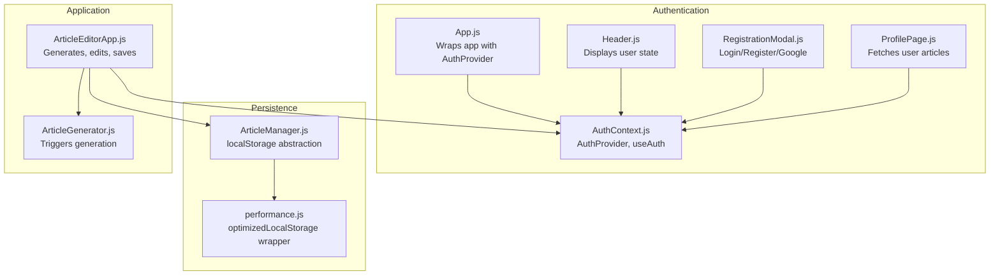
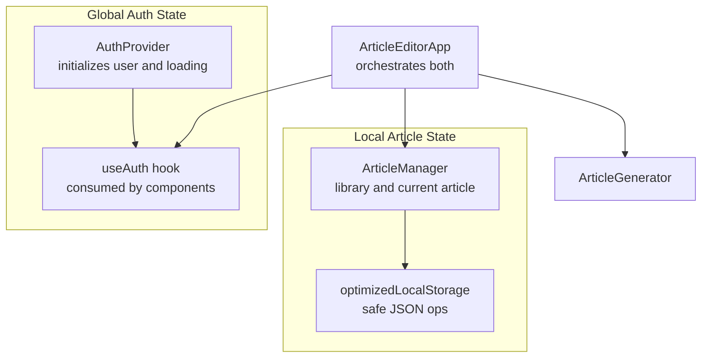
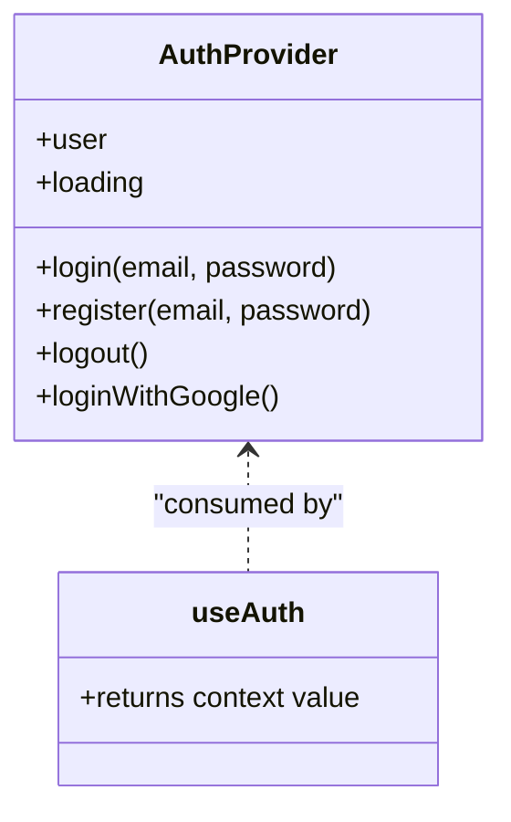
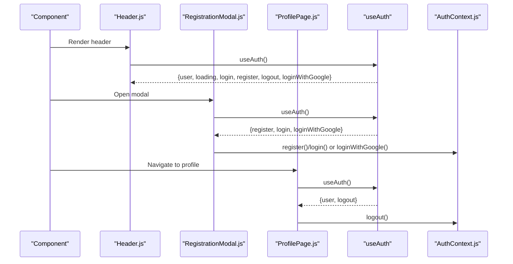
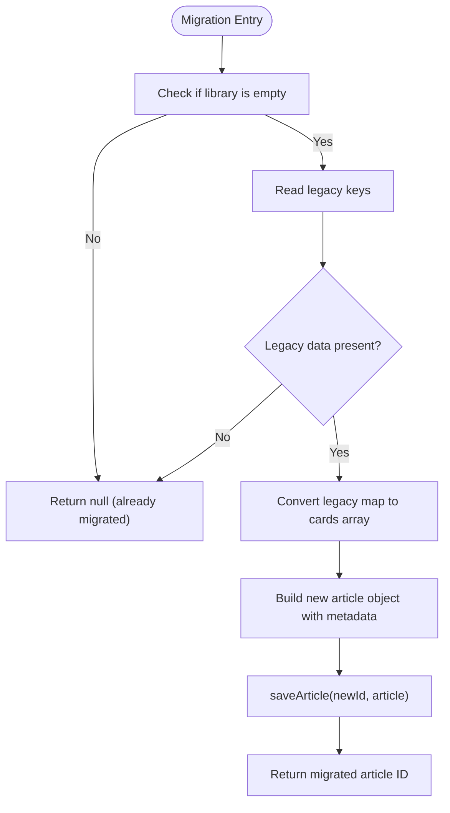
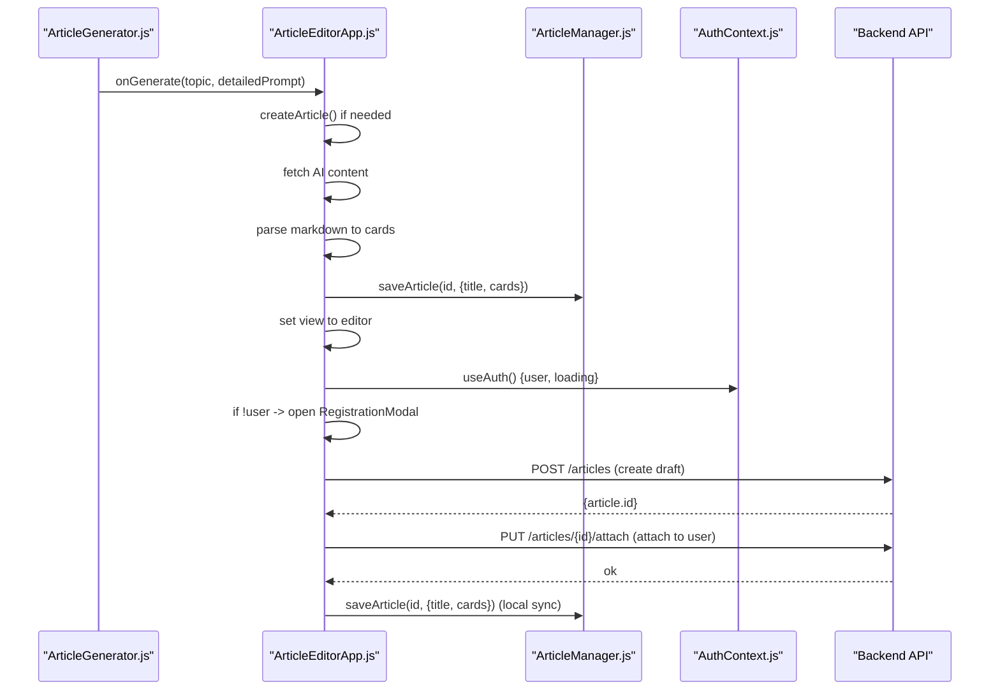
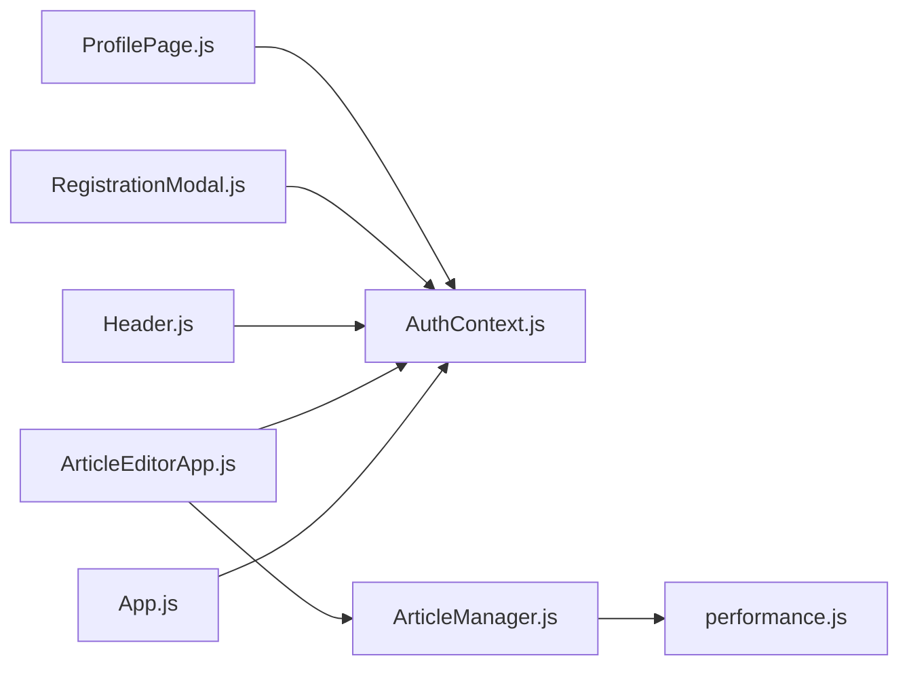

# State Management

<cite>
**Referenced Files in This Document**
- [AuthContext.js](file://src/context/AuthContext.js)
- [ArticleManager.js](file://src/utils/ArticleManager.js)
- [ArticleEditorApp.js](file://src/components/ArticleEditorApp.js)
- [ArticleGenerator.js](file://src/components/ArticleGenerator.js)
- [performance.js](file://src/utils/performance.js)
- [App.js](file://src/App.js)
- [Header.js](file://src/components/Header.js)
- [RegistrationModal.js](file://src/components/RegistrationModal.js)
- [ProfilePage.js](file://src/components/ProfilePage.js)
</cite>

## Table of Contents
1. [Introduction](#introduction)
2. [Project Structure](#project-structure)
3. [Core Components](#core-components)
4. [Architecture Overview](#architecture-overview)
5. [Detailed Component Analysis](#detailed-component-analysis)
6. [Dependency Analysis](#dependency-analysis)
7. [Performance Considerations](#performance-considerations)
8. [Troubleshooting Guide](#troubleshooting-guide)
9. [Conclusion](#conclusion)

## Introduction
This document explains the state management architecture used in article-page-v11. The system employs a dual approach:
- Global authentication state via React Context API (AuthContext.js)
- Local storage-backed persistence for article content via a utility class (ArticleManager.js)

It details how AuthProvider initializes and exposes authentication functions, how the useAuth hook enables components to consume authentication state, and how ArticleManager abstracts localStorage operations for article CRUD. It also illustrates how ArticleEditorApp integrates both systems: using useAuth for user session data and ArticleManager for article persistence across sessions. Finally, it describes data flows for article generation, temporary component state, persistence via ArticleManager, and synchronization with the backend upon authentication, plus error handling and migration from legacy localStorage formats.

## Project Structure
The state management spans three primary areas:
- Authentication: React Context Provider and consumer hook
- Persistence: Utility class encapsulating localStorage operations
- Application integration: Editor app orchestrating both systems

**Diagram sources**
- [AuthContext.js](file://src/context/AuthContext.js#L1-L110)
- [App.js](file://src/App.js#L1-L20)
- [Header.js](file://src/components/Header.js#L1-L87)
- [RegistrationModal.js](file://src/components/RegistrationModal.js#L1-L146)
- [ProfilePage.js](file://src/components/ProfilePage.js#L1-L38)
- [ArticleManager.js](file://src/utils/ArticleManager.js#L1-L152)
- [performance.js](file://src/utils/performance.js#L44-L75)
- [ArticleEditorApp.js](file://src/components/ArticleEditorApp.js#L1-L649)
- [ArticleGenerator.js](file://src/components/ArticleGenerator.js#L1-L91)

**Section sources**
- [AuthContext.js](file://src/context/AuthContext.js#L1-L110)
- [ArticleManager.js](file://src/utils/ArticleManager.js#L1-L152)
- [ArticleEditorApp.js](file://src/components/ArticleEditorApp.js#L1-L649)
- [App.js](file://src/App.js#L1-L20)

## Core Components
- AuthContext.js
  - Provides a Context with user, loading, and authentication functions (login, register, logout, loginWithGoogle).
  - Initializes authentication state by checking the backend on mount.
  - Exposes useAuth hook for consuming components.
- ArticleManager.js
  - Encapsulates localStorage operations for article library and current article selection.
  - Offers CRUD-like methods: getAllArticles, getArticle, saveArticle, createArticle, deleteArticle, setCurrentArticleId, getCurrentArticleId.
  - Includes migration logic for legacy single-article data to the new library format.
- performance.js
  - Provides an optimizedLocalStorage wrapper around localStorage with safe JSON serialization/deserialization and error logging.

Key responsibilities:
- AuthContext.js: Centralizes authentication state and actions; handles server communication and redirects for OAuth.
- ArticleManager.js: Manages article data model and persistence; ensures robust migration from legacy formats.
- performance.js: Adds resilience and consistency to localStorage operations.

**Section sources**
- [AuthContext.js](file://src/context/AuthContext.js#L1-L110)
- [ArticleManager.js](file://src/utils/ArticleManager.js#L1-L152)
- [performance.js](file://src/utils/performance.js#L44-L75)

## Architecture Overview
The system separates concerns:
- Authentication state is global and reactive, propagated via React Context.
- Article persistence is local-first and resilient, abstracted behind a utility class.
- The editor app composes both systems: it reads authentication state to gate backend operations and writes to localStorage for offline continuity.

**Diagram sources**
- [AuthContext.js](file://src/context/AuthContext.js#L1-L110)
- [ArticleManager.js](file://src/utils/ArticleManager.js#L1-L152)
- [performance.js](file://src/utils/performance.js#L44-L75)
- [ArticleEditorApp.js](file://src/components/ArticleEditorApp.js#L1-L649)
- [ArticleGenerator.js](file://src/components/ArticleGenerator.js#L1-L91)

## Detailed Component Analysis

### AuthContext.js: Authentication State and Actions
- Context creation and provider
  - Creates a context with initial null user and loading flag.
  - On mount, checks backend for existing session and sets user accordingly.
- Authentication functions
  - login: posts credentials to backend, parses response, sets user, and returns data.
  - register: posts registration payload to backend, sets user on success.
  - logout: calls backend logout endpoint and clears user state.
  - loginWithGoogle: redirects to backend OAuth endpoint.
- Hook
  - useAuth returns the context value for consumption by components.

**Diagram sources**
- [AuthContext.js](file://src/context/AuthContext.js#L1-L110)

**Section sources**
- [AuthContext.js](file://src/context/AuthContext.js#L1-L110)

### useAuth Hook: Consuming Authentication State
- Components import useAuth to access user, loading, and authentication functions.
- Used in Header to conditionally render profile or login/register button.
- Used in RegistrationModal to perform login/register and Google login redirection.
- Used in ProfilePage to fetch user’s articles and log out.

**Diagram sources**
- [Header.js](file://src/components/Header.js#L1-L87)
- [RegistrationModal.js](file://src/components/RegistrationModal.js#L1-L146)
- [ProfilePage.js](file://src/components/ProfilePage.js#L1-L38)
- [AuthContext.js](file://src/context/AuthContext.js#L1-L110)

**Section sources**
- [Header.js](file://src/components/Header.js#L1-L87)
- [RegistrationModal.js](file://src/components/RegistrationModal.js#L1-L146)
- [ProfilePage.js](file://src/components/ProfilePage.js#L1-L38)
- [AuthContext.js](file://src/context/AuthContext.js#L1-L110)

### ArticleManager.js: Local Storage Abstraction
- Data model
  - Articles library stored under a single key with article objects keyed by ID.
  - Current article ID stored separately for quick access.
- Methods
  - getAllArticles/getArticle: read operations.
  - saveArticle: merges partial updates and timestamps.
  - createArticle: generates a new article ID and initializes metadata.
  - deleteArticle: removes an article from the library.
  - setCurrentArticleId/getCurrentArticleId: manage active article selection.
  - migrateOldData: migrates legacy single-article data to the new library format.
- Migration strategy
  - Checks if library is empty; if so, reads legacy keys and converts to new format.
  - Converts legacy map-like structure to cards array expected by the app.
  - Saves migrated article and returns its ID.

**Diagram sources**
- [ArticleManager.js](file://src/utils/ArticleManager.js#L96-L151)

**Section sources**
- [ArticleManager.js](file://src/utils/ArticleManager.js#L1-L152)

### ArticleEditorApp: Integrating Auth and Persistence
- Authentication integration
  - Uses useAuth to access user, loading, and logout.
  - Blocks save operations until authentication state resolves.
  - Prompts registration modal if user is not authenticated.
- Article lifecycle
  - Generates content, temporarily stores in component state (cards, title).
  - Persists to localStorage via ArticleManager immediately after generation.
  - Synchronizes with backend on save: creates a draft, attaches it to the authenticated user, and updates local copy.
- Initialization and routing
  - Reads URL parameters to decide whether to load an existing article, create a new one from a topic, or migrate legacy data.
  - Updates browser history to reflect current article ID.

**Diagram sources**
- [ArticleEditorApp.js](file://src/components/ArticleEditorApp.js#L1-L649)
- [ArticleManager.js](file://src/utils/ArticleManager.js#L1-L152)
- [AuthContext.js](file://src/context/AuthContext.js#L1-L110)

**Section sources**
- [ArticleEditorApp.js](file://src/components/ArticleEditorApp.js#L1-L649)
- [ArticleGenerator.js](file://src/components/ArticleGenerator.js#L1-L91)
- [ArticleManager.js](file://src/utils/ArticleManager.js#L1-L152)
- [AuthContext.js](file://src/context/AuthContext.js#L1-L110)

## Dependency Analysis
- App.js wraps the entire application with AuthProvider, ensuring all components can consume authentication state.
- ArticleEditorApp depends on:
  - useAuth for authentication state and actions
  - ArticleManager for persistence
  - Header and RegistrationModal for UI integration
- ArticleManager depends on optimizedLocalStorage for safe storage operations.
- RegistrationModal and ProfilePage depend on useAuth for authentication flows.

**Diagram sources**
- [App.js](file://src/App.js#L1-L20)
- [AuthContext.js](file://src/context/AuthContext.js#L1-L110)
- [ArticleEditorApp.js](file://src/components/ArticleEditorApp.js#L1-L649)
- [ArticleManager.js](file://src/utils/ArticleManager.js#L1-L152)
- [performance.js](file://src/utils/performance.js#L44-L75)
- [Header.js](file://src/components/Header.js#L1-L87)
- [RegistrationModal.js](file://src/components/RegistrationModal.js#L1-L146)
- [ProfilePage.js](file://src/components/ProfilePage.js#L1-L38)

**Section sources**
- [App.js](file://src/App.js#L1-L20)
- [AuthContext.js](file://src/context/AuthContext.js#L1-L110)
- [ArticleEditorApp.js](file://src/components/ArticleEditorApp.js#L1-L649)
- [ArticleManager.js](file://src/utils/ArticleManager.js#L1-L152)
- [performance.js](file://src/utils/performance.js#L44-L75)
- [Header.js](file://src/components/Header.js#L1-L87)
- [RegistrationModal.js](file://src/components/RegistrationModal.js#L1-L146)
- [ProfilePage.js](file://src/components/ProfilePage.js#L1-L38)

## Performance Considerations
- Optimized localStorage operations
  - The optimizedLocalStorage wrapper serializes/deserializes safely and logs errors, preventing silent failures.
  - This reduces risk during frequent save operations and improves reliability.
- Debounce/throttle utilities
  - While not directly used in state management, the presence of debounce/throttle in performance.js suggests potential for optimizing frequent UI updates that could trigger saves.
- Network resilience
  - AuthContext.js catches and logs errors during auth checks and logout attempts, preventing unhandled exceptions and allowing graceful degradation.

**Section sources**
- [performance.js](file://src/utils/performance.js#L44-L75)
- [AuthContext.js](file://src/context/AuthContext.js#L1-L110)

## Troubleshooting Guide
- Authentication failures
  - Login/register errors surface as thrown errors with messages derived from server responses; RegistrationModal displays the error and keeps the modal open for retry.
  - Backend endpoints are called with credentials included to support cookie-based sessions.
- Logout issues
  - Logout attempts are wrapped in try/catch; user state is cleared regardless of network outcome.
- Article persistence errors
  - ArticleManager relies on optimizedLocalStorage; if localStorage throws, operations return false/null and errors are logged.
  - Migration from legacy data is defensive: only runs when library is empty and legacy keys are detected.
- Save synchronization
  - ArticleEditorApp waits for authentication to resolve before saving; if user is not authenticated, it prompts the registration modal.
  - Backend save flow includes creating a draft and attaching it to the authenticated user; errors are caught and surfaced to the user.

**Section sources**
- [RegistrationModal.js](file://src/components/RegistrationModal.js#L1-L146)
- [AuthContext.js](file://src/context/AuthContext.js#L1-L110)
- [ArticleManager.js](file://src/utils/ArticleManager.js#L1-L152)
- [ArticleEditorApp.js](file://src/components/ArticleEditorApp.js#L352-L418)

## Conclusion
The article-page-v11 state management system cleanly separates global authentication state (React Context) from local article persistence (utility class wrapping localStorage). AuthProvider centralizes authentication actions and exposes them via useAuth, while ArticleManager encapsulates all localStorage operations and migration logic. ArticleEditorApp orchestrates both systems: it uses authentication to gate backend synchronization and persists content locally for immediate availability. The design emphasizes resilience through error handling, defensive migration, and safe storage operations, enabling a smooth user experience across generation, editing, and authentication flows.