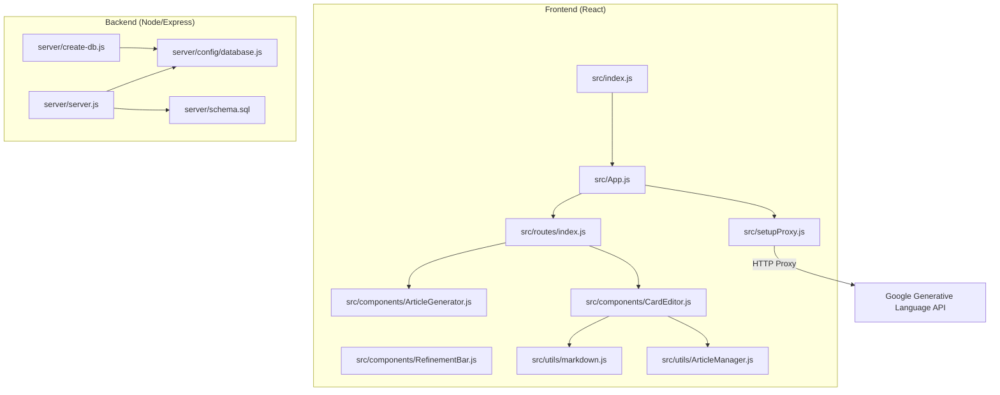
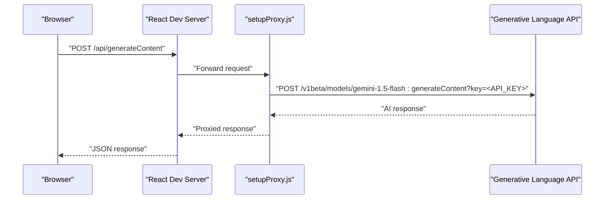
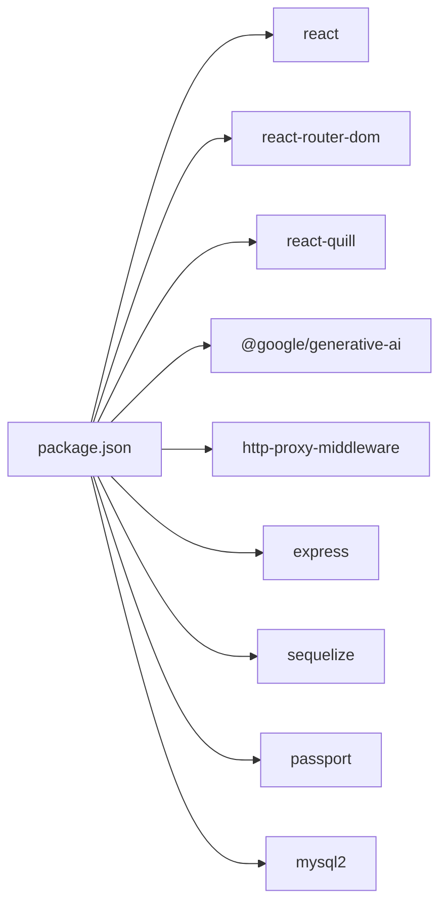

# Getting Started

<cite>
**Referenced Files in This Document**
- [package.json](file://package.json)
- [README.md](file://README.md)
- [.env](file://.env)
- [src/setupProxy.js](file://src/setupProxy.js)
- [src/App.js](file://src/App.js)
- [src/index.js](file://src/index.js)
- [src/routes/index.js](file://src/routes/index.js)
- [src/components/ArticleGenerator.js](file://src/components/ArticleGenerator.js)
- [src/components/RefinementBar.js](file://src/components/RefinementBar.js)
- [src/components/CardEditor.js](file://src/components/CardEditor.js)
- [src/utils/markdown.js](file://src/utils/markdown.js)
- [src/utils/ArticleManager.js](file://src/utils/ArticleManager.js)
- [server/server.js](file://server/server.js)
- [server/config/database.js](file://server/config/database.js)
- [server/schema.sql](file://server/schema.sql)
- [server/create-db.js](file://server/create-db.js)
- [list_models.js](file://list_models.js)
</cite>

## Table of Contents
1. [Introduction](#introduction)
2. [Project Structure](#project-structure)
3. [Core Components](#core-components)
4. [Architecture Overview](#architecture-overview)
5. [Detailed Component Analysis](#detailed-component-analysis)
6. [Dependency Analysis](#dependency-analysis)
7. [Performance Considerations](#performance-considerations)
8. [Troubleshooting Guide](#troubleshooting-guide)
9. [Conclusion](#conclusion)
10. [Appendices](#appendices)

## Introduction
This guide helps you set up and run the article-page-v11 application locally. It covers installing dependencies, configuring environment variables, starting the development server, and using the AI-powered article generation and editing features. It also explains the purpose of the development proxy for Google’s Generative Language API and how to modify it safely. Finally, it provides troubleshooting tips for common setup issues and highlights security considerations for API keys.

## Project Structure
The project is a React frontend with a small Node/Express backend for authentication, articles, facets, and moderation. The frontend uses a development proxy to route AI requests to Google’s Generative Language API.

**Diagram sources**
- [src/index.js](file://src/index.js#L1-L28)
- [src/App.js](file://src/App.js#L1-L20)
- [src/routes/index.js](file://src/routes/index.js#L1-L22)
- [src/setupProxy.js](file://src/setupProxy.js#L1-L29)
- [src/components/ArticleGenerator.js](file://src/components/ArticleGenerator.js#L1-L91)
- [src/components/RefinementBar.js](file://src/components/RefinementBar.js#L1-L62)
- [src/components/CardEditor.js](file://src/components/CardEditor.js#L1-L482)
- [src/utils/markdown.js](file://src/utils/markdown.js#L1-L128)
- [src/utils/ArticleManager.js](file://src/utils/ArticleManager.js#L1-L152)
- [server/server.js](file://server/server.js#L1-L59)
- [server/config/database.js](file://server/config/database.js#L1-L16)
- [server/schema.sql](file://server/schema.sql#L1-L134)
- [server/create-db.js](file://server/create-db.js#L1-L23)

**Section sources**
- [package.json](file://package.json#L1-L53)
- [README.md](file://README.md#L1-L45)

## Core Components
- Frontend entrypoint initializes the React app and routes.
- Routes define pages for the editor, profile, categories, and blog.
- ArticleGenerator captures a topic and triggers generation.
- RefinementBar allows adding refinement prompts and regenerating content.
- CardEditor handles per-card editing, AI-assisted improvements, and saving changes.
- markdown utility converts AI responses to HTML.
- ArticleManager persists articles in local storage.
- Development proxy routes AI requests to Google’s Generative Language API.

**Section sources**
- [src/index.js](file://src/index.js#L1-L28)
- [src/routes/index.js](file://src/routes/index.js#L1-L22)
- [src/components/ArticleGenerator.js](file://src/components/ArticleGenerator.js#L1-L91)
- [src/components/RefinementBar.js](file://src/components/RefinementBar.js#L1-L62)
- [src/components/CardEditor.js](file://src/components/CardEditor.js#L1-L482)
- [src/utils/markdown.js](file://src/utils/markdown.js#L1-L128)
- [src/utils/ArticleManager.js](file://src/utils/ArticleManager.js#L1-L152)

## Architecture Overview
The frontend runs on a development server. During development, AI requests are proxied to Google’s Generative Language API so the client does not need to embed API keys. The backend provides authentication, articles, facets, and moderation endpoints.

**Diagram sources**
- [src/setupProxy.js](file://src/setupProxy.js#L1-L29)

## Detailed Component Analysis

### Environment Variables and Scripts
- Install dependencies using the standard script.
- Start the development server using the standard script.
- Test script is available for running tests.
- Backend scripts include starting the server and database utilities.

Code snippet paths:
- [npm start](file://package.json#L6-L14)
- [npm test](file://package.json#L6-L14)
- [npm run server](file://package.json#L6-L14)
- [npm run sync-db](file://package.json#L6-L14)
- [npm run seed-facets](file://package.json#L6-L14)

Environment variables:
- API key for AI requests in development is configured in the proxy.
- Database credentials and secrets are configured in the backend environment.
- The frontend reads a REACT_APP_GEMINI_API_KEY for potential client-side usage.

Code snippet paths:
- [REACT_APP_GEMINI_API_KEY in .env](file://.env#L1-L10)
- [Backend DB env usage](file://server/config/database.js#L1-L16)

**Section sources**
- [package.json](file://package.json#L1-L53)
- [.env](file://.env#L1-L10)
- [server/config/database.js](file://server/config/database.js#L1-L16)

### Development Proxy for AI Requests
The development proxy forwards requests from the frontend to Google’s Generative Language API. It rewrites the path to the model endpoint and injects an API key. It logs proxy activity and returns structured error responses on failure.

Key behaviors:
- Target: Generative Language API base URL
- Path rewrite: Adds model and API key to the path
- Logging: Logs target path and status code
- Error handling: Returns JSON error on proxy failures

Code snippet paths:
- [Proxy configuration](file://src/setupProxy.js#L1-L29)

How to modify the proxy:
- Change the target base URL if needed.
- Adjust pathRewrite to select a different model or endpoint.
- Update the embedded API key only if you must use a different key in development (not recommended for security).
- Add or adjust headers if the upstream API requires additional headers.

Security note:
- The proxy uses a hardcoded API key in development. Do not expose this key in production. Use a backend proxy or API gateway in production.

**Section sources**
- [src/setupProxy.js](file://src/setupProxy.js#L1-L29)

### Generating Your First Article
Steps:
1. Start the development server.
2. Navigate to the editor page.
3. Enter a topic in the generator input.
4. Click the generate button or press Enter.
5. Use the refinement bar to add prompts and regenerate content.
6. Edit a card using the CardEditor modal:
   - Open the edit modal from a card.
   - Optionally provide an AI prompt to improve content.
   - Save changes to persist updates.

Code snippet paths:
- [ArticleGenerator input and button](file://src/components/ArticleGenerator.js#L1-L91)
- [RefinementBar prompt input and send](file://src/components/RefinementBar.js#L1-L62)
- [CardEditor modal and save](file://src/components/CardEditor.js#L1-L482)
- [Markdown conversion](file://src/utils/markdown.js#L1-L128)
- [Local storage persistence](file://src/utils/ArticleManager.js#L1-L152)

**Section sources**
- [src/components/ArticleGenerator.js](file://src/components/ArticleGenerator.js#L1-L91)
- [src/components/RefinementBar.js](file://src/components/RefinementBar.js#L1-L62)
- [src/components/CardEditor.js](file://src/components/CardEditor.js#L1-L482)
- [src/utils/markdown.js](file://src/utils/markdown.js#L1-L128)
- [src/utils/ArticleManager.js](file://src/utils/ArticleManager.js#L1-L152)

### Backend Authentication and Data Layer
The backend initializes sessions, Passport authentication, and exposes API routes for authentication, articles, facets, and moderation. It connects to a MySQL database via Sequelize.

Key behaviors:
- CORS enabled for the dev client origin.
- Session configuration with cookie settings.
- Passport initialization and strategies.
- Route registration for auth, articles, facets, and moderation.
- Health check endpoint.

Code snippet paths:
- [Backend server bootstrap](file://server/server.js#L1-L59)
- [Database configuration](file://server/config/database.js#L1-L16)
- [Schema definitions](file://server/schema.sql#L1-L134)
- [Database creation script](file://server/create-db.js#L1-L23)

**Section sources**
- [server/server.js](file://server/server.js#L1-L59)
- [server/config/database.js](file://server/config/database.js#L1-L16)
- [server/schema.sql](file://server/schema.sql#L1-L134)
- [server/create-db.js](file://server/create-db.js#L1-L23)

## Dependency Analysis
Frontend dependencies include React, React Router, React Quill, and the official Google Generative Language SDK. The development proxy middleware is included for local AI routing. Backend dependencies include Express, Sequelize, Passport, and MySQL connectors.

**Diagram sources**
- [package.json](file://package.json#L1-L53)

**Section sources**
- [package.json](file://package.json#L1-L53)

## Performance Considerations
- The CardEditor enforces a cooldown between AI requests to avoid rate limiting.
- The markdown utility performs simple conversions; avoid extremely large inputs for optimal responsiveness.
- The backend sets a generous JSON payload size limit to support larger article content.

**Section sources**
- [src/components/CardEditor.js](file://src/components/CardEditor.js#L1-L482)
- [src/utils/markdown.js](file://src/utils/markdown.js#L1-L128)
- [server/server.js](file://server/server.js#L1-L59)

## Troubleshooting Guide

Common setup issues and solutions:

- Missing .env file
  - Symptom: Environment variables not loaded.
  - Solution: Ensure the .env file exists with required keys. Confirm the backend loads dotenv and reads DB credentials and secrets.

  Code snippet paths:
  - [.env file](file://.env#L1-L10)
  - [Backend dotenv usage](file://server/server.js#L1-L10)
  - [Database dotenv usage](file://server/config/database.js#L1-L5)

- Incorrect API key or proxy misconfiguration
  - Symptom: AI requests fail or return errors.
  - Solution: Verify the proxy path rewrite targets the correct model and API key. Check that the proxy is registered during development. For production, move the API key to a backend route and proxy from there.

  Code snippet paths:
  - [Proxy configuration](file://src/setupProxy.js#L1-L29)
  - [Model listing script](file://list_models.js#L1-L36)

- Frontend cannot reach backend endpoints
  - Symptom: CORS errors or 404s for /api routes.
  - Solution: Confirm the backend server is running on the expected port and that CORS allows the frontend origin.

  Code snippet paths:
  - [Backend CORS and routes](file://server/server.js#L1-L59)

- Database connectivity issues
  - Symptom: Server fails to start due to database authentication.
  - Solution: Create the database using the provided script, then start the server. Verify DB credentials in .env.

  Code snippet paths:
  - [Database creation script](file://server/create-db.js#L1-L23)
  - [Database configuration](file://server/config/database.js#L1-L16)

- Security: Exposing API keys
  - Symptom: Concern about embedding API keys in client code.
  - Solution: Do not rely on client-side API keys in production. Use a backend proxy or API gateway to protect keys. The README recommends moving the API key to a secure backend proxy.

  Code snippet paths:
  - [README recommendation](file://README.md#L40-L45)

**Section sources**
- [.env](file://.env#L1-L10)
- [src/setupProxy.js](file://src/setupProxy.js#L1-L29)
- [list_models.js](file://list_models.js#L1-L36)
- [server/server.js](file://server/server.js#L1-L59)
- [server/config/database.js](file://server/config/database.js#L1-L16)
- [server/create-db.js](file://server/create-db.js#L1-L23)
- [README.md](file://README.md#L40-L45)

## Conclusion
You can run the article-page-v11 application by installing dependencies, starting the development server, and using the editor to generate and refine articles. The development proxy simplifies AI integration during development, but for production, move sensitive API keys behind a backend proxy. Use the troubleshooting steps to diagnose common issues and follow the security recommendations to protect your API keys.

## Appendices

### Quick Commands
- Install dependencies: [npm install](file://package.json#L6-L14)
- Start development server: [npm start](file://package.json#L6-L14)
- Run tests: [npm test](file://package.json#L6-L14)
- Start backend server: [npm run server](file://package.json#L6-L14)
- Sync database: [npm run sync-db](file://package.json#L6-L14)
- Seed facets: [npm run seed-facets](file://package.json#L6-L14)

### Environment Variables Reference
- Frontend: [REACT_APP_GEMINI_API_KEY](file://.env#L1-L10)
- Backend: [DB_NAME, DB_USER, DB_PASS, DB_HOST, JWT_SECRET, SESSION_SECRET, GOOGLE_CLIENT_ID, GOOGLE_CLIENT_SECRET](file://.env#L1-L10)
- Backend DB config: [server/config/database.js](file://server/config/database.js#L1-L16)