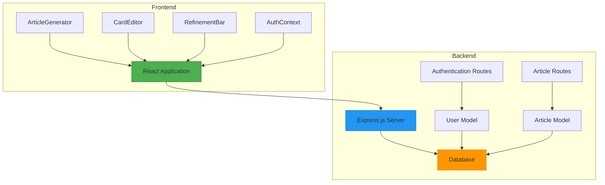
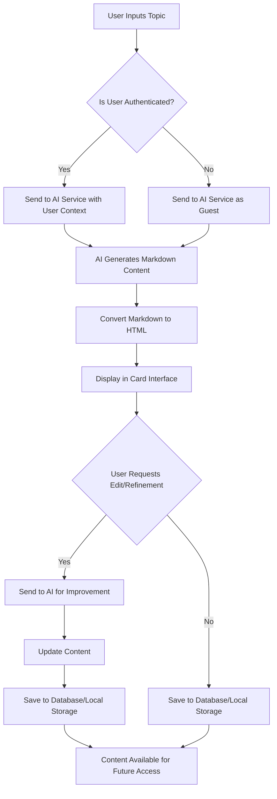
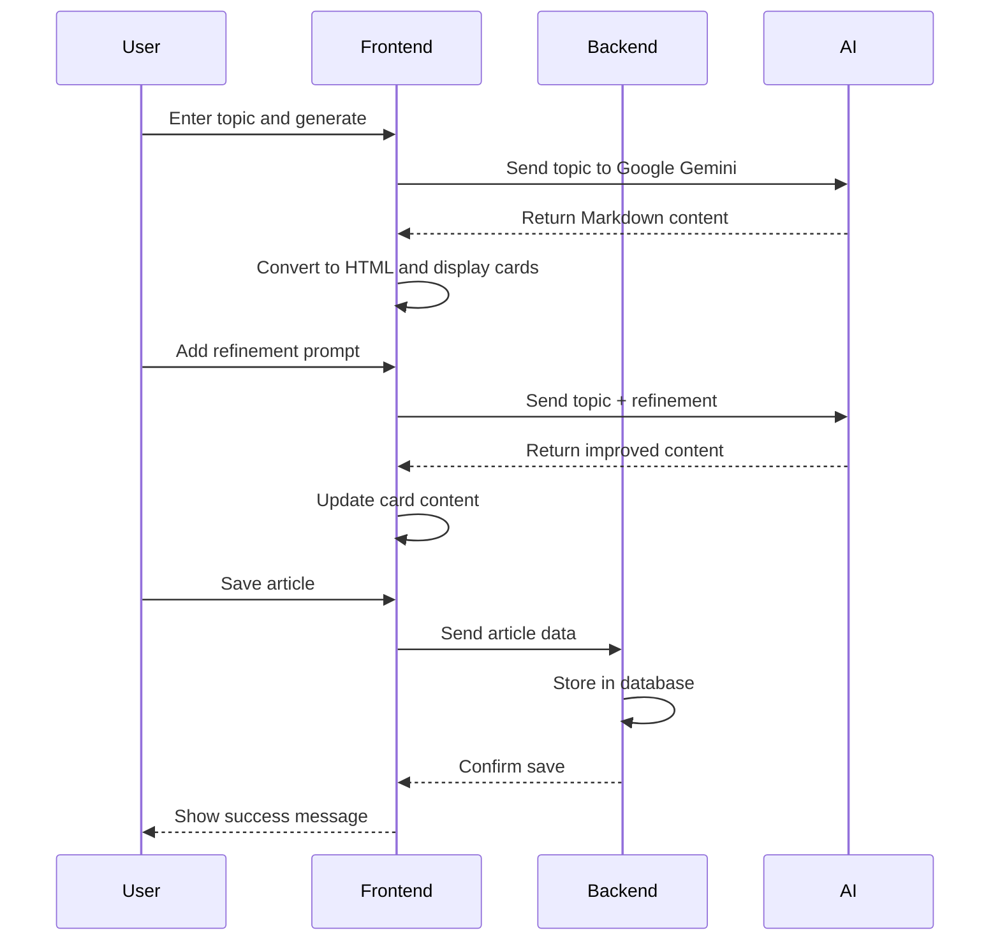

# Project Overview

<cite>
**Referenced Files in This Document**   
- [README.md](file://README.md)
- [package.json](file://package.json)
- [server.js](file://server/server.js)
- [App.js](file://src/App.js)
- [index.js](file://src/index.js)
- [ArticleGenerator.js](file://src/components/ArticleGenerator.js)
- [CardEditor.js](file://src/components/CardEditor.js)
- [RefinementBar.js](file://src/components/RefinementBar.js)
- [ArticleManager.js](file://src/utils/ArticleManager.js)
- [markdown.js](file://src/utils/markdown.js)
- [passport.js](file://server/config/passport.js)
- [User.js](file://server/models/User.js)
- [Article.js](file://server/models/Article.js)
- [AuthContext.js](file://src/context/AuthContext.js)
- [index.js](file://src/routes/index.js)
</cite>

## Table of Contents
1. [Introduction](#introduction)
2. [Core Features and Functionality](#core-features-and-functionality)
3. [Target Audience](#target-audience)
4. [System Architecture](#system-architecture)
5. [Data Flow and Processing](#data-flow-and-processing)
6. [User Workflows](#user-workflows)
7. [Common Issues and Troubleshooting](#common-issues-and-troubleshooting)
8. [Performance Considerations](#performance-considerations)

## Introduction

The article-page-v11 application is a full-stack AI-powered platform designed for generating and editing structured technical articles using React for the frontend and Express.js for the backend. The system leverages Google Gemini to generate content in Markdown format, which is then converted to HTML for display. Users interact with the application through a card-based interface where each article section is represented as a "card" that can be individually edited and refined.

The platform enables users to create comprehensive technical documentation by inputting a topic, which triggers AI-generated content structured with appropriate headings and sections. The system supports advanced features such as AI-links for knowledge branching, filter-based prompt refinement, and user authentication for personalized content management. Articles are stored and managed through a comprehensive system that supports both guest and authenticated user workflows.

**Section sources**
- [README.md](file://README.md#L1-L45)
- [package.json](file://package.json#L1-L53)

## Core Features and Functionality

The article-page-v11 application provides several key features that enable efficient article generation and editing:

**AI-powered Article Generation**: The core functionality allows users to input a topic and generate structured technical articles using Google Gemini. The AI returns content in Markdown format with proper heading hierarchy (# for main title, ## for sections), which is then converted to HTML for display in the application.

**AI-links for Knowledge Branching**: The system supports special `<ai-link>` tags that enable knowledge branching. When the AI encounters a complex sub-topic during content generation, it can wrap it in an `<ai-link topic="Exact Topic Title" template="guide">visible text</ai-link>` tag. Clicking these links generates a new article on the specified topic, creating a network of interconnected knowledge.

**Filter-based Prompt Refinement**: Users can refine generated content through a refinement system that includes both a refinement bar and modal interface. This allows users to add additional prompts, adjust style, length, audience, format, and other parameters to improve the generated content.

**Card-based Editing Interface**: Content is organized into cards that can be individually edited through a dedicated CardEditor component. This editor provides AI-assisted editing capabilities, allowing users to submit prompts for content improvement while maintaining the structural integrity of the article.

**User Authentication and Article Management**: The application supports user authentication through both email/password and Google OAuth, enabling users to save and manage their articles across sessions. Articles are stored in the database with user associations, status tracking, and publishing capabilities.

**Section sources**
- [README.md](file://README.md#L4-L45)
- [CardEditor.js](file://src/components/CardEditor.js#L7-L366)
- [RefinementBar.js](file://src/components/RefinementBar.js#L1-L62)
- [ArticleManager.js](file://src/utils/ArticleManager.js#L1-L152)

## Target Audience

The article-page-v11 application is designed for three primary user groups:

**Developers**: Technical professionals who need to create comprehensive documentation for software projects, APIs, or development processes. The AI-powered generation capabilities help developers quickly create structured technical content without starting from scratch.

**Technical Writers**: Content creators specializing in technical documentation who can leverage the AI assistance to enhance their productivity. The refinement system allows technical writers to guide the AI toward specific writing styles, audience levels, and content structures.

**Content Creators**: General content producers who need to create educational or instructional materials on technical topics. The platform's intuitive interface and AI assistance lower the barrier to creating high-quality technical content, even for those without extensive technical writing experience.

All user groups benefit from the card-based editing interface, which allows for modular content creation and refinement, as well as the AI-links feature that facilitates the creation of comprehensive knowledge networks.

**Section sources**
- [README.md](file://README.md#L4-L45)
- [project_concept.md](file://project_concept.md)

## System Architecture

The article-page-v11 application follows a standard full-stack architecture with a React frontend and Express.js backend, connected through RESTful APIs. The system is organized into distinct layers that handle different aspects of the application functionality.

**Diagram sources**
- [App.js](file://src/App.js#L1-L20)
- [server.js](file://server/server.js#L1-L59)
- [AuthContext.js](file://src/context/AuthContext.js#L1-L110)

**Section sources**
- [App.js](file://src/App.js#L1-L20)
- [server.js](file://server/server.js#L1-L59)
- [package.json](file://package.json#L1-L53)

## Data Flow and Processing

The data flow in the article-page-v11 application follows a clear sequence from user input to AI-generated content and storage. When a user inputs a topic in the ArticleGenerator component, the request is processed through the following steps:

1. The topic is sent to the AI service (Google Gemini) with appropriate prompts and context
2. The AI generates content in Markdown format with proper heading structure
3. The Markdown content is converted to HTML using the markdown.js utility
4. The processed content is displayed in the card-based interface
5. User interactions (edits, refinements) are captured and optionally sent back to the AI for improvement
6. Final content is stored either in local storage (for guests) or in the database (for authenticated users)

The markdown.js utility plays a critical role in content processing, providing three key functions: `markdownToHtml` for converting Markdown syntax to HTML, `plainTextToHtml` for converting plain text with line breaks to HTML paragraphs, and `convertToHtml` which detects the input format and applies the appropriate conversion method.

**Diagram sources**
- [ArticleGenerator.js](file://src/components/ArticleGenerator.js#L1-L91)
- [CardEditor.js](file://src/components/CardEditor.js#L270-L357)
- [markdown.js](file://src/utils/markdown.js#L1-L128)

**Section sources**
- [ArticleGenerator.js](file://src/components/ArticleGenerator.js#L1-L91)
- [CardEditor.js](file://src/components/CardEditor.js#L270-L357)
- [markdown.js](file://src/utils/markdown.js#L1-L128)

## User Workflows

The article-page-v11 application supports several key user workflows that demonstrate the platform's capabilities:

**Generating an Article**: Users begin by entering a topic in the ArticleGenerator interface. Upon submission, the system sends the topic to Google Gemini with appropriate prompts to generate structured technical content. The AI returns Markdown-formatted content with proper heading hierarchy, which is then converted to HTML and displayed as a series of cards in the editing interface.

**Refining Content with Filters**: After initial generation, users can refine the content using the refinement system. Through the RefinementBar or filter modal, users can add additional prompts to adjust the style, length, audience, or format of the content. These refinement prompts are combined with the original topic and sent back to the AI service, which regenerates the content with the requested modifications.

**Saving to User Profile**: Authenticated users can save their articles to their profile for future access and editing. The ArticleManager handles the storage operations, saving articles with metadata including creation date, last modification date, and template type. Users can access their saved articles from the profile page and continue editing or publishing them.

**Diagram sources**
- [ArticleGenerator.js](file://src/components/ArticleGenerator.js#L6-L10)
- [RefinementBar.js](file://src/components/RefinementBar.js#L7-L8)
- [ArticleManager.js](file://src/utils/ArticleManager.js#L35-L45)

**Section sources**
- [ArticleGenerator.js](file://src/components/ArticleGenerator.js#L6-L10)
- [RefinementBar.js](file://src/components/RefinementBar.js#L7-L8)
- [ArticleManager.js](file://src/utils/ArticleManager.js#L35-L45)

## Common Issues and Troubleshooting

The article-page-v11 application may encounter several common issues that users and administrators should be aware of:

**API Key Configuration**: The application currently has a hard-coded Gemini API key in the CardEditor component. For production use, this should be moved to an environment variable (REACT_APP_GEMINI_API_KEY) and accessed through process.env. Failure to properly configure the API key will result in AI service failures.

**CORS Setup**: The backend server has CORS configured to allow requests from http://localhost:3000. If the frontend is hosted on a different domain or port, the CORS configuration in server.js must be updated accordingly. Incorrect CORS settings will prevent the frontend from communicating with the backend.

**Authentication Flow**: The Google OAuth callback URL is hardcoded to http://localhost:3003/api/auth/google/callback. This must be updated in both the code and Google Cloud Console when deploying to different environments. Issues with the authentication flow can prevent users from logging in with Google.

**Database Connection**: The application uses MySQL with Sequelize ORM. Proper database configuration in the server/config/database.js file is required for the application to start successfully. Connection issues will prevent article storage and user authentication.

**Section sources**
- [README.md](file://README.md#L11-L15)
- [server.js](file://server/server.js#L12-L16)
- [passport.js](file://server/config/passport.js#L54-L58)
- [database.js](file://server/config/database.js)

## Performance Considerations

The article-page-v11 application has several performance considerations that impact both AI response handling and client-side rendering:

**AI Response Handling**: The application implements rate limiting in the CardEditor component with a 10-second cooldown between AI requests. This prevents excessive API calls to Google Gemini and associated costs. The system also validates prompts for length (10-500 characters) and forbidden phrases before sending them to the AI service, reducing unnecessary API calls.

**Client-Side Rendering**: The application uses React's memoization features to optimize rendering performance. The CardEditor component is wrapped with React.memo to prevent unnecessary re-renders, and Quill editor modules and formats are memoized using useMemo. This reduces the performance impact of rendering complex article content.

**Storage Optimization**: The ArticleManager utility uses an optimized local storage implementation that handles serialization and deserialization efficiently. For authenticated users, articles are stored in the database with appropriate indexing on user_id and status fields to ensure fast retrieval.

**Content Processing**: The markdown conversion process is optimized to handle both Markdown and plain text input efficiently. The convertToHtml function uses a heuristic to detect Markdown patterns before applying the more complex Markdown conversion, improving performance for plain text content.

**Section sources**
- [CardEditor.js](file://src/components/CardEditor.js#L18-L23)
- [ArticleManager.js](file://src/utils/ArticleManager.js#L1-L3)
- [markdown.js](file://src/utils/markdown.js#L107-L125)
- [performance.js](file://src/utils/performance.js)