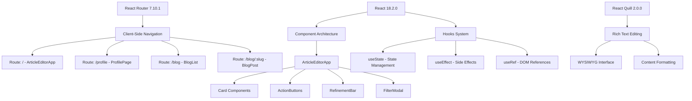
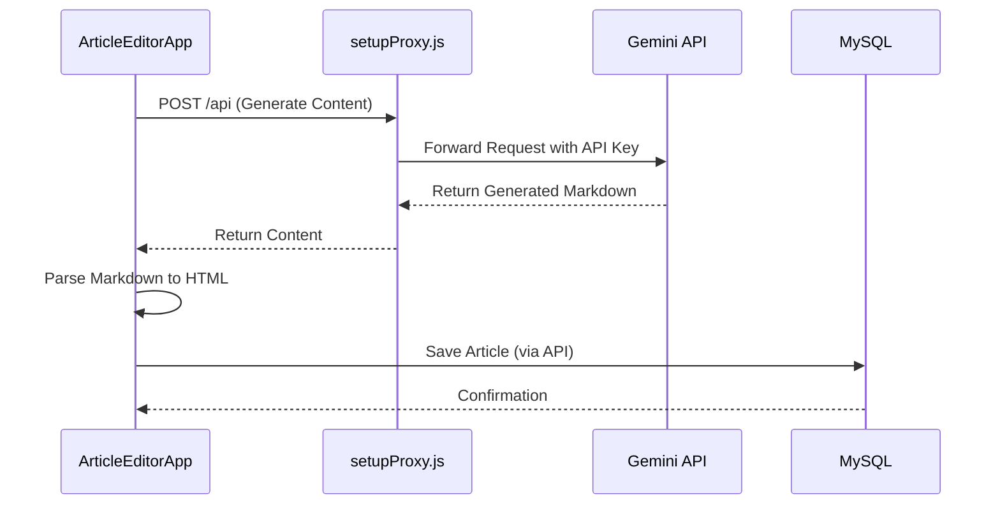
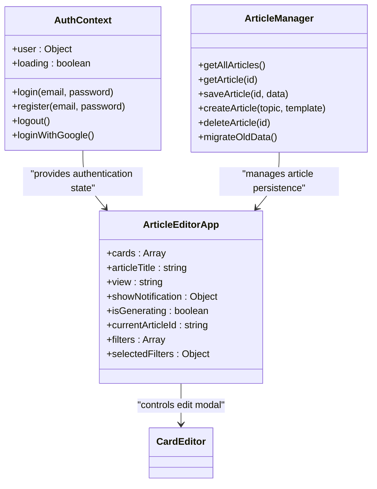
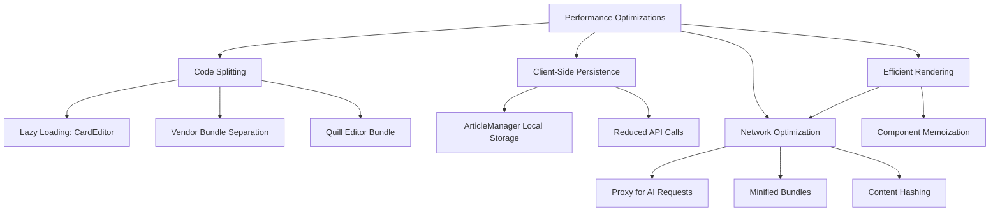

# Technology Stack

<cite>
**Referenced Files in This Document**   
- [package.json](file://package.json)
- [App.js](file://src/App.js)
- [index.js](file://src/index.js)
- [server.js](file://server/server.js)
- [ArticleEditorApp.js](file://src/components/ArticleEditorApp.js)
- [AuthContext.js](file://src/context/AuthContext.js)
- [ArticleManager.js](file://src/utils/ArticleManager.js)
- [setupProxy.js](file://src/setupProxy.js)
- [database.js](file://server/config/database.js)
- [passport.js](file://server/config/passport.js)
- [markdown.js](file://src/utils/markdown.js)
- [webpack.config.js](file://src/webpack.config.js)
- [requireAuth.js](file://server/middleware/requireAuth.js)
- [Article.js](file://server/models/Article.js)
- [articles.js](file://server/routes/articles.js)
</cite>

## Table of Contents
1. [Frontend Stack](#frontend-stack)
2. [Backend Stack](#backend-stack)
3. [AI Integration](#ai-integration)
4. [State Management](#state-management)
5. [Build and Transpilation](#build-and-transpilation)
6. [Version Compatibility](#version-compatibility)
7. [Performance Considerations](#performance-considerations)
8. [Architecture Trade-offs](#architecture-trade-offs)

## Frontend Stack

The frontend stack is built on React 18.2.0, providing a component-based architecture that enables modular and reusable UI elements. React Router 7.10.1 handles client-side navigation, managing routes between the article editor, profile page, blog list, and category views as defined in the AppRoutes component. React Quill 2.0.0 serves as the rich text editing solution, integrating the Quill editor with React to provide WYSIWYG capabilities for content creation and modification.

The application structure follows a component hierarchy with key components including ArticleEditorApp as the main container, Card for individual content sections, CardEditor for editing functionality, and various UI components like ActionButtons and RefinementBar. The use of React's useEffect and useState hooks in ArticleEditorApp.js enables dynamic state management for article generation, editing, and persistence.



**Diagram sources**
- [App.js](file://src/App.js)
- [ArticleEditorApp.js](file://src/components/ArticleEditorApp.js)
- [routes/index.js](file://src/routes/index.js)

**Section sources**
- [package.json](file://package.json)
- [App.js](file://src/App.js)
- [ArticleEditorApp.js](file://src/components/ArticleEditorApp.js)

## Backend Stack

The backend stack utilizes Express.js 5.2.1 as the web application framework, providing a robust set of features for building API routes and handling HTTP requests. The server.js file initializes the Express application with middleware for CORS, JSON parsing, and session management, establishing the foundation for API endpoints that serve the frontend application.

Sequelize 6.37.7 acts as the Object-Relational Mapping (ORM) layer for MySQL database interactions, abstracting database operations and providing a promise-based interface for data manipulation. The database.js configuration file establishes the connection to MySQL using the mysql2 driver, with environment variables for secure credential management. The models directory contains Sequelize model definitions including Article, User, and Facet-related entities that map to database tables.

Passport.js 0.7.0 handles authentication with multiple strategies, including local email/password authentication and Google OAuth 2.0. The passport.js configuration file defines these strategies, with serialization and deserialization methods to manage user sessions. The requireAuth.js middleware protects routes by verifying authentication status, while the auth.js routes implement login, registration, and session management endpoints.

```mermaid
graph TD
A[Express.js 5.2.1] --> B[Web Server]
B --> C[Middleware Stack]
C --> D[CORS Configuration]
C --> E[JSON Parsing]
C --> F[Session Management]
C --> G[Passport Initialization]
H[Sequelize 6.37.7] --> I[ORM Layer]
I --> J[MySQL Database]
J --> K[Articles Table]
J --> L[Users Table]
J --> M[Facets Tables]
N[Passport.js 0.7.0] --> O[Authentication]
O --> P[Local Strategy]
O --> Q[Google OAuth 2.0]
O --> R[Session Serialization]
S[API Routes] --> T[/api/auth]
S --> U[/api/articles]
S --> V[/api/facets]
S --> W[/api/moderation]
```

**Diagram sources**
- [server.js](file://server/server.js)
- [database.js](file://server/config/database.js)
- [passport.js](file://server/config/passport.js)
- [requireAuth.js](file://server/middleware/requireAuth.js)
- [articles.js](file://server/routes/articles.js)

**Section sources**
- [package.json](file://package.json)
- [server.js](file://server/server.js)
- [database.js](file://server/config/database.js)
- [passport.js](file://server/config/passport.js)

## AI Integration

AI integration is implemented through Google's Gemini API, accessed via a proxy middleware configuration in setupProxy.js. This approach routes frontend requests to the Gemini API while keeping the API key secure on the server side, preventing exposure in client-side code. The proxy rewrites requests from /api to the generativelanguage.googleapis.com endpoint with the appropriate API key and model specification.

In the ArticleEditorApp.js component, AI-powered article generation is triggered by the handleGenerate function, which constructs a system prompt with detailed instructions for content creation. The prompt includes formatting rules requiring standard Markdown output with specific heading structures and a custom <ai-link> tag for identifying sub-topics that deserve separate guides. This structured approach ensures consistent output that can be reliably parsed and displayed.

The AI integration follows a client-side request pattern where the frontend directly communicates with the proxy to generate content, reducing server load but requiring careful rate limiting and error handling. The generated content is processed to extract the title and split into sections based on Markdown headers, with each section converted to HTML and displayed as individual cards in the editor interface.



**Diagram sources**
- [setupProxy.js](file://src/setupProxy.js)
- [ArticleEditorApp.js](file://src/components/ArticleEditorApp.js)
- [articles.js](file://server/routes/articles.js)

**Section sources**
- [setupProxy.js](file://src/setupProxy.js)
- [ArticleEditorApp.js](file://src/components/ArticleEditorApp.js)

## State Management

State management in the application is implemented through a combination of React Context API for authentication state and a custom ArticleManager utility for article persistence. The AuthContext.js file creates a context provider that manages user authentication state, including login, registration, logout, and Google authentication methods. This context is consumed throughout the application using the useAuth hook, providing global access to authentication status and user data.

The ArticleManager.js utility implements a comprehensive article persistence system that manages article creation, retrieval, saving, and deletion. It uses optimized local storage to persist articles in the browser, allowing users to continue working on drafts even after closing the browser. The manager includes methods for creating new articles, saving article state, retrieving existing articles by ID, and migrating legacy data formats to the current structure.

For temporary state within components, React's built-in useState and useRef hooks are used extensively. The ArticleEditorApp component manages state for cards, article title, view state, notifications, generation status, and filter selections. The use of useRef for the cardEditorRef enables direct access to the CardEditor component instance for programmatic control of the edit modal.



**Diagram sources**
- [AuthContext.js](file://src/context/AuthContext.js)
- [ArticleManager.js](file://src/utils/ArticleManager.js)
- [ArticleEditorApp.js](file://src/components/ArticleEditorApp.js)

**Section sources**
- [AuthContext.js](file://src/context/AuthContext.js)
- [ArticleManager.js](file://src/utils/ArticleManager.js)
- [ArticleEditorApp.js](file://src/components/ArticleEditorApp.js)

## Build and Transpilation

The build and transpilation process is configured through webpack.config.js and Babel, enabling modern JavaScript development with backward compatibility. Webpack handles module bundling, code splitting, and asset optimization, with configuration for entry points, output filenames with content hashing for cache busting, and chunk splitting for improved loading performance.

The optimization settings include code splitting via splitChunks, which separates vendor libraries, application code, and specific dependencies like Quill into different bundles. This improves caching efficiency as third-party libraries change less frequently than application code. The runtimeChunk is configured as 'single' to extract the webpack runtime into a separate file, further improving caching.

Babel transpilation is configured through the babel-loader in webpack, using @babel/preset-env and @babel/preset-react to convert modern JavaScript and JSX into browser-compatible code. The @babel/plugin-syntax-dynamic-import plugin enables dynamic import() syntax for code splitting, allowing components like CardEditor to be lazy-loaded only when needed.

Although the project uses Create React App (evident from react-scripts in package.json), the webpack.config.js file provides insight into the optimization strategies that would be applied, including minification, tree shaking, and efficient module resolution with .js and .jsx extensions.

```mermaid
flowchart TD
A[Source Code] --> B[Webpack]
B --> C[Babel Transpilation]
C --> D[@babel/preset-env]
C --> E[@babel/preset-react]
C --> F[@babel/plugin-syntax-dynamic-import]
B --> G[Code Splitting]
G --> H[Vendor Bundle]
G --> I[Quill Bundle]
G --> J[Main Bundle]
G --> K[Runtime Bundle]
B --> L[Minification]
B --> M[Content Hashing]
B --> N[Asset Optimization]
B --> O[Output: dist/]
```

**Diagram sources**
- [webpack.config.js](file://src/webpack.config.js)
- [package.json](file://package.json)

**Section sources**
- [webpack.config.js](file://src/webpack.config.js)
- [package.json](file://package.json)

## Version Compatibility

The technology stack demonstrates careful version selection for compatibility and stability. React 18.2.0 is paired with compatible versions of React DOM, React Router 7.10.1, and React Quill 2.0.0, ensuring API consistency across the frontend ecosystem. The use of React 18 features like concurrent rendering is supported by these compatible library versions.

On the backend, Express.js 5.2.1 works with compatible middleware versions including cors 2.8.5, express-session 1.18.2, and passport 0.7.0. Sequelize 6.37.7 is compatible with mysql2 3.15.3, providing a stable ORM layer for MySQL database interactions. The passport strategies (passport-local 1.0.0 and passport-google-oauth20 2.0.0) are version-compatible with the core Passport library.

The @google/generative-ai library at version 0.24.1 is used for direct API communication with Gemini, though the proxy approach in setupProxy.js suggests this may be a fallback or alternative implementation. The use of http-proxy-middleware 2.0.6 in development dependencies supports the proxy configuration for API requests.

All dependencies target modern browser support as defined in the browserslist configuration, supporting browsers with greater than 0.2% market share and excluding obsolete browsers, ensuring broad compatibility while allowing the use of modern JavaScript features.

**Section sources**
- [package.json](file://package.json)

## Performance Considerations

The technology stack incorporates several performance optimizations at both the application and build levels. The use of React's lazy loading and Suspense features for the CardEditor component enables code splitting, reducing initial bundle size and improving load times. The Webpack configuration includes code splitting for vendor libraries and specific dependencies, allowing for more efficient caching and reduced download sizes.

Client-side article persistence through the ArticleManager utility reduces server load by storing drafts in local storage, only syncing with the backend when explicitly saved. This approach minimizes API calls and database interactions during the editing process. The optimizedLocalStorage wrapper provides enhanced performance for storage operations.

The AI integration architecture balances performance considerations by handling content generation on the client side through the proxy, reducing server processing load but requiring careful management of API rate limits and error handling. The response size is managed through the maxOutputTokens parameter set to 8192, preventing excessively large responses.

Image and asset optimization is supported through Webpack's asset handling capabilities, though specific configurations are not visible in the provided code. The use of content hashing in Webpack output filenames enables long-term browser caching with automatic cache invalidation when content changes.



**Diagram sources**
- [ArticleManager.js](file://src/utils/ArticleManager.js)
- [ArticleEditorApp.js](file://src/components/ArticleEditorApp.js)
- [webpack.config.js](file://src/webpack.config.js)
- [setupProxy.js](file://src/setupProxy.js)

**Section sources**
- [ArticleManager.js](file://src/utils/ArticleManager.js)
- [ArticleEditorApp.js](file://src/components/ArticleEditorApp.js)
- [webpack.config.js](file://src/webpack.config.js)

## Architecture Trade-offs

The architecture reflects several key trade-offs in technology selection and implementation approach. The decision to handle AI requests on the client side through a proxy balances security and server load considerations. While this approach keeps the API key secure on the server, it exposes rate limits to individual clients and requires more sophisticated error handling in the frontend.

The choice of Markdown over JSON for content structure prioritizes human readability and editing flexibility over strict data typing and validation. Markdown allows for rich text formatting and is easily parsed and edited, but requires additional processing to convert to HTML for display and may be more prone to formatting errors than a structured JSON format.

The state management strategy combines React Context for authentication with a custom utility for article persistence, avoiding the complexity of a full Redux or Zustand implementation while providing sufficient functionality for the application's needs. This approach reduces bundle size and complexity but may become challenging to maintain if the application scales significantly.

The use of Sequelize as an ORM provides database abstraction and query building capabilities, but introduces an additional layer of complexity and potential performance overhead compared to raw SQL queries or a lighter query builder. However, it enables easier database migrations and schema management, particularly with the sync-db.js script for database synchronization.

The build process leverages Create React App for developer convenience and standardized tooling, sacrificing some configuration flexibility for faster development and reduced setup time. The presence of a custom webpack.config.js suggests potential plans to eject from CRA for more advanced optimizations if needed in the future.

**Section sources**
- [ArticleEditorApp.js](file://src/components/ArticleEditorApp.js)
- [ArticleManager.js](file://src/utils/ArticleManager.js)
- [setupProxy.js](file://src/setupProxy.js)
- [markdown.js](file://src/utils/markdown.js)
- [webpack.config.js](file://src/webpack.config.js)