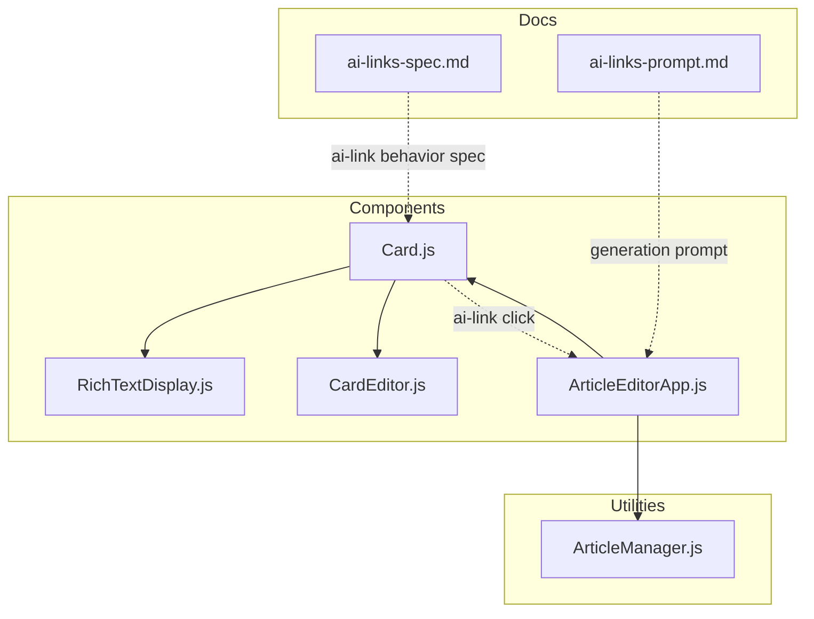
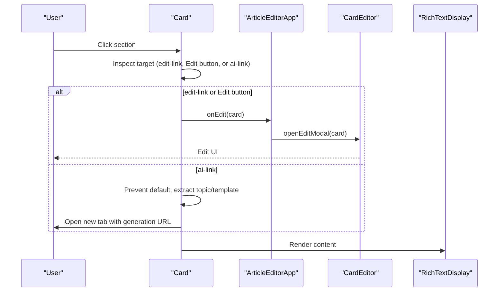
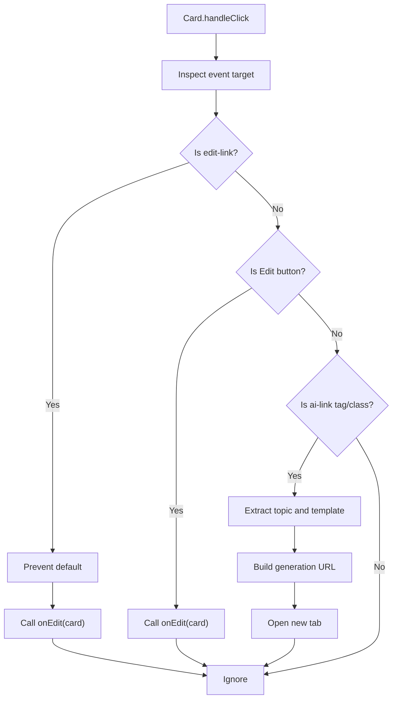
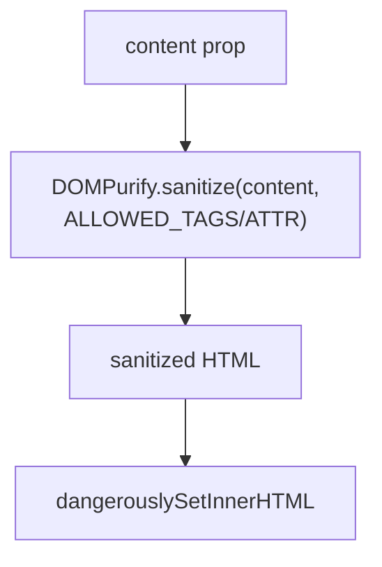
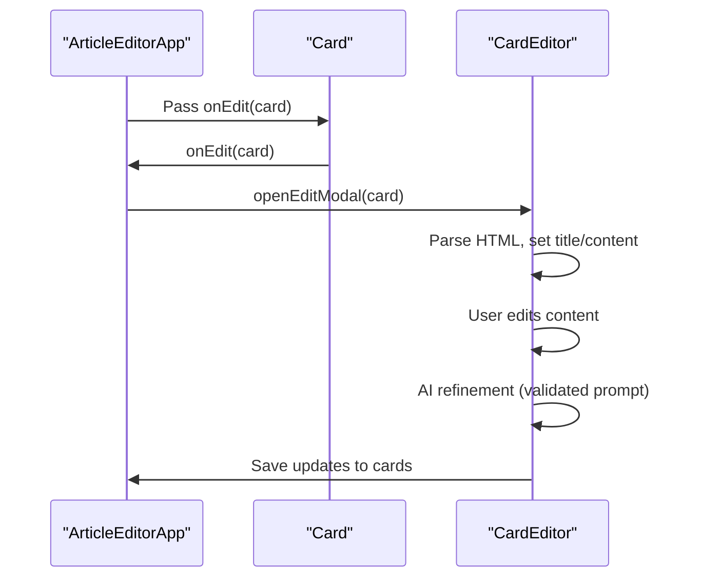
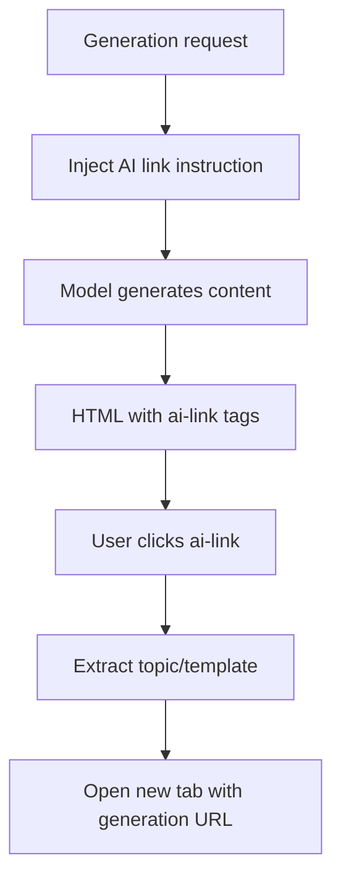
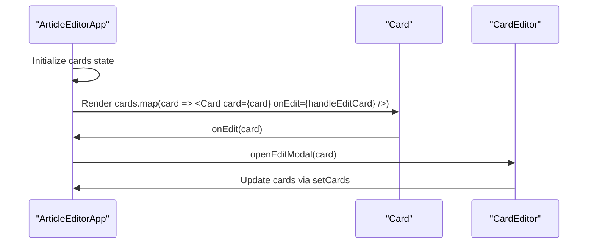
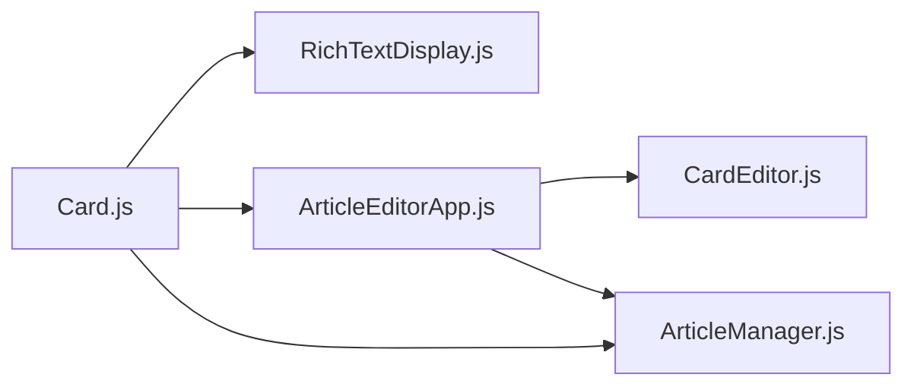

# Card Component

<cite>
**Referenced Files in This Document**
- [Card.js](file://src/components/Card.js)
- [ArticleEditorApp.js](file://src/components/ArticleEditorApp.js)
- [RichTextDisplay.js](file://src/components/RichTextDisplay.js)
- [CardEditor.js](file://src/components/CardEditor.js)
</cite>

## Update Summary
**Changes Made**
- Updated documentation to reflect the new 'Edit' button functionality in the Card component
- Added details about the new button-based editing interaction alongside the existing edit-link functionality
- Updated component analysis to include both click handlers for editing
- Enhanced usage examples to show the new editing pattern
- Updated accessibility guidelines to include button interaction considerations

## Table of Contents
1. [Introduction](#introduction)
2. [Project Structure](#project-structure)
3. [Core Components](#core-components)
4. [Architecture Overview](#architecture-overview)
5. [Detailed Component Analysis](#detailed-component-analysis)
6. [Dependency Analysis](#dependency-analysis)
7. [Performance Considerations](#performance-considerations)
8. [Accessibility Guidelines](#accessibility-guidelines)
9. [Troubleshooting Guide](#troubleshooting-guide)
10. [Conclusion](#conclusion)

## Introduction
The Card component is a focused container for individual article sections. It renders rich text content via RichTextDisplay and orchestrates user interactions through click handlers. Cards support:
- Inline editing via an edit-link that opens the CardEditor modal
- AI-driven content generation via ai-link tags that trigger contextual article generation in a new tab
- Direct editing through a dedicated 'Edit' button positioned alongside section headings

The component exposes a minimal API: a card prop containing id and content, and an onEdit callback to open the editor. It is rendered within ArticleEditorApp, which manages the full article lifecycle and state.

## Project Structure
The Card component lives alongside other UI building blocks in the components directory and integrates with the editor and display utilities.

**Diagram sources**
- [Card.js](file://src/components/Card.js#L1-L34)
- [ArticleEditorApp.js](file://src/components/ArticleEditorApp.js#L502-L561)
- [RichTextDisplay.js](file://src/components/RichTextDisplay.js#L1-L51)
- [CardEditor.js](file://src/components/CardEditor.js#L1-L482)
- [ai-links-spec.md](file://docs/ai-links-spec.md#L1-L33)
- [ai-links-prompt.md](file://docs/ai-links-prompt.md#L1-L15)
- [ArticleManager.js](file://src/utils/ArticleManager.js#L1-L152)

**Section sources**
- [Card.js](file://src/components/Card.js#L1-L34)
- [ArticleEditorApp.js](file://src/components/ArticleEditorApp.js#L502-L561)

## Core Components
- Card: Renders a single article section, handles edit and AI link clicks, and delegates content rendering to RichTextDisplay.
- RichTextDisplay: Safely renders HTML content, including ai-link tags, with DOMPurify and configured allowances.
- CardEditor: Modal editor invoked by Card’s edit-link to create or update card content and leverage AI refinement.
- ArticleEditorApp: Orchestrates article generation, routing, and rendering of cards; wires Card to onEdit.

Key props and responsibilities:
- Card props:
  - card: object with id and content
  - onEdit: callback invoked with card when edit-link is clicked
- Rendering:
  - Card wraps RichTextDisplay to render sanitized HTML content
- Interactions:
  - Click handler inspects target class or tag to route to edit or AI generation
  - AI links open a new tab with a generation action URL
  - Edit button triggers the onEdit callback for in-card editing

**Section sources**
- [Card.js](file://src/components/Card.js#L1-L34)
- [RichTextDisplay.js](file://src/components/RichTextDisplay.js#L1-L51)
- [CardEditor.js](file://src/components/CardEditor.js#L1-L482)
- [ArticleEditorApp.js](file://src/components/ArticleEditorApp.js#L502-L561)

## Architecture Overview
The Card component participates in a layered architecture:
- Presentation layer: Card renders content
- Interaction layer: Card handles click events for edit and AI
- Editor layer: CardEditor modal manages editing and AI refinement
- Orchestration layer: ArticleEditorApp manages generation, routing, and state

**Diagram sources**
- [Card.js](file://src/components/Card.js#L1-L34)
- [ArticleEditorApp.js](file://src/components/ArticleEditorApp.js#L346-L351)
- [CardEditor.js](file://src/components/CardEditor.js#L95-L150)
- [RichTextDisplay.js](file://src/components/RichTextDisplay.js#L1-L51)

## Detailed Component Analysis

### Card Component
Responsibilities:
- Render a single article section
- Handle click events for edit-link, Edit button, and ai-link
- Delegate content rendering to RichTextDisplay
- Pass card to onEdit callback for editor integration

Behavior highlights:
- Edit-link detection uses class matching and prevents default navigation
- Edit button click triggers the onEdit callback directly
- ai-link detection checks tag name or class and extracts topic and template attributes
- Opens a new tab with a generation URL constructed from topic and template
- Uses React.memo to minimize re-renders

Props:
- card: object with id and content
- onEdit: function(card) invoked when edit-link or Edit button is clicked

Rendering:
- Wraps RichTextDisplay to render sanitized HTML content
- Displays section heading with an adjacent Edit button when card.heading exists

Integration points:
- onEdit callback is wired from ArticleEditorApp’s handleEditCard
- ai-link tags are allowed by RichTextDisplay and handled by Card’s click logic
- Edit button provides an alternative, more prominent way to trigger editing

**Diagram sources**
- [Card.js](file://src/components/Card.js#L1-L34)

**Section sources**
- [Card.js](file://src/components/Card.js#L1-L34)

### RichTextDisplay Component
Responsibilities:
- Sanitize HTML content to prevent XSS
- Allow ai-link tag and its attributes
- Render content safely with dangerouslySetInnerHTML

Security and configuration:
- DOMPurify configured to allow ai-link and specific attributes
- Additional tags/attributes explicitly permitted for editor compatibility

**Diagram sources**
- [RichTextDisplay.js](file://src/components/RichTextDisplay.js#L1-L51)

**Section sources**
- [RichTextDisplay.js](file://src/components/RichTextDisplay.js#L1-L51)

### CardEditor Component
Responsibilities:
- Modal editor for creating/updating card content
- AI refinement pipeline integrated with Gemini API
- Keyboard shortcuts and validation for prompts
- Saving changes back to the cards array

Key interactions:
- Receives openEditModal via a forwarded ref from ArticleEditorApp
- Parses existing card HTML to populate title/content
- Adds edit-link markup when saving
- Integrates AI refinement with prompt validation and rate limiting

**Diagram sources**
- [ArticleEditorApp.js](file://src/components/ArticleEditorApp.js#L346-L351)
- [CardEditor.js](file://src/components/CardEditor.js#L95-L202)

**Section sources**
- [CardEditor.js](file://src/components/CardEditor.js#L1-L482)

### AI Link Integration
Specification:
- ai-link tag defines a phrase that triggers generation of a new article when clicked
- Attributes: topic (required), template (optional, defaults to guide)
- Behavior: click prevents default, extracts attributes, opens new tab with generation URL

Prompt integration:
- System prompt fragments instruct the model to embed ai-link tags for sub-topics during generation
- Generated HTML contains ai-link elements that the frontend recognizes

**Diagram sources**
- [ai-links-spec.md](file://docs/ai-links-spec.md#L1-L33)
- [ai-links-prompt.md](file://docs/ai-links-prompt.md#L1-L15)
- [Card.js](file://src/components/Card.js#L1-L34)

**Section sources**
- [ai-links-spec.md](file://docs/ai-links-spec.md#L1-L33)
- [ai-links-prompt.md](file://docs/ai-links-prompt.md#L1-L15)
- [Card.js](file://src/components/Card.js#L1-L34)

### Usage in ArticleEditorApp
ArticleEditorApp maps and renders cards in the editor view:
- Iterates over the cards state and passes each card with onEdit to Card
- The onEdit callback dispatches a custom event to open CardEditor modal
- Cards are created/updated by CardEditor and persisted via ArticleManager

**Diagram sources**
- [ArticleEditorApp.js](file://src/components/ArticleEditorApp.js#L502-L561)
- [Card.js](file://src/components/Card.js#L1-L34)
- [CardEditor.js](file://src/components/CardEditor.js#L95-L150)

**Section sources**
- [ArticleEditorApp.js](file://src/components/ArticleEditorApp.js#L502-L561)

## Dependency Analysis
- Card depends on RichTextDisplay for rendering and on ArticleEditorApp’s onEdit callback for editing
- RichTextDisplay depends on DOMPurify and allows ai-link tags
- CardEditor depends on ReactQuill and integrates with ArticleManager for persistence
- ArticleEditorApp coordinates Card rendering and CardEditor modal lifecycle

**Diagram sources**
- [Card.js](file://src/components/Card.js#L1-L34)
- [RichTextDisplay.js](file://src/components/RichTextDisplay.js#L1-L51)
- [ArticleEditorApp.js](file://src/components/ArticleEditorApp.js#L502-L561)
- [CardEditor.js](file://src/components/CardEditor.js#L1-L482)
- [ArticleManager.js](file://src/utils/ArticleManager.js#L1-L152)

**Section sources**
- [Card.js](file://src/components/Card.js#L1-L34)
- [ArticleEditorApp.js](file://src/components/ArticleEditorApp.js#L502-L561)
- [CardEditor.js](file://src/components/CardEditor.js#L1-L482)
- [RichTextDisplay.js](file://src/components/RichTextDisplay.js#L1-L51)
- [ArticleManager.js](file://src/utils/ArticleManager.js#L1-L152)

## Performance Considerations
- Card is wrapped with React.memo to prevent unnecessary re-renders when props are shallowly equal.
- RichTextDisplay renders sanitized HTML; ensure content is kept minimal and avoid excessive DOM nesting.
- CardEditor memoizes toolbar modules/formats and uses forwardRef to avoid extra wrapper renders.
- For large articles, consider:
  - Virtualizing card rendering if the list grows significantly
  - Debouncing or throttling frequent updates to cards
  - Persisting incremental changes to reduce re-computation

Guidance:
- Prefer stable card.id values to maximize memoization benefits
- Avoid passing new object instances as props; pass primitives or memoized objects
- Batch state updates when applying AI refinements to minimize re-renders

**Section sources**
- [Card.js](file://src/components/Card.js#L1-L34)
- [CardEditor.js](file://src/components/CardEditor.js#L386-L390)

## Accessibility Guidelines
- Keyboard navigation:
  - Ensure edit-link, Edit button, and ai-link are focusable and operable via Enter/Space
  - Provide clear focus indicators and skip links for long articles
- ARIA labeling:
  - Add aria-label or aria-labelledby to interactive elements inside cards
  - Use role="button" semantics for non-button interactive elements if needed
- Screen reader support:
  - Provide meaningful labels for EDIT actions and AI link triggers
  - Announce new tab navigation for ai-link interactions
- Focus management:
  - Manage focus when opening CardEditor modal and returning focus after closing
  - Ensure focus order remains logical across sections

Implementation tips:
- Wrap interactive anchors with explicit roles and labels where appropriate
- Announce state changes (e.g., "New tab opened for AI generation") to assistive technologies
- Test with screen readers and keyboard-only navigation

[No sources needed since this section provides general guidance]

## Troubleshooting Guide
Common issues and resolutions:
- ai-link not triggering generation:
  - Verify topic and template attributes are present and correctly encoded
  - Confirm click handler is attached and default is prevented
- Edit-link or Edit button not opening modal:
  - Ensure onEdit callback is passed and handleEditCard dispatches the expected event
  - Check that CardEditor is mounted and openEditModal is callable
- Rich text not rendering:
  - Confirm content is sanitized and includes allowed tags/attributes
  - Verify ai-link is allowed and properly formatted
- AI refinement not applied:
  - Validate prompt length and forbidden phrases
  - Check rate limiting and API availability

**Section sources**
- [Card.js](file://src/components/Card.js#L1-L34)
- [CardEditor.js](file://src/components/CardEditor.js#L238-L366)
- [RichTextDisplay.js](file://src/components/RichTextDisplay.js#L1-L51)

## Conclusion
The Card component serves as a focused, secure, and interactive container for article sections. It integrates seamlessly with RichTextDisplay for safe rendering, with CardEditor for editing and AI refinement, and with ArticleEditorApp for orchestration. By leveraging React.memo and careful event handling, it balances usability with performance. The ai-link specification enables contextual content generation, while the documented accessibility guidelines help ensure inclusive interactions. The addition of the dedicated Edit button provides users with a more intuitive way to initiate editing while maintaining backward compatibility with the existing edit-link functionality.