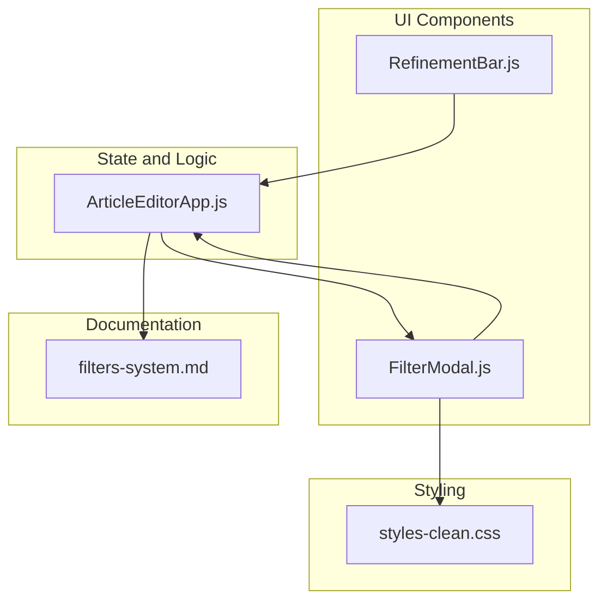
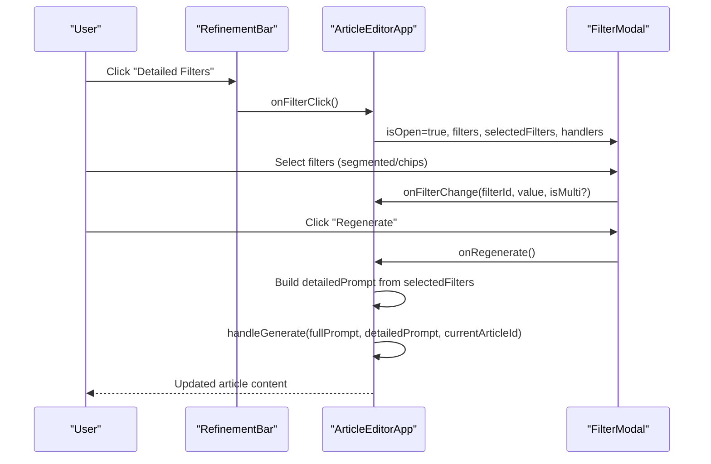
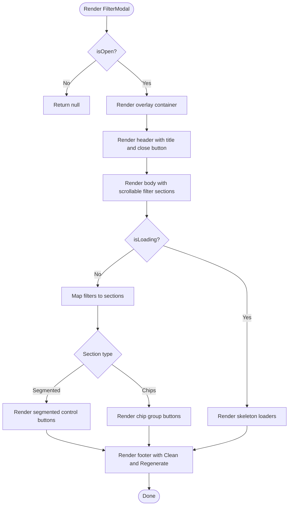
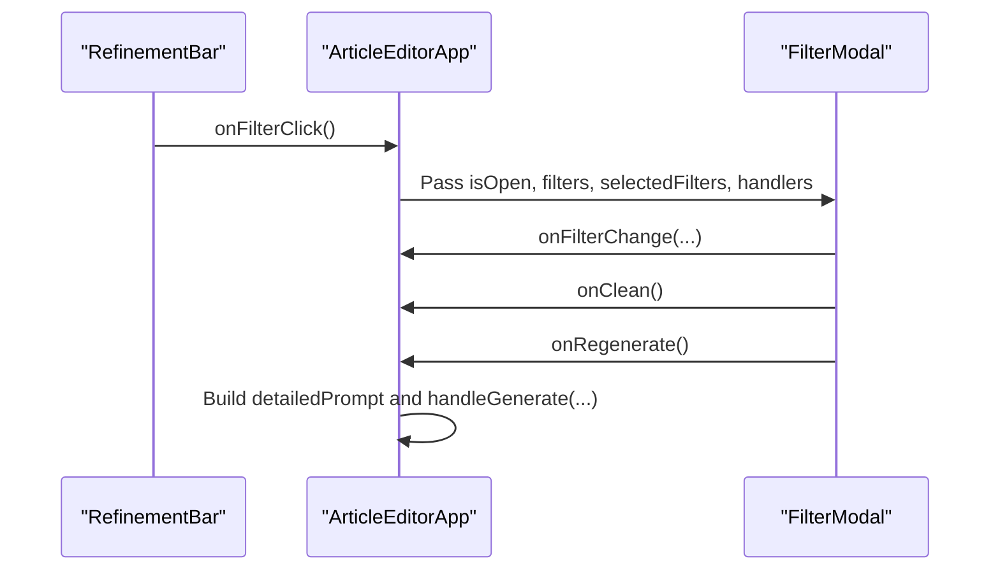
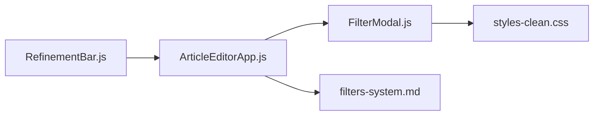

# FilterModal Component

<cite>
**Referenced Files in This Document**
- [FilterModal.js](file://src/components/FilterModal.js)
- [ArticleEditorApp.js](file://src/components/ArticleEditorApp.js)
- [RefinementBar.js](file://src/components/RefinementBar.js)
- [filters-system.md](file://docs/filters-system.md)
- [styles-clean.css](file://src/styles-clean.css)
</cite>

## Table of Contents
1. [Introduction](#introduction)
2. [Project Structure](#project-structure)
3. [Core Components](#core-components)
4. [Architecture Overview](#architecture-overview)
5. [Detailed Component Analysis](#detailed-component-analysis)
6. [Dependency Analysis](#dependency-analysis)
7. [Performance Considerations](#performance-considerations)
8. [Troubleshooting Guide](#troubleshooting-guide)
9. [Conclusion](#conclusion)
10. [Appendices](#appendices)

## Introduction
FilterModal is a modal overlay component that provides a comprehensive filtering interface for configuring article generation parameters. It appears when users click the filters button in RefinementBar and allows selection of single-choice segmented controls and multi-select chip groups. The component renders filter sections dynamically based on filter type, manages selections via a centralized handler, and exposes actions to clean selections and apply changes. It integrates with the broader filtering system described in the project documentation and participates in the end-to-end flow from user input to AI generation.

## Project Structure
FilterModal lives under the components directory and is composed with other UI elements:
- FilterModal: Modal overlay with header, body, and footer
- RefinementBar: Floating input bar that triggers FilterModal
- ArticleEditorApp: Orchestrates state, filter configuration, and regeneration flow
- filters-system.md: Explains the overall filtering system and integration points
- styles-clean.css: Provides modal-specific styles and skeleton loaders

**Diagram sources**
- [FilterModal.js](file://src/components/FilterModal.js#L1-L111)
- [ArticleEditorApp.js](file://src/components/ArticleEditorApp.js#L580-L607)
- [RefinementBar.js](file://src/components/RefinementBar.js#L1-L62)
- [filters-system.md](file://docs/filters-system.md#L1-L176)
- [styles-clean.css](file://src/styles-clean.css#L1110-L1309)

**Section sources**
- [FilterModal.js](file://src/components/FilterModal.js#L1-L111)
- [ArticleEditorApp.js](file://src/components/ArticleEditorApp.js#L580-L607)
- [RefinementBar.js](file://src/components/RefinementBar.js#L1-L62)
- [filters-system.md](file://docs/filters-system.md#L1-L176)
- [styles-clean.css](file://src/styles-clean.css#L1110-L1309)

## Core Components
- FilterModal: Renders the modal overlay, handles overlay click-to-close, and renders filter sections based on type. It accepts props for visibility, configuration, selections, and handlers for changes, cleaning, and regeneration. It also renders skeleton loaders while data is loading.
- ArticleEditorApp: Manages filter configuration, selected filters, and the regeneration flow. It passes props to FilterModal and orchestrates the build of the detailed prompt for AI generation.
- RefinementBar: Triggers FilterModal and provides the primary input for article generation. It disables the Regenerate button when there is no input and no active filters.

**Section sources**
- [FilterModal.js](file://src/components/FilterModal.js#L1-L111)
- [ArticleEditorApp.js](file://src/components/ArticleEditorApp.js#L220-L287)
- [RefinementBar.js](file://src/components/RefinementBar.js#L1-L62)

## Architecture Overview
FilterModal sits between RefinementBar and ArticleEditorApp in the UI flow. RefinementBar triggers FilterModal, which presents filter sections. Selections are propagated back to ArticleEditorApp via onFilterChange, and the user can apply changes by clicking Regenerate, which builds a detailed prompt and invokes the generation handler.

**Diagram sources**
- [RefinementBar.js](file://src/components/RefinementBar.js#L18-L39)
- [ArticleEditorApp.js](file://src/components/ArticleEditorApp.js#L580-L607)
- [ArticleEditorApp.js](file://src/components/ArticleEditorApp.js#L240-L287)
- [FilterModal.js](file://src/components/FilterModal.js#L81-L107)

## Detailed Component Analysis

### FilterModal Implementation
FilterModal is a presentational component that:
- Conditionally renders only when isOpen is true
- Handles overlay click-to-close by checking if the click target is the overlay itself
- Renders filter sections with either segmented controls (single-select) or chip groups (multi-select)
- Uses onFilterChange to update selections
- Exposes onClean to reset selections and onRegenerate to apply changes
- Renders skeleton loaders when isLoading is true

**Diagram sources**
- [FilterModal.js](file://src/components/FilterModal.js#L1-L111)

**Section sources**
- [FilterModal.js](file://src/components/FilterModal.js#L1-L111)

### Props and Behavior
- isOpen: Controls visibility of the modal
- onClose: Closes the modal (overlay click-to-close)
- filters: Array of filter sections with id, label, type, and options
- selectedFilters: Current selections keyed by filter id
- onFilterChange: Updates selections; for chips, toggles inclusion/exclusion
- onClean: Resets all selections
- onRegenerate: Applies changes and triggers regeneration
- isLoading: Enables skeleton loaders in the body

Selection logic:
- Single-select (segmented): Replaces the value for the filter id
- Multi-select (chips): Toggles the value in an array; duplicates are prevented

Overlay click-to-close:
- The overlay div listens for clicks and closes the modal when the click target equals the overlay itself

Skeleton loaders:
- Render a minimalized layout while isLoading is true

**Section sources**
- [FilterModal.js](file://src/components/FilterModal.js#L1-L111)
- [ArticleEditorApp.js](file://src/components/ArticleEditorApp.js#L240-L251)

### Integration with RefinementBar and ArticleEditorApp
- RefinementBar triggers FilterModal via onFilterClick and provides the Regenerate button logic
- ArticleEditorApp manages filters, selectedFilters, and the regeneration flow
- FilterModal receives filters and selectedFilters from ArticleEditorApp and forwards user interactions via handlers

**Diagram sources**
- [RefinementBar.js](file://src/components/RefinementBar.js#L18-L39)
- [ArticleEditorApp.js](file://src/components/ArticleEditorApp.js#L580-L607)
- [ArticleEditorApp.js](file://src/components/ArticleEditorApp.js#L240-L287)

**Section sources**
- [RefinementBar.js](file://src/components/RefinementBar.js#L1-L62)
- [ArticleEditorApp.js](file://src/components/ArticleEditorApp.js#L580-L607)
- [ArticleEditorApp.js](file://src/components/ArticleEditorApp.js#L240-L287)

### Filter Types and Rendering
- Segmented control: Single-select buttons; selection replaces the stored value
- Chip group: Multi-select chips; selection toggles inclusion in an array

Rendering logic:
- For segmented: Button with active state based on equality
- For chips: Button with active state based on membership in array

**Section sources**
- [FilterModal.js](file://src/components/FilterModal.js#L21-L64)

### Styling and Skeleton Loaders
- Modal overlay and content are styled for centered presentation and responsive behavior
- Segmented control and chip styles define active states and hover effects
- Skeleton loaders provide a loading experience with animated placeholders

**Section sources**
- [styles-clean.css](file://src/styles-clean.css#L1110-L1309)

### Accessibility Considerations
Current implementation does not include explicit ARIA roles or keyboard navigation handling. Recommendations for improvement:
- Add aria-modal and aria-hidden attributes on the overlay and modal content when open/closed
- Manage focus trapping inside the modal (e.g., move focus to the first interactive element on open, trap focus within the modal)
- Ensure keyboard navigation support (Tab order, Escape to close)
- Provide accessible labels for filter sections and chips
- Announce selection changes to assistive technologies

[No sources needed since this section provides general guidance]

## Dependency Analysis
FilterModal depends on:
- ArticleEditorApp for state and handlers
- RefinementBar for triggering the modal
- filters-system.md for conceptual integration and filter types
- styles-clean.css for modal and filter UI

**Diagram sources**
- [RefinementBar.js](file://src/components/RefinementBar.js#L1-L62)
- [ArticleEditorApp.js](file://src/components/ArticleEditorApp.js#L580-L607)
- [FilterModal.js](file://src/components/FilterModal.js#L1-L111)
- [filters-system.md](file://docs/filters-system.md#L1-L176)
- [styles-clean.css](file://src/styles-clean.css#L1110-L1309)

**Section sources**
- [RefinementBar.js](file://src/components/RefinementBar.js#L1-L62)
- [ArticleEditorApp.js](file://src/components/ArticleEditorApp.js#L580-L607)
- [FilterModal.js](file://src/components/FilterModal.js#L1-L111)
- [filters-system.md](file://docs/filters-system.md#L1-L176)
- [styles-clean.css](file://src/styles-clean.css#L1110-L1309)

## Performance Considerations
- Conditional rendering: FilterModal only renders when isOpen is true, minimizing DOM overhead
- Efficient selection updates: onFilterChange uses immutable updates to avoid unnecessary re-renders
- Skeleton loaders: Provide perceived performance while filters are being fetched
- Scrollable body: Ensures long filter lists remain usable without excessive layout thrashing

[No sources needed since this section provides general guidance]

## Troubleshooting Guide
- Modal does not appear:
  - Verify isOpen prop is true when the filters button is clicked
  - Confirm that the overlay click-to-close logic is not interfering with intended interactions
- Selections not updating:
  - Ensure onFilterChange is passed correctly and is invoked with the correct arguments (filter id, value, isMulti flag for chips)
  - Check that selectedFilters is initialized and updated immutably
- Overlay click does nothing:
  - Confirm the click target equals the overlay container; otherwise, the click occurred inside the modal content
- Regenerate not applying:
  - Ensure onRegenerate is bound and that detailedPrompt is constructed from selectedFilters
  - Verify that handleGenerate is called with the correct parameters

**Section sources**
- [FilterModal.js](file://src/components/FilterModal.js#L13-L20)
- [ArticleEditorApp.js](file://src/components/ArticleEditorApp.js#L240-L287)

## Conclusion
FilterModal provides a focused, accessible filtering experience within the article generation workflow. Its three-part structure—header, body, and footer—aligns with the overall filtering system documented in filters-system.md. Integration with RefinementBar and ArticleEditorApp enables seamless transitions from user input to AI-driven content generation. Enhancements to accessibility and keyboard navigation would further improve usability for diverse users.

[No sources needed since this section summarizes without analyzing specific files]

## Appendices

### Props Reference
- isOpen: Boolean controlling visibility
- onClose: Function to close the modal
- filters: Array of filter sections with id, label, type, options
- selectedFilters: Object mapping filter ids to selected values or arrays
- onFilterChange: Function to update selections
- onClean: Function to reset selections
- onRegenerate: Function to apply changes and regenerate
- isLoading: Boolean enabling skeleton loaders

**Section sources**
- [FilterModal.js](file://src/components/FilterModal.js#L3-L12)
- [ArticleEditorApp.js](file://src/components/ArticleEditorApp.js#L580-L607)

### Integration Examples
- Triggering FilterModal from RefinementBar:
  - onFilterClick sets the internal state to show the modal
- Applying filters and regenerating:
  - onRegenerate constructs a detailed prompt from selectedFilters and calls the generation handler

**Section sources**
- [RefinementBar.js](file://src/components/RefinementBar.js#L18-L39)
- [ArticleEditorApp.js](file://src/components/ArticleEditorApp.js#L240-L287)