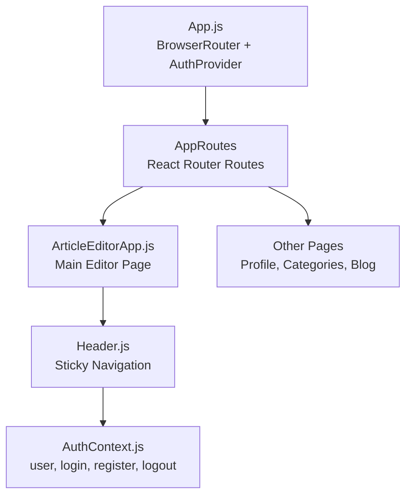
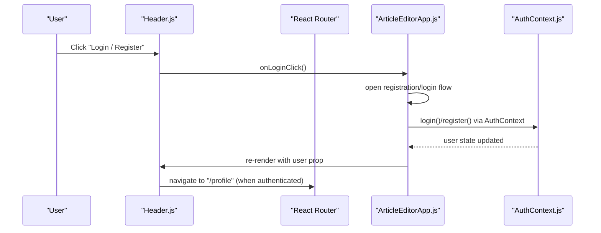
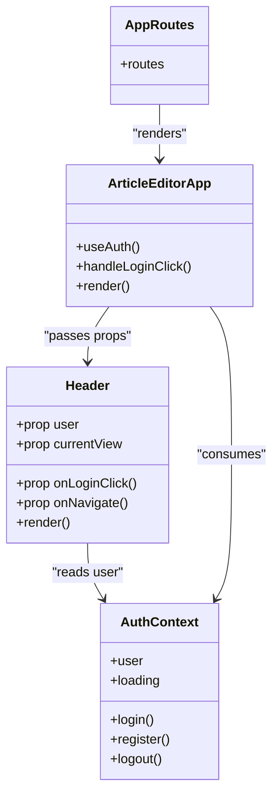
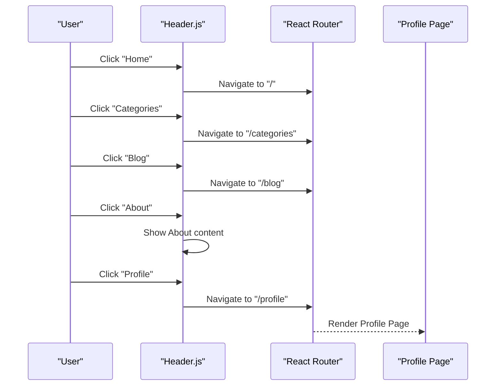
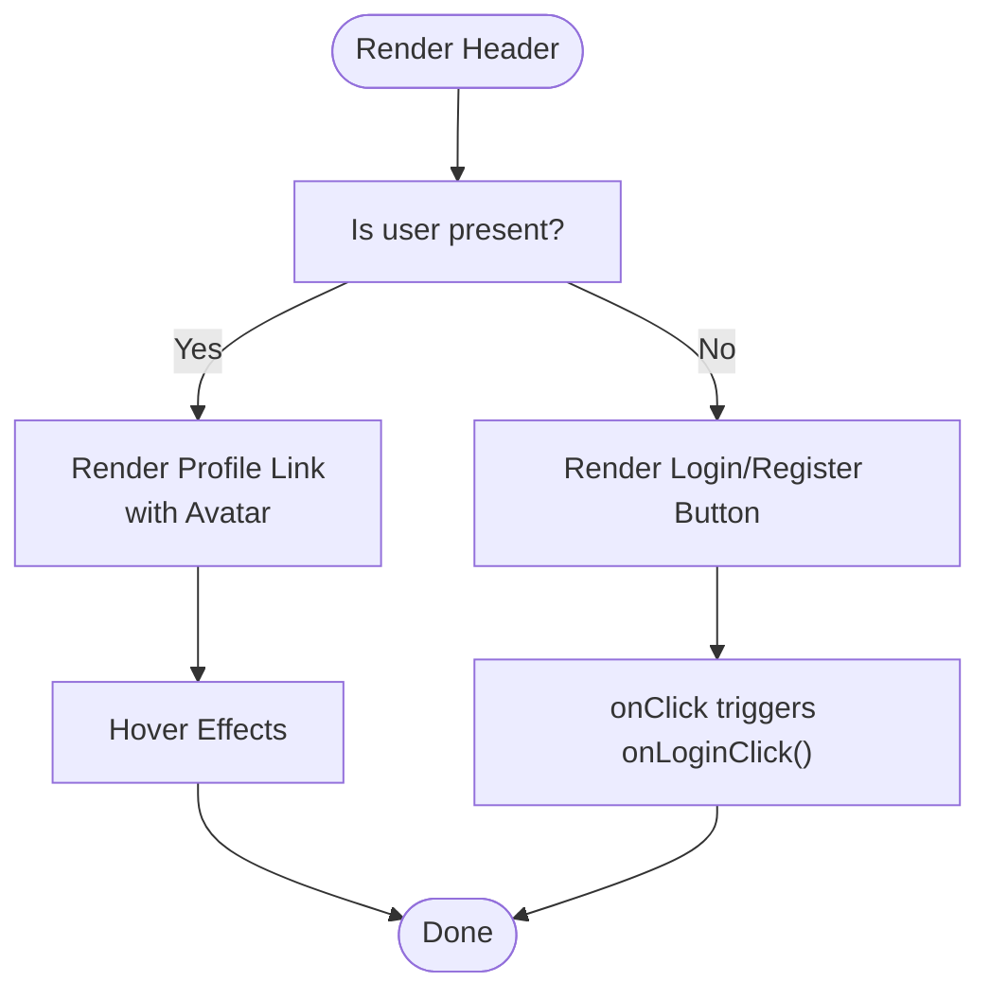
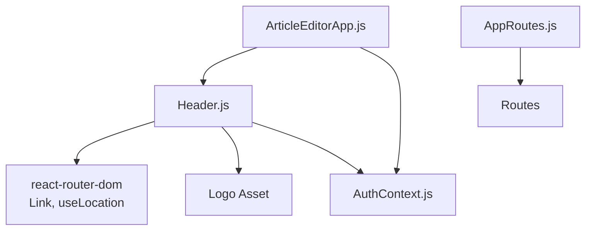

# Header Component

<cite>
**Referenced Files in This Document**
- [Header.js](file://src/components/Header.js)
- [AuthContext.js](file://src/context/AuthContext.js)
- [ArticleEditorApp.js](file://src/components/ArticleEditorApp.js)
- [index.js](file://src/routes/index.js)
- [App.js](file://src/App.js)
- [project_concept.md](file://project_concept.md)
</cite>

## Table of Contents
1. [Introduction](#introduction)
2. [Project Structure](#project-structure)
3. [Core Components](#core-components)
4. [Architecture Overview](#architecture-overview)
5. [Detailed Component Analysis](#detailed-component-analysis)
6. [Dependency Analysis](#dependency-analysis)
7. [Performance Considerations](#performance-considerations)
8. [Troubleshooting Guide](#troubleshooting-guide)
9. [Conclusion](#conclusion)
10. [Appendices](#appendices)

## Introduction
This document describes the Header component used as a sticky navigation bar at the top of the viewport. It explains the three-section layout (left logo, center navigation, right account management), conditional rendering for authenticated vs unauthenticated users, styling and responsiveness, and integration with routing and authentication contexts. It also outlines accessibility considerations and provides examples of how to integrate with React Router and authentication context.

## Project Structure
The Header component resides under the components folder and is integrated into the main application via the ArticleEditorApp container. Authentication state is provided by the AuthContext provider, and routing is handled by React Router.

**Diagram sources**
- [App.js](file://src/App.js#L1-L20)
- [index.js](file://src/routes/index.js#L1-L22)
- [ArticleEditorApp.js](file://src/components/ArticleEditorApp.js#L563-L580)
- [Header.js](file://src/components/Header.js#L1-L87)
- [AuthContext.js](file://src/context/AuthContext.js#L1-L110)

**Section sources**
- [App.js](file://src/App.js#L1-L20)
- [index.js](file://src/routes/index.js#L1-L22)

## Core Components
- Header: A sticky navigation bar with three sections and conditional account controls.
- AuthContext: Provides authentication state and actions to the app.
- ArticleEditorApp: Integrates Header and passes props for user state and navigation callbacks.
- AppRoutes: Defines page routes for Home, Profile, Categories, and Blog.

Key responsibilities:
- Header manages sticky positioning, three-section layout, and conditional rendering of login/register vs profile link with avatar.
- AuthContext exposes user state and login/logout flows.
- ArticleEditorApp wires Header to authentication and routing.

**Section sources**
- [Header.js](file://src/components/Header.js#L1-L87)
- [AuthContext.js](file://src/context/AuthContext.js#L1-L110)
- [ArticleEditorApp.js](file://src/components/ArticleEditorApp.js#L563-L580)
- [index.js](file://src/routes/index.js#L1-L22)

## Architecture Overview
The Header participates in a layered architecture:
- Presentation layer: Header component renders UI and handles click events.
- State layer: AuthContext provides user state and authentication actions.
- Routing layer: React Router defines navigable pages; Header links route to Home, Categories, Blog, and Profile.

**Diagram sources**
- [Header.js](file://src/components/Header.js#L56-L78)
- [ArticleEditorApp.js](file://src/components/ArticleEditorApp.js#L563-L580)
- [AuthContext.js](file://src/context/AuthContext.js#L31-L56)
- [index.js](file://src/routes/index.js#L12-L16)

## Detailed Component Analysis

### Sticky Navigation Behavior
- The Header is positioned at the top of the viewport and remains fixed during scrolling using a sticky positioning class.
- It has a white background, a subtle shadow below, and a border at the bottom to visually separate it from content.
- On small screens, the center navigation menu is hidden and replaced by a mobile-friendly layout.

Implementation highlights:
- Sticky positioning and z-index ensure the header overlays content while scrolling.
- Shadow and border enhance readability against page content.
- Mobile responsiveness hides the center nav links on smaller screens.

**Section sources**
- [Header.js](file://src/components/Header.js#L12-L20)

### Three-Section Layout
- Left section: Logo that links to the Home route.
- Center section: Navigation links to Home, Categories, Blog, and About.
- Right section: Conditional account management:
  - Unauthenticated: Login/Register button.
  - Authenticated: Profile link with a colored avatar placeholder derived from the user’s email.

Active state highlighting:
- Home link highlights when the current view is set to "home".
- Categories link highlights when the URL path equals "/categories".
- Blog link highlights when the URL path starts with "/blog".
- Profile link highlights with a light blue background when the current view is "profile".

Hover states:
- Links and buttons have hover effects for improved interactivity.

Responsive behavior:
- The center navigation is hidden on small screens, prioritizing the logo and account controls.

**Section sources**
- [Header.js](file://src/components/Header.js#L16-L80)

### Conditional Rendering: Authenticated vs Unauthenticated
- When user is present, the right section shows a profile link with an avatar and a label.
- When user is absent, the right section shows a prominent Login/Register button.
- The profile link navigates to the Profile route.

Integration points:
- The ArticleEditorApp supplies the user prop and onLoginClick callback to Header.
- The AuthContext provides the user state used by the parent container.

**Section sources**
- [Header.js](file://src/components/Header.js#L56-L78)
- [ArticleEditorApp.js](file://src/components/ArticleEditorApp.js#L563-L580)
- [AuthContext.js](file://src/context/AuthContext.js#L1-L110)

### Props and Their Roles
- user: Object containing user identity (e.g., email). Used to render the avatar and decide conditional content.
- onLoginClick: Callback invoked when the Login/Register button is clicked.
- onNavigate: Handler passed to Header to manage navigation actions (e.g., opening modals or routing).
- currentView: String indicating the active view (e.g., "home", "profile"). Used to highlight active navigation items.

These props enable the Header to remain decoupled from routing specifics while still enabling navigation and highlighting behavior.

**Section sources**
- [Header.js](file://src/components/Header.js#L5-L10)
- [ArticleEditorApp.js](file://src/components/ArticleEditorApp.js#L563-L580)

### Styling Details
- Background: White.
- Shadow: Bottom shadow for separation from content.
- Borders: Light bottom border.
- Typography: Medium-weight text for links with hover transitions.
- Interactive states: Hover effects on links and buttons.
- Avatar: Circular placeholder with initials derived from the user’s email.
- Responsive: Center navigation hidden on small screens; profile label hidden on small screens.

**Section sources**
- [Header.js](file://src/components/Header.js#L12-L80)

### Accessibility Considerations
- Focus management: Ensure keyboard navigation moves predictably among logo, navigation links, and account controls. Provide visible focus indicators.
- Screen reader support: Use semantic elements (nav, button, Link) and ensure labels are descriptive. Consider aria-current for active navigation items.
- Contrast and readability: Maintain sufficient contrast for text and hover states.
- Keyboard operability: Allow activation of links and buttons via Enter/Space keys.

[No sources needed since this section provides general guidance]

### Integration Examples

#### With React Router
- Define routes for Home, Categories, Blog, and Profile.
- Use Link components for navigation within the Header.
- Use the current URL to determine active states (as implemented).

**Section sources**
- [index.js](file://src/routes/index.js#L1-L22)
- [Header.js](file://src/components/Header.js#L21-L54)

#### With Authentication Context
- Wrap the app with AuthProvider to supply user state and authentication actions.
- Pass user and onLoginClick to Header from the parent container.
- Use the user prop to conditionally render the profile link or login/register button.

**Section sources**
- [App.js](file://src/App.js#L1-L20)
- [AuthContext.js](file://src/context/AuthContext.js#L1-L110)
- [ArticleEditorApp.js](file://src/components/ArticleEditorApp.js#L563-L580)
- [Header.js](file://src/components/Header.js#L56-L78)

## Architecture Overview

**Diagram sources**
- [Header.js](file://src/components/Header.js#L1-L87)
- [AuthContext.js](file://src/context/AuthContext.js#L1-L110)
- [ArticleEditorApp.js](file://src/components/ArticleEditorApp.js#L563-L580)
- [index.js](file://src/routes/index.js#L1-L22)

## Detailed Component Analysis

### Component Implementation Notes
- Sticky behavior is achieved via Tailwind-like classes applied directly in the JSX.
- Active state detection uses the current URL and a simple view identifier.
- Conditional rendering switches between login/register and profile controls based on user presence.

**Section sources**
- [Header.js](file://src/components/Header.js#L1-L87)

### Navigation Flow

**Diagram sources**
- [Header.js](file://src/components/Header.js#L21-L54)
- [index.js](file://src/routes/index.js#L12-L16)

### Conditional Rendering Flow

**Diagram sources**
- [Header.js](file://src/components/Header.js#L56-L78)
- [ArticleEditorApp.js](file://src/components/ArticleEditorApp.js#L563-L580)

## Dependency Analysis

**Diagram sources**
- [Header.js](file://src/components/Header.js#L1-L10)
- [ArticleEditorApp.js](file://src/components/ArticleEditorApp.js#L563-L580)
- [index.js](file://src/routes/index.js#L1-L22)
- [AuthContext.js](file://src/context/AuthContext.js#L1-L110)

**Section sources**
- [Header.js](file://src/components/Header.js#L1-L10)
- [ArticleEditorApp.js](file://src/components/ArticleEditorApp.js#L563-L580)
- [index.js](file://src/routes/index.js#L1-L22)
- [AuthContext.js](file://src/context/AuthContext.js#L1-L110)

## Performance Considerations
- Keep the Header lightweight; it is always mounted and rendered at the top of the viewport.
- Avoid heavy computations in render; rely on memoization or stable references for callbacks.
- Minimize re-renders by passing stable references for onLoginClick and onNavigate.
- Use CSS transitions for hover states rather than JavaScript animations.

[No sources needed since this section provides general guidance]

## Troubleshooting Guide
- Active state not highlighting:
  - Verify currentView prop is set appropriately in the parent container.
  - Confirm URL path checks match actual routes.
- Login/Register button not triggering:
  - Ensure onLoginClick is passed and not null.
  - Check that the parent container invokes the intended action (e.g., opening a modal).
- Profile link not visible:
  - Confirm user prop is truthy.
  - Ensure the Profile route exists and is reachable.
- Sticky behavior not working:
  - Verify the sticky positioning class is applied and z-index is sufficient.
  - Ensure no conflicting styles override the sticky behavior.

**Section sources**
- [Header.js](file://src/components/Header.js#L56-L78)
- [ArticleEditorApp.js](file://src/components/ArticleEditorApp.js#L563-L580)
- [index.js](file://src/routes/index.js#L12-L16)

## Conclusion
The Header component provides a clean, sticky navigation bar with three distinct sections and responsive behavior. It integrates seamlessly with React Router for navigation and with the authentication context for conditional rendering. By following the outlined integration steps and accessibility guidelines, teams can maintain a consistent and usable navigation experience across the application.

## Appendices

### Design Decisions from Project Concept
- Persistent access to core navigation is emphasized for usability.
- The sticky header ensures continuous access to Home, Categories, Blog, and Profile.
- Visual style includes a white background, bottom shadow, and clear hover states.

**Section sources**
- [project_concept.md](file://project_concept.md#L121-L141)