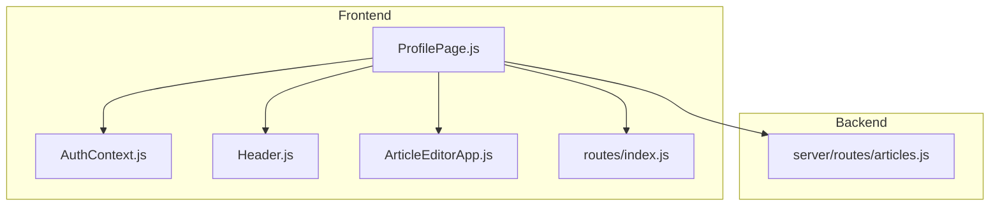
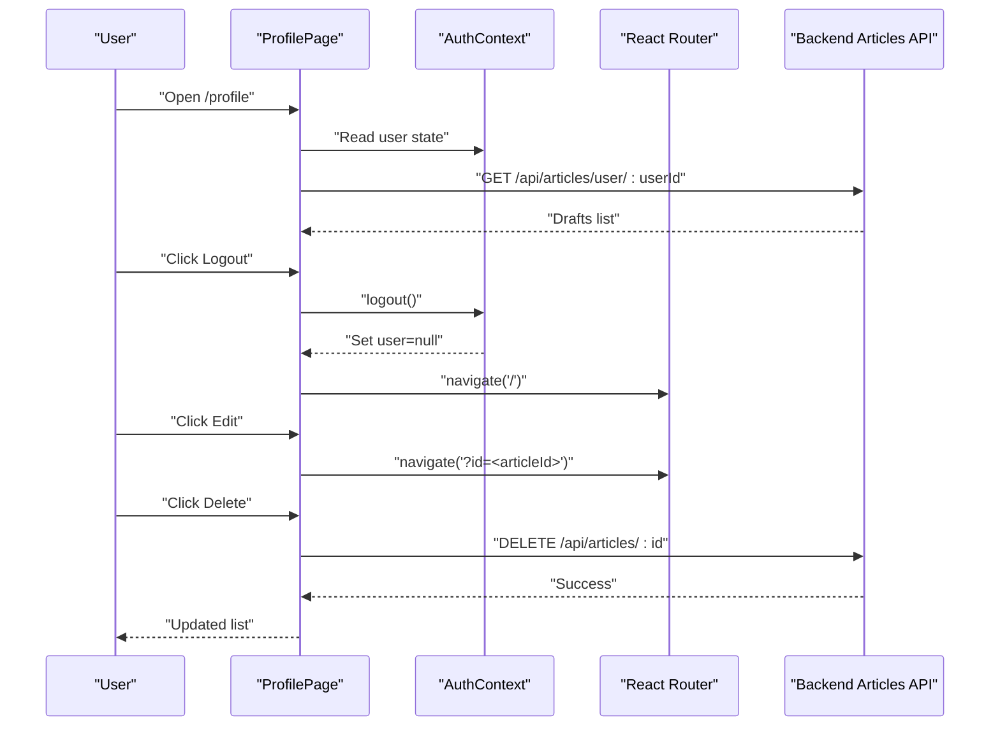
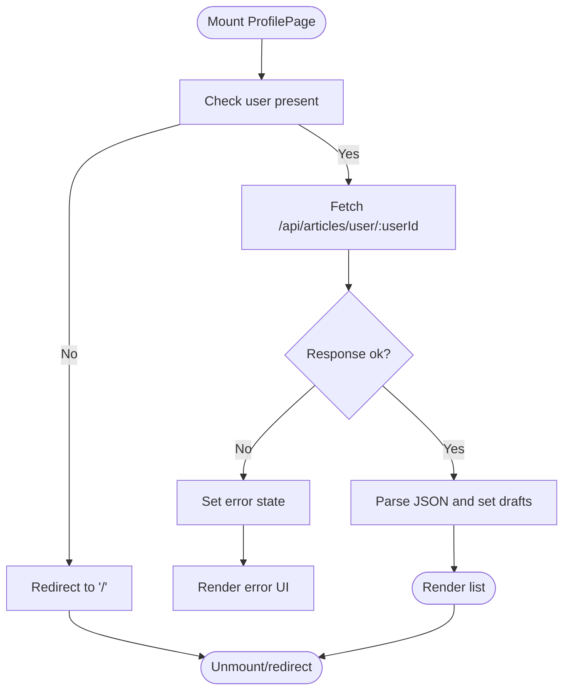
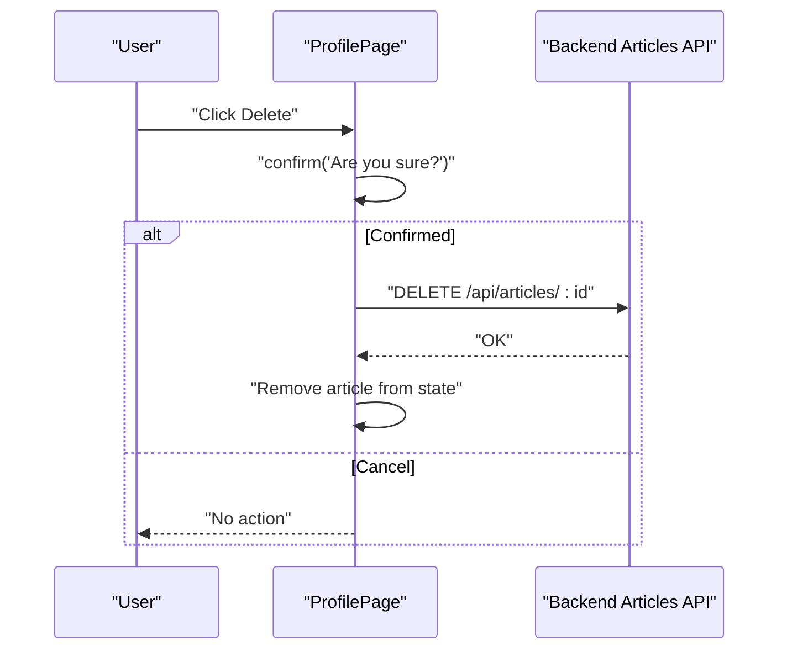
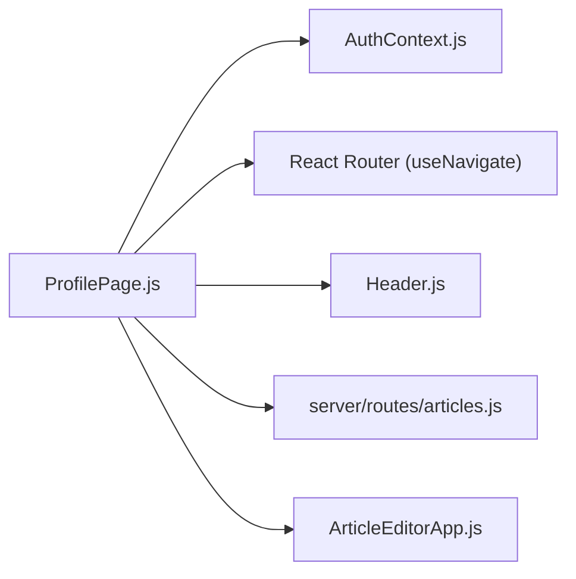

# ProfilePage Component

<cite>
**Referenced Files in This Document**
- [ProfilePage.js](file://src/components/ProfilePage.js)
- [AuthContext.js](file://src/context/AuthContext.js)
- [Header.js](file://src/components/Header.js)
- [index.js](file://src/routes/index.js)
- [ArticleEditorApp.js](file://src/components/ArticleEditorApp.js)
- [articles.js](file://server/routes/articles.js)
- [project_concept.md](file://project_concept.md)
</cite>

## Table of Contents
1. [Introduction](#introduction)
2. [Project Structure](#project-structure)
3. [Core Components](#core-components)
4. [Architecture Overview](#architecture-overview)
5. [Detailed Component Analysis](#detailed-component-analysis)
6. [Dependency Analysis](#dependency-analysis)
7. [Performance Considerations](#performance-considerations)
8. [Troubleshooting Guide](#troubleshooting-guide)
9. [Conclusion](#conclusion)
10. [Appendices](#appendices)

## Introduction
This document describes the ProfilePage component as a user dashboard for managing saved articles with full CRUD capabilities. It explains the layout, data fetching, navigation, and integration with authentication and routing. It also aligns the implementation with the project’s design concepts for responsive layout and user experience.

## Project Structure
ProfilePage resides in the components folder and integrates with:
- Authentication context for user state and logout
- React Router for navigation
- Backend API for fetching, editing, creating, and deleting articles
- Shared Header component for navigation and account actions

**Diagram sources**
- [ProfilePage.js](file://src/components/ProfilePage.js#L1-L147)
- [AuthContext.js](file://src/context/AuthContext.js#L1-L110)
- [Header.js](file://src/components/Header.js#L1-L87)
- [index.js](file://src/routes/index.js#L1-L22)
- [ArticleEditorApp.js](file://src/components/ArticleEditorApp.js#L1-L649)
- [articles.js](file://server/routes/articles.js#L1-L228)

**Section sources**
- [ProfilePage.js](file://src/components/ProfilePage.js#L1-L147)
- [index.js](file://src/routes/index.js#L1-L22)

## Core Components
- ProfilePage: Renders the user’s saved articles, handles logout, edit, create, and delete actions, and manages loading/error states.
- AuthContext: Provides authentication state and logout functionality used by ProfilePage.
- Header: Shared header component used on ProfilePage for navigation and account actions.
- routes/index.js: Declares the route mapping for ProfilePage.
- server/routes/articles.js: Implements the backend endpoints used by ProfilePage.

**Section sources**
- [ProfilePage.js](file://src/components/ProfilePage.js#L1-L147)
- [AuthContext.js](file://src/context/AuthContext.js#L1-L110)
- [Header.js](file://src/components/Header.js#L1-L87)
- [index.js](file://src/routes/index.js#L1-L22)
- [articles.js](file://server/routes/articles.js#L83-L123)

## Architecture Overview
ProfilePage orchestrates:
- Authentication state via useAuth
- Data fetching on mount using the backend endpoint for user drafts
- Navigation via useNavigate for logout and creating new articles
- Editing by navigating to the editor with article ID
- Deletion via DELETE request to the backend with confirmation

**Diagram sources**
- [ProfilePage.js](file://src/components/ProfilePage.js#L13-L60)
- [AuthContext.js](file://src/context/AuthContext.js#L85-L96)
- [articles.js](file://server/routes/articles.js#L83-L123)
- [ArticleEditorApp.js](file://src/components/ArticleEditorApp.js#L477-L492)

## Detailed Component Analysis

### Layout and Visual Design
- Header: Displays logo, navigation links, and account actions. On ProfilePage, the profile link is highlighted based on currentView.
- Main content area:
  - My Articles heading
  - Responsive list of article entries
  - Logout button aligned with the heading
- Article entry:
  - Title rendered as an editable link/button that navigates to the editor with the article ID
  - Modification date displayed as a small text label
  - Delete button aligned to the right with confirmation

Responsive layout follows the project concept’s guidance for mobile-first design and vertical stacking on smaller screens.

**Section sources**
- [ProfilePage.js](file://src/components/ProfilePage.js#L82-L144)
- [Header.js](file://src/components/Header.js#L1-L87)
- [project_concept.md](file://project_concept.md#L143-L161)

### Authentication and Navigation
- Authentication context:
  - useAuth provides user state and logout
  - ProfilePage reads user and invokes logout
- Navigation:
  - useNavigate is used for redirecting after logout and for creating new articles
  - Article editing navigates to the editor with article ID in the URL

**Section sources**
- [ProfilePage.js](file://src/components/ProfilePage.js#L1-L12)
- [AuthContext.js](file://src/context/AuthContext.js#L1-L110)
- [ArticleEditorApp.js](file://src/components/ArticleEditorApp.js#L477-L492)

### Data Fetching and CRUD Operations

#### Fetching Articles on Mount
- On mount, ProfilePage checks for a logged-in user and fetches drafts from the backend endpoint for the current user ID.
- Loading and error states are handled with appropriate UI feedback.
- The fetched drafts are stored in component state.

**Diagram sources**
- [ProfilePage.js](file://src/components/ProfilePage.js#L13-L31)
- [articles.js](file://server/routes/articles.js#L83-L101)

**Section sources**
- [ProfilePage.js](file://src/components/ProfilePage.js#L13-L31)
- [articles.js](file://server/routes/articles.js#L83-L101)

#### Editing Articles
- Clicking the article title navigates to the editor with the article ID in the URL.
- The editor loads the article content and allows editing.

**Section sources**
- [ProfilePage.js](file://src/components/ProfilePage.js#L38-L41)
- [ArticleEditorApp.js](file://src/components/ArticleEditorApp.js#L477-L492)

#### Creating New Articles
- Clicking the “Create your first article” action navigates to the editor, which creates a new article and persists it to the backend.

**Section sources**
- [ProfilePage.js](file://src/components/ProfilePage.js#L43-L45)
- [ArticleEditorApp.js](file://src/components/ArticleEditorApp.js#L372-L418)

#### Deleting Articles with Confirmation
- Clicking Delete triggers a browser confirmation dialog.
- If confirmed, a DELETE request is sent to the backend endpoint for the article ID.
- On success, the article is removed from the local list.

**Diagram sources**
- [ProfilePage.js](file://src/components/ProfilePage.js#L47-L60)
- [articles.js](file://server/routes/articles.js#L103-L123)

**Section sources**
- [ProfilePage.js](file://src/components/ProfilePage.js#L47-L60)
- [articles.js](file://server/routes/articles.js#L103-L123)

### Backend Integration Details
- Fetch user drafts: GET /api/articles/user/:userId
- Delete article: DELETE /api/articles/:id
- Authentication cookies are included in requests to maintain session state.

**Section sources**
- [ProfilePage.js](file://src/components/ProfilePage.js#L17-L28)
- [ProfilePage.js](file://src/components/ProfilePage.js#L49-L59)
- [articles.js](file://server/routes/articles.js#L83-L123)

### Accessibility Considerations
- Proper labeling:
  - Buttons for Logout and Delete have clear text labels.
  - The article title is presented as a button with accessible text.
- Keyboard navigation:
  - Buttons receive focus and can be activated via Enter/Space.
  - The list is structured as a grid for improved readability.
- Screen reader support:
  - Dynamic content updates occur via state changes; ensure announcements are handled by the framework.
  - Use of semantic elements and clear labels improves screen reader comprehension.

**Section sources**
- [ProfilePage.js](file://src/components/ProfilePage.js#L93-L135)
- [project_concept.md](file://project_concept.md#L143-L161)

## Dependency Analysis
ProfilePage depends on:
- AuthContext for user state and logout
- React Router for navigation
- Backend Articles API for CRUD operations
- Header component for shared UI

**Diagram sources**
- [ProfilePage.js](file://src/components/ProfilePage.js#L1-L147)
- [AuthContext.js](file://src/context/AuthContext.js#L1-L110)
- [Header.js](file://src/components/Header.js#L1-L87)
- [index.js](file://src/routes/index.js#L1-L22)
- [ArticleEditorApp.js](file://src/components/ArticleEditorApp.js#L1-L649)
- [articles.js](file://server/routes/articles.js#L1-L228)

**Section sources**
- [ProfilePage.js](file://src/components/ProfilePage.js#L1-L147)
- [AuthContext.js](file://src/context/AuthContext.js#L1-L110)
- [Header.js](file://src/components/Header.js#L1-L87)
- [index.js](file://src/routes/index.js#L1-L22)
- [ArticleEditorApp.js](file://src/components/ArticleEditorApp.js#L1-L649)
- [articles.js](file://server/routes/articles.js#L1-L228)

## Performance Considerations
- Network requests:
  - Include credentials to reuse authentication cookies.
  - Handle errors gracefully to avoid repeated retries.
- Rendering:
  - Use minimal re-renders by updating only the affected article in the list after deletion.
  - Consider virtualizing long lists if drafts grow significantly.
- UX:
  - Provide immediate visual feedback on actions (loading spinner, success/error messages).
  - Avoid blocking the UI during confirmations.

[No sources needed since this section provides general guidance]

## Troubleshooting Guide
- Authentication issues:
  - If user is null, ProfilePage redirects to the home page. Verify AuthContext is wrapping the app and that the backend auth endpoint is reachable.
- Fetch failures:
  - Check network connectivity and backend availability. Confirm the user ID matches the authenticated user.
- Delete failures:
  - Ensure the user owns the article and that the backend responds with success. Review console logs for error details.
- Navigation problems:
  - Confirm routes are defined and that the editor expects an article ID in the URL.

**Section sources**
- [ProfilePage.js](file://src/components/ProfilePage.js#L82-L90)
- [AuthContext.js](file://src/context/AuthContext.js#L1-L110)
- [articles.js](file://server/routes/articles.js#L83-L123)

## Conclusion
ProfilePage provides a focused dashboard for users to manage their saved articles. It integrates authentication, navigation, and backend APIs to deliver a seamless CRUD experience. The component’s layout and behavior align with the project’s responsive design goals and user experience guidelines.

[No sources needed since this section summarizes without analyzing specific files]

## Appendices

### API Endpoints Used by ProfilePage
- GET /api/articles/user/:userId
  - Purpose: Retrieve drafts owned by the current user
  - Notes: Requires authentication; returns a drafts array
- DELETE /api/articles/:id
  - Purpose: Delete a specific draft owned by the current user
  - Notes: Requires authentication; returns success on removal

**Section sources**
- [ProfilePage.js](file://src/components/ProfilePage.js#L17-L28)
- [ProfilePage.js](file://src/components/ProfilePage.js#L49-L59)
- [articles.js](file://server/routes/articles.js#L83-L123)

### Route Mapping
- Route path "/profile" renders ProfilePage
- Route path "/" renders ArticleEditorApp (used for creating/editing articles)

**Section sources**
- [index.js](file://src/routes/index.js#L1-L22)