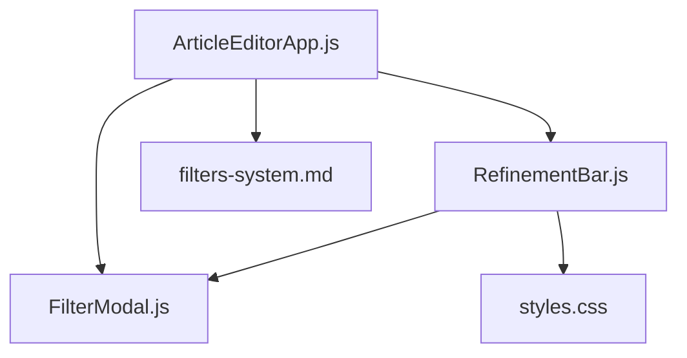
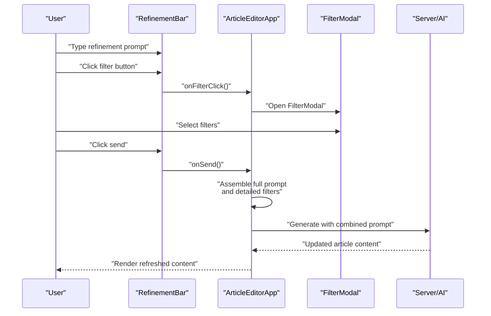
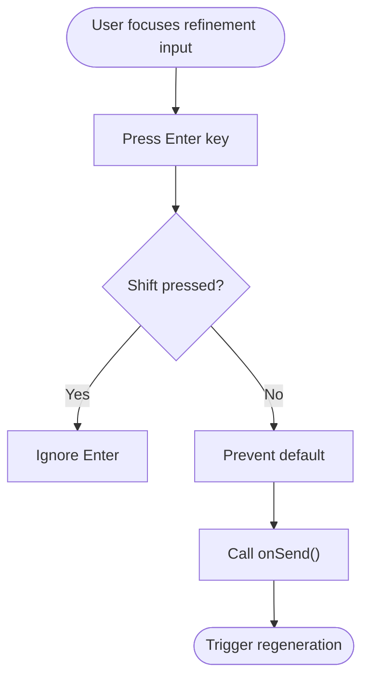
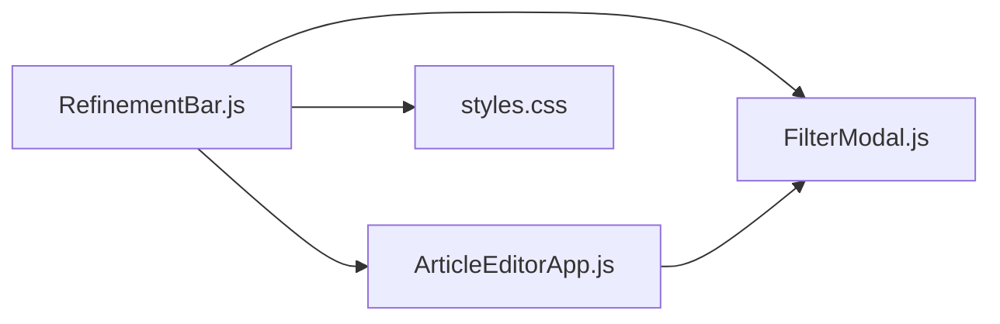

# RefinementBar Component

<cite>
**Referenced Files in This Document**
- [RefinementBar.js](file://src/components/RefinementBar.js)
- [ArticleEditorApp.js](file://src/components/ArticleEditorApp.js)
- [FilterModal.js](file://src/components/FilterModal.js)
- [filters-system.md](file://docs/filters-system.md)
- [styles.css](file://src/styles.css)
</cite>

## Table of Contents
1. [Introduction](#introduction)
2. [Project Structure](#project-structure)
3. [Core Components](#core-components)
4. [Architecture Overview](#architecture-overview)
5. [Detailed Component Analysis](#detailed-component-analysis)
6. [Dependency Analysis](#dependency-analysis)
7. [Performance Considerations](#performance-considerations)
8. [Troubleshooting Guide](#troubleshooting-guide)
9. [Conclusion](#conclusion)
10. [Appendices](#appendices)

## Introduction
RefinementBar is a fixed bottom control panel that enables users to refine article generation prompts during editing. It provides three primary controls:
- Left filter button: Opens the FilterModal to select and apply filters.
- Center text input: Allows users to enter refinement prompts (e.g., “make it shorter”, “add examples”).
- Right send button: Triggers regeneration of the article content using the combined prompt and selected filters.

It visually indicates active filters by changing the filter button’s color. Keyboard interaction supports submission via Enter (without Shift). The component integrates tightly with the filtering system and the editor workflow.

## Project Structure
RefinementBar lives under the components directory and is rendered conditionally in the editor view of the application. It communicates with FilterModal and the editor state to assemble a refined prompt and regenerate content.

**Diagram sources**
- [ArticleEditorApp.js](file://src/components/ArticleEditorApp.js#L580-L607)
- [RefinementBar.js](file://src/components/RefinementBar.js#L1-L61)
- [FilterModal.js](file://src/components/FilterModal.js#L1-L111)
- [filters-system.md](file://docs/filters-system.md#L1-L176)
- [styles.css](file://src/styles.css#L94-L182)

**Section sources**
- [RefinementBar.js](file://src/components/RefinementBar.js#L1-L61)
- [ArticleEditorApp.js](file://src/components/ArticleEditorApp.js#L580-L607)
- [FilterModal.js](file://src/components/FilterModal.js#L1-L111)
- [filters-system.md](file://docs/filters-system.md#L1-L176)
- [styles.css](file://src/styles.css#L94-L182)

## Core Components
- RefinementBar: Stateless UI component rendering the three-part interface and handling keyboard submission.
- FilterModal: Modal overlay displaying segmented and chip-based filters; triggers regeneration when requested.
- ArticleEditorApp: Orchestrates state for refinement prompt, selected filters, and regeneration flow.

Key responsibilities:
- RefinementBar: renders controls, manages keyboard input, toggles filter button color based on active filters, and disables actions while generating.
- FilterModal: renders filter sections, tracks selection, and invokes callbacks to clean or regenerate.
- ArticleEditorApp: maintains refinementPrompt, selectedFilters, and handles the combined prompt assembly and regeneration.

**Section sources**
- [RefinementBar.js](file://src/components/RefinementBar.js#L1-L61)
- [FilterModal.js](file://src/components/FilterModal.js#L1-L111)
- [ArticleEditorApp.js](file://src/components/ArticleEditorApp.js#L25-L287)

## Architecture Overview
The RefinementBar participates in a two-stage flow:
1. User enters a refinement prompt in the center input.
2. User selects filters via the left filter button (opens FilterModal).
3. User clicks the right send button to regenerate content using the combined prompt and filters.

**Diagram sources**
- [RefinementBar.js](file://src/components/RefinementBar.js#L1-L61)
- [ArticleEditorApp.js](file://src/components/ArticleEditorApp.js#L25-L287)
- [FilterModal.js](file://src/components/FilterModal.js#L1-L111)

## Detailed Component Analysis

### RefinementBar Component
Responsibilities:
- Render three controls: filter button, refinement input, and send button.
- Toggle filter button color when filters are active.
- Submit refinement on Enter (without Shift).
- Disable controls while generating.
- Respect disabled state when there is no refinement text and no active filters.

Props:
- value: string controlling the refinement input value.
- onChange: function receiving the new refinement text.
- onFilterClick: function opening the FilterModal.
- onSend: function initiating regeneration.
- isGenerating: boolean indicating a pending generation.
- hasFilters: boolean indicating whether any filters are selected.

Keyboard interaction:
- Enter key triggers onSend when Shift is not pressed.
- Input disabled during generation.

Visual indicators:
- Filter button changes color when hasFilters is true.
- Send button shows a spinner when isGenerating is true.
- Disabled states for both buttons and input.

Styling and responsiveness:
- Fixed positioning at the bottom of the viewport.
- Centered horizontally with a max-width container.
- Input styled with focused border highlight.
- Hover and disabled states defined for buttons.

Accessibility:
- Buttons include titles for context.
- Disabled states communicate unavailability.
- Keyboard-only navigation supported via Enter.

**Section sources**
- [RefinementBar.js](file://src/components/RefinementBar.js#L1-L61)
- [styles.css](file://src/styles.css#L94-L182)

### FilterModal Component
Responsibilities:
- Render filter sections (segmented and chips).
- Track and update selected filters.
- Provide Clean and Regenerate actions.

Integration with RefinementBar:
- RefinementBar’s filter button triggers FilterModal visibility.
- Selected filters are passed back to the editor to form the detailed prompt.

**Section sources**
- [FilterModal.js](file://src/components/FilterModal.js#L1-L111)
- [ArticleEditorApp.js](file://src/components/ArticleEditorApp.js#L25-L287)

### ArticleEditorApp Integration
State management:
- refinementPrompt: current refinement text.
- selectedFilters: object containing active filters.
- isGenerating: loading state during generation.
- showFilterModal: visibility flag for FilterModal.

Behavior:
- RefinementBar passes value, onChange, onFilterClick, onSend, isGenerating, hasFilters.
- onSend triggers handleRegenerateWithFilters when either refinementPrompt or selectedFilters exist.
- handleRegenerateWithFilters builds a detailed prompt from selectedFilters and combines it with refinementPrompt to call handleGenerate.

Filter system relationship:
- The filtering system defines how filters are structured and how they contribute to the detailed prompt.
- RefinementBar’s hasFilters prop mirrors the presence of selected filters.

**Section sources**
- [ArticleEditorApp.js](file://src/components/ArticleEditorApp.js#L25-L287)
- [filters-system.md](file://docs/filters-system.md#L1-L176)

### Keyboard Interaction Flow

**Diagram sources**
- [RefinementBar.js](file://src/components/RefinementBar.js#L11-L16)

### Visual Indicators and Disabled States
- Filter button:
  - Active state: blue background and white text when hasFilters is true.
  - Hover state: darker blue background.
  - Inactive state: gray background and gray text with hover effect.
- Send button:
  - Spinner icon when isGenerating is true.
  - Disabled when isGenerating is true or when both refinementPrompt and selectedFilters are empty.
  - Hover effect applies only when enabled.
- Input:
  - Disabled during generation.
  - Focused state highlights bottom border.

**Section sources**
- [RefinementBar.js](file://src/components/RefinementBar.js#L20-L56)
- [styles.css](file://src/styles.css#L94-L182)

### Props Reference
- value: string bound to the refinement input.
- onChange: function updating the refinement text.
- onFilterClick: function toggling FilterModal visibility.
- onSend: function initiating regeneration.
- isGenerating: boolean controlling loading states.
- hasFilters: boolean reflecting active filters.

Usage in ArticleEditorApp:
- Passed to RefinementBar with current refinementPrompt, handlers, and flags.

**Section sources**
- [RefinementBar.js](file://src/components/RefinementBar.js#L3-L10)
- [ArticleEditorApp.js](file://src/components/ArticleEditorApp.js#L582-L595)

### Relationship to Filtering System
- The filtering system defines filter types (segmented and chips), how they are presented, and how they are combined into a detailed prompt.
- RefinementBar’s hasFilters prop reflects whether any filters are selected, enabling visual feedback.
- The editor composes the detailed prompt from selectedFilters and appends it to the refinementPrompt to form the full prompt.

**Section sources**
- [filters-system.md](file://docs/filters-system.md#L1-L176)
- [ArticleEditorApp.js](file://src/components/ArticleEditorApp.js#L25-L287)

### Accessibility Considerations
- Buttons include descriptive titles for assistive technologies.
- Disabled states clearly indicate unavailability.
- Keyboard navigation supported via Enter submission.
- Focus styles and hover states improve discoverability.

**Section sources**
- [RefinementBar.js](file://src/components/RefinementBar.js#L20-L56)
- [styles.css](file://src/styles.css#L135-L181)

## Dependency Analysis
RefinementBar depends on:
- ArticleEditorApp for state and handlers.
- FilterModal for filter selection.
- styles.css for layout and visual states.

**Diagram sources**
- [RefinementBar.js](file://src/components/RefinementBar.js#L1-L61)
- [ArticleEditorApp.js](file://src/components/ArticleEditorApp.js#L580-L607)
- [FilterModal.js](file://src/components/FilterModal.js#L1-L111)
- [styles.css](file://src/styles.css#L94-L182)

**Section sources**
- [RefinementBar.js](file://src/components/RefinementBar.js#L1-L61)
- [ArticleEditorApp.js](file://src/components/ArticleEditorApp.js#L580-L607)
- [FilterModal.js](file://src/components/FilterModal.js#L1-L111)
- [styles.css](file://src/styles.css#L94-L182)

## Performance Considerations
- Keep refinementPrompt minimal to reduce prompt length and generation time.
- Avoid unnecessary re-renders by passing stable handlers from the parent.
- Debounce or throttle frequent updates to refinementPrompt if used in other contexts.
- Ensure FilterModal only renders when open to minimize DOM overhead.

## Troubleshooting Guide
Common issues and resolutions:
- Send button remains disabled:
  - Ensure either refinementPrompt has content or selectedFilters exist.
  - Verify isGenerating is false.
- Filter button not highlighting:
  - Confirm hasFilters is true when filters are selected.
- Enter does not submit:
  - Ensure Shift is not held when pressing Enter.
  - Confirm onSend is wired to the button click handler.
- Input disabled unexpectedly:
  - Check isGenerating flag; input is disabled during generation.

**Section sources**
- [RefinementBar.js](file://src/components/RefinementBar.js#L11-L16)
- [ArticleEditorApp.js](file://src/components/ArticleEditorApp.js#L582-L595)

## Conclusion
RefinementBar provides a streamlined, accessible way to refine article content by combining textual prompts with selectable filters. Its fixed-position design ensures quick access during editing, while visual feedback and keyboard support enhance usability. Together with FilterModal and the filtering system, it forms a cohesive refinement workflow that balances flexibility and simplicity.

## Appendices

### Usage Example: Integration with Article Generation Workflows
- Initialize state for refinementPrompt and selectedFilters in the editor.
- Pass RefinementBar the current refinementPrompt and handlers.
- On send, assemble the full prompt from refinementPrompt and selectedFilters, then call the generation handler.
- Open FilterModal via onFilterClick to allow users to adjust filters.

**Section sources**
- [ArticleEditorApp.js](file://src/components/ArticleEditorApp.js#L25-L287)
- [RefinementBar.js](file://src/components/RefinementBar.js#L1-L61)