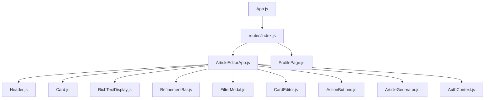
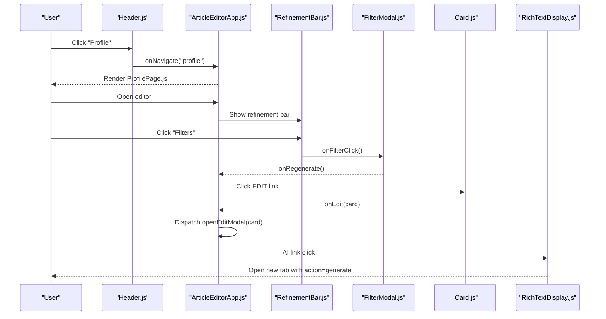
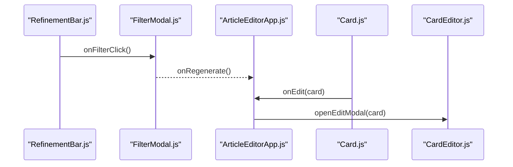
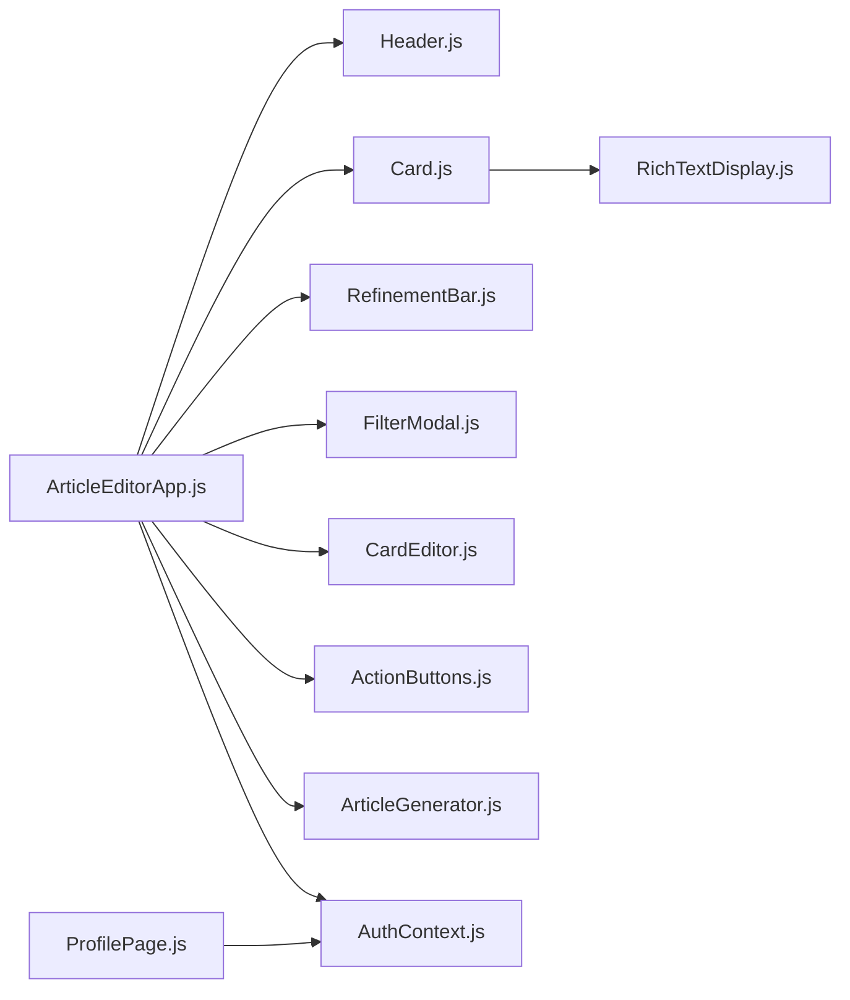

# UI Components

<cite>
**Referenced Files in This Document**
- [ArticleEditorApp.js](file://src/components/ArticleEditorApp.js)
- [Card.js](file://src/components/Card.js)
- [Header.js](file://src/components/Header.js)
- [RefinementBar.js](file://src/components/RefinementBar.js)
- [FilterModal.js](file://src/components/FilterModal.js)
- [ProfilePage.js](file://src/components/ProfilePage.js)
- [RichTextDisplay.js](file://src/components/RichTextDisplay.js)
- [CardEditor.js](file://src/components/CardEditor.js)
- [ActionButtons.js](file://src/components/ActionButtons.js)
- [ArticleGenerator.js](file://src/components/ArticleGenerator.js)
- [AuthContext.js](file://src/context/AuthContext.js)
- [routes/index.js](file://src/routes/index.js)
- [styles.css](file://src/styles.css)
</cite>

## Table of Contents
1. [Introduction](#introduction)
2. [Project Structure](#project-structure)
3. [Core Components](#core-components)
4. [Architecture Overview](#architecture-overview)
5. [Detailed Component Analysis](#detailed-component-analysis)
6. [Dependency Analysis](#dependency-analysis)
7. [Performance Considerations](#performance-considerations)
8. [Troubleshooting Guide](#troubleshooting-guide)
9. [Conclusion](#conclusion)
10. [Appendices](#appendices)

## Introduction
This document describes the core UI components of article-page-v11 with a focus on the article editor and related controls. It explains each component’s visual appearance, behavior, user interaction patterns, props/events, customization options, and how they compose together. It also provides usage examples pointing to code locations, guidelines for responsive design and accessibility, cross-browser compatibility notes, and performance optimization strategies for frequently rendered components.

## Project Structure
The application is a React SPA bootstrapped by a routing layer that mounts the main editor page and profile page. The editor integrates a sticky header, a content card renderer, a bottom refinement bar, a filter modal, and an editor modal for editing individual content cards. Styling is centralized in a single stylesheet with Tailwind-like class usage.

**Diagram sources**
- [App.js](file://src/App.js#L1-L20)
- [routes/index.js](file://src/routes/index.js#L1-L22)
- [ArticleEditorApp.js](file://src/components/ArticleEditorApp.js#L1-L649)
- [Header.js](file://src/components/Header.js#L1-L87)
- [Card.js](file://src/components/Card.js#L1-L34)
- [RichTextDisplay.js](file://src/components/RichTextDisplay.js#L1-L51)
- [RefinementBar.js](file://src/components/RefinementBar.js#L1-L62)
- [FilterModal.js](file://src/components/FilterModal.js#L1-L111)
- [CardEditor.js](file://src/components/CardEditor.js#L1-L482)
- [ActionButtons.js](file://src/components/ActionButtons.js#L1-L34)
- [ArticleGenerator.js](file://src/components/ArticleGenerator.js#L1-L91)
- [AuthContext.js](file://src/context/AuthContext.js#L1-L110)

**Section sources**
- [App.js](file://src/App.js#L1-L20)
- [routes/index.js](file://src/routes/index.js#L1-L22)

## Core Components
This section summarizes the primary UI components and their roles in the article editor experience.

- Card.js: Renders sanitized rich text content inside a content section container and handles edit and AI link interactions.
- Header.js: Provides a sticky navigation bar with Home, Categories, Blog, and Profile links and user account actions.
- RefinementBar.js: Bottom control panel enabling quick prompt refinement and filter toggling with regeneration.
- FilterModal.js: Comprehensive filter interface for style, length, audience, format, and extras with segmented and chip controls.
- ProfilePage.js: User dashboard for managing saved articles, including listing, editing, deleting, and logging out.

**Section sources**
- [Card.js](file://src/components/Card.js#L1-L34)
- [Header.js](file://src/components/Header.js#L1-L87)
- [RefinementBar.js](file://src/components/RefinementBar.js#L1-L62)
- [FilterModal.js](file://src/components/FilterModal.js#L1-L111)
- [ProfilePage.js](file://src/components/ProfilePage.js#L1-L147)

## Architecture Overview
The editor composes several UI layers:
- Top-level routing mounts either the editor or profile pages.
- The editor orchestrates generation, rendering, refinement, and persistence.
- Cards are rendered from structured content and support inline editing and AI link navigation.
- The refinement bar triggers filter modal and regeneration.
- The filter modal builds a detailed prompt from selected filters and regenerates content.

**Diagram sources**
- [Header.js](file://src/components/Header.js#L1-L87)
- [ArticleEditorApp.js](file://src/components/ArticleEditorApp.js#L563-L646)
- [RefinementBar.js](file://src/components/RefinementBar.js#L1-L62)
- [FilterModal.js](file://src/components/FilterModal.js#L1-L111)
- [Card.js](file://src/components/Card.js#L1-L34)
- [RichTextDisplay.js](file://src/components/RichTextDisplay.js#L1-L51)

## Detailed Component Analysis

### Card.js
Role and behavior:
- Renders rich text content inside a content section container.
- Handles edit link clicks to open the editor modal.
- Handles AI link clicks to open a new tab with a preconfigured generation action.

Props:
- card: object with id and content fields.
- onEdit: callback invoked with the clicked card.

Events:
- Click handler inspects target classes/tags to decide whether to edit or open an AI link.

Customization options:
- Content is sanitized and rendered via RichTextDisplay.
- Edit link and AI link classes/tags are recognized by the click handler.

Accessibility and UX:
- Edit link is visually styled and keyboard accessible via anchor semantics.
- AI links are clickable and open in a new tab.

Usage example (snippet path):
- [ArticleEditorApp.js](file://src/components/ArticleEditorApp.js#L546-L552)

**Section sources**
- [Card.js](file://src/components/Card.js#L1-L34)
- [RichTextDisplay.js](file://src/components/RichTextDisplay.js#L1-L51)

### Header.js
Role and behavior:
- Sticky navigation bar with logo, centered nav links, and profile/account actions.
- Highlights current view and conditionally renders login/register or profile link.

Props:
- user: authenticated user object or null.
- onLoginClick: callback for login button.
- onNavigate: callback to switch views.
- currentView: string indicating active view.

Events:
- Button click handlers for login and navigation.

Customization options:
- Conditional styling for active/current view.
- Dynamic avatar initials from user email.

Usage example (snippet path):
- [ArticleEditorApp.js](file://src/components/ArticleEditorApp.js#L563-L575)

**Section sources**
- [Header.js](file://src/components/Header.js#L1-L87)
- [AuthContext.js](file://src/context/AuthContext.js#L1-L110)

### RefinementBar.js
Role and behavior:
- Bottom control panel with a filter toggle, refinement input, and send button.
- Supports Enter key submission and disables controls during generation.

Props:
- value: refinement prompt string.
- onChange: handler to update refinement prompt.
- onFilterClick: handler to open filter modal.
- onSend: handler to trigger regeneration.
- isGenerating: boolean flag to disable controls.
- hasFilters: boolean flag to highlight filter toggle.

Events:
- Input keydown (Enter) triggers onSend.
- Filter toggle button opens modal.
- Send button triggers regeneration.

Customization options:
- Disabled states and spinner animation during generation.
- Active state styling for filter toggle when filters are selected.

Usage example (snippet path):
- [ArticleEditorApp.js](file://src/components/ArticleEditorApp.js#L582-L595)

**Section sources**
- [RefinementBar.js](file://src/components/RefinementBar.js#L1-L62)
- [styles.css](file://src/styles.css#L95-L182)

### FilterModal.js
Role and behavior:
- Modal overlay with filter sections for style, length, audience, format, and extras.
- Supports segmented controls and multi-select chips.
- Provides clean and regenerate actions.

Props:
- isOpen: boolean to show/hide modal.
- onClose: handler to close modal.
- filters: array of filter sections.
- selectedFilters: object mapping filter ids to selected values.
- onFilterChange: handler to update selected filters.
- onClean: handler to reset filters.
- onRegenerate: handler to build detailed prompt and regenerate.
- isLoading: boolean to render skeleton loaders.

Events:
- Overlay click closes modal.
- Chip and segment buttons toggle selections.
- Footer buttons trigger clean and regenerate.

Customization options:
- Skeleton loaders while filters are loading.
- Active state styling for chips and segments.

Composition pattern:
- Triggered by RefinementBar’s filter toggle and closed via overlay click or close button.

Usage example (snippet path):
- [ArticleEditorApp.js](file://src/components/ArticleEditorApp.js#L597-L608)

**Section sources**
- [FilterModal.js](file://src/components/FilterModal.js#L1-L111)
- [styles.css](file://src/styles.css#L183-L317)

### ProfilePage.js
Role and behavior:
- User dashboard to manage saved articles.
- Fetches user drafts, lists them, allows editing and deletion, and logout.

Props:
- None (uses AuthContext internally).

Events:
- Navigation to editor with article id.
- Delete confirmation and API call to remove article.
- Logout handler.

Customization options:
- Loading and error states.
- Empty state with call-to-action to create an article.

Usage example (snippet path):
- [routes/index.js](file://src/routes/index.js#L1-L22)
- [AuthContext.js](file://src/context/AuthContext.js#L1-L110)

**Section sources**
- [ProfilePage.js](file://src/components/ProfilePage.js#L1-L147)

### Composition Patterns
- FilterModal is triggered from RefinementBar and closed via overlay click or close button.
- Card.click dispatches a custom event to open the editor modal.
- Header.onNavigate updates the URL and view state.
- ProfilePage integrates with Header and uses AuthContext for user state.

**Diagram sources**
- [RefinementBar.js](file://src/components/RefinementBar.js#L1-L62)
- [FilterModal.js](file://src/components/FilterModal.js#L1-L111)
- [ArticleEditorApp.js](file://src/components/ArticleEditorApp.js#L582-L608)
- [Card.js](file://src/components/Card.js#L1-L34)
- [CardEditor.js](file://src/components/CardEditor.js#L1-L482)

## Dependency Analysis
Component dependencies and relationships:
- ArticleEditorApp orchestrates Card, CardEditor, RefinementBar, FilterModal, Header, ActionButtons, and ArticleGenerator.
- Card depends on RichTextDisplay for safe HTML rendering.
- ProfilePage depends on AuthContext and uses routing to navigate.
- FilterModal is controlled by ArticleEditorApp and uses local state for filters and selectedFilters.
- RefinementBar is a pure presentational component controlled by ArticleEditorApp.

**Diagram sources**
- [ArticleEditorApp.js](file://src/components/ArticleEditorApp.js#L1-L649)
- [Card.js](file://src/components/Card.js#L1-L34)
- [RichTextDisplay.js](file://src/components/RichTextDisplay.js#L1-L51)
- [RefinementBar.js](file://src/components/RefinementBar.js#L1-L62)
- [FilterModal.js](file://src/components/FilterModal.js#L1-L111)
- [CardEditor.js](file://src/components/CardEditor.js#L1-L482)
- [ActionButtons.js](file://src/components/ActionButtons.js#L1-L34)
- [ArticleGenerator.js](file://src/components/ArticleGenerator.js#L1-L91)
- [ProfilePage.js](file://src/components/ProfilePage.js#L1-L147)
- [AuthContext.js](file://src/context/AuthContext.js#L1-L110)

**Section sources**
- [ArticleEditorApp.js](file://src/components/ArticleEditorApp.js#L1-L649)
- [Card.js](file://src/components/Card.js#L1-L34)
- [RichTextDisplay.js](file://src/components/RichTextDisplay.js#L1-L51)
- [RefinementBar.js](file://src/components/RefinementBar.js#L1-L62)
- [FilterModal.js](file://src/components/FilterModal.js#L1-L111)
- [CardEditor.js](file://src/components/CardEditor.js#L1-L482)
- [ActionButtons.js](file://src/components/ActionButtons.js#L1-L34)
- [ArticleGenerator.js](file://src/components/ArticleGenerator.js#L1-L91)
- [ProfilePage.js](file://src/components/ProfilePage.js#L1-L147)
- [AuthContext.js](file://src/context/AuthContext.js#L1-L110)

## Performance Considerations
- Memoization:
  - Card is wrapped with React.memo to prevent unnecessary re-renders when props are unchanged.
  - ActionButtons is wrapped with React.memo to reduce re-render cost for frequent interactions.
  - CardEditor is exported with memo to avoid re-mounting the heavy Quill editor.
- Rendering optimization:
  - CardEditor lazily loads the editor via React.lazy/Suspense to defer expensive initialization until needed.
  - RefinementBar and FilterModal are lightweight and only mounted in the editor view.
- Event handling:
  - Click handlers in Card and RichTextDisplay use event delegation checks to minimize overhead.
- Local storage:
  - ArticleManager persists data efficiently and migrates legacy formats to avoid repeated conversions.

[No sources needed since this section provides general guidance]

## Troubleshooting Guide
- AI link navigation does not open:
  - Verify the click handler recognizes ai-link tags/classes and that the target has topic/template attributes.
  - Confirm window.open is permitted by browser policies.
- Filter modal not closing:
  - Ensure overlay click logic targets the overlay element and not inner content.
  - Check that onClose prop is passed and invoked.
- Edit link not opening editor:
  - Confirm the custom event openEditModal is dispatched with the correct card detail.
  - Ensure CardEditor is mounted and the forwardRef exposes openEditModal.
- Profile page shows loading or error:
  - Check AuthContext user state and network connectivity to the auth API.
  - Validate that ProfilePage navigates appropriately when user is missing.

**Section sources**
- [Card.js](file://src/components/Card.js#L1-L34)
- [FilterModal.js](file://src/components/FilterModal.js#L1-L111)
- [CardEditor.js](file://src/components/CardEditor.js#L1-L482)
- [AuthContext.js](file://src/context/AuthContext.js#L1-L110)
- [ProfilePage.js](file://src/components/ProfilePage.js#L1-L147)

## Conclusion
The article editor UI is composed of focused, reusable components that collaborate to deliver a smooth authoring experience. Card renders content safely, Header provides navigation, RefinementBar enables quick adjustments, FilterModal offers deep customization, and ProfilePage manages user content. The design emphasizes composability, performance, and user-friendly interactions, with clear separation of concerns and straightforward prop/event contracts.

[No sources needed since this section summarizes without analyzing specific files]

## Appendices

### Props and Events Reference

- Card.js
  - Props: card, onEdit
  - Events: click handler for edit and AI links

- Header.js
  - Props: user, onLoginClick, onNavigate, currentView
  - Events: button clicks for login and navigation

- RefinementBar.js
  - Props: value, onChange, onFilterClick, onSend, isGenerating, hasFilters
  - Events: input keydown (Enter), filter toggle click, send click

- FilterModal.js
  - Props: isOpen, onClose, filters, selectedFilters, onFilterChange, onClean, onRegenerate, isLoading
  - Events: overlay click, chip/segment clicks, footer button clicks

- ProfilePage.js
  - Props: none (uses AuthContext)
  - Events: edit, delete, logout, create article

**Section sources**
- [Card.js](file://src/components/Card.js#L1-L34)
- [Header.js](file://src/components/Header.js#L1-L87)
- [RefinementBar.js](file://src/components/RefinementBar.js#L1-L62)
- [FilterModal.js](file://src/components/FilterModal.js#L1-L111)
- [ProfilePage.js](file://src/components/ProfilePage.js#L1-L147)

### Usage Examples (by snippet path)
- Open editor from Card edit link:
  - [ArticleEditorApp.js](file://src/components/ArticleEditorApp.js#L546-L552)
- Trigger FilterModal from RefinementBar:
  - [ArticleEditorApp.js](file://src/components/ArticleEditorApp.js#L582-L595)
- Render ProfilePage:
  - [routes/index.js](file://src/routes/index.js#L1-L22)
- Authenticate and persist article:
  - [AuthContext.js](file://src/context/AuthContext.js#L1-L110)
  - [ArticleEditorApp.js](file://src/components/ArticleEditorApp.js#L352-L418)

### Responsive Design and Accessibility Guidelines
- Responsive:
  - Use container widths and spacing appropriate for mobile and desktop.
  - Ensure filter modal content is scrollable and accessible on small screens.
- Accessibility:
  - Provide labels and titles for interactive elements.
  - Ensure keyboard navigation (Enter to submit, Escape to close).
  - Maintain sufficient color contrast and focus indicators.

**Section sources**
- [styles.css](file://src/styles.css#L490-L618)

### Cross-Browser Compatibility Notes
- DOMPurify sanitization ensures safe rendering of custom ai-link tags and attributes.
- ReactQuill editor may require polyfills for older browsers; ensure modern browsers or add necessary shims.
- CSS backdrop-filter is used for modal overlays; consider fallbacks for unsupported environments.

**Section sources**
- [RichTextDisplay.js](file://src/components/RichTextDisplay.js#L1-L51)
- [styles.css](file://src/styles.css#L183-L207)